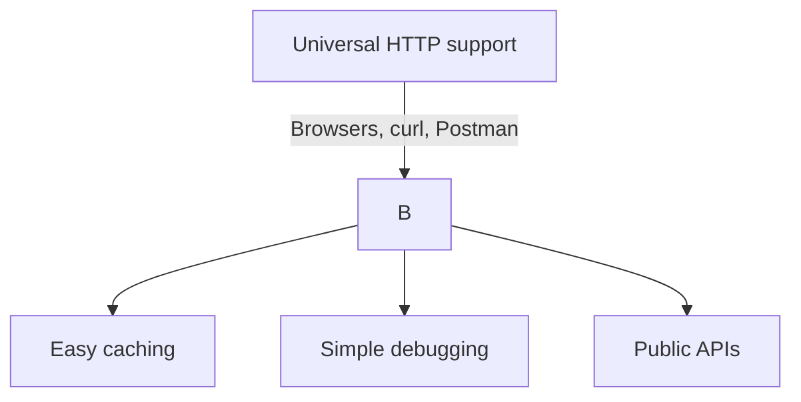
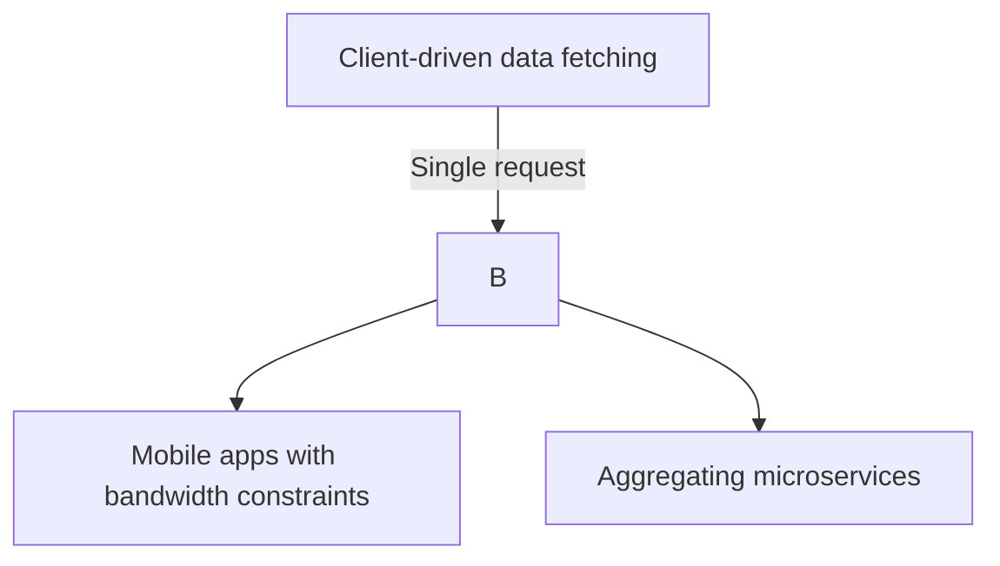
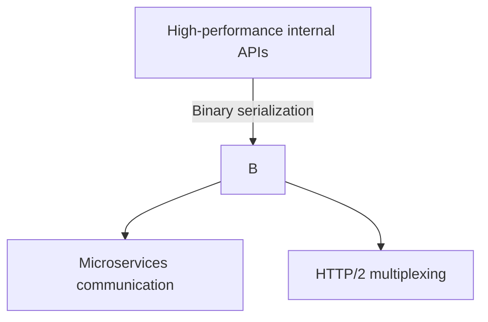

```markdown
# REST vs GraphQL vs gRPC: Choosing the Right API Paradigm for 2024

## Introduction: The API Evolution Challenge

In today’s distributed systems landscape, API design isn’t just about connecting services—it’s about optimizing for performance, flexibility, and developer experience. Back in the early 2010s, REST became the default choice due to its simplicity and HTTP compatibility. Then came GraphQL’s rise in 2015, promising to solve REST’s over-fetching and under-fetching problems. More recently, gRPC has gained traction for its high-performance microservices communication.

But here’s the reality: **no single paradigm fits all use cases**. A public API serving third-party developers will thrive with REST’s simplicity, while a mobile app with complex nested queries might need GraphQL’s precision. Meanwhile, internal microservices might require gRPC’s binary efficiency. This isn’t just academic—your choice impacts bandwidth usage, latency, caching strategy, and even team productivity.

In this guide, we’ll compare REST, GraphQL, and gRPC across **real-world tradeoffs**, using concrete examples and implementation patterns. By the end, you’ll have a clear framework for selecting the right tool—and know when to blend approaches.

---

## The API Paradigms: Examples in Action

Let’s start by examining each paradigm through practical examples. We’ll use a sample e-commerce API with three entities: `User`, `Product`, and `Order`.

---

### **1. REST: The HTTP Resource Standard**

REST (Representational State Transfer) organizes data as resources accessed via HTTP methods. Each resource has a predictable URL, and clients request specific fields by expanding paths (though often with nested queries).

#### Example API:
- **GET** `/users/{id}` → Returns user details
- **GET** `/users/{id}/orders` → Returns orders for a user
- **GET** `/products?category=books` → Filters products

#### Implementation (Node.js with Express)
```javascript
// REST endpoint for a user's orders
app.get('/users/:userId/orders', async (req, res) => {
  const user = await db.getUser(req.params.userId);
  const orders = await db.getOrdersForUser(user.id);
  res.json({ user, orders });
});
```

#### Key Observations:
- **Over-fetching**: The `/users/:userId` endpoint might return all fields, even if the client only needs `name` and `email`.
- **Under-fetching**: To get a user’s orders, you need a *separate* request to `/users/:userId/orders`.
- **Versioning**: REST APIs often require versioning (e.g., `/v1/users`), leading to endpoint sprawl.

#### When REST Shines:


---

### **2. GraphQL: The Query-First Approach**

GraphQL lets clients specify *exactly* what data they need in a single request, eliminating over-fetching and under-fetching. It uses a declarative query language over a single endpoint (e.g., `/graphql`).

#### Example Query:
```graphql
query GetUserWithOrders($userId: ID!) {
  user(id: $userId) {
    id
    name
    email
    orders {
      id
      items {
        product {
          name
          price
        }
      }
    }
  }
}
```

#### Implementation (Node.js with Apollo Server)
```javascript
const { ApolloServer } = require('apollo-server');
const typeDefs = gql`
  type User {
    id: ID!
    name: String!
    email: String!
    orders: [Order!]!
  }
  type Query {
    user(id: ID!): User
  }
`;

const server = new ApolloServer({ typeDefs, rootValue });
server.listen().then(({ url }) => console.log(`GraphQL ready at ${url}`));
```

#### Key Observations:
- **Single Request**: The above query fetches only the fields the client needs.
- **Schema First**: The server exposes a schema that clients can introspect.
- **Caching Challenges**: No native HTTP-based caching (though tools like Apollo Cache help).

#### When GraphQL Shines:


---

### **3. gRPC: The High-Performance RPC**

gRPC is a modern RPC framework using Protocol Buffers (protobuf) for serialization. It excels at internal service-to-service communication, especially with streaming.

#### Example `.proto` Definition:
```protobuf
syntax = "proto3";

service OrderService {
  rpc GetUserOrders (GetOrdersRequest) returns (UserOrdersResponse) {}
}

message GetOrdersRequest {
  string user_id = 1;
}

message UserOrdersResponse {
  repeated Order orders = 1;
}

message Order {
  string id = 1;
  repeated OrderItem items = 2;
}
```

#### Implementation (Node.js with gRPC)
```javascript
const grpc = require('@grpc/grpc-js');
const protoLoader = require('@grpc/proto-loader');

// Load protocol buffer
const packageDefinition = protoLoader.loadSync('order.proto');
const protoDescriptor = grpc.loadPackageDefinition(packageDefinition);

// Start server
const server = new grpc.Server();
server.addService(protoDescriptor.order.OrderService.service, {
  GetUserOrders: (call, callback) => {
    // Fetch orders from DB
    const orders = db.getOrders(call.request.user_id);
    callback(null, { orders });
  }
});
server.bindAsync('0.0.0.0:50051', grpc.ServerCredentials.createInsecure(), () =>
  server.start());
```

#### Key Observations:
- **Binary Format**: Smaller payloads than JSON/REST.
- **HTTP/2 Multiplexing**: Multiple requests on a single connection.
- **Streaming**: Supports server/client streaming (e.g., live updates).

#### When gRPC Shines:


---

## Head-to-Head Comparison

Let’s formalize the tradeoffs with a side-by-side comparison:

| **Criteria**          | **REST**                          | **GraphQL**                      | **gRPC**                          |
|-----------------------|-----------------------------------|----------------------------------|-----------------------------------|
| **Protocol**          | HTTP (text-based)                 | HTTP (text-based, JSON)          | HTTP/2 (binary, protobuf)        |
| **Performance**       | Good (cacheable, but O/F issues)  | Good (single request, but parsing overhead) | **Excellent** (binary, HTTP/2) |
| **Flexibility**       | Low (fixed endpoints)             | High (client specifies data)     | Medium (defined in `.proto`)      |
| **Learning Curve**    | Low (familiar HTTP)               | Medium (query language)          | High (protobuf, streaming)        |
| **Browser Support**   | Native                            | Native (over HTTP)               | **Requires grpc-web**             |
| **Caching**           | Built-in HTTP caching             | Manual (Apollo Cache, etc.)      | Application-level                 |
| **Versioning**        | Explicit (e.g., `/v1/users`)      | Schema evolution (breaking changes handled via schema) | Protobuf versioning |
| **Use Case**          | Public APIs, simple CRUD          | Complex nested data, mobile apps | Microservices, real-time streaming |

---

## Decision Framework: When to Choose Which

Choose your API paradigm based on these key questions:

### **1. Will Your API Serve Public Clients?**
- **REST**: Best for third-party developers (native browser support, familiar patterns).
- *Example*: Twitter’s API uses REST for its broad developer ecosystem.

### **2. Do Clients Need Fine-Grained Data Control?**
- **GraphQL**: Ideal when clients require nested, variable data (e.g., mobile apps).
- *Example*: Shopify and GitHub use GraphQL for flexible data fetching.

### **3. Is Performance Critical for Internal Services?**
- **gRPC**: Perfect for microservices with low-latency needs (e.g., recommendation engines).
- *Example*: Google uses gRPC internally for its massive distributed systems.

### **4. Do You Need Real-Time Updates?**
- **GraphQL (subscriptions) or gRPC (streaming)**: Both support real-time (e.g., chat apps, dashboards).
- *Example*: Stripe’s live payment status updates use GraphQL subscriptions.

---
## Common Pitfalls When Choosing APIs

1. **REST Over-Fetching**: Assuming clients will cache aggressively. *Mitigation*: Use HATEOAS or GraphQL.
2. **GraphQL N+1 Queries**: Forgetting to batch database queries. *Mitigation*: Use DataLoader or Apollo’s `batch` option.
3. **gRPC Complexity**: Misjudging debugging challenges. *Mitigation*: Use tools like [grpcurl](https://github.com/fullstorydev/grpcurl) for inspection.
4. **GraphQL Schema Bloat**: Designing an overly complex schema. *Mitigation*: Start small, validate with real client queries.
5. **REST Versioning Nightmares**: Avoiding versioning by overloading endpoints. *Mitigation*: Use subpaths (`/v2/users`) or header-based versioning.

---

## Key Takeaways

- **REST** is the safe default for public APIs but can lead to inefficiencies with over-fetching.
- **GraphQL** solves over-fetching but requires careful schema design and caching strategies.
- **gRPC** is unmatched for internal performance but isn’t browser-native.
- **Hybrid approaches work**: Use REST for public APIs, GraphQL for frontend queries, and gRPC for microservices.
- **Performance isn’t the only metric**: Consider developer experience, caching, and tooling.

---

## Conclusion: The Right Tool for the Job

There’s no single "best" API paradigm—**context matters**. Here’s a quick cheat sheet:

| **Scenario**               | **Recommended Paradigm** | **Why?**                                  |
|----------------------------|--------------------------|-------------------------------------------|
| Public API for third parties | **REST**                 | Universal HTTP support, no client tooling needed. |
| Mobile app with complex data | **GraphQL**             | Single requests, reduced bandwidth.        |
| Microservices communication | **gRPC**                 | Binary serialization, HTTP/2 efficiency.  |
| Real-time dashboard        | **GraphQL (subscriptions) or gRPC (streaming)** | Low-latency updates. |

### Final Recommendation:
Start with REST if you’re building a public API. If your frontend demands precise data control, **add GraphQL as a parallel layer**. For internal services, **gRPC will likely be your fastest option**. And remember: tools like [Apollo Federation](https://www.apollographql.com/docs/federation/) and [Envoy](https://www.envoyproxy.io/) can bridge these paradigms seamlessly.

The future of APIs lies in **combining the strengths of each paradigm**—REST for simplicity, GraphQL for flexibility, and gRPC for performance. Choose wisely, but don’t be afraid to evolve as your system grows.

---
## Further Reading
- [REST API Design Best Practices](https://restfulapi.net/)
- [GraphQL Performance Guide](https://www.apollographql.com/docs/performance/)
- [gRPC Best Practices](https://grpc.io/blog/best-practices/)
- [Hybrid API Architectures](https://www.informationweek.com/database/what-is-hybrid-api-management-and-how-does-it-work)