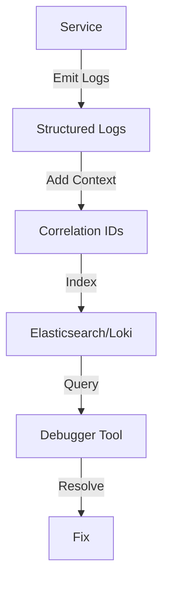

# **[Pattern] Audit Debugging Reference Guide**

---

## **Overview**
The **Audit Debugging** pattern provides a structured approach to diagnosing, tracing, and resolving operational issues in distributed systems by leveraging historical audit logs, real-time debugging tools, and telemetry data. This pattern is essential for **outage investigations, anomaly detection, and performance tuning** in environments where traditional logging lacks sufficient context for debugging failures.

Audit debugging combines **structured logging, context propagation, and intelligent querying** to reconstruct system state changes leading up to incidents. It is particularly useful in:
- **Microservices architectures** (e.g., Kubernetes, serverless)
- **Event-driven systems** (e.g., Kafka, RabbitMQ)
- **Multi-tenant platforms** (e.g., SaaS applications)

This guide covers key components, schema structures, query techniques, and integrations with related patterns.

---

## **Key Concepts & Implementation Details**

### **1. Core Components**
Audit debugging relies on these foundational elements:

| **Component**          | **Description**                                                                                     | **Example Use Case**                          |
|------------------------|-----------------------------------------------------------------------------------------------------|-----------------------------------------------|
| **Structured Audit Logs** | Timestamps, correlation IDs, and nested JSON metadata to trace requests across services.          | Tracking a failed API call across 3 microservices. |
| **Context Propagation** | Injecting unique request IDs and metadata into logs, traces, and metrics to link related events.   | Debugging a payment failure in a distributed transaction. |
| **Debug Workflows**    | Interactive debugging sessions with saved state snapshots (e.g., Dapr Debugger, OpenTelemetry).  | Reverting to a previous state before a crash. |
| **Queryable History**  | Persistent storage of logs/metrics with fast filtering (e.g., Elasticsearch, TimescaleDB).       | Finding all failed logins in the last 24 hours. |
| **Anomaly Alerts**     | Rules to flag unexpected patterns (e.g., "all logs with status=500 in 5-minute window").           | Detecting sudden spikes in 4xx errors.        |

---

### **2. Data Flow**
Audit debugging follows this sequence:

1. **Event Generation** → Logs/metrics emitted by services (structured or unstructured).
2. **Context Injection** → Correlation IDs and metadata are added (e.g., via OpenTelemetry).
3. **Storage** → Data is indexed in a queryable repository (e.g., Loki, Datadog).
4. **Query & Analysis** → Debugging tooling (e.g., Grafana, Prometheus) filters and visualizes data.
5. **Resolution** → Debugged state is applied (e.g., code changes, config fixes).



---

## **Schema Reference**
Audit debugging relies on standardized schemas for logs, traces, and metadata. Below are key tables:

### **1. Log Entry Schema**
```json
{
  "timestamp": "2023-10-01T12:34:56.789Z",
  "correlation_id": "abc123-xyz456",
  "service": "order-service",
  "level": "ERROR|INFO|WARN|DEBUG",
  "message": "Failed to validate credit card",
  "payload": { "card": "4111111111111111", "error": "expiry_date_invalid" },
  "tags": ["payment", "validation"]
}
```

| **Field**          | **Type**       | **Description**                                                                                     | **Example**                          |
|--------------------|----------------|-----------------------------------------------------------------------------------------------------|--------------------------------------|
| `timestamp`        | ISO 8601       | When the log was generated.                                                                | `2023-10-01T12:34:56.789Z`         |
| `correlation_id`   | UUID           | Links related logs across services.                                                            | `abc123-xyz456`                      |
| `service`          | String         | Name of the emitting service.                                                                   | `order-service`                      |
| `level`            | String (enum)  | Log severity.                                                                                   | `ERROR`                              |
| `message`          | String         | Human-readable description.                                                                    | `Failed to validate credit card`     |
| `payload`          | JSON           | Structured data (e.g., errors, inputs).                                                        | `{"card": "4111111111111111"}`      |
| `tags`             | Array          | Categorization for filtering (e.g., `["payment", "validation"]`).                              | `["payment", "validation"]`          |

---

### **2. Trace Span Schema**
```json
{
  "trace_id": "def789-pqr012",
  "span_id": "span123",
  "name": "process_payment",
  "start_time": "2023-10-01T12:34:56.789Z",
  "end_time": "2023-10-01T12:35:01.234Z",
  "service": "payment-gateway",
  "attributes": {
    "status": "ERROR",
    "amount": 99.99
  }
}
```

| **Field**        | **Type**       | **Description**                                                                                     | **Example**                          |
|------------------|----------------|-----------------------------------------------------------------------------------------------------|--------------------------------------|
| `trace_id`       | UUID           | Unique identifier for a distributed trace.                                                       | `def789-pqr012`                      |
| `span_id`        | UUID           | Sub-operation within a trace.                                                                    | `span123`                            |
| `name`           | String         | Description of the operation (e.g., `process_payment`).                                            | `process_payment`                    |
| `start_time`     | ISO 8601       | When the span began.                                                                              | `2023-10-01T12:34:56.789Z`         |
| `end_time`       | ISO 8601       | When the span completed.                                                                          | `2023-10-01T12:35:01.234Z`         |
| `service`        | String         | Service name.                                                                                     | `payment-gateway`                    |
| `attributes`     | JSON           | Key-value pairs (e.g., `status`, `amount`).                                                     | `{"status": "ERROR", "amount": 99.99}`|

---

### **3. Debug Session Schema**
```json
{
  "session_id": "debug-456",
  "user": "alice@example.com",
  "start_time": "2023-10-01T13:00:00Z",
  "end_time": "2023-10-01T13:05:30Z",
  "queries": [
    {
      "type": "log_filter",
      "query": 'service="order-service" AND level="ERROR"',
      "results": [/* filtered logs */]
    }
  ],
  "state_snapshot": {
    "database": "production",
    "status": "reverted_to_previous_build"
  }
}
```

| **Field**       | **Type**       | **Description**                                                                                     | **Example**                          |
|-----------------|----------------|-----------------------------------------------------------------------------------------------------|--------------------------------------|
| `session_id`    | String         | Unique ID for the debugging session.                                                              | `debug-456`                          |
| `user`          | String         | Who initiated the session.                                                                          | `alice@example.com`                  |
| `start_time`    | ISO 8601       | When the session began.                                                                             | `2023-10-01T13:00:00Z`              |
| `end_time`      | ISO 8601       | When the session ended.                                                                             | `2023-10-01T13:05:30Z`              |
| `queries`       | Array          | List of queries executed (e.g., log filters, trace searches).                                    | `[ { "type": "log_filter", ... } ]`  |
| `state_snapshot`| JSON           | Saved system state for rollback/inspection.                                                      | `{"database": "production"}`         |

---

## **Query Examples**

### **1. Filtering Logs by Service and Error Level**
**Use Case:** Find all `ERROR` logs from `order-service` in the last hour.
**Query (Elasticsearch):**
```json
GET /audit-logs/_search
{
  "query": {
    "bool": {
      "must": [
        { "match": { "service": "order-service" } },
        { "match": { "level": "ERROR" } },
        { "range": { "timestamp": { "gte": "now-1h" } } }
      ]
    }
  },
  "sort": [ { "timestamp": { "order": "desc" } } ]
}
```

**Output (first 5 matches):**
```json
[
  { "timestamp": "2023-10-01T12:59:00Z", "correlation_id": "xyz789", "message": "Payment declined" },
  { "timestamp": "2023-10-01T12:55:30Z", "correlation_id": "abc456", "message": "Invalid DB connection" }
]
```

---

### **2. Tracing a Correlated Request**
**Use Case:** Trace a request with `correlation_id="abc123-xyz456"` across services.
**Query (OpenTelemetry Query API):**
```sql
-- Find all spans with correlation_id=abc123-xyz456
SELECT
  service,
  name,
  attributes.status,
  attributes.amount
FROM traces
WHERE trace_id = "def789-pqr012" /* inferred from logs */
AND attributes.correlation_id = "abc123-xyz456"
ORDER BY start_time DESC;
```

**Output:**
| **Service**        | **Name**           | **Status** | **Amount** |
|--------------------|--------------------|------------|------------|
| order-service      | validate_payment   | ERROR      | 99.99      |
| payment-gateway    | process_payment    | ERROR      | 99.99      |

---

### **3. Anomaly Detection (Spike in Errors)**
**Use Case:** Alert if >10 `ERROR` logs are emitted per minute from `auth-service`.
**Rule (Prometheus):**
```promql
rate(audit_errors_total{service="auth-service"}[1m])
> 10
```
**Action:** Trigger a Slack alert with the offending logs.

---

### **4. Debug Workflow: Reverting to a Previous State**
**Use Case:** Revert a database to its state at `timestamp="2023-10-01T11:00:00Z"`.
**Command (Example with Dapr):**
```bash
dapr debug session start --state-snapshot "2023-10-01T11:00:00Z"
# Run queries in the reverted state
SELECT * FROM orders WHERE created_at < '2023-10-01T11:00:00Z';
```

---

## **Related Patterns**
Audit debugging integrates with these architectural patterns:

| **Pattern**               | **Description**                                                                                     | **Integration Example**                          |
|----------------------------|-----------------------------------------------------------------------------------------------------|--------------------------------------------------|
| **Distributed Tracing**    | End-to-end request tracing using OpenTelemetry or Jaeger.                                          | Correlating spans with audit logs.               |
| **Circuit Breaker**        | Isolating failures in microservices (e.g., Hystrix).                                               | Debugging why a circuit tripped.                 |
| **Saga Pattern**           | Managing long-running transactions across services.                                                 | Reverting a saga step that failed.               |
| **Canary Deployments**     | Gradually rolling out changes to detect issues.                                                    | Comparing logs between canary and production.     |
| **Feature Flags**          | Temporarily enabling/disabling features for debugging.                                             | Reverting a feature that introduced bugs.        |
| **Chaos Engineering**      | Intentionally injecting failures to test resilience.                                               | Analyzing audit logs after a simulated outage.   |

---

## **Best Practices**
1. **Correlation IDs Everywhere**
   Inject `correlation_id` into logs, traces, and metrics to ensure end-to-end visibility.

2. **Retention Policies**
   Keep audit logs for **30–90 days** (adjust based on compliance needs). Use Tiered Storage (e.g., hot/warm/cold) to balance cost and access.

3. **Structured Over Unstructured**
   Avoid raw text logs; use JSON schemas for consistency.

4. **Automate Anomalies**
   Set up alerts for sudden spikes in errors or unusual patterns (e.g., `429 Too Many Requests`).

5. **Debug Tools**
   - **Observability Platforms:** Grafana, Datadog, New Relic.
   - **Distributed Tracing:** Jaeger, Zipkin.
   - **Debug Workflows:** Dapr Debugger, OpenTelemetry Debugger.

6. **Document Incidents**
   Save debugging sessions in a knowledge base for future reference.

---
## **Troubleshooting**
| **Issue**                          | **Diagnostic Query**                                                                 | **Solution**                                  |
|-------------------------------------|--------------------------------------------------------------------------------------|-----------------------------------------------|
| Logs missing correlation IDs         | `GET /audit-logs/_search { "query": { "must_not": { "exists": { "field": "correlation_id" } } } }` | Inject correlation IDs in code.               |
| Slow query performance              | Check Elasticsearch `size` limit and indexing speed.                                | Increase shards or optimize schema.           |
| False positives in anomaly alerts   | Review `rate()` window in Prometheus.                                                | Adjust thresholds or refine queries.          |
| Debug session state lost            | Verify `state_snapshot` is persisted.                                                | Use immutable storage (e.g., S3).            |

---
## **Further Reading**
- [OpenTelemetry Logs Specification](https://github.com/open-telemetry/opentelemetry-specification/blob/main/specification/logs/data-model.md)
- [Elasticsearch Logs Guide](https://www.elastic.co/guide/en/elastic-stack/current/logs.html)
- [Dapr Debugger Documentation](https://docs.dapr.io/developing-applications/debugging/)

---
**Last Updated:** 2023-10-01
**Version:** 1.2