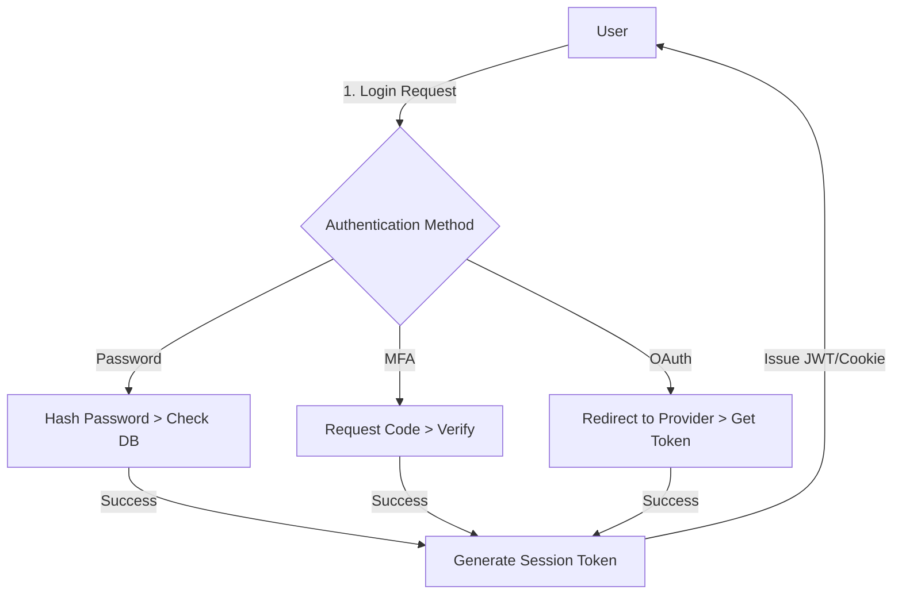

# **[Pattern] Authentication Approaches – Reference Guide**

---

## **Overview**
The **Authentication Approaches** pattern defines standard methods for verifying user identity before granting access to systems, APIs, or resources. This pattern ensures security, scalability, and flexibility while supporting diverse authentication use cases—from simple username/password logins to multi-factor authentication (MFA) and social logins. Properly implemented, it mitigates risks like credential theft, brute-force attacks, and session hijacking while aligning with regulatory requirements (e.g., GDPR, HIPAA).

This guide covers key authentication mechanisms, their trade-offs, and implementation best practices. Use it to design secure and user-friendly authentication systems tailored to your architecture (cloud, on-premises, or hybrid).

---

## **1. Key Concepts & Implementation Details**

### **1.1 Authentication vs. Authorization**
| **Term**       | **Definition**                                                                 | **Key Responsibility**                                      |
|----------------|-------------------------------------------------------------------------------|------------------------------------------------------------|
| **Authentication** | Verifying a user’s identity (e.g., via credentials).                          | Proves *"Who you are"*.                                     |
| **Authorization** | Granting access to resources after authentication.                            | Proves *"What you can do"*.                                 |
| **Authentication Flow** | Sequence of steps (e.g., login, token exchange, session management).        | Ensures a secure, seamless user journey.                    |

**Note:** This pattern focuses on **authentication**; see **Authorization Patterns** (e.g., Role-Based Access Control) for post-authentication controls.

---

### **1.2 Common Authentication Approaches**

| **Approach**               | **Definition**                                                                 | **Use Cases**                                                                 | **Pros**                                                                 | **Cons**                                                                 | **Implementation Notes**                          |
|----------------------------|-------------------------------------------------------------------------------|-------------------------------------------------------------------------------|--------------------------------------------------------------------------|--------------------------------------------------------------------------|----------------------------------------------------|
| **Password-Based**         | Uses a shared secret (e.g., username + password).                             | Traditional web/mobile apps, internal systems.                              | Simple, widely supported.                                                | Vulnerable to brute force, phishing. Requires password policies.       | Enforce strong passwords (12+ chars, complexity). Use **hashing** (e.g., bcrypt, Argon2) for storage. |
| **Multi-Factor (MFA)**     | Requires **2+ factors**: Something you know (password), have (hardware token), or are (biometrics). | High-security environments (banking, healthcare), admin access.            | Highly secure against credential theft.                                   | Friction for users; relies on external factors (e.g., SMS delays).   | Combine **TOTP** (Time-based OTP) or **FIDO2** (WebAuthn) with passwords. |
| **OAuth 2.0 / OpenID Connect** | Delegates authentication to third parties (e.g., Google, Facebook) via tokens. | Social logins, microservices, and federated identity.                          | Scalable, reduces password management burden.                           | Complex to implement; relies on third-party reliability.               | Use **PKCE** for public clients (e.g., mobile apps). Cache tokens securely. |
| **Biometric**              | Uses fingerprint, facial recognition, or voice patterns.                      | Mobile apps, IoT devices, or high-convenience flows.                          | Low friction for users; no passwords to remember.                        | Hardware dependency; privacy concerns; susceptible to spoofing.        | Pair with MFA for critical systems. Use **Liveness Detection**.          |
| **Certificates**           | Uses digital certificates (e.g., X.509) for mutual TLS or client authentication. | Enterprise networks, VPNs, or machine-to-machine (M2M) communication.         | High security; no shared secrets.                                        | Complex setup; requires PKI infrastructure.                             | Issue certificates via **Let’s Encrypt** or internal CA. |
| **API Keys**               | Generates a unique key for programmatic access (e.g., AWS, GitHub).           | Server-to-server communication, bots, or scripts.                           | Simple, stateless.                                                       | No user identity; limited to machine identities.                         | Rotate keys frequently; restrict API scopes.    |
| **Session Tokens**         | Issues a temporary token (e.g., JWT, cookies) after successful authentication. | Web apps, SPAs, or session-based auth.                                      | Stateless post-authentication; enables stateless APIs.                   | Token theft risks; requires expiration/expiration policies.             | Use **JWT with short lifetimes** + refresh tokens. Sign with HS256/RS256. |
| **Single Sign-On (SSO)**   | Allows users to log in once and access multiple systems (e.g., SAML, OIDC).    | Enterprise environments with multiple applications.                         | Reduces password fatigue; centralized identity management.               | Single point of failure; complex integration.                          | Implement via **Okta**, **Azure AD**, or **Keycloak**.                   |
| **Device-Based**           | Uses device-specific tokens (e.g., ADFS, Duo Security).                      | Corporate laptops/devices with enterprise policies.                          | Bypasses traditional passwords; ties auth to trusted devices.            | Requires device enrollment; not user-friendly for BYOD.                 | Combine with **conditional access** policies.                          |

---
### **1.3 Security Considerations**
| **Risk**                  | **Mitigation Strategy**                                                                 | **Tools/Technologies**                          |
|---------------------------|----------------------------------------------------------------------------------------|------------------------------------------------|
| **Credential Stuffing**   | Enforce **password policies**, use **rate limiting**, and monitor for breached credentials. | **Have I Been Pwned API**, **Cloudflare Bot Management** |
| **Phishing**              | Educate users on **phishing awareness**; use **FIDO2** or **WebAuthn** for passwordless. | **Microsoft Defender for Office 365**             |
| **Session Hijacking**     | Use **short-lived tokens**, **HTTP-only cookies**, and **CORS restrictions**.         | **JWT with expiry**, **Spring Security**         |
| **Man-in-the-Middle (MITM)** | Enforce **TLS 1.2+**, use **HSTS**, and validate certificates.                         | **Let’s Encrypt**, **Cloudflare**               |
| **Token Leakage**         | Implement **token revocation**, **scopes**, and **introspection endpoints**.          | **OAuth 2.0 Token Revocation**, **Keycloak**     |

---

## **2. Schema Reference**

### **2.1 Authentication Flow Schema (Generic)**


### **2.2 Token Schema (JWT Example)**
| **Field**       | **Type**   | **Description**                                                                 | **Example Value**                     |
|-----------------|------------|---------------------------------------------------------------------------------|----------------------------------------|
| `iss`           | String     | Issuer (e.g., `https://auth.example.com`).                                     | `https://auth.example.com`             |
| `sub`           | String     | Subject (user ID or email).                                                     | `user123@domain.com`                   |
| `aud`           | String     | Audience (API endpoint or client ID).                                           | `api.example.com`                      |
| `exp`           | Timestamp  | Expiration time (Unix epoch).                                                   | `1712345678` (Dec 2024)                |
| `iat`           | Timestamp  | Issued at time.                                                                  | `1712000000`                          |
| `auth_method`   | String     | Authentication method used (e.g., `password`, `mfa`, `oauth`).                    | `mfa`                                  |
| `scopes`        | Array      | Permissions granted (e.g., `read:profile`, `write:data`).                        | `[ "read:profile", "write:data" ]`    |

**Algorithms:**
- **Header:** `alg=HS256` (HMAC-SHA256) or `alg=RS256` (RSA-SHA256).
- **Secret Key Storage:** Use **AWS KMS**, **HashiCorp Vault**, or **Azure Key Vault**.

---

## **3. Query Examples**

### **3.1 Password-Based Authentication (REST API)**
**Endpoint:** `POST /api/auth/login`
**Request Body:**
```json
{
  "username": "user@example.com",
  "password": "SecurePass123!",
  "device_id": "abc123"  // Optional: For session persistence
}
```
**Response (Success):**
```json
{
  "access_token": "eyJhbGciOiJSUzI1NiIs...",
  "token_type": "Bearer",
  "expires_in": 3600,
  "refresh_token": "refresh_abc456..."
}
```
**Response (Failure - 401 Unauthorized):**
```json
{
  "error": "invalid_credentials",
  "message": "Username or password incorrect."
}
```
**Security Headers:**
```
X-Content-Type-Options: nosniff
X-Frame-Options: DENY
Content-Security-Policy: default-src 'self'
```

---

### **3.2 OAuth 2.0 Flow (Authorization Code + PKCE)**
**Step 1: Redirect to Auth Provider**
```
GET https://auth.example.com/oauth/authorize?
  response_type=code&
  client_id=CLIENT_ID&
  redirect_uri=https://client.app/callback&
  scope=openid%20profile&
  code_challenge=...&
  code_challenge_method=S256
```

**Step 2: Exchange Code for Token**
**Endpoint:** `POST /token`
**Request Body:**
```json
{
  "code": "AUTH_CODE_HERE",
  "redirect_uri": "https://client.app/callback",
  "grant_type": "authorization_code",
  "client_id": "CLIENT_ID",
  "client_secret": "CLIENT_SECRET"
}
```
**Response:**
```json
{
  "access_token": "eyJhbGciOiJSUzI1NiIs...",
  "id_token": "id_token_here",
  "expires_in": 3600,
  "token_type": "Bearer"
}
```

---

### **3.3 Biometric Authentication (FIDO2/WebAuthn)**
**Endpoint:** `POST /api/auth/register-credential`
**Request Body:**
```json
{
  "username": "user@example.com",
  "challenge": "base64_encoded_challenge_from_server",
  "attestation_response": "base64_encoded_response_from_browser"
}
```
**Response (Success):**
```json
{
  "status": "registered"
}
```
**Login Flow:**
```javascript
// Client-side WebAuthn API call
const publicKeyCredential = await navigator.credentials.get({
  publicKey: {
    challenge: new Uint8Array(challenge_bytes),
    rpId: "auth.example.com",
    userVerification: "required"
  }
});
```

---

## **4. Implementation Checklist**
| **Task**                                  | **Tools/Libraries**                          | **Validation**                          |
|-------------------------------------------|---------------------------------------------|-----------------------------------------|
| Define authentication methods per use case. | N/A                                         | Align with security requirements.       |
| Store passwords securely.                 | **bcrypt**, **Argon2**                      | Test with slow hash benchmarks.         |
| Implement rate limiting.                  | **Redis**, **Spring Boot Actuator**         | Simulate DDoS attacks.                 |
| Generate and validate tokens.             | **JSON Web Tokens (jwt.io)**, **Spring Security** | Test token expiry/revocation.           |
| Enable MFA for sensitive operations.      | **Duo Security**, **Google Authenticator**  | Test SMS/OTP delivery.                 |
| Use HTTPS + HSTS.                        | **Nginx**, **Cloudflare**                   | Check SSL Labs for configuration.       |
| Monitor authentication attempts.          | **Splunk**, **ELK Stack**                   | Alert on suspicious logins.             |
| Logout users securely.                    | **Clear cookies**, **revoke tokens**        | Test session termination.               |

---

## **5. Related Patterns**
| **Pattern**                          | **Description**                                                                 | **When to Use**                                                                 |
|--------------------------------------|---------------------------------------------------------------------------------|---------------------------------------------------------------------------------|
| **[API Gateway Authentication]**     | Centralizes auth logic for microservices.                                       | When managing multiple APIs with shared auth policies.                          |
| **[Rate Limiting]**                  | Throttles authentication requests to prevent brute force.                       | High-traffic apps or APIs exposed publicly.                                    |
| **[Password Rotation]**               | Enforces periodic password changes.                                             | Compliance-heavy environments (e.g., government, healthcare).                     |
| **[Web Application Firewall (WAF)]** | Filters malicious auth requests (e.g., SQLi, XSS).                               | Protecting legacy systems or public-facing APIs.                                |
| **[Certificate-Based Auth]**         | Uses X.509 certificates for mutual TLS or client auth.                           | Enterprise networks or IoT devices.                                           |
| **[Conditional Access]**             | Dynamically applies auth policies (e.g., IP, device compliance).               | Hybrid environments with BYOD policies.                                       |
| **[Token Introspection]**             | Validates JWT tokens in real-time.                                              | High-security APIs requiring runtime token checks.                             |

---

## **6. Troubleshooting Guide**
| **Issue**                          | **Root Cause**                                  | **Solution**                                                                 |
|------------------------------------|------------------------------------------------|------------------------------------------------------------------------------|
| **401 Unauthorized**               | Invalid credentials, expired token, or missing auth header. | Verify credentials; check token scope/expiry.                                |
| **Slow Login Times**               | Password hashing (bcrypt/Argon2) or database latency. | Optimize DB indexes; consider caching hashed passwords.                     |
| **MFA Not Working**                | OTP not received, TOTP app misconfigured, or rate-limited. | Check carrier delivery; test TOTP apps (e.g., Authy).                       |
| **Token Leakage**                  | Token stored in localStorage or exposed in logs. | Use **HttpOnly Secure cookies** or **JWT with short lifetimes**.             |
| **OAuth Provider Errors**          | Incorrect redirect URI, expired client secrets. | Validate scopes; regenerate secrets.                                        |
| **Biometric Failures**             | Poor lighting, low-quality fingerprint sensor. | Calibrate device sensors; test in varying conditions.                       |

---

## **7. Best Practices**
1. **Principle of Least Privilege:** Grant only the minimum scopes/permissions.
2. **Token Best Practices:**
   - Use **short-lived access tokens** (TTL: 15–30 mins).
   - Store **refresh tokens** securely (HTTP-only cookies or encrypted storage).
   - Rotate tokens on session activities (e.g., password change).
3. **Password Policies:**
   - Enforce **12+ characters** with mixed case, numbers, and symbols.
   - Ban common passwords via **password lists** (e.g., **RockYou.txt**).
4. **Audit Logging:**
   - Log all authentication attempts (success/failure) with timestamps.
   - Include **IP address**, **user agent**, and **auth method**.
5. **User Education:**
   - Teach users to recognize phishing; provide **MFA enablement guides**.
6. **Regular Audits:**
   - Penetration test auth flows annually.
   - Rotate secrets (API keys, certificates) every **90 days**.

---
**See also:**
- [OWASP Authentication Cheat Sheet](https://cheatsheetseries.owasp.org/cheatsheets/Authentication_Cheat_Sheet.html)
- [IETF RFC 6749 (OAuth 2.0)](https://datatracker.ietf.org/doc/html/rfc6749)
- [FIDO Alliance Specifications](https://fidoalliance.org/specifications/)