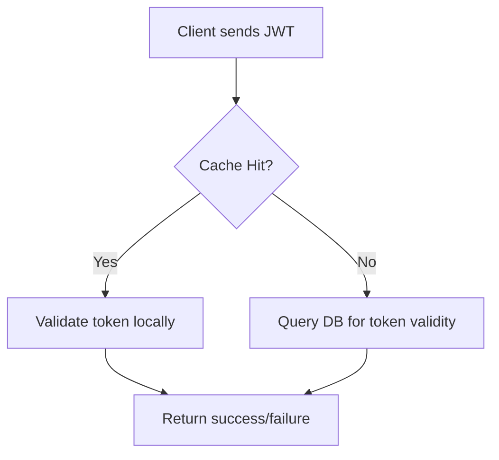
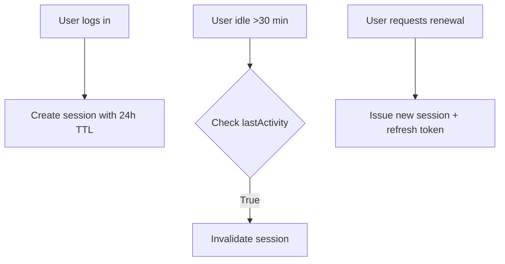

# **[Pattern] Authentication Optimization – Reference Guide**

---

## **Overview**
Authentication Optimization ensures secure and efficient user authentication while minimizing latency, computational overhead, and potential security risks. This pattern addresses scalability challenges in high-traffic systems by reducing redundant authentication calls, leveraging caching, and integrating progressive enhancement strategies. It balances security with performance, allowing developers to implement seamless, low-latency authentication flows for global distributed applications.

Key objectives include:
- Reducing authentication latency for a better user experience.
- Minimizing server load during peak traffic.
- Mitigating risks of brute-force attacks via rate limiting.
- Supporting multi-factor authentication (MFA) without sacrificing usability.

This guide covers architectural patterns, schema recommendations, and implementation considerations for optimizing authentication workflows.

---

## **1. Key Concepts**
Authentication Optimization relies on the following principles:

| **Concept**               | **Description**                                                                                                                                                                                                 |
|---------------------------|-----------------------------------------------------------------------------------------------------------------------------------------------------------------------------------------------------------------|
| **Token Caching**         | Stores authentication tokens (e.g., JWT) briefly in memory or session stores to avoid repeated verification against a database or external service.                                                                 |
| **Progressive Authentication** | Starts with low-security checks (e.g., IP-based or session validation) and escalates to full authentication only when needed (e.g., sensitive operations).                          |
| **Rate Limiting**         | Restricts authentication attempts per user/IP to prevent brute-force attacks, improving security without blocking legitimate users.                                                          |
| **Session Management**   | Extends session validity for authenticated users while invalidating suspicious sessions early.                                                                                                              |
| **Offline Authentication**| Allows pre-authentication (e.g., via tokens or single sign-on) to reduce login friction for returning users.                                                                                          |
| **Async Validation**      | Uses background validation for tokens (e.g., revoked tokens) to avoid blocking requests during peak loads.                                                                                            |

---

## **2. Schema Reference**
### **2.1 Core Entities**
| **Entity**               | **Fields**                                                                                     | **Description**                                                                                                                                                                                                 |
|--------------------------|-----------------------------------------------------------------------------------------------|-----------------------------------------------------------------------------------------------------------------------------------------------------------------------------------------------------------------|
| **User**                 | `id`, `username`, `email`, `hashedPassword`, `salt`, `isActive`, `lastLogin`                 | Stores user credentials and metadata for verification. `salt` mitigates rainbow table attacks.                                                                                                                 |
| **Session**              | `id`, `userId`, `token`, `expiresAt`, `ipAddress`, `userAgent`, `isValid`, `lastActivity`      | Tracks authenticated sessions with short-lived tokens for security. `lastActivity` helps detect abandoned sessions.                                                                                       |
| **Token**                | `id`, `userId`, `type` (JWT/OAuth), `value`, `issuedAt`, `expiresAt`, `scope`, `revoked`       | Stores authentication tokens. `revoked` flag enables quick blacklisting.                                                                                                                                       |
| **RequestLog**           | `id`, `userId`, `ipAddress`, `timestamp`, `status` ("success"/"failed"/"blocked")           | Logs authentication attempts for auditing and rate-limiting enforcement.                                                                                                                                         |
| **RateLimit**            | `id`, `userId`, `ipAddress`, `limit`, `windowSeconds` (e.g., 60), `remaining`, `resetAt`    | Tracks authentication request quotas per user/IP.                                                                                                                                                            |

---

### **2.2 Relationships**
| **Source**       | **Target**   | **Relationship**                                                                                     | **Description**                                                                                                                                                                                                 |
|------------------|--------------|----------------------------------------------------------------------------------------------------|-----------------------------------------------------------------------------------------------------------------------------------------------------------------------------------------------------------------|
| **User**         | **Session**  | `one-to-many`                                                                                       | A user can have multiple active sessions.                                                                                                                                                                |
| **User**         | **Token**    | `one-to-many`                                                                                       | Users generate multiple tokens (e.g., refresh tokens, JWTs).                                                                                                                                                   |
| **Session**      | **RequestLog** | `one-to-many`                                                                                       | Logs all requests tied to a session.                                                                                                                                                                       |
| **RequestLog**   | `N/A`        | `one-to-one` with **RateLimit**                                                                | Each request updates the rate-limit counter for the user/IP.                                                                                                                                                  |

---

## **3. Implementation Details**
### **3.1 Token Caching**
**Purpose**: Avoid repeated database lookups for token validation.
**Implementation**:
- Cache JWTs/OAuth tokens in-memory (e.g., Redis) with a **TTL** matching the token’s `expiresAt`.
- Use a **write-through cache**: Update the cache whenever a token is issued or revoked.
- Invalidate cached tokens when:
  - The user logs out.
  - The token’s `expiresAt` passes.
  - A revocation request is received (e.g., via `/revoke-token`).

**Example Flow**:


---

### **3.2 Progressive Authentication**
**Purpose**: Reduce full authentication overhead for low-risk actions.
**Implementation**:
- **Step 1**: Validate session/token for basic requests (e.g., API calls).
- **Step 2**: Escalate to full authentication if:
  - The request is sensitive (e.g., `GET /profile`).
  - The token is expired or invalid.
- Use **short-lived access tokens** (5–15 minutes) with **refresh tokens** for seamless reauthentication.

**Example**:
```javascript
// Pseudocode for progressive check
if (isAuthenticated(session)) {
  if (isSensitiveRequest(request)) {
    return fullAuthChallenge(); // Step 2: Full auth
  }
  return allowRequest();
}
```

---

### **3.3 Rate Limiting**
**Purpose**: Protect against brute-force attacks.
**Implementation**:
- Use a **sliding window** algorithm to track requests per user/IP.
- Enforce limits via middleware (e.g., Express `express-rate-limit`).
- Log blocked attempts to `RequestLog`.

**Example Schema Update**:
```sql
-- Rate limit update on failed attempt
UPDATE RateLimit
SET remaining = remaining - 1,
    resetAt = CASE
               WHEN remaining <= 0 THEN NOW() + windowSeconds
               ELSE resetAt
              END
WHERE userId = ? AND ipAddress = ?;
```

**Rate-Limit Middleware (Pseudocode)**:
```python
def rate_limit_middleware(request):
    user_ip = request.ip
    limit = get_rate_limit(user_ip)  # From RateLimit table
    if limit.remaining <= 0:
        log_blocked(request)
        return forbidden()
    decrement_remaining(limit)
    return next()
```

---

### **3.4 Session Management**
**Purpose**: Balance security and usability.
**Implementation**:
- **Session Expiry**: Set short TTLs (e.g., 24 hours) but allow renewals via refresh tokens.
- **Idleness Detection**: Invalidate sessions after **30 minutes of inactivity** (`lastActivity`).
- **Concurrent Sessions**: Limit to **1–3 active sessions** per user to reduce exposure.

**Example Workflow**:


---

### **3.5 Async Validation**
**Purpose**: Avoid blocking during token revocation checks.
**Implementation**:
- Use a **background job queue** (e.g., RabbitMQ, Celery) to validate tokens asynchronously.
- Cache revoked tokens in memory for **fast lookup** during real-time requests.
- Mark tokens as pending revocation; fully revoke after async processing.

**Example**:
```python
# Async revocation task
@async_task
def revoke_token_async(token_id):
    token = get_token(token_id)
    token.revoked = True
    cache.invalidate(f"token:{token_id}")
    save(token)
```

---

## **4. Query Examples**
### **4.1 Check Token Validity (Synchronous)**
```sql
-- Check if JWT is valid and not revoked
SELECT COUNT(*) > 0 AS is_valid
FROM Token
WHERE value = ? AND expiresAt > NOW() AND revoked = FALSE;
```

### **4.2 Invalidate Session on Idle**
```sql
-- Invalidate sessions older than 30 minutes of inactivity
UPDATE Session
SET isValid = FALSE
WHERE lastActivity < NOW() - INTERVAL '30 minutes';
```

### **4.3 Enforce Rate Limit**
```sql
-- Check/update rate limit for a user/IP
UPDATE RateLimit
SET remaining = GREATEST(remaining - 1, 0),
    resetAt = CASE
               WHEN remaining <= 0 THEN DATEADD(second, windowSeconds, NOW())
               ELSE resetAt
              END
WHERE userId = ? AND ipAddress = ?;
RETURNING remaining, resetAt;
```

### **4.4 Generate Refresh Token**
```sql
-- Issue a new refresh token (long-lived)
INSERT INTO Token (userId, type, value, expiresAt)
VALUES (?, 'refresh', generate_token(), NOW() + INTERVAL '7 days')
RETURNING value;
```

---

## **5. Performance Considerations**
| **Optimization**               | **Impact**                          | **Trade-offs**                                                                 |
|---------------------------------|-------------------------------------|---------------------------------------------------------------------------------|
| **Token Caching**               | Reduces DB queries by **80–90%**    | Higher memory usage; requires cache invalidation logic.                           |
| **Short-Lived Access Tokens**   | Lowers attack surface               | Requires refresh token workflow for usability.                                  |
| **Async Revocation**            | Reduces latency for valid requests  | Eventual consistency; risk of stale revoked tokens (mitigated by cache).        |
| **Rate Limiting**               | Stops brute-force attacks           | May impact legitimate users during DDoS events (needs adaptive limits).         |
| **Session Idleness**            | Reduces abandoned sessions          | Requires client-side tracking of activity (e.g., heartbeat pings).               |

---

## **6. Security Considerations**
| **Risk**                          | **Mitigation**                                                                                     |
|-----------------------------------|---------------------------------------------------------------------------------------------------|
| **Token Leakage**                 | Use short TTLs; rotate tokens on suspicious activity (e.g., login from new device/IP).           |
| **Replay Attacks**                | Include nonce or timestamp in tokens; validate on server.                                          |
| **Session Hijacking**             | Bind sessions to `ipAddress` + `userAgent`; enforce same-device policies.                          |
| **Credential Stuffing**           | Enforce rate limits on login attempts; use CAPTCHA after 3 failures.                             |
| **Token Revocation Lag**          | Combine async revocation with in-memory cache for real-time invalidation.                          |

---

## **7. Related Patterns**
| **Pattern**               | **Description**                                                                                     | **When to Use**                                                                                     |
|---------------------------|---------------------------------------------------------------------------------------------------|---------------------------------------------------------------------------------------------------|
| **OAuth 2.0**             | Standardized authorization framework for delegated access.                                          | When integrating with third-party services (e.g., Google Login).                                  |
| **Multi-Factor Authentication (MFA)** | Adds secondary verification (e.g., TOTP, biometrics).                                          | For high-value accounts or compliance requirements (e.g., PCI DSS).                              |
| **Token Swapping**        | Exchanges refresh tokens for new access tokens without user interaction.                          | To mitigate token expiration without requiring re-authentication.                                  |
| **Service Mesh Authentication** | Decentralized auth via sidecars (e.g., Istio, Linkerd).                                           | For microservices architectures with dynamic service discovery.                                   |
| **Zero Trust**            | Assumes breach; requires reauthentication for every request.                                       | In highly regulated environments (e.g., healthcare, finance).                                     |

---

## **8. Tools & Libraries**
| **Category**               | **Tools/Libraries**                                                                               | **Use Case**                                                                                       |
|---------------------------|-------------------------------------------------------------------------------------------------|---------------------------------------------------------------------------------------------------|
| **Token Generation**      | `jwt-simple` (Node.js), `PyJWT` (Python), `spring-security-oauth` (Java)                       | Secure JWT/OAuth token creation.                                                                 |
| **Rate Limiting**         | `express-rate-limit`, `Ratelimit` (Go), `RedisRateLimiter`                                      | Enforce request quotas.                                                                          |
| **Session Management**    | `connect-session` (Node.js), `Django-sessions`, `Spring Session`                               | Persist and manage user sessions.                                                                  |
| **Caching**               | Redis, Memcached, `in-memory` caches                                                             | Store tokens/sessions for low-latency access.                                                     |
| **Async Processing**      | Bull (Node.js), Celery (Python), Kafka                                                           | Handle revocation/purging in background.                                                          |

---
**Note**: Replace placeholders (e.g., `?`) with parameterized queries to prevent SQL injection. Always validate input data.