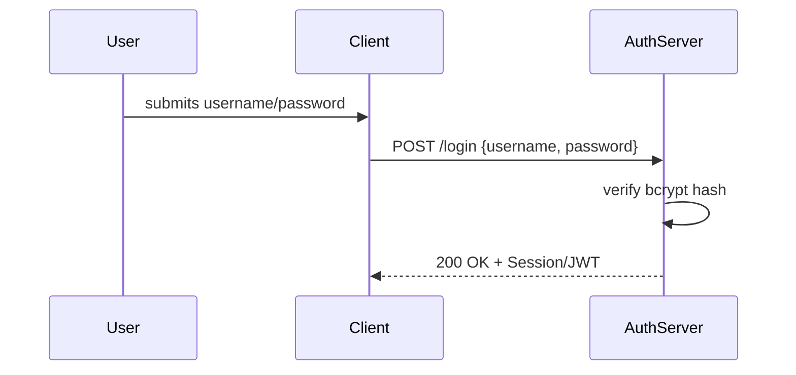
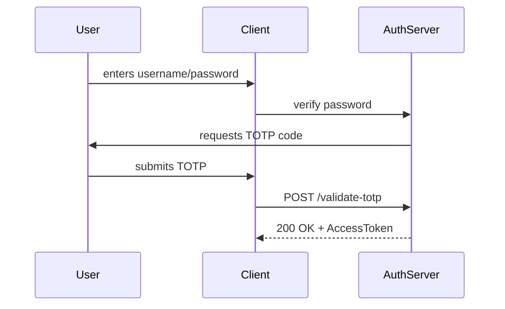
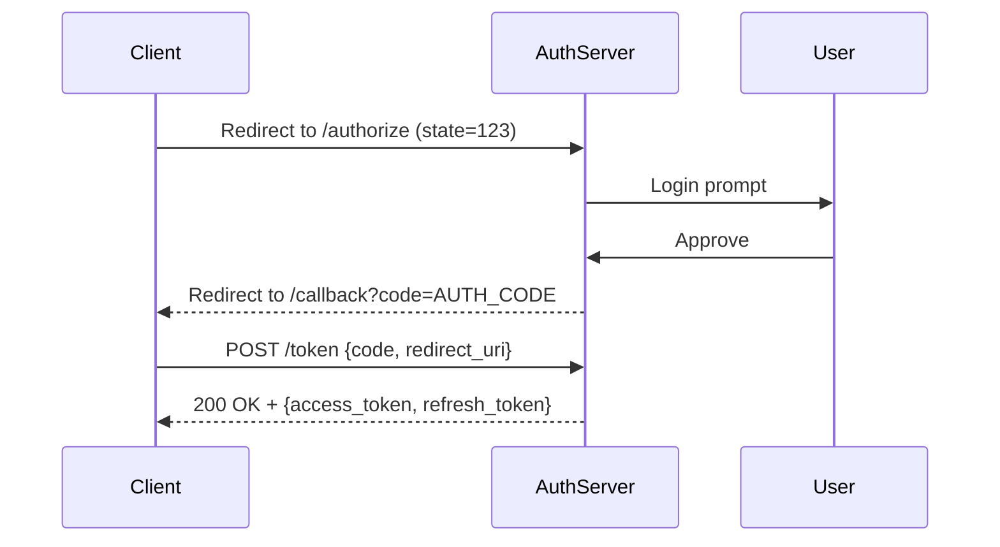

# **[Pattern] Authentication Patterns: Reference Guide**

---

## **Overview**
Authentication Patterns define mechanisms for verifying user identities in systems where authorization (access control) may follow separately. These patterns ensure secure, scalable, and user-friendly authentication while addressing tradeoffs like performance, security, and usability. Common use cases include:
- Web and mobile applications requiring secure login.
- APIs needing stateless or session-based auth.
- Microservices requiring token-based or OAuth2 flows.
- Single Sign-On (SSO) for cross-platform access.

This guide covers key patterns, their tradeoffs, and implementation details to help architects and developers select the right approach for their environment.

---

## **Schema Reference**

| **Pattern Name**       | **Description**                                                                                     | **Use Case**                                                                                     | **Mechanism**                                                                                     | **Security Level** | **Scalability** | **State Management** | **Token Lifespan**      | **Key Tradeoffs**                                                                             |
|------------------------|---------------------------------------------------------------------------------------------------|---------------------------------------------------------------------------------------------------|---------------------------------------------------------------------------------------------------|---------------------|-----------------|----------------------|-----------------------|------------------------------------------------------------------------------------------------|
| **Password-Based Auth** | Traditional username/password validation against a secure database.                               | Legacy systems, simple web apps.                                                                        | HMAC, bcrypt, Argon2 for password hashing; JWT for session tokens.                               | High               | Medium          | Server-side (cookies/sessions) | Short (15-30 min) | Usability vs. phishing risk; session fixation vulnerabilities.                                  |
| **Multi-Factor Auth (MFA)** | Combines passwords with 2FA (SMS, TOTP, biometrics, or hardware tokens).                          | High-security apps (banking, healthcare); sensitive APIs.                                           | Time-based OTP (TOTP), OAuth2 device pairing, FIDO2 WebAuthn.                                      | Very High          | Medium          | Client-side (TOTP) or server-side (device tokens) | Short (5-10 min) | User friction vs. reduced fraud risk.                                                           |
| **OAuth 2.0**          | Delegated authorization via third-party identity providers (e.g., Google, Facebook).             | APIs, microservices, SSO integrations.                                                               | Authorization Code Flow, Implicit Flow, Client Credentials.                                        | Medium-High        | High            | Stateless (JWT tokens) | Short-Medium (hours/days) | Complexity vs. scalability; reliance on third parties.                                             |
| **OpenID Connect (OIDC)** | Extends OAuth 2.0 with identity verification (e.g., "Sign In With Google").                   | Single Sign-On (SSO), social logins.                                                                 | ID Token claims (JWT); relies on OAuth 2.0 infrastructure.                                          | Medium-High        | High            | Stateless            | Medium (hours)       | Token introspection overhead; vendor lock-in risk.                                                |
| **JWT (JSON Web Tokens)** | Stateless tokens containing claims (user identity, roles) signed by a secret or asymmetric keys.  | APIs, stateless serverless apps.                                                                        | RS256, HS256 signing; JWT headers, payload, signature.                                              | Medium             | Very High        | Stateless            | Short-Medium (15 min–days) | Token replay risk; claims management complexity.                                                  |
| **Session-Based Auth** | Server maintains user state via encrypted cookies or session IDs.                                | Traditional web apps (PHP, Rails), low-latency systems.                                               | Encrypted cookies (HttpOnly, Secure flag); in-memory or Redis storage.                            | High               | Medium          | Server-side          | Short (15-30 min) | Session hijacking risk; scalability bottlenecks with in-memory sessions.                         |
| **Certificate-Based Auth** | Clients authenticate using X.509 certificates (e.g., mutual TLS).                            | Enterprise apps, IoT devices, high-security networks.                                                 | TLS client certificates; public-key cryptography.                                                  | Very High          | Low             | Stateless            | Long (days/years)    | Certificate management overhead; hardware dependencies.                                           |
| **SAML (Security Assertion Markup Language)** | XML-based SSO protocol for enterprise environments.                                               | Enterprise SSO (e.g., Active Directory integrations).                                                 | SAML Assertions, SP/IdP metadata exchange.                                                          | High               | Medium          | Stateless            | Short-Medium (hours) | Complexity; legacy support required.                                                             |
| **Biometric Auth**     | Uses fingerprint, facial recognition, or voice patterns for authentication.                     | Mobile apps, high-security unlock mechanisms.                                                        | Android BiometricPrompt, FaceID, Apple TouchID; local/remote verification.                        | Very High          | Low-Medium       | Client-side         | Short (1-5 min)     | False positives/negatives; hardware dependency; privacy concerns.                                  |
| **API Keys**           | Simple string-based auth for machine-to-machine communication.                                   | Internal services, serverless functions, CI/CD pipelines.                                             | Base64-encoded keys; stateless validation.                                                          | Low-Medium         | Very High        | Stateless            | Long (permanent)     | Limited scope; no user identity; susceptible to leakage.                                           |
| **WebAuthn (FIDO2)**   | Standardized public-key cryptography for passwordless auth.                                      | Modern browsers/mobile apps; phishing-resistant logins.                                              | Public-private key pairs; WebAuthn API (CTAP).                                                     | Very High          | Medium          | Client-side         | Short-Medium (hours) | Browser support variability; setup complexity.                                                     |
| **Short-Lived Tokens** | Tokens with minimal validity (e.g., 5 minutes), requiring frequent re-authentication.         | High-security APIs, browser-based apps.                                                              | JWT with short expiry; refresh tokens for re-authentication.                                        | Very High          | High            | Stateless            | Very Short (5 min)   | User friction vs. reduced token misuse risk.                                                      |

---

## **Implementation Details**

### **1. Password-Based Authentication**
**How It Works:**
- Users submit credentials to a server, which hashes the password (e.g., `bcrypt`) and compares it to stored hashes.
- Successful auth grants a session (cookie/JWT) or refresh token.

**Security Best Practices:**
- Enforce **password policies** (length, complexity).
- Use **salting** to prevent rainbow table attacks.
- Implement **rate limiting** to thwart brute-force attacks.
- Support **passwordless recovery** (e.g., magic links).

**Example Flow:**


---

### **2. Multi-Factor Authentication (MFA)**
**How It Works:**
- After password entry, the user provides a second factor (e.g., TOTP code from an app like Google Authenticator).
- For hardware tokens (e.g., YubiKey), a cryptographic handshake occurs.

**Security Best Practices:**
- Use **TOTP (RFC 6238)** or **WebAuthn** for client-side factors.
- Store recovery codes securely (never in plaintext).
- Support **backup codes** for lost devices.

**Example Flow (TOTP):**


---

### **3. OAuth 2.0**
**Key Flows:**
| **Flow**               | **Use Case**                          | **Steps**                                                                                     |
|------------------------|---------------------------------------|------------------------------------------------------------------------------------------------|
| **Authorization Code** | Web apps, mobile apps.                 | Redirect to auth server → code → exchange for tokens.                                           |
| **Implicit**           | SPAs (legacy).                         | Redirect with token in URL (insecure; avoid).                                                   |
| **Client Credentials** | Machine-to-machine auth.              | Client ID/Secret → access token for APIs.                                                      |
| **Password**           | Legacy apps (deprecated).             | username/password → access token (risky; avoid).                                               |

**Security Best Practices:**
- Use **PKCE (Proof Key for Code Exchange)** for public clients (e.g., mobile apps).
- Store **client secrets securely** (e.g., AWS Secrets Manager).
- Implement **token introspection** for short-lived tokens.

**Example (Authorization Code Flow):**


---

### **4. JWT (JSON Web Tokens)**
**Token Structure:**
```
{
  "header": {"alg": "RS256", "typ": "JWT"},
  "payload": {"sub": "user123", "iat": 1234567890, "exp": 1234568490},
  "signature": "..."
}
```

**Best Practices:**
- Use **asymmetric signing (RS256)** for stateless validation.
- Store **private keys securely** (e.g., AWS KMS, HashiCorp Vault).
- Set **short expiry** (e.g., 15-30 minutes) and use refresh tokens.

**Example (Token Validation):**
```javascript
const jwt = require('jsonwebtoken');
const token = req.headers.authorization.split(' ')[1];
try {
  const decoded = jwt.verify(token, publicKey);
  if (decoded.exp < Date.now() / 1000) throw new Error('Expired');
  // Proceed
} catch (err) {
  res.status(401).send('Invalid token');
}
```

---

### **5. Session-Based Auth**
**How It Works:**
- Server generates a **session ID** (e.g., `abc123`) and stores it in a database (Redis, memory).
- Client receives a **cookie** (`JSESSIONID=abc123`).

**Security Best Practices:**
- Use **HttpOnly, Secure, SameSite=Strict** cookies.
- Regenerate session IDs after login.
- Set **short session timeouts** (e.g., 30 minutes).

**Example (Node.js with Express):**
```javascript
const session = require('express-session');
app.use(session({
  secret: 'your_secret_key',
  resave: false,
  saveUninitialized: false,
  cookie: { secure: true, maxAge: 1800000 } // 30 min
}));
```

---

## **Query Examples**

### **1. JWT Validation (FastAPI)**
```python
from fastapi import FastAPI, Depends, HTTPException, status
from fastapi.security import OAuth2PasswordBearer

app = FastAPI()
oauth2_scheme = OAuth2PasswordBearer(tokenUrl="token")

async def get_current_user(token: str = Depends(oauth2_scheme)):
    try:
        payload = jwt.decode(token, options={"verify_signature": False})  # In production, use proper key
        return payload.get("sub")
    except Exception:
        raise HTTPException(
            status_code=status.HTTP_401_UNAUTHORIZED,
            detail="Invalid authentication credentials",
        )

@app.get("/protected")
async def protected_route(user: str = Depends(get_current_user)):
    return {"user": user}
```

### **2. OAuth2 Token Exchange (cURL)**
```bash
# Exchange code for tokens (Authorization Code Flow)
curl -X POST \
  https://auth-server.com/token \
  -H "Content-Type: application/x-www-form-urlencoded" \
  -d "code=AUTH_CODE&redirect_uri=https://client.com/callback&client_id=CLIENT_ID&client_secret=CLIENT_SECRET&grant_type=authorization_code"

# Access protected API
curl -X GET \
  https://api.example.com/data \
  -H "Authorization: Bearer ACCESS_TOKEN"
```

### **3. MFA with TOTP (Python)**
```python
import pyotp

# Generate a TOTP URI (e.g., for Google Authenticator)
secret = pyotp.random_base32()
totp_uri = pyotp.totp.TOTP(secret).provisioning_uri(
    name="user@example.com", issuer_name="MyApp"
)

# Verify a user-provided TOTP
totp = pyotp.TOTP(secret)
is_valid = totp.verify("123456")  # User-entered code
```

---

## **Related Patterns**
1. **[Authorization Patterns]**
   - Defines how to control access to resources (e.g., RBAC, ABAC, Attribute-Based Access Control).
   - *Use Case:* After authenticating a user, determine their permissions.

2. **[CORS (Cross-Origin Resource Sharing)]**
   - Ensures securely shared resources across domains in web apps.
   - *Use Case:* APIs used by frontend apps hosting elsewhere.

3. **[Rate Limiting]**
   - Protects auth endpoints from brute-force attacks.
   - *Use Case:* Password-based auth, API keys.

4. **[Session Management]**
   - Extends session-based auth with features like invalidation or token rotation.
   - *Use Case:* Logout across devices, session hijacking protection.

5. **[Passwordless Authentication]**
   - Alternatives to passwords (e.g., magic links, WebAuthn).
   - *Use Case:* Reducing password-based attacks.

6. **[Idempotency Keys]**
   - Safely retries authentication flows (e.g., OAuth2 token refresh).
   - *Use Case:* Resilient token-based auth.

7. **[API Gateway Security]**
   - Centralized auth for microservices (e.g., JWT validation, rate limiting).
   - *Use Case:* Serverless architectures.

---
## **Further Reading**
- [OAuth 2.0 Spec](https://datatracker.ietf.org/doc/html/rfc6749)
- [JWT Best Practices](https://auth0.com/blog/critical-jwt-security-considerations/)
- [SAML Core](https://docs.oasis-open.org/security/saml/v2.0/saml-core-2.0-os.pdf)
- [WebAuthn API](https://developer.chrome.com/docs/web-platform/webauthn/)