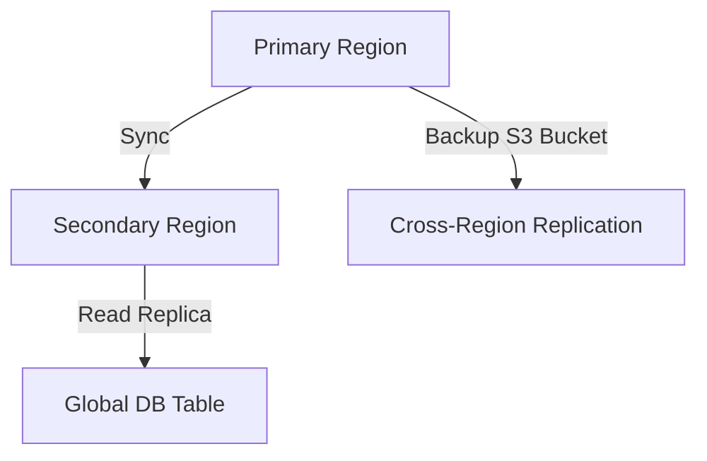

# **[Backup & Storage Patterns] Reference Guide**

---

## **Overview**
The **Backup & Storage Patterns** reference guide provides best practices and architectural principles for ensuring data durability, availability, and disaster recovery. Whether storing data in cloud, hybrid, or on-premises environments, this pattern helps mitigate risks through **redundancy, backup strategies, and cost-efficient storage tiers**. It covers:
- **Storage design** (hot/cold archival, tiered storage)
- **Backup strategies** (full, incremental, differential, versioning)
- **Fault tolerance** (multi-region replication, snapshots)
- **Recovery procedures** (restore workflows, point-in-time recovery)
- **Cost optimization** (lifecycle policies, data deduplication)

Follow this guide to implement resilient storage systems while balancing **reliability, performance, and cost**.

---

## **Core Concepts & Implementation Details**

### **1. Storage Tiers & Lifecycle Management**
Organize data into tiers based on **access frequency** and **cost sensitivity**:
| **Tier**       | **Use Case**                          | **Storage Type**       | **Retention Policy**       | **Cost Efficiency** |
|----------------|---------------------------------------|------------------------|----------------------------|---------------------|
| **Hot (Active)** | Frequently accessed data (e.g., transaction logs, live DBs) | SSDs, cloud block storage (e.g., AWS EBS, Azure Premium) | 30–90 days                | High (performance-focused) |
| **Warm (Nearline)** | Infrequently accessed but retrievable (e.g., backups, analytics data) | Cloud object storage (e.g., AWS S3 Standard-IA, Azure Cool) | 6–12 months               | Medium (cost savings) |
| **Cold (Archive)** | Long-term retention (e.g., compliance, historical logs) | Cloud deep archive (e.g., AWS Glacier Deep Archive) | 7+ years                  | Low (minimal access) |
| **Tape (Offline)** | Rarely accessed, air-gapped data (e.g., regulatory archives) | Physical tape libraries | 10+ years                  | Very Low (manual) |

**Implementation Tip:**
Use **lifecycle policies** (e.g., AWS S3 Lifecycle Rules) to auto-migrate data between tiers. Example:
```json
{
  "Rules": [
    {
      "ID": "MoveToColdAfter30Days",
      "Status": "Enabled",
      "Transitions": [
        {
          "Days": 30,
          "StorageClass": "STANDARD_IA"
        }
      ]
    },
    {
      "ID": "ArchiveAfter1Year",
      "Status": "Enabled",
      "Transitions": [
        {
          "Days": 365,
          "StorageClass": "GLACIER"
        }
      ]
    }
  ]
}
```

---

### **2. Backup Strategies**
Choose backup types based on **RPO (Recovery Point Objective)** and **RTO (Recovery Time Objective)**:

| **Strategy**       | **Description**                                                                 | **Pros**                                  | **Cons**                              | **Best For**                     |
|--------------------|-------------------------------------------------------------------------------|-------------------------------------------|---------------------------------------|----------------------------------|
| **Full Backup**    | Complete copy of all data.                                                   | Simple, verifiable                        | Time-consuming, high storage cost    | Small datasets, nightly backups  |
| **Incremental**    | Copies only changed data since last backup.                                  | Fast, low storage usage                  | Long restore time                    | Large datasets, frequent changes |
| **Differential**   | Copies all changes since the last **full** backup.                           | Balanced speed/storage                   | Requires full backup for restore     | Medium datasets                   |
| **Snapshot**       | Point-in-time copy (filesystem-level, e.g., VM snapshots, DB snapshots).       | Instantaneous, low overhead              | Risk of cascade failures             | VMs, databases                    |
| **Versioning**     | Multiple copies of a file/object with timestamps (e.g., Git, S3 versioning). | Easy rollback                           | Higher storage cost                 | Critical files, config data      |

**Example Workflow (Hybrid):**
1. **Daily incremental backups** (to cloud cold storage)
2. **Weekly full backups** (to tape)
3. **Hourly snapshots** (for VMs in on-prem datacenter)

---

### **3. Fault Tolerance & Replication**
Reduce downtime with **redundancy strategies**:

| **Pattern**               | **Description**                                                                 | **Tools/Examples**                          | **Trade-offs**                     |
|---------------------------|-------------------------------------------------------------------------------|---------------------------------------------|------------------------------------|
| **Multi-Region Replication** | Sync data across geographic regions for disaster recovery.               | AWS Cross-Region Replication, Azure Geo-Redundant Storage | Higher cost, latency for sync     |
| **Multi-AZ Deployment**   | Deploy DB/storage across Availability Zones (AZs) in a single region.         | AWS Multi-AZ RDS, Azure Zone-Redundant SQL | Faster recovery than cross-region  |
| **Local Replication**     | Sync data within a datacenter (e.g., DRBD, glusterfs).                     | On-prem storage clusters                   | Single-region risk                |
| **Immutable Backups**     | Prevent tampering with backups (e.g., WORM—Write Once, Read Many).           | AWS S3 Object Lock, Azure Immutable Blob   | Complex policy enforcement         |

**Example (AWS Multi-Region Setup):**


---

### **4. Data Integrity & Validation**
Ensure backups are **restorable** with:
- **Checksum validation** (e.g., SHA-256 for files, checksum databases).
- **Regular restore tests** (simulate disaster recovery monthly).
- **Immutable logs** (e.g., AWS CloudTrail for API calls, Azure Monitor).

**Example Checksum Script (Bash):**
```bash
#!/bin/bash
for file in /path/to/backups/*.tar.gz; do
  echo "Validating $file..."
  tar -tczf "$file" | wc -l  # Count files (basic check)
  sha256sum "$file" > "${file}.sha256"  # Generate checksum
done
```

---

### **5. Cost Optimization**
| **Strategy**               | **How It Works**                                                                 | **Tools**                          |
|---------------------------|-------------------------------------------------------------------------------|------------------------------------|
| **Data Deduplication**     | Eliminate redundant copies of data (e.g., identical files).                   | Veeam, Commvault, AWS Storage Gateway |
| **Compression**            | Reduce storage footprint for backups (e.g., `.gz`, `.zst`).                 | `gzip`, `zstd`                     |
| **Thin Provisioning**     | Allocate only used storage space (e.g., VM disks).                            | AWS EBS, Azure Disks               |
| **Right-Sizing**           | Match storage type to workload (e.g., SSDs for DBs, HDDs for logs).          | Cloud provider tools                |

**Example (AWS Cost Savings Calculation):**
| **Storage Type**       | **Cost/GB/Month** | **Data Size** | **Monthly Cost** |
|------------------------|-------------------|---------------|------------------|
| EBS (SSD)              | $0.10             | 100GB         | $10              |
| S3 Standard-IA         | $0.024            | 100GB         | **$2.40**        |
| **Savings**            |                   |               | **76% lower**    |

---

## **Schema Reference**
| **Component**          | **Description**                                                                 | **Example (JSON/Schema)**                                                                 |
|------------------------|-------------------------------------------------------------------------------|------------------------------------------------------------------------------------------|
| **Backup Policy**      | Defines backup frequency, type, and targets.                                   | ```{ "name": "db-backup", "type": "incremental", "schedule": "daily", "targets": ["s3://backups/db"] }``` |
| **Storage Tier**       | Metadata for lifecycle management.                                             | ```{ "path": "/backups/monthly", "tier": "cold", "retention_days": 365 }```               |
| **Replication Rule**   | Sync settings between regions.                                                  | ```{ "source": "region-1", "destination": "region-2", "sync_frequency": "hourly" }```       |
| **Checksum Record**    | Integrity verification for backups.                                            | ```{ "file": "backup.tar.gz", "checksum": "a1b2c3...", "timestamp": "2024-01-01" }```     |

---

## **Query Examples**
### **1. List All Backups for a VM (Terraform + AWS CLI)**
```bash
# List EBS snapshots for a VM
aws ec2 describe-snapshots \
  --filter "Name=tag:ResourceId,Values=vm-12345" \
  --query "Snapshots[*].{SnapshotId:SnapshotId, StartTime:StartTime, State:State}"
```

### **2. Filter S3 Objects by Size (AWS CLI)**
```bash
# Find large files in a bucket (>10GB)
aws s3 ls s3://my-bucket/ --recursive \
  --summarize \
  | awk '$1 > 1073741824 {print $4, $1}'
```

### **3. Restore a Snapshot (Azure CLI)**
```bash
# Restore a VM from a snapshot
az vm create \
  --resource-group my-rg \
  --name restored-vm \
  --image /subscriptions/.../snapshots/my-snapshot \
  --admin-username azureuser
```

### **4. Validate Checksums (Python)**
```python
import hashlib
import os

def verify_checksum(file_path, expected_checksum):
    with open(file_path, "rb") as f:
        file_hash = hashlib.sha256(f.read()).hexdigest()
    return file_hash == expected_checksum

# Usage
print(verify_checksum("backup.tar.gz", "a1b2c3..."))
```

---

## **Related Patterns**
Consume these patterns in conjunction with **Backup & Storage Patterns** for comprehensive data resilience:

1. **[Resilience Patterns: Multi-Region Deployment](link)**
   - Extends **Backup & Storage** with app-level redundancy.

2. **[Observability Patterns: Backup Monitoring](link)**
   - Integrates metrics (e.g., backup failure rates, restore times) into dashboards.

3. **[Cost Optimization Patterns: Storage Tiering](link)**
   - Dives deeper into dynamic storage cost management.

4. **[Data Governance Patterns: Compliance Archiving](link)**
   - Ensures backups meet regulatory requirements (e.g., GDPR, HIPAA).

5. **[Disaster Recovery Patterns: RTO/RPO Planning](link)**
   - Defines recovery time/objectives for backup strategies.

---
## **Glossary**
| **Term**            | **Definition**                                                                 |
|---------------------|-------------------------------------------------------------------------------|
| **RPO (Recovery Point Objective)** | Max acceptable data loss (e.g., "30 minutes").                              |
| **RTO (Recovery Time Objective)**  | Max time to restore services (e.g., "4 hours").                              |
| **Immutable Backup**          | Backup that cannot be modified after creation (WORM compliance).               |
| **Consistency Model**         | How backups reflect database state (e.g., eventual consistency in distributed DBs). |
| **Point-in-Time Recovery (PITR)** | Restore data to a specific timestamp (e.g., DB transactions).               |

---
**Next Steps:**
- Audit your current storage costs using the [AWS Cost Explorer](https://aws.amazon.com/aws-cost-management/aws-cost-explorer/).
- Test restore procedures with a **dry run** (simulate a disaster).
- Automate checksum validation in your CI/CD pipeline.