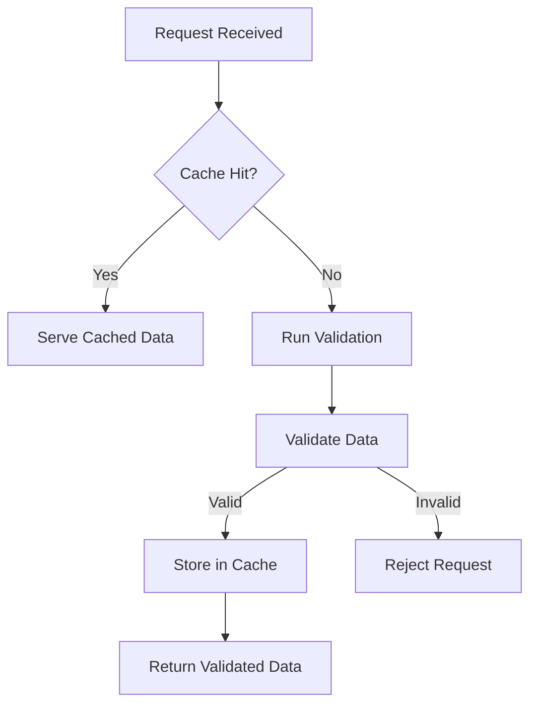
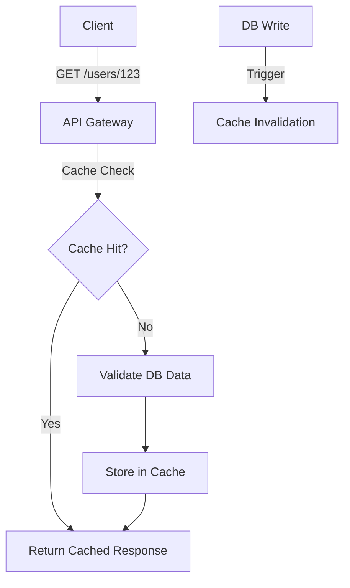

# **[Pattern] Caching Validation Reference Guide**

---

## **1. Overview**
The **Caching Validation** pattern enhances data consistency and performance by storing validated results of heavy computations, queries, or computations in a cache. This avoids redundant processing while maintaining the integrity of data. It is commonly used in **API responses, database queries, or expensive calculations** where validation ensures correctness, and caching improves efficiency.

Key benefits include:
- **Reduced latency** for repeated requests.
- **Lower computational load** on backend systems.
- **Consistent responses** by serving validated cached data.

This pattern is ideal for:
- REST/GraphQL APIs with read-heavy workloads.
- Microservices requiring standardized responses.
- Applications with frequent repeated validations (e.g., JWT tokens, form submissions).

---

## **2. Key Concepts**

| **Term**               | **Definition**                                                                 | **Example**                              |
|------------------------|-------------------------------------------------------------------------------|------------------------------------------|
| **Cache Layer**        | A temporary store (e.g., Redis, Memcached) holding validated results.         | Redis key-value store for API responses. |
| **Validation Rule**    | Logic defining what qualifies as valid data (e.g., schema compliance).       | JSON Schema validation for request payloads. |
| **Cache Key**          | Unique identifier (e.g., `user_123:orders`) to retrieve cached data.         | `product_sku123:stock`.                  |
| **TTL (Time-to-Live)** | Duration (in seconds) cached data remains valid before revalidation.          | `TTL=300` (5 minutes).                   |
| **Cache Invalidation** | Process to remove stale or outdated cached data (e.g., after DB updates).    | Delete cache on `user_profile` after edit. |

---

## **3. Schema Reference**

### **3.1 Cache Validation Workflow Schema**



### **3.2 Key Data Structures**

| **Component**          | **Description**                                                                 | **Example (JSON)**                     |
|------------------------|-------------------------------------------------------------------------------|----------------------------------------|
| **Cache Entry**        | Structured cached object with metadata (e.g., `data`, `ttl`, `version`).     | ```{ "data": { "price": 9.99 }, "ttl": 300 }``` |
| **Validation Config**  | Defines rules for validation (e.g., required fields, regex patterns).         | ```{ "schema": { "$schema": "http://json-schema.org/draft-07/schema#", "type": "object", "properties": { "id": { "type": "number" } } }``` |
| **Cache Key Generator**| Function to generate unique cache keys (e.g., `user_id:entity_type`).          | Key: `user_42:orders_2023`.             |

---

## **4. Implementation Steps**

### **4.1 Prerequisites**
- **Caching System**: Redis, Memcached, or in-memory cache (e.g., Node.js `Cache`).
- **Validation Library**: [JSON Schema](https://json-schema.org/), [Zod](https://github.com/colinhacks/zod), or custom logic.
- **Backend Framework**: Node.js, Python (FastAPI), Java (Spring Boot).

### **4.2 Step-by-Step Implementation**

#### **Step 1: Configure Cache Client**
Initialize a cache client (e.g., Redis) with TTL settings.
```javascript
// Node.js with Redis
const redis = require('redis');
const client = redis.createClient({ url: 'redis://localhost:6379' });

// Set TTL (300 seconds = 5 minutes)
client.set("user_123:orders", JSON.stringify(data), { EX: 300 });
```

#### **Step 2: Define Validation Rules**
Use a schema validator (e.g., Zod) to enforce data integrity.
```javascript
const { z } = require('zod');
const orderSchema = z.object({
  id: z.number(),
  items: z.array(z.object({ productId: z.string() })),
});
```

#### **Step 3: Implement Cache Logic**
Check cache first; if missing, validate and cache the result.
```javascript
async function getValidatedOrders(userId) {
  const cacheKey = `user_${userId}:orders`;

  // 1. Check cache
  const cachedData = await client.get(cacheKey);
  if (cachedData) return JSON.parse(cachedData);

  // 2. Fetch raw data (e.g., from DB)
  const rawOrders = await db.query(`SELECT * FROM orders WHERE user_id = ?`, [userId]);

  // 3. Validate data
  const validated = orderSchema.parse(rawOrders);

  // 4. Cache valid result
  await client.set(cacheKey, JSON.stringify(validated), { EX: 300 });

  return validated;
}
```

#### **Step 4: Handle Invalidation**
Invalidate cache on data changes (e.g., after an `UPDATE`).
```javascript
// After updating an order
async function updateOrder(orderId, data) {
  await db.query('UPDATE orders SET ... WHERE id = ?', [orderId]);
  await client.del(`user_*:orders`); // Invalidate all user orders (or use precise keys)
}
```

---

## **5. Query Examples**

### **5.1 Cache Hit (Fast Response)**
```http
GET /api/orders/123
Cache-Control: public, max-age=300

Response: 200 OK
{
  "id": 123,
  "items": [ { "productId": "sku123" } ]
}
```

### **5.2 Cache Miss (Validation + Caching)**
```http
GET /api/orders/123 (Cache MISS)
```

1. **Backend Logic**:
   ```javascript
   // Step 1: No cache hit → Query DB
   const rawData = await db.query(...);

   // Step 2: Validate
   const validated = orderSchema.parse(rawData);

   // Step 3: Cache for 5 minutes
   await client.set("order_123", validated, { EX: 300 });
   ```

2. **Response**:
   ```http
   HTTP/1.1 200 OK
   Cache-Control: public, max-age=300

   {
     "id": 123,
     "items": [ { "productId": "sku123" } ]
   }
   ```

### **5.3 Cache Invalidation (Post-Update)**
```javascript
// After updating order 123:
await db.query('UPDATE orders SET ... WHERE id = 123');
await client.del("order_123"); // Clear stale cache
```

---

## **6. Error Handling**
| **Scenario**               | **Solution**                                                                 |
|----------------------------|-----------------------------------------------------------------------------|
| **Invalid Cache Data**     | Serve fresh data from source; log error (e.g., `cache corruption`).         |
| **Validation Failure**     | Return `400 Bad Request` with error details (e.g., missing fields).          |
| **Cache Full**             | Implement eviction policies (e.g., LRU) or fall back to DB.                |
| **Race Conditions**        | Use locks (e.g., Redis `SETNX`) during validation + caching.                |

---

## **7. Performance Considerations**
- **Cache Size**: Monitor memory usage (e.g., Redis memory stats).
- **TTL Tuning**: Balance freshness vs. load (e.g., `TTL=60` for volatile data).
- **Bulk Caching**: Pre-load frequently accessed data (e.g., during startup).

---

## **8. Related Patterns**
| **Pattern**               | **Description**                                                                 | **When to Use**                          |
|---------------------------|-------------------------------------------------------------------------------|------------------------------------------|
| **ETag/Conditional Requests** | Cache validation via HTTP headers (e.g., `If-None-Match`).                 | REST APIs with versioning.               |
| **Circuit Breaker**       | Fall back to cached data if downstream service fails.                         | Microservices with unreliable dependencies. |
| **Lazy Loading**          | Load cached data only after initial validation.                              | Large datasets (e.g., paginated APIs).   |
| **Event Sourcing**        | Invalidate cache on domain events (e.g., `OrderUpdated`).                     | Real-time systems with high write throughput. |

---

## **9. Example Architecture**


---

## **10. Anti-Patterns to Avoid**
- **Over-Caching**: Cache everything → leads to stale data.
- **No TTL**: Unbounded cache growth (memory issues).
- **Ignoring Invalidation**: Silent cache pollution after DB changes.
- **Complex Keys**: Unpredictable cache misses (e.g., non-unique keys).

---
**See Also**:
- [Redis Documentation](https://redis.io/topics/)
- [JSON Schema Validator](https://json-schema.org/)
- [API Design Patterns](https://docs.microsoft.com/en-us/azure/architecture/patterns/)