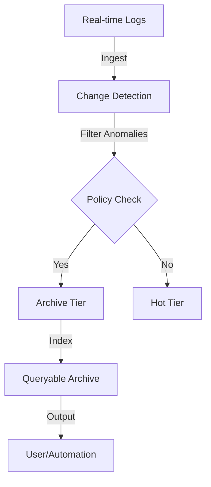
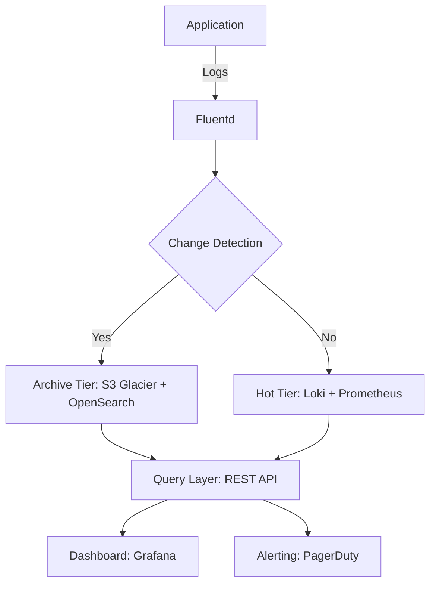

# **[Pattern] Change Log Archival for Observability Reference Guide**

---

## **1. Overview**
Observability architecture relies on real-time monitoring, tracing, and logging to detect, analyze, and resolve issues. However, long-term retention of raw observability data (e.g., logs, traces, metrics) can quickly consume storage and degrade query performance. **Change Log Archival for Observability** is a pattern that reduces storage overhead and preserves key insights by archiving log data incrementally based on change detection (e.g., anomalies, policy violations, or business-critical events) rather than storing everything.

This pattern is ideal for applications requiring regulatory compliance (e.g., audit logs), long-term trend analysis, or scenarios where most log data is non-critical but exceptions must be retained. By archiving only logs correlating to significant changes, organizations balance cost, performance, and compliance.

---

## **2. Schema Reference**

### **Core Components**
| **Component**          | **Description**                                                                                     | **Sample Fields**                                                                                     |
|------------------------|-----------------------------------------------------------------------------------------------------|-------------------------------------------------------------------------------------------------------|
| **Change Detection Engine**  | Identifies anomalies, policy violations, or thresholds in real-time observability data.            | `alert_type`, `severity`, `timestamp`, `affected_resource`                                         |
| **Archival Policy Engine**       | Defines rules for which logs to archive (e.g., logs with `severity > 3` or `error_count > 5`).      | `policy_id`, `filter_expression`, `retention_days`, `compression_level`                           |
| **Log Storage Tiering**            | Separates data into hot (real-time) and cold (archived) storage.                                    | `log_type`, `storage_class`, `hot_cold_threshold` (e.g., 7 days)                                  |
| **Indexing Layer**                  | Maintains searchable indexes for fast queries on archived logs (e.g., Elasticsearch or OpenSearch).| `index_name`, `shard_count`, `replica_count`, `time_based_alias`                                   |
| **Query Interface**                  | Exposes APIs/CLI for querying archived logs (e.g., SQL-like syntax for structured logs).             | `query_language`, `pagination_support`, `sampling_rate`                                            |
| **Notification Service**            | Alerts users when archived logs meet criteria (e.g., “High-severity errors in `app:api`”).        | `notification_channels` (Slack, Email), `escalation_policy`, `thresholds`                          |

---

### **Data Flow Diagram**


---

## **3. Implementation Details**

### **Key Concepts**
1. **Change Detection**:
   - Use ML-based anomaly detection (e.g., Prometheus Alertmanager, OpenTelemetry Anomaly Detection) or rule-based filtering (e.g., “logs with `status=5xx`”).
   - Example tools: Grafana Anomaly Detection, ELK Stack (Elasticsearch + Kibana), or custom scripts with Pandas/NumPy.

2. **Archival Policy Engine**:
   - Policies can be static (e.g., “Archive all logs older than 30 days”) or dynamic (e.g., “Archive logs when `latency > 2s`”).
   - Store policies in a configuration database (e.g., Redis, PostgreSQL) or as part of observability platform settings (e.g., Datadog, Splunk).

3. **Storage Tiering**:
   - **Hot Tier**: High-performance storage (e.g., S3 Standard, SSD-backed databases) for recent logs.
   - **Cold Tier**: Lower-cost storage (e.g., S3 Glacier, Azure Archive Storage) for archived logs.
   - Transition logs automatically when they exceed the hot threshold (e.g., 7 days).

4. **Indexing**:
   - Use time-based indexes (e.g., `logs-2024-05-01` to `logs-2024-05-31`) for efficient querying.
   - For structured logs, include a schema (e.g., Avro, JSON Schema) to enforce consistency.

5. **Query Optimization**:
   - Support **sampling** for large cold queries (e.g., “Query 1% of logs where `severity=CRITICAL`”).
   - Use **materialized views** for common aggregations (e.g., “Count of errors per service per day”).

---

### **Tools & Technologies**
| **Category**               | **Tools**                                                                                       |
|----------------------------|-------------------------------------------------------------------------------------------------|
| **Change Detection**       | Prometheus Alertmanager, OpenTelemetry Anomaly Detection, Grafana Anomaly Detection            |
| **Log Ingestion**          | Fluentd, Fluent Bit, Logstash, Loki Ingest                                                     |
| **Archival Storage**       | S3 Glacier, Azure Blob Archive, GCP Coldline Storage                                           |
| **Indexing**               | Elasticsearch, OpenSearch, ClickHouse, Apache Druid                                            |
| **Query Interface**        | Elasticsearch DSL, ClickHouse SQL, PromQL (for metrics), custom APIs                            |
| **Orchestration**          | Kubernetes (for scaling), Terraform (for IaC), Airflow (for workflows)                         |

---

## **4. Query Examples**

### **Prerequisites**
- Assume a schema where archived logs are stored in Elasticsearch with the following mapping:
  ```json
  {
    "mappings": {
      "properties": {
        "timestamp": { "type": "date" },
        "severity": { "type": "keyword" },
        "resource": { "type": "keyword" },
        "message": { "type": "text" },
        "archived_at": { "type": "date" }
      }
    }
  }
  ```

---

### **Example 1: Basic Filtering**
**Query**: Find all `CRITICAL` logs from the last 30 days archived in cold storage.
```json
GET logs-cold/_search
{
  "query": {
    "bool": {
      "must": [
        { "match": { "severity": "CRITICAL" } },
        { "range": { "timestamp": { "gte": "now-30d" } } }
      ]
    }
  }
}
```
**Optimization**: Use a time-based index alias (e.g., `logs-cold-*`) to avoid wildcards.

---

### **Example 2: Aggregation with Sampling**
**Query**: Get a summary of `ERROR` logs per service, sampling 5% of the data.
```json
POST logs-cold/_search
{
  "size": 0,
  "query": {
    "bool": {
      "must": [
        { "match": { "severity": "ERROR" } }
      ]
    }
  },
  "sampler": { "ratio": 0.05 },
  "aggs": {
    "services": { "terms": { "field": "resource.keyword", "size": 20 } }
  }
}
```

---

### **Example 3: Complex Filter with Multi-Field Match**
**Query**: Find logs where `severity` is `WARN` OR `ERROR` AND contain the word “timeout.”
```json
GET logs-cold/_search
{
  "query": {
    "bool": {
      "should": [
        { "match": { "severity": "WARN" } },
        { "match": { "severity": "ERROR" } },
        { "multi_match": { "query": "timeout", "fields": ["message"] } }
      ],
      "minimum_should_match": 2
    }
  }
}
```

---

### **Example 4: Cross-Archival Join (Hot + Cold)**
**Query**: Correlate real-time `ERROR` logs with archived context (e.g., previous day’s trends).
```sql
-- Hypothetical SQL-like syntax for a unified query (e.g., using ClickHouse)
SELECT
  h.message,
  c.avg_latency,
  c.error_rate
FROM hot_logs h
JOIN (
  SELECT resource, AVG(latency) as avg_latency, COUNT(*)/COUNT(DISTINCT timestamp) as error_rate
  FROM cold_logs
  WHERE severity = 'ERROR'
    AND timestamp BETWEEN NOW()-1d AND NOW()-2d
  GROUP BY resource
) c ON h.resource = c.resource
WHERE h.severity = 'ERROR';
```

---

### **Example 5: Notification-Based Query**
**Query**: Alert when the count of `CRITICAL` logs in cold storage exceeds 100 for a service.
```python
# Pseudocode for a scheduled alert (e.g., using Airflow or Kubernetes CronJob)
def check_critical_logs():
    result = elasticsearch.search(
        index="logs-cold",
        query={"match_all": True},
        size=0,
        aggs={
            "service_errors": {
                "terms": {"field": "resource.keyword"},
                "aggs": {
                    "critical_count": {"filter": {"term": {"severity": "CRITICAL"}}}
                }
            }
        }
    )
    for bucket in result["aggregations"]["service_errors"]:
        if bucket["critical_count"]["value"] > 100:
            notify_slack(f"⚠️ Service {bucket['key']} has {bucket['critical_count']['value']} CRITICAL logs!")
```

---

## **5. Related Patterns**
| **Pattern**                          | **Description**                                                                                     | **When to Use**                                                                                     |
|--------------------------------------|-----------------------------------------------------------------------------------------------------|-----------------------------------------------------------------------------------------------------|
| **[Sampling for Observability](link)** | Reduces log volume by sampling non-critical data before ingestion.                               | High-volume systems where not all logs are needed real-time.                                        |
| **[Log Enrichment](link)**            | Adds contextual metadata (e.g., user ID, geolocation) to raw logs.                                | When logs lack critical context for debugging (e.g., “Who triggered this error?”).                |
| **[Event Sourcing](link)**            | Stores system state as an immutable sequence of events.                                             | Applications requiring exact replayability (e.g., financial systems).                               |
| **[Metric Aggregation](link)**        | Pre-computes metrics (e.g., average latency) to reduce query load.                                | Dashboards requiring high-cardinality aggregations (e.g., “latency by service per minute”).        |
| **[Sidecar Pattern](link)**           | Deploys observability agents alongside application pods.                                           | Microservices architectures where centralized agents may not fit.                                   |

---

## **6. Common Pitfalls & Mitigations**
| **Pitfall**                          | **Mitigation**                                                                                     |
|--------------------------------------|-----------------------------------------------------------------------------------------------------|
| **False negatives in change detection** | Use hybrid detection (rule-based + ML) and validate alerts manually.                              |
| **Cold query performance bottlenecks** | Pre-aggregate data (e.g., daily summaries) and use columnar storage (e.g., Parquet).              |
| **Indexing overhead**                | Limit index fields to frequently queried attributes; use sparse indexes.                           |
| **Policy drift**                     | Automate policy reviews (e.g., via GitOps) and set retention expiration warnings.                 |
| **Vendor lock-in**                   | Use open standards (e.g., OpenTelemetry, PromQL) and abstract storage backends.                   |

---

## **7. Example Architecture**


---
**References**:
- [OpenTelemetry Anomaly Detection](https://opentelemetry.io/docs/specs/otlp/protocol/anomaly-detection/)
- [Elasticsearch Cold Storage Guide](https://www.elastic.co/guide/en/elasticsearch/reference/current/cold-storage.html)
- [Prometheus Alertmanager Documentation](https://prometheus.io/docs/alerting/latest/alertmanager/)