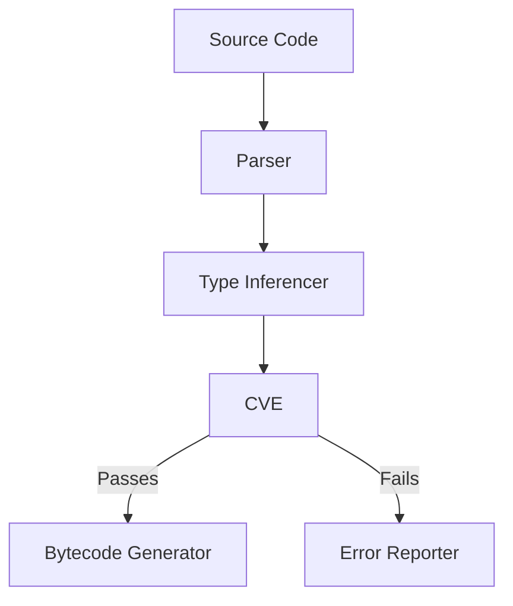

# **[Pattern] Compilation Validation Engine Reference Guide**

---

## **Overview**
The **Compilation Validation Engine (CVE)** pattern ensures robust validation of compiled artifacts before execution. It systematically checks:
- **Type closure** (all types are fully defined and resolved).
- **Binding correctness** (variable/function references are valid and scoping is accurate).
- **Authorization rule validity** (access policies comply with system constraints).
- **Database capability matching** (query operations align with supported database features).

Integrated into the compilation pipeline, the CVE prevents runtime errors by enforcing constraints during compilation, reducing debugging overhead and improving application reliability.

---

## **Key Concepts**
| Concept               | Definition                                                                                                                                                                                                                                                                 |
|-----------------------|---------------------------------------------------------------------------------------------------------------------------------------------------------------------------------------------------------------------------------------------------------------------------------|
| **Type Closure**      | Ensures all referenced types (classes, interfaces, enums) are either explicitly imported or resolved as part of the current compilation context.                                                                                                             |
| **Binding Correctness** | Validates that all variable/attribute references (e.g., `myVar`, `func()`) are within scope, type-safe, and not shadowed by conflicting names.                                                                                                                 |
| **Authorization Rules** | Checks that security policies (e.g., `@RequireRole("admin")`) are: <br> - Applied only to valid methods/classes.<br> - Not redundant.<br> - Aligned with role hierarchy.                                                                                       |
| **Database Capability** | Verifies that SQL/ORM operations (e.g., `JOIN`, `GROUP BY`) are supported by the target database, with fallbacks if needed (e.g., `LIKE` → regex alternatives).                                                                                     |
| **Validation Node**   | A pipeline stage where violations are recorded with severity levels (e.g., `Error`, `Warning`).                                                                                                                                                           |
| **Fallback Mechanism** | When a rule fails (e.g., unsupported DB feature), the engine suggests alternatives (e.g., "Use `IN` instead of `EXISTS` for performance").                                                                                                               |

---

## **Schema Reference**

### **1. Validation Rule Schema**
Defines rules for type/authorization/database checks.

| Field               | Type           | Description                                                                                                                                                                                                                     | Default Value | Example Values                              |
|---------------------|----------------|-----------------------------------------------------------------------------------------------------------------------------------------------------------------------------------------------------------------------------|----------------|-----------------------------------------------|
| `rule_id`           | `string`       | Unique identifier for the rule (e.g., `TYPE_CLOSURE`).                                                                                                                                                                       | auto-generated | `TYPE_CLOSURE`, `AUTH_ROLE_VALIDITY`        |
| `severity`          | `enum`         | Severity level (`Error`, `Warning`, `Info`).                                                                                                                                                                                 | `Error`        | `Error`, `Warning`                           |
| `applicability`     | `array[string]`| Contexts where the rule applies (e.g., `["class", "method"]`).                                                                                                                                                                   | `[]`           | `["class", "method"]`                        |
| `validator`         | `function`     | A function implementing the validation logic (returns `{ passed: bool, message: string }`).                                                                                                                               | –              | `validateTypeClosure`, `validateDBQuery`     |
| `fallback_suggestion`| `string`        | Suggested action if the rule fails (e.g., "Import missing type").                                                                                                                                                                    | `null`         | `"Use `@Deprecated` annotation"`             |
| `examples`          | `array[object]`| Test cases to ensure rule correctness.                                                                                                                                                                                     | `[]`           | `[{ input: `class X extends Y`, expected: true }]` |

---

### **2. Violation Record Schema**
Logs validation failures.

| Field          | Type           | Description                                                                                                                                                                                                                     | Example                                                                                     |
|----------------|----------------|-----------------------------------------------------------------------------------------------------------------------------------------------------------------------------------------------------------------------------|---------------------------------------------------------------------------------------------|
| `violation_id` | `string`       | Unique ID for the violation.                                                                                                                                                                                                     | `"error_123_compile"`                                                                      |
| `rule_id`      | `string`       | Reference to the failed rule (e.g., `TYPE_CLOSURE`).                                                                                                                                                                       | `"TYPE_CLOSURE"`                                                                        |
| `file_path`    | `string`       | Source file where the violation occurred.                                                                                                                                                                                 | `"/src/services/user.ts"`                                                                 |
| `line`         | `integer`      | Line number in the source file.                                                                                                                                                                                               | `42`                                                                                       |
| `message`      | `string`       | Human-readable description of the issue.                                                                                                                                                                               | `"Type 'UserProfile' not found"`                                                          |
| `severity`     | `enum`         | Severity level (`Error`, `Warning`).                                                                                                                                                                                   | `Error`                                                                                     |
| `context`      | `object`       | Metadata about the failing token/operation.                                                                                                                                                                               | `{ type: "class", name: "UserProfile", missingImports: ["utils/types"] }`                   |
| `suggested_fix`| `string`       | Auto-generated fix (if available).                                                                                                                                                                                   | `"Add 'import { UserProfile } from 'utils/types';'`                                       |

---

## **Query Examples**
### **1. Validate Type Closure**
**Input:**
```typescript
class UserService {
  private userInfo: UserProfile; // "UserProfile" not imported
}
```
**Validation Output:**
```json
{
  "violations": [
    {
      "violation_id": "error_456_type_closure",
      "rule_id": "TYPE_CLOSURE",
      "file_path": "/src/services/user.ts",
      "line": 3,
      "message": "Type 'UserProfile' not found.",
      "severity": "Error",
      "context": { "type": "class", "name": "UserProfile" },
      "suggested_fix": "Add 'import { UserProfile } from 'utils/types';'"
    }
  ]
}
```

---

### **2. Check Authorization Rule Validity**
**Input:**
```typescript
class AdminPanel {
  @RequireRole("guest") // Role "guest" has no privileges
  public updateUserData(userId: string) { ... }
}
```
**Validation Output:**
```json
{
  "violations": [
    {
      "violation_id": "error_789_auth_role",
      "rule_id": "AUTH_ROLE_VALIDITY",
      "file_path": "/src/admin/panel.ts",
      "line": 2,
      "message": "Role 'guest' is not assigned any permissions.",
      "severity": "Error",
      "context": { "method": "updateUserData", "required_role": "guest" },
      "fallback_suggestion": "Use `@RequireRole('admin')` instead."
    }
  ]
}
```

---

### **3. Verify Database Capability**
**Input (SQLite → Uses `LIKE` but SQLite lacks regex support):**
```sql
SELECT * FROM users WHERE email LIKE '/admin%';
```
**Validation Output:**
```json
{
  "violations": [
    {
      "violation_id": "warning_101_db_capability",
      "rule_id": "DB_CAPABILITY",
      "file_path": "/queries/admin.sql",
      "line": 1,
      "message": "'LIKE' with regex (e.g., '/admin%') is not supported in SQLite.",
      "severity": "Warning",
      "context": { "query": "SELECT * FROM users WHERE email LIKE '/admin%'", "feature": "regex" },
      "suggested_fix": "Use `email LIKE 'admin%'` or rewrite as `SUBSTR(email, 1, 6) = 'admin'`."
    }
  ]
}
```

---

## **Implementation Steps**
### **1. Integrate the CVE into the Pipeline**
Add the engine as a post-compilation step:


### **2. Register Validation Rules**
Define rules in a configuration file (e.g., `validation-rules.json`):
```json
{
  "rules": [
    {
      "rule_id": "TYPE_CLOSURE",
      "severity": "Error",
      "applicability": ["class", "interface", "enum"],
      "validator": "validateTypeClosure",
      "fallback_suggestion": "Import missing type."
    },
    {
      "rule_id": "AUTH_ROLE_VALIDITY",
      "severity": "Error",
      "applicability": ["method", "class"],
      "validator": "validateRoleExists"
    }
  ]
}
```

### **3. Implement Validators**
Example: `validateTypeClosure.ts`:
```typescript
export function validateTypeClosure(
  context: { type: string; name: string; imports: string[] }
): { passed: boolean; message: string } {
  const registeredTypes = getRegisteredTypes(); // Fetch from symbol table
  if (!registeredTypes.includes(context.name)) {
    return {
      passed: false,
      message: `Type '${context.name}' not found.`,
    };
  }
  return { passed: true, message: "Type closure valid." };
}
```

---

## **Performance Considerations**
| Optimization            | Benefit                                                                                                                                                                                                                     |
|-------------------------|---------------------------------------------------------------------------------------------------------------------------------------------------------------------------------------------------------------------------------|
| **Incremental Checks**  | Re-runs only affected files after changes (e.g., `git diff` → validate modified imports).                                                                                                                             |
| **Caching**             | Store symbols/imports in-memory to avoid reprocessing identical checks.                                                                                                                                                     |
| **Parallel Validation** | Distribute checks across CPU cores for large projects.                                                                                                                                                                   |
| **Early Termination**   | Stop processing a file after the first `Error` violation (unless `--continue` flag is set).                                                                                                                        |

---

## **Related Patterns**
| Pattern                          | Description                                                                                                                                                                                                                     | When to Use                                                                                                                                                                      |
|----------------------------------|-----------------------------------------------------------------------------------------------------------------------------------------------------------------------------------------------------------------------------|-----------------------------------------------------------------------------------------------------------------------------------------------------------------------------------|
| **Compile-Time Guards**          | Enforces constraints via template literals or attributes (e.g., `@RuntimeOnly`).                                                                                                                                | When runtime checks are unavoidable but static analysis can catch some cases.                                                                                                  |
| **Dependency Injection Validation** | Validates injectors/resolvers for circular dependencies or missing bindings.                                                                                                                                      | For frameworks relying on DI (e.g., Angular, NestJS).                                                                                                                              |
| **Static Analysis Plugin**       | Extends IDEs (VSCode, IntelliJ) with real-time validation hints.                                                                                                                                                     | Developer productivity: catch errors before compilation.                                                                                                                       |

---

## **Troubleshooting**
| Issue                          | Root Cause                                                                                     | Solution                                                                                                                                                                           |
|--------------------------------|------------------------------------------------------------------------------------------------|-------------------------------------------------------------------------------------------------------------------------------------------------------------------------------|
| **False Positives**             | Overly strict rules (e.g., rejecting valid DB aliases).                                         | Adjust `severity` to `Warning` or add exclusions (e.g., `whitelist: ["db_aliases"]`).                                                                                              |
| **Performance Bottlenecks**     | Slow symbol resolution in large codebases.                                                         | Use a symbol database (e.g., [TSLR](https://github.com/microsoft/TypeScript/tree/main/src/compiler)) or compile symbols in parallel.                                                  |
| **Database-Specific Errors**    | Unsupported features in target DB (e.g., PostgreSQL `JSONB` → SQLite).                          | Implement a `DB_PROFILE` switch to load rulesets per database variant.                                                                                                         |

---
**Note:** For advanced use cases, extend the engine with plugins (e.g., a `CodeCoverageValidator` to ensure rule test coverage).