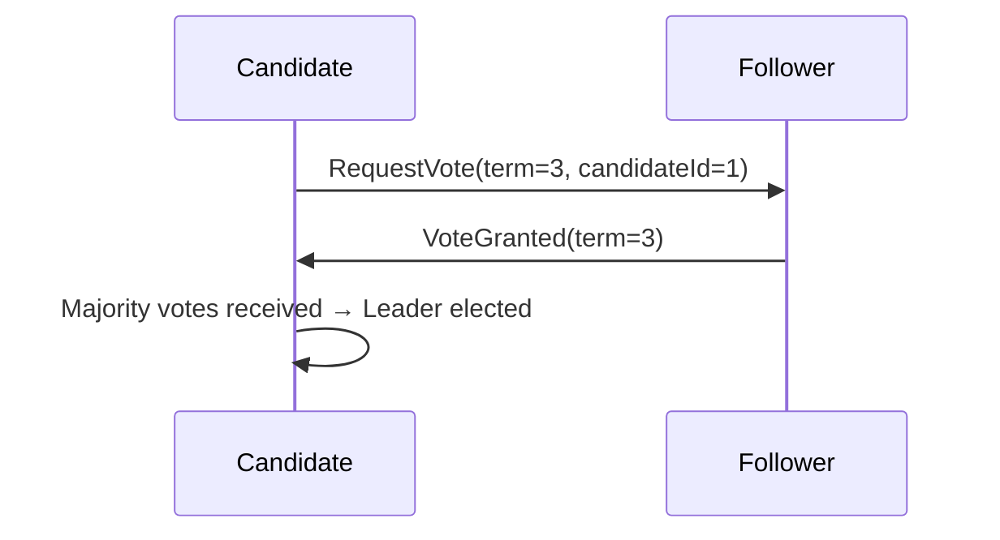
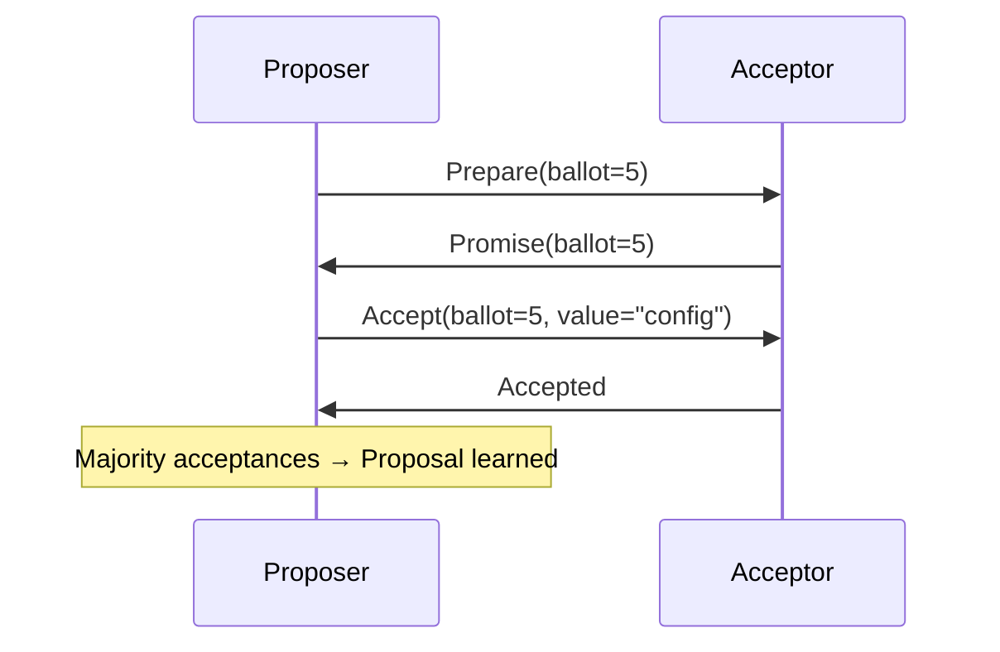

---
# **[Distributed Consensus Algorithms (Raft & Paxos)] Reference Guide**

---

## **Overview**
Distributed consensus ensures multiple independent nodes agree on a single data state or decision, even under network partitioning or node failures. This guide details **Raft** and **Paxos**, two widely adopted consensus algorithms, covering key concepts, workflows, and implementation trade-offs. Raft prioritizes understandability and fault tolerance with a linearizable leader-based model, while Paxos achieves consensus via state machines and message exchanges. Both are foundational for distributed systems like databases (etcd, Cassandra), blockchains (Ethereum), and orchestration tools (Kubernetes).

*Key use cases:*
- Cluster state management (e.g., leader election).
- Fault-tolerant replication (e.g., distributed logs).
- Atomic configuration changes (e.g., service updates).

---

## **1. Schema Reference**

### **Core Concepts**
| **Concept**               | **Raft**                                                                 | **Paxos**                                                                 |
|---------------------------|--------------------------------------------------------------------------|--------------------------------------------------------------------------|
| **Model**                | Linearizable, leader-based.                                              | State-machine replication (SMR).                                         |
| **Roles**                | Leader, Followers, Candidates.                                           | Proposers, Acceptors, Learners.                                           |
| **Termination**          | 3-phase protocol (RequestVote → AppendEntries → Log replication).       | 2-phase protocol (Prepare → Accept).                                     |
| **Leader Election**      | Elected via majority vote; expires after timeout.                        | Proposers compete; no dedicated leader (multi-leader variants exist).    |
| **Fault Tolerance**      | `N/2+1` nodes to tolerate `N/2` failures.                                | Requires majority (50%+1) acceptors for agreement.                         |
| **Performance**          | Lower latency due to leader-centric writes.                              | Higher cost due to message exchanges; slower leaderless variants.         |
| **Use Cases**            | Cloud-native services (e.g., etcd, Consul).                              | Workloads needing no single point of failure (e.g., distributed locks).    |

---

### **Raft Workflow Phases**
| **Phase**               | **Action**                                                                 | **Key Messages**                          | **Success Condition**                     |
|-------------------------|---------------------------------------------------------------------------|------------------------------------------|------------------------------------------|
| **Election**            | Followers timeout; candidates request votes via `RequestVote`.         | `RequestVote`, `VoteGranted/Rejected`.   | Majority votes from current term.        |
| **Log Replication**     | Leader appends entries to followers via `AppendEntries`.                | `AppendEntries`, `AppendSuccess/Fail`.   | Entries replicated on majority nodes.    |
| **State Transfer**      | Joiners sync logs via `AppendEntries` from leader.                       | `AppendEntries`, `InstallSnapshot`.      | Leader acknowledges snapshot receipt.   |
| **Configuration**       | Append config changes as log entries.                                    | `AppendEntries` (config changes).       | Confirmed on majority nodes.             |

---
### **Paxos Workflow Phases**
| **Phase**               | **Action**                                                                 | **Key Messages**                          | **Success Condition**                     |
|-------------------------|---------------------------------------------------------------------------|------------------------------------------|------------------------------------------|
| **Prepare**             | Proposer asks acceptors for highest known proposal number via `Prepare`. | `Prepare`, `Promise`.                     | Acceptor promises no conflicting accept.  |
| **Accept**              | Proposer offers value via `Accept` if `Prepare` succeeds.                | `Accept`, `Accepted`.                     | Majority acceptors accept the proposal.   |
| **Learn**               | Learners replicate accepted proposals to replicate state.                | `Learn`, `Learned`.                       | Proposal confirmed on majority learners. |

---

## **2. Implementation Details**

### **Raft-Specific**
- **Leader Lease:** The leader holds authority for `N` millisecond leases (adjustable) to prevent split-votes.
- **Log Consistency:** Followers only append entries after the leader’s committed index.
- **Splitting Brain:** Use heartbeats to detect stale leaders; followers only switch if no heartbeat for `2*lease`.
- **Snapshots:** Reduce log size by compressing state into snapshots (e.g., `InstallSnapshot`).

**Example Code Snippet (Pseudocode):**
```python
# Raft Leader: AppendEntries Request
def append_entries(self, leader_id: str, entries: List[Entry], prev_log_index: int):
    if self.log[prev_log_index] != entries[0].prev_hash:  # Match prev log entry
        return {"success": False, "error": "Log mismatch"}
    for entry in entries:
        self.log.append(entry)  # Append new entries
    return {"success": True, "term": self.current_term}
```

---

### **Paxos-Specific**
- **Ballot Numbers:** Unique identifiers for proposals (`<ballot, proposal>`) to prevent conflicts.
- **Multi-Paxos:** Optimizes Paxos by reusing accepted ballots for subsequent phases (e.g., `Prepare → Accept`).
- **Learners vs. Acceptors:** Learners replicate state but don’t accept new proposals (common in SMR systems).

**Paxos Trade-offs:**
- **High Messaging Cost:** O(`N²`) messages in multi-proposer scenarios.
- **Liveness Blocking:** If proposers fail, the system may deadlock (mitigated via timeouts or hints).

**Example Code Snippet (Pseudocode):**
```python
# Paxos Proposer: Prepare Phase
def prepare(self, ballot: int):
    if ballot > self.highest_ballot:
        self.highest_ballot = ballot
        return {"type": "Promise", "highest-known": self.highest_accepted_proposal}
    return {"type": "Reject"}
```

---

## **3. Query Examples**

### **Raft: Leader Election**


### **Paxos: Proposal Acceptance**


---

## **4. Common Pitfalls & Mitigations**

| **Pitfall**                          | **Raft**                                  | **Paxos**                                |
|---------------------------------------|------------------------------------------|------------------------------------------|
| **Split Brain**                       | Use heartbeats + lease timeouts.         | Design timeouts for proposer backoff.    |
| **Slow Leaders**                      | Monitor append entries latency.          | Optimize with multi-Paxos.              |
| **Log Corruption**                    | Followers reject mismatched entries.    | Acceptors reject duplicate promises.     |
| **Network partitions**                | Leader must survive majority splits.    | Majority quorum ensures safety.          |

---

## **5. Related Patterns**
- **[Leader Election]** (Subpattern of Raft/Paxos) – Determine a single leader in clusters.
- **[Distributed Locks]** – Paxos-based locks (e.g., Zookeeper).
- **[Chandy-Lamport Log Replication]** – Alternative to Raft for primary-backup systems.
- **[Byzantine Fault Tolerance (PBFT)**] – For malicious node scenarios (vs. crash faults).
- **[Causal Consistency]** – Trade-offs between eventual vs. linearizable consistency.

---
## **6. Optimization Tips**
- **Raft:**
  - Reduce lease time to failover faster (but watch for thrashing).
  - Use snapshots to limit log size (e.g., etcd’s `max-snapshot-time`).
- **Paxos:**
  - Cache promises to avoid repeated `Prepare` phases.
  - Use hints (e.g., "I’ll accept your proposal if you help me") for stalled proposers.

---
## **7. References**
- **Raft:** [Diego Ongaro & John Ousterhout (2014)](https://raft.github.io/raft.pdf)
- **Paxos:** [Leslie Lamport (1998)](https://lamport.azurewebsites.net/pubs/lamport-paxos.pdf)
- **Implementations:**
  - Raft: [etcd](https://github.com/etcd-io/etcd), [Consul](https://github.com/hashicorp/consul)
  - Paxos: [ZooKeeper](https://zookeeper.apache.org/) (Multi-Paxos variant)

---
**Note:** Adjust parameters (e.g., timeout durations, quorum sizes) based on your system’s failure rates and performance needs.