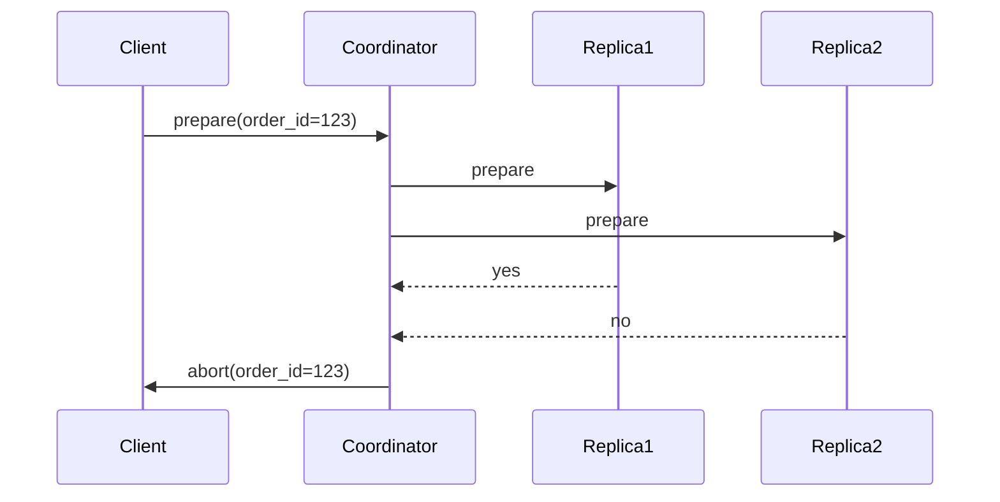

# **[Pattern] Consistency Integration: Reference Guide**

---

## **Overview**
The **Consistency Integration** pattern ensures that distributed systems maintain a unified state across all replicas or nodes by enforcing synchronization rules. Unlike eventual consistency (where replicas converge over time), this pattern guarantees **strong consistency**—all valid reads return the latest committed value, eliminating temporal discrepancies.

This pattern is critical for systems where precision matters (e.g., financial transactions, inventory management) but introduces trade-offs like latency and increased network overhead. Common strategies include **synchronous replication**, **two-phase commit (2PC)**, and **log-based replication**. Implementations must balance fault tolerance (e.g., handling network partitions) with performance (e.g., minimizing latency spikes).

---

## **1. Key Concepts**
| **Term**               | **Definition**                                                                                     | **Example Use Case**                                                                 |
|-------------------------|---------------------------------------------------------------------------------------------------|---------------------------------------------------------------------------------------|
| **Strong Consistency**  | All operations complete only when all replicas acknowledge the update.                             | Bank withdrawal: Debit account A *and* credit account B instantly.                     |
| **Synchronous Replication** | Requests wait for acknowledgments from all replicas before proceeding.                            | Primary/secondary database replication with failover checks.                          |
| **Two-Phase Commit (2PC)** | Coordinator verifies all participants can commit before executing updates globally.              | Distributed transaction across microservices (e.g., order processing + payment gateways).|
| **Causal Ordering**     | Events are ordered based on logical dependencies, not just network timing.                      | Webhook notifications: A must trigger B before C.                                    |
| **Conflict Resolution** | Rules to handle concurrent writes (e.g., last-write-wins, merge strategies).                     | Collaborative editing: User edits conflict; system prioritizes by timestamp or Merge. |

---

## **2. Schema Reference**
Below is a **simplified schema** for a distributed system using Consistency Integration.

### **2.1 Core Entities**
| **Entity**         | **Fields**                          | **Description**                                                                                     |
|--------------------|-------------------------------------|-----------------------------------------------------------------------------------------------------|
| **`Replica`**      | `id` (UUID), `host` (string), `status` (enum: *ACTIVE*, *PENDING*, *FAILED*) | Represents a node in the distributed cluster.                                                      |
| **`OperationLog`** | `id` (UUID), `type` (enum: *READ*, *WRITE*), `timestamp` (ISO8601), `value` (JSON) | Immutable log of operations with causal dependencies.                                              |
| **`Transaction`**  | `id` (UUID), `status` (enum: *PENDING*, *COMMITTED*, *ABORTED*), `operations` (List<`OperationLog`>) | Atomic unit of work across replicas.                                                               |
| **`Lock`**         | `resourceId` (string), `holder` (UUID), `expiry` (timestamp) | Prevents concurrent modifications to critical resources.                                           |

### **2.2 Relationships**
- **`Transaction`** → **`{1..N}`** `OperationLog`
  Each transaction contains a sequence of reads/writes.
- **`OperationLog`** → **`1`** `Replica`
  Logs are replicated to all active replicas.
- **`Lock`** → **`1`** `Resource` (implicit)
  Locks are scoped to specific keys (e.g., `user_account:123`).

---

## **3. Implementation Details**
### **3.1 Synchronous Replication Workflow**
1. **Client** sends a write request to the **primary replica**.
2. **Primary** validates the request and forwards it to all **secondary replicas**.
3. **Secondaries** acknowledge receipt (or fail fast if unavailable).
4. **Primary** commits only after all secondaries respond within a timeout (`T`).
5. **Client** receives confirmation from the primary.

**Pseudocode:**
```python
def write(data):
    primary_ack = primary.replicate(data)  # Synchronous call
    for replica in secondaries:
        if not replica.acknowledge(data, timeout=T):
            raise ReplicationError("Timeout")
    return primary.commit()
```

### **3.2 Two-Phase Commit (2PC)**
1. **Prepare Phase**:
   - Coordinator sends `prepare` to all participants.
   - Participants vote `yes`/`no` based on local validation (e.g., schema constraints).
2. **Commit Phase**:
   - If all vote `yes`, coordinator broadcasts `commit`.
   - Participants execute updates atomically.

**Example:**


### **3.3 Conflict Resolution Strategies**
| **Strategy**               | **When to Use**                          | **Pros**                                  | **Cons**                                  |
|----------------------------|-----------------------------------------|-------------------------------------------|-------------------------------------------|
| **Last-Write-Wins (LWW)**  | High-throughput systems (e.g., caches)   | Simple to implement                        | Data loss if writes overlap.             |
| **Merge (CRDTs)**          | Collaborative apps (e.g., docs)          | No conflicts; eventual convergence        | Complex state updates.                   |
| **Manual Resolution**      | Critical systems (e.g., accounting)     | Precise control                          | High latency for user intervention.       |

---

## **4. Query Examples**
### **4.1 Synchronous Read Consistency**
**Use Case:** Ensure a user’s balance is up-to-date across all replicas.
```sql
-- Pseudocode: Get the latest balance with causal ordering
SELECT balance
FROM user_accounts
WHERE user_id = '123'
ORDER BY causal_timestamp DESC
LIMIT 1;
```

**Implementation (Java):**
```java
public BigDecimal getBalance(String userId) {
    Replica primary = getPrimaryReplica();
    return primary.query(
        "SELECT balance FROM user_accounts WHERE user_id = ?",
        userId,
        ConsistencyLevel.STRONG
    );
}
```

### **4.2 Transactional Cross-Replica Query**
**Use Case:** Transfer funds between accounts atomically.
```sql
-- Start transaction (2PC)
BEGIN TRANSACTION;

UPDATE accounts SET balance = balance - 100 WHERE id = 'A';
UPDATE accounts SET balance = balance + 100 WHERE id = 'B';

COMMIT;
```

**Implementation (Python):**
```python
def transfer(source_id, target_id, amount):
    with Transaction(coordinator):
        source.reduce_balance(amount)
        target.increase_balance(amount)
        coordinator.commit()
```

### **4.3 Conflict Detection**
**Use Case:** Detect concurrent edits to a document.
```sql
-- Check for conflicting versions
SELECT * FROM document_versions
WHERE document_id = 'xyz'
ORDER BY version_id
LIMIT 2;
```

**Output:**
| `version_id` | `timestamp`       | `content`                     |
|--------------|-------------------|-------------------------------|
| v1           | 2023-10-01T10:00  | "Hello, world!"               |
| v2           | 2023-10-01T10:01  | "Hi there!" (conflicts with v1) |

---

## **5. Trade-offs and Best Practices**
### **5.1 Performance vs. Consistency**
| **Factor**               | **Impact**                                      | **Mitigation**                                                                 |
|--------------------------|-------------------------------------------------|-------------------------------------------------------------------------------|
| **Latency**              | Higher due to sync calls.                       | Use **asynchronous validation** where possible (e.g., pre-check locks).       |
| **Throughput**           | Lower (bottlenecked by slow replicas).           | **Shard data** or **partition replicas** by key (e.g., consistent hashing).   |
| **Fault Tolerance**      | Single point of failure (primary replica).     | **Multi-primary replication** with conflict-free replicated data types (CRDTs).|

### **5.2 Best Practices**
1. **Minimize Lock Contention**:
   - Use **short-lived locks** (e.g., timeout after 5s).
   - Implement **non-blocking algorithms** (e.g., optimistic concurrency control).
2. **Handle Network Partitions**:
   - Detect partitions via **heartbeat timeouts**.
   - Use **paxos/raft** for leader election during splits.
3. **Monitor Consistency**:
   - Track **replication lag** (e.g., `SELECT pg_stat_replication` in PostgreSQL).
   - Alert on **read/write conflicts** (e.g., increase in `version_id` collisions).

---

## **6. Related Patterns**
| **Pattern**                  | **Description**                                                                                     | **When to Pair With**                                                                 |
|------------------------------|---------------------------------------------------------------------------------------------------|---------------------------------------------------------------------------------------|
| **[Eventual Consistency]**   | Trade latency for availability; allow temporary discrepancies.                                     | Use **hybrid approaches** (e.g., strong consistency for critical ops, eventual for logs).|
| **[Saga Pattern]**           | Manages distributed transactions via compensating actions.                                         | Replace 2PC when retry logic is complex (e.g., microservices).                         |
| **[Sharding]**               | Splits data across replicas to improve parallelism.                                                | Combined with **consistent hashing** to maintain locality of reads/writes.             |
| **[Conflict-Free Replicated Data Types (CRDTs)]** | Data structures that merge without conflicts.                   | Ideal for **offline-first apps** (e.g., collaborative editing).                     |
| **[CQRS]**                   | Separates read/write models to optimize for different consistency needs.                         | Use **strong consistency for writes**, eventual consistency for reads.                  |

---

## **7. Anti-Patterns**
| **Anti-Pattern**            | **Why It Fails**                                                                                     | **Fix**                                                                                     |
|-----------------------------|-----------------------------------------------------------------------------------------------------|-------------------------------------------------------------------------------------------|
| **Fire-and-Forget Replication** | No acknowledgments; data may be lost if replicas fail.                                          | Enforce **synchronous replication** or **retries with backoff**.                           |
| **Global Locks**            | Scales poorly; causes bottlenecks.                                                              | Use **fine-grained locks** (e.g., per-row or per-shard).                                  |
| **Ignoring Network Partitions** | Assumes perfect connectivity; leads to split-brain scenarios.                                      | Implement **quorum-based consensus** (e.g., Raft).                                          |

---
**References:**
- [CAP Theorem (Gilbert & Lynch, 2002)](https://www.cs.berkeley.edu/~brewer/cap.pdf)
- [Two-Phace Commit Protocol (Gray, 1981)](https://dl.acm.org/doi/10.1145/358756.358776)
- [CRDTs Survey (Shapiro et al., 2011)](https://hal.inria.fr/inria-00555582/document)