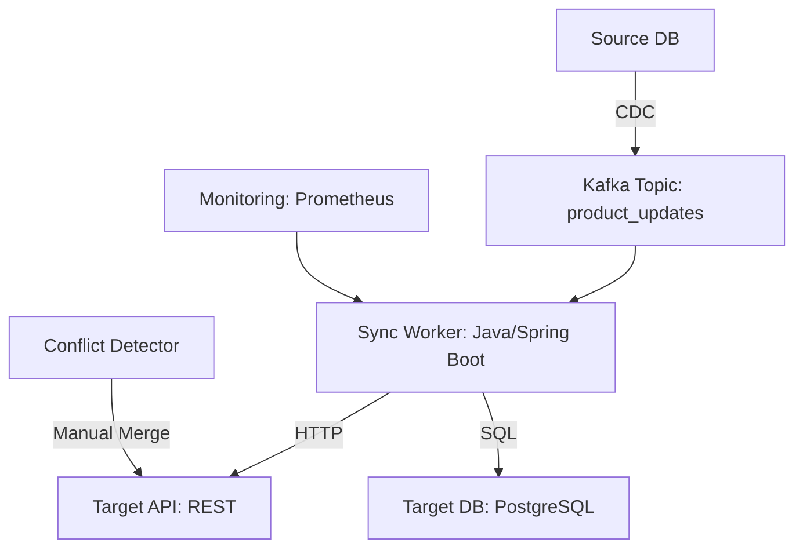

# **[Pattern] Reference Guide: Data Synchronization Between Systems**

---

## **1. Overview**
The **Data Synchronization Between Systems** pattern ensures consistency and availability of data across distributed systems, preventing data conflicts, inconsistencies, and stale data. This pattern addresses the challenge of maintaining accurate, up-to-date information in multiple systems (e.g., databases, APIs, or microservices) while handling network latency, offline operations, and conflicting updates.

Common use cases include:
- **E-commerce:** Syncing inventory between web, mobile, and POS systems.
- **Healthcare:** Updating patient records across clinics and hospitals.
- **Finance:** Real-time transaction synchronization across banking platforms.
- **IoT:** Keeping device states consistent in cloud and edge systems.

The pattern employs techniques like **event-driven architecture**, **change data capture (CDC)**, **optimistic/concurrency control**, and **conflict resolution strategies** to balance performance and correctness.

---

## **2. Schema Reference**
Below are key components and their relationships in a typical synchronization system.

| **Component**               | **Description**                                                                 | **Example Fields**                                                                 | **Optional?** |
|-----------------------------|-------------------------------------------------------------------------------|-----------------------------------------------------------------------------------|----------------|
| **Source System**           | The system where data originates (e.g., primary database, API, or service). | `system_id`, `last_sync_timestamp`, `source_type` (e.g., "PostgreSQL", "REST API") | No             |
| **Target System**           | The system where data is replicated (e.g., secondary DB, caching layer).     | `system_id`, `last_sync_timestamp`, `target_type` (e.g., "MongoDB", "Redis")     | No             |
| **Sync Metadata**           | Tracks synchronization status and conflicts.                                   | `sync_id`, `status` (`pending`, `completed`, `failed`), `error_code`, `retry_count` | No             |
| **Change Event**            | Represents a data modification (insert/update/delete).                       | `event_id`, `table_name`, `operation` (`CREATE`, `UPDATE`, `DELETE`), `timestamp`, `payload` (JSON) | No             |
| **Conflict Resolution**     | Rules for handling conflicting updates (e.g., last-write-wins, manual merge). | `conflict_strategy` (`lww`, `manual`, `merge`), `last_updated_at`, `version`     | Yes            |
| **Sync Queue/Stream**       | Buffer for unsynced changes (e.g., Kafka, RabbitMQ, or local queues).         | `message_id`, `source_id`, `priority`, `delivered_at`                              | No (for async) |
| **Audit Log**               | Records sync operations for debugging and compliance.                        | `log_id`, `action`, `source`, `target`, `timestamp`, `user_agent`                  | Yes            |

---

## **3. Implementation Strategies**
Choose one or combine techniques based on your requirements.

### **A. Synchronous vs. Asynchronous Sync**
| **Approach**       | **When to Use**                                                                 | **Pros**                                      | **Cons**                                      |
|--------------------|-------------------------------------------------------------------------------|-----------------------------------------------|-----------------------------------------------|
| **Synchronous**    | Low-latency, tightly coupled systems (e.g., microservices in the same network). | Immediate consistency, simple conflict handling. | Blocking, risk of cascading failures.       |
| **Asynchronous**   | Decoupled systems (e.g., cloud services, IoT).                                | Scalable, fault-tolerant.                      | Eventual consistency, delay in updates.       |

### **B. Sync Mechanisms**
| **Mechanism**          | **Description**                                                                 | **Tools/Libraries**                          | **Example Use Case**                          |
|------------------------|-------------------------------------------------------------------------------|-----------------------------------------------|-----------------------------------------------|
| **Polling**            | Target system periodically checks for changes in the source.                 | Custom scripts, `cron`, `REST API`.            | Legacy systems with no event hooks.          |
| **Change Data Capture**| Captures database changes (e.g., via triggers or logs) and emits events.     | Debezium, AWS DMS, PostgreSQL logical decoding. | Real-time analytics databases.                |
| **Event Sourcing**     | Stores state changes as a sequence of events; replayed on targets.          | EventStore, Apache Kafka.                    | Audit trails, replayable history.             |
| **Webhooks/HTTP**      | Source notifies target via HTTP callbacks when data changes.                 | AWS SNS, Azure Event Grid.                   | Third-party integrations (e.g., Stripe).     |
| **Pub/Sub**            | Decoupled messaging (e.g., Kafka, RabbitMQ) for event propagation.          | Kafka, NATS, Redis Streams.                   | High-throughput systems.                     |

### **C. Conflict Resolution**
| **Strategy**           | **Description**                                                                 | **Use Case**                                  | **Pros**                                      | **Cons**                                      |
|------------------------|-------------------------------------------------------------------------------|----------------------------------------------|-----------------------------------------------|-----------------------------------------------|
| **Last-Write-Wins (LWW)** | The latest update overwrites previous versions.                          | Simple systems with timestamp tracking.      | Easy to implement.                           | Data loss if timestamps are unreliable.     |
| **Manual Merge**       | Human intervention to resolve conflicts.                                    | Critical data (e.g., financial records).     | Accurate, auditable.                         | Slow, not scalable.                          |
| **Operational Transformation** | Applies changes in a way that preserves logical consistency.          | Collaborative editing (e.g., Google Docs).   | Preserves intent.                             | Complex to implement.                        |
| **Vector Clocks**      | Uses causal relationships to detect/merge conflicts.                     | Distributed systems with partial orders.    | Handles complex causality.                    | High overhead.                                |
| **CRDTs (Conflict-Free Replicated Data Types)** | Data structures designed to merge without conflicts.               | Offline-first apps (e.g., P2P sync).         | No coordination needed.                      | Limited to specific data models.             |

---

## **4. Query Examples**
Below are SQL and API query examples for common synchronization scenarios.

---

### **A. SQL-Based Synchronization**
#### **1. Track Unsynced Changes (Polling)**
```sql
-- Find records modified since last sync in the source DB.
SELECT id, name, modified_at
FROM products
WHERE modified_at > '2024-01-01 00:00:00'
  AND sync_status != 'completed';
```

#### **2. Update Sync Status (After Processing)**
```sql
-- Mark a batch of records as synced.
UPDATE products
SET sync_status = 'completed',
    last_sync_timestamp = NOW()
WHERE id IN (SELECT id FROM unsynced_products)
  AND modified_at > '2024-01-01 00:00:00';
```

#### **3. Detect Conflicts (Last-Write-Wins)**
```sql
-- Find records where the target has a newer timestamp than the source.
SELECT s.id, s.name, s.modified_at AS source_time,
       t.modified_at AS target_time
FROM source_products s
JOIN target_products t ON s.id = t.id
WHERE t.modified_at > s.modified_at;
```

---

### **B. API/Event-Driven Queries**
#### **1. Fetch Changes via REST API**
```http
GET /api/products/changes?since=2024-01-01T00:00:00Z
Headers:
  Accept: application/json
Response:
[
  {
    "id": "123",
    "operation": "UPDATE",
    "payload": { "name": "Updated Product", "price": 99.99 },
    "timestamp": "2024-01-15T12:00:00Z"
  }
]
```

#### **2. Subscribe to CDC Events (Kafka)**
```bash
# Consume changes from a Kafka topic.
kafka-console-consumer --bootstrap-server localhost:9092 \
  --topic product_updates \
  --from-beginning \
  --formatter "console" \
  --property print.key=true \
  --property key.deserializer="org.apache.kafka.common.serialization.StringDeserializer" \
  --property value.deserializer="org.apache.kafka.common.serialization.StringDeserializer"
```
**Sample Message:**
```json
{
  "table": "products",
  "operation": "UPDATE",
  "payload": { "id": "123", "name": "Updated" },
  "source_timestamp": "2024-01-15T12:00:00Z",
  "version": 2
}
```

---

### **C. Conflict Resolution Queries**
#### **1. Merge Changes (Manual Resolution)**
```sql
-- Log a conflict for manual review.
INSERT INTO conflict_log (record_id, source_value, target_value, resolved_at)
VALUES ('123', 'Old Value', 'New Value', NULL);

-- After manual resolution, update the target.
UPDATE target_products
SET name = 'Resolved Value'
WHERE id = '123';
```

#### **2. Apply LWW Strategy (Programmatic)**
```python
# Pseudo-code for last-write-wins in a sync worker.
def resolve_conflict(source_record, target_record):
    if source_record["timestamp"] > target_record["timestamp"]:
        # Overwrite target with source.
        update_target(target_record["id"], source_record["payload"])
    else:
        # Source is stale; skip or log.
        log_stale_update(source_record)
```

---

## **5. Best Practices**
1. **Idempotency**: Design sync operations to be repeatable without side effects (e.g., use `idempotency_keys` in APIs).
2. **At-Least-Once Delivery**: Assume events may be duplicated; handle duplicates gracefully (e.g., deduplication via `event_id`).
3. **Backpressure**: Throttle sync operations to avoid overwhelming targets (e.g., exponential backoff for retries).
4. **Monitoring**: Track sync latency, error rates, and conflict resolution (e.g., Prometheus + Grafana).
5. **Schema Evolution**: Use backward-compatible changes (e.g., additive fields) to avoid breaking sync.
6. **Offline Support**: Implement local caching (e.g., SQLite) for mobile/web apps with weak connectivity.
7. **Security**:
   - Use TLS for all sync channels.
   - Validate payloads (e.g., JSON Schema) to prevent malformed data.
   - Restrict access via IAM/role-based permissions.

---
## **6. Error Handling**
| **Error Type**               | **Example Cause**                          | **Mitigation Strategy**                              |
|------------------------------|--------------------------------------------|------------------------------------------------------|
| **Network Failure**          | Unreachable target system.                 | Retry with exponential backoff + circuit breaker.     |
| **Schema Mismatch**          | Target expects a field not in source.      | Validate schema compatibility before sync.             |
| **Permission Denied**        | API/auth failure.                          | Implement retry with fresh tokens.                    |
| **Duplicate Event**          | Event processed twice.                     | Use idempotent operations (e.g., `UPDATE OR IGNORE`). |
| **Target Rejection**         | Target rejects payload (e.g., validation).  | Log details and retry or notify stakeholders.         |
| **Conflict Too Old**         | Timestamp-based conflict resolution fails.  | Fall back to manual merge or discard stale changes.   |

---
## **7. Performance Considerations**
| **Optimization**            | **Description**                                                                 | **Tools/Techniques**                              |
|-----------------------------|-------------------------------------------------------------------------------|---------------------------------------------------|
| **Batch Processing**        | Reduce API calls by syncing records in batches.                              | `LIMIT` + `OFFSET` in SQL, Kafka consumer groups. |
| **Compression**             | Reduce payload size for high-volume syncs.                                    | gzip, Protocol Buffers.                           |
| **Incremental Sync**        | Only sync changes since last sync (avoid full table scans).                   | `WHERE modified_at > last_sync`.                  |
| **Parallelization**         | Sync independent tables/records concurrently.                                 | Partitioned Kafka topics, database sharding.       |
| **Caching**                 | Cache frequently accessed data locally.                                         | Redis, CDN for read-heavy workloads.               |

---
## **8. Related Patterns**
| **Pattern**                          | **Connection to Data Sync**                                                                 | **Reference**                     |
|--------------------------------------|---------------------------------------------------------------------------------------------|-----------------------------------|
| **CQRS (Command Query Responsibility Segregation)** | Separates read and write models; sync optimizes for each.                                   | [CQRS Pattern](link)               |
| **Saga Pattern**                     | Manages distributed transactions by orchestrating local transactions across services.      | [Saga Pattern](link)               |
| **Event Sourcing**                   | Stores state changes as events; sync can replay events to recover state.                    | [Event Sourcing](link)            |
| **Optimistic Concurrency Control**  | Uses version vectors or timestamps to resolve conflicts in distributed writes.              | [Optimistic Locking](link)        |
| **Idempotent Operations**            | Ensures repeated sync operations have the same effect; critical for async systems.         | [Idempotency Pattern](link)       |
| **Bulkhead Pattern**                 | Isolates sync workers to prevent one failure from cascading.                               | [Bulkhead Pattern](link)           |
| **Compensating Transactions**       | Rolls back changes if sync fails (e.g., undo a payment if inventory sync fails).           | [Saga Pattern (Compensation)]    |

---
## **9. Example Architecture**


---
## **10. Tools & Libraries**
| **Category**               | **Tools**                                                                 |
|----------------------------|---------------------------------------------------------------------------|
| **CDC**                   | Debezium, AWS DMS, PostgreSQL logical decoding, Oracle GoldenGate.      |
| **Messaging**             | Apache Kafka, RabbitMQ, NATS, AWS SNS/SQS.                                |
| **Event Sourcing**        | EventStore, Axon Framework, EventSourced.                                |
| **Sync Libraries**        | Dropbox Sync (libsync), Apache Pulsar, Kafka Connect.                    |
| **Conflict Resolution**   | CRDT libraries (e.g., Yjs), Operational Transformation (OT) frameworks.  |
| **Monitoring**            | Prometheus, Grafana, ELK Stack, Datadog.                                   |

---
## **11. Anti-Patterns**
1. **Full Table Syncs**: Syncing entire tables periodically leads to performance bottlenecks and consistency lag.
   - *Fix*: Use incremental syncs (CDC/polling with `WHERE modified_at > ...`).
2. **No Conflict Handling**: Assuming conflicts won’t occur leads to data loss.
   - *Fix*: Implement explicit conflict resolution (e.g., LWW, manual merge).
3. **Ignoring Network Partitions**: Assuming always-on connectivity in distributed systems.
   - *Fix*: Design for offline-first with local caching and retry logic.
4. **Tight Coupling**: Directly embedding target system credentials in source code.
   - *Fix*: Use secrets managers (HashiCorp Vault, AWS Secrets Manager).
5. **No Monitoring**: Lack of observability into sync health.
   - *Fix*: Instrument with metrics (latency, error rates) and logs.

---
## **12. When to Avoid This Pattern**
- **Static Data**: If data rarely changes, manual exports/imports may suffice.
- **Single-Writer Systems**: If only one system writes data, sync isn’t needed (e.g., Read Replicas).
- **High-Consistency Requirements**: If strong consistency is critical (e.g., financial transactions), use **two-phase commits** or **distributed locks** instead.