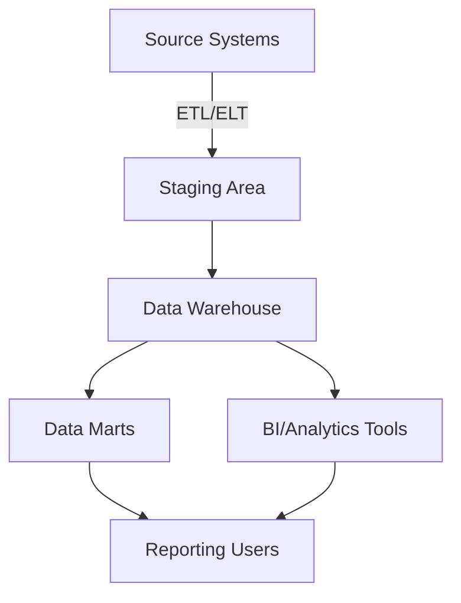

# **[Pattern] Data Warehouse Architecture & Best Practices – Reference Guide**

---

## **1. Overview**
A **data warehouse (DW)** is a centralized repository designed for **historical data analysis**, optimized for **read-heavy, analytical queries** (OLAP) rather than transactional workloads (OLTP). Unlike operational databases, warehouses prioritize:

- **Query performance** (complex aggregations, joins, and large scans)
- **Scalability** (handling petabytes of data)
- **Data consistency** (ensuring accuracy for reporting)
- **Flexibility** (supporting ad-hoc queries and BI tools)

This pattern outlines best practices for **schema design, ETL processes, indexing, partitioning, and optimization** to ensure high-performance analytical workloads.

---

## **2. Core Concepts & Architecture**

### **2.1 Key Principles**
| **Principle**               | **Description**                                                                 |
|-----------------------------|---------------------------------------------------------------------------------|
| **Star/Snowflake Schema**   | Organizes data into fact tables (transactions) and dimension tables (descriptions). |
| **Slowly Changing Dimensions (SCD)** | Handles evolving data attributes (e.g., customer addresses) via Type 1-3 updates. |
| **Incremental Loading**    | Loads only new/changed data to reduce processing time.                         |
| **Partitioning**           | Splits tables by date/range to improve scan efficiency.                        |
| **Indexing**               | Uses columnar indexes (e.g., **B-trees, bitmap**) for analytical queries.      |
| **Materialized Views**     | Pre-computes aggregates to speed up common queries.                            |
| **Data Virtualization**    | Optionally queries source systems directly (reduces storage but increases latency). |

---

## **2.2 Typical Data Warehouse Architecture**



**Components:**
- **Source Systems** (OLTP databases, APIs, logs)
- **Staging Area** (temporaryraw data validation/cleansing)
- **Data Warehouse** (optimized for analytics)
- **Data Marts** (subsets for specific teams, e.g., finance, marketing)
- **BI Tools** (Power BI, Tableau, SQL clients)

---

## **3. Schema Reference**

### **3.1 Star Schema Example**
A common **dimensional model** for sales analytics:

| **Table Type**       | **Table Name**       | **Key Columns**               | **Description**                          |
|----------------------|----------------------|--------------------------------|------------------------------------------|
| **Fact**             | `sales_facts`        | `sale_id (PK)`, `product_id`, `customer_id`, `date_id`, `quantity`, `revenue` | Records transactions with metrics.      |
| **Dimension**        | `dim_products`       | `product_id (PK)`, `product_name`, `category`, `price` | Describes products.                     |
| **Dimension**        | `dim_customers`      | `customer_id (PK)`, `name`, `region`, `loyalty_tier` | Customer attributes.                     |
| **Dimension**        | `dim_dates`          | `date_id (PK)`, `date`, `day_of_week`, `month`, `quarter` | Time-based filtering.                   |

**Key Design Rules:**
✅ **Denormalize** (normalize only dimensions; fact tables should be wide).
✅ **Foreign keys** reference dimension PKs (not business keys).
✅ **Surrogate keys** (integer IDs) improve join performance.

---

### **3.2 Snowflake Schema (Normalized Dimensions)**
For larger datasets, split dimensions into sub-tables:

```sql
-- Example: Normalized 'dim_products' into 'products' + 'categories'
CREATE TABLE products (
    product_id INT PRIMARY KEY,
    name VARCHAR(100),
    price DECIMAL(10,2)
);

CREATE TABLE categories (
    category_id INT PRIMARY KEY,
    category_name VARCHAR(50)
);

-- Join via foreign key in 'dim_products'
```

**Trade-off:** More joins but reduced storage redundancy.

---

## **4. Implementation Best Practices**

### **4.1 ETL/ELT Process**
| **Step**               | **Best Practice**                                                                 |
|------------------------|------------------------------------------------------------------------------------|
| **Extract**            | Use CDC (Change Data Capture) for real-time feeds or batch for historical loads. |
| **Transform**          | Cleanse data (handle nulls, duplicates) and standardize formats (e.g., dates). |
| **Load**               | Prefer **incremental loads** (avoid full refreshes).                             |
| **Validation**         | Check row counts, data types, and constraints post-load.                          |

**Tools:** Apache NiFi, Talend, dbt, Airflow.

---

### **4.2 Performance Optimization**
| **Technique**          | **Implementation**                                                                 |
|------------------------|------------------------------------------------------------------------------------|
| **Partitioning**       | Split tables by `date` or `range` (e.g., `PARTITION BY RANGE (YEAR(date_id))`).  |
| **Columnar Storage**   | Use **Parquet/ORC** formats for compressed, efficient scans.                       |
| **Indexing**           | Create **bitmap indexes** for low-cardinality columns (e.g., `region`).            |
| **Materialized Views** | Refresh nightly for common aggregations (e.g., `MATERIALIZED VIEW sales_by_month`).|
| **Query Hints**        | Force full scans for small tables (`/*+ FULL */`) or use `/*+ INDEX */`.          |

**Example Partitioning (PostgreSQL):**
```sql
CREATE TABLE sales_facts (
    sale_id INT,
    date_id INT,
    revenue DECIMAL(18,2),
    -- ...
)
PARTITION BY RANGE (date_id) (
    PARTITION p_2020 VALUES LESS THAN (20210101),
    PARTITION p_2021 VALUES LESS THAN (20220101),
    -- ...
);
```

---

### **4.3 Handling Slowly Changing Dimensions (SCD)**
| **SCD Type** | **Use Case**               | **Implementation**                                                                 |
|--------------|----------------------------|-----------------------------------------------------------------------------------|
| **Type 1**   | Overwrite old data          | Update existing record (risk of losing history).                                  |
| **Type 2**   | Track history               | Add `valid_from`, `valid_to` columns + new row for changes.                      |
| **Type 3**   | Store 2 prior versions      | Add `attr1_old`, `attr2_old` columns (limited history).                          |
| **Type 6**   | Hybrid (add/delete)         | Use soft deletes (`is_active` flag) + Type 2 for changes.                        |

**Example (Type 2):**
```sql
-- Add history-tracking columns
ALTER TABLE dim_customers ADD COLUMN effective_date DATE NOT NULL;

-- Insert new row for changes
INSERT INTO dim_customers (customer_id, name, effective_date)
VALUES (123, 'Jane Doe Updated', CURRENT_DATE);
```

---

## **5. Query Examples**

### **5.1 Basic Aggregation (Star Schema)**
```sql
-- Total revenue by region (optimized with join order)
SELECT
    d.region,
    SUM(f.revenue) AS total_revenue
FROM
    sales_facts f
JOIN
    dim_customers d ON f.customer_id = d.customer_id
GROUP BY
    d.region
ORDER BY
    total_revenue DESC;
```

### **5.2 Time-Series Analysis (Partitioned Table)**
```sql
-- Monthly trend using partitioned date dimension
SELECT
    d.month,
    AVG(f.revenue) AS avg_revenue
FROM
    sales_facts f
JOIN
    dim_dates d ON f.date_id = d.date_id
WHERE
    d.year = 2023
GROUP BY
    d.month
ORDER BY
    d.month;
```

### **5.3 Common Table Expression (CTE) for Complex Joins**
```sql
WITH customer_spend AS (
    SELECT
        c.customer_id,
        c.region,
        SUM(f.revenue) AS lifetime_spend
    FROM
        sales_facts f
    JOIN
        dim_customers c ON f.customer_id = c.customer_id
    GROUP BY
        c.customer_id, c.region
)
SELECT
    region,
    AVG(lifetime_spend) AS avg_spend,
    PERCENTILE_CONT(0.5) WITHIN GROUP (ORDER BY lifetime_spend) AS median_spend
FROM
    customer_spend
GROUP BY
    region;
```

---

## **6. Monitoring & Maintenance**
| **Task**               | **Tool/Method**                                                                 |
|------------------------|---------------------------------------------------------------------------------|
| **Query Performance**  | Use **EXPLAIN ANALYZE** to identify bottlenecks.                               |
| **Storage Growth**     | Monitor table sizes (e.g., `pg_table_size` in PostgreSQL).                    |
| **ETL Latency**        | Track load times in a dashboard (e.g., Prometheus + Grafana).                  |
| **Data Quality**       | Run SQL checks for nulls, duplicates (e.g., `COUNT(DISTINCT col) vs ROW_COUNT`). |
| **Backup Strategy**    | Implement incremental backups (e.g., AWS S3 + Glacier).                       |

**Example Query Monitoring (PostgreSQL):**
```sql
-- Find slow queries
SELECT
    query, execution_count, total_time
FROM
    pg_stat_statements
ORDER BY
    total_time DESC
LIMIT 10;
```

---

## **7. Related Patterns**
| **Pattern**               | **Description**                                                                 |
|---------------------------|---------------------------------------------------------------------------------|
| **[Data Mesh](https://datamesh.io/)** | Decentralizes data ownership for scalability (complements warehouses).          |
| **[Lakehouse](https://delta.rs/)**   | Combines data lakes + warehouse capabilities (e.g., Delta Lake, Iceberg).       |
| **[Microservices Data](https://microservices.io/)** | Designs data pipelines for decentralized services (may feed into a warehouse). |
| **[Event-Driven Architecture](https://eventstore.com/)** | Uses streams (e.g., Kafka) to populate warehouses in real-time.                |
| **[Real-Time Analytics](https://www.databricks.com/)** | Tools like Kafka + Spark SQL for low-latency DW.                              |

---

## **8. Anti-Patterns to Avoid**
❌ **OLTP Schema in a Warehouse** (e.g., normalized tables for reporting).
❌ **Full Table Scans on Large Datasets** (always partition/index).
❌ **Ignoring Data Freshness** (plan for incremental refreshes).
❌ **Over-Indexing** (adds write overhead; use selectively).
❌ **Silos Without Metadata** (track lineage for governance).

---
**Next Steps:**
- Start with a **pilot schema** (e.g., sales or customer data).
- Use **dbt** for transformational models.
- Benchmark queries with **EXPLAIN** before optimizing.

---
**References:**
- Kimball, R. (2013). *The Data Warehouse Toolkit*.
- SQL Performance Explained (https://use-the-index-luke.com/).