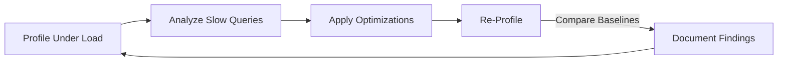

# **[Pattern] Databases Profiling – Reference Guide**

---

## **Overview**
**Databases Profiling** is an analytical pattern designed to monitor, analyze, and optimize database performance by collecting runtime metrics (e.g., query execution plans, lock contention, memory usage) and identifying inefficiencies. This pattern helps DBAs, developers, and architects diagnose bottlenecks, fine-tune queries, and align database behavior with application requirements. Profiling involves **instrumentation** (e.g., logging, tracing) and **analysis** (e.g., latency breakdowns, resource consumption) to prioritize optimizations and reduce operational overhead.

Key use cases include:
- **Performance degradation** detection (e.g., slow queries, high CPU/memory usage).
- **Resource contention** analysis (e.g., blocking locks, deadlocks).
- **Query optimization** via execution plan review.
- **Capacity planning** for scaling infrastructure.

---

## **Schema Reference**
Below are core tables and metrics used in database profiling, categorized by functionality:

| **Category**               | **Table/Concept**               | **Description**                                                                                                                                                                                                 | **Key Columns/Attributes**                                                                                     |
|----------------------------|----------------------------------|-----------------------------------------------------------------------------------------------------------------------------------------------------------------------------------------------------------------|---------------------------------------------------------------------------------------------------------------|
| **Profiling Metadata**     | `profiling_runs`                 | Tracks profiling sessions (start time, duration, database version, tool used).                                                                                                                                         | `run_id`, `start_time`, `end_time`, `database_name`, `tool_version`, `status` (e.g., "completed", "failed"). |
| **Query Execution**        | `executed_queries`               | Logs executed SQL queries during profiling (normalized for privacy).                                                                                                                                           | `run_id`, `query_hash`, `query_text`, `execution_count`, `avg_latency_ms`, `rows_processed`.               |
| **Execution Plans**        | `query_plans`                    | Stores parsed execution plans (e.g., `EXPLAIN ANALYZE` results) for analysis.                                                                                                                                     | `query_id`, `plan_hash`, `cost`, `rows_estimated`, `rows_actual`, `plan_tree_json`.                          |
| **Resource Usage**         | `resource_metrics`               | Captures CPU, memory, I/O, and lock metrics per query or session.                                                                                                                                               | `run_id`, `metric_type` (e.g., "cpu_time_ms", "memory_usage_mb"), `value`, `time_window_ms`.               |
| **Lock Contention**        | `lock_events`                    | Records blocking locks, deadlocks, and wait times.                                                                                                                                                               | `run_id`, `lock_id`, `holder_session`, `waiting_session`, `start_time`, `duration_ms`, `resource_type`.     |
| **Index/Hint Statistics**  | `index_usage`                    | Tracks index usage (or lack thereof) and hint effectiveness.                                                                                                                                                     | `query_id`, `index_name`, `used` (boolean), `hint_applied`, `cost_savings_estimated`.                        |
| **Baseline Comparisons**   | `performance_baselines`          | Stores historical metrics for trend analysis (e.g., pre/post-optimization).                                                                                                                                       | `database_name`, `metric_name`, `value`, `timestamp`, `version`, `environment`.                            |

---
**Note:** For privacy/compliance, hash or anonymize `query_text` and `session_id` in production logs.

---

## **Implementation Details**

### **1. Profiling Tools & Instrumentation**
Use built-in or third-party tools to collect metrics:

| **Tool/Feature**            | **Database Platform**       | **Key Capabilities**                                                                                                                                                     | **Example Command/Config**                                                                                     |
|-----------------------------|-----------------------------|---------------------------------------------------------------------------------------------------------------------------------------------------------------------|---------------------------------------------------------------------------------------------------------------|
| **EXPLAIN ANALYZE**         | PostgreSQL, MySQL, SQLite    | Generates execution plans with runtime stats (e.g., actual time, rows fetched).                                                                                            | `EXPLAIN (ANALYZE, BUFFERS) SELECT * FROM users WHERE id = 1;`                                                  |
| **sp_Who2 (sys.dm_os_wait_stats)** | SQL Server       | Inspects blocking processes and wait types (e.g., `PAGEIOLATCH`, `LCK_M_SCH_M`).                                                                                          | `EXEC sp_Who2;` or query `sys.dm_os_wait_stats`.                                                               |
| **pg_stat_statements**      | PostgreSQL                  | Extends `pg_stat_activity` to track query performance (requires extension).                                                                                                  | `CREATE EXTENSION pg_stat_statements;` + `pg_stat_statements.track = 'all';`                                   |
| **MySQL Slow Query Log**    | MySQL/MariaDB                | Logs queries exceeding a latency threshold (configurable).                                                                                                                 | `SET GLOBAL slow_query_log = 'ON'; SET GLOBAL long_query_time = 2;`                                            |
| **Orchestrator/AWS RDS**    | Multi-platform              | Cloud-managed profiling with dashboards for distributed databases.                                                                                                         | [Orchestrator Docs](https://github.com/Netflix/orchestrator) / AWS RDS Performance Insights.                    |
| **Custom Tracing**          | Any                         | Embed instrumentation (e.g., OpenTelemetry, custom logs) in application code.                                                                                                | Example: `LOGGER.trace("Query executed: {} in {}ms", query, elapsedTime);`                                  |

---

### **2. Query Analysis Workflow**
Follow this structured approach to interpret profiling data:

#### **Step 1: Identify Slow Queries**
- **Filters**:
  - `avg_latency_ms > threshold` (e.g., 500ms).
  - `rows_processed > X` (e.g., top 10% by I/O).
  - `execution_count > 1` (repeated queries).
- **Query**:
  ```sql
  SELECT
      query_hash,
      AVG(avg_latency_ms) AS avg_latency,
      SUM(rows_processed) AS total_rows
  FROM executed_queries
  WHERE avg_latency_ms > 500
  GROUP BY query_hash
  ORDER BY avg_latency DESC
  LIMIT 10;
  ```

#### **Step 2: Review Execution Plans**
- **Flags in Plans**:
  - **Full Table Scans**: `Seq Scan` (PostgreSQL) or `TABLE ACCESS FULL` (Oracle).
  - **Inefficient Joins**: `Hash Join`/`Nested Loop` with high `Rows` estimates.
  - **Missing Indexes**: `Index Scan` on a column with `Seq Scan` fallback.
- **Example Plan Insight**:
  ```plaintext
  Seq Scan on users  (cost=0.00..5000.00 rows=1000 width=12) (actual time=2.123..100.456 rows=500 loops=1)
    Filter: id = 123
    Rows Removed by Filter: 10000
  ```
  → **Issue**: 95% of rows scanned; likely missing index on `id`.

#### **Step 3: Analyze Resource Contention**
- **Lock Events**:
  ```sql
  SELECT
      waiting_session,
      resource_type,
      COUNT(*) AS wait_count,
      AVG(duration_ms) AS avg_wait_ms
  FROM lock_events
  GROUP BY waiting_session, resource_type
  ORDER BY avg_wait_ms DESC;
  ```
- **Wait Types (SQL Server)**:
  ```sql
  SELECT
      wait_type,
      wait_time_ms,
      signal_wait_time_ms
  FROM sys.dm_os_wait_stats
  ORDER BY wait_time_ms DESC;
  ```
  → **Action**: Address `PAGEIOLATCH` (I/O bottlenecks) or `LCK_M_SCH_M` (schema locks).

#### **Step 4: Compare Against Baselines**
- **Trend Analysis**:
  ```sql
  WITH query_performance AS (
      SELECT
          query_hash,
          AVG(avg_latency_ms) AS current_latency
      FROM executed_queries
      WHERE run_id IN (SELECT MAX(run_id) FROM profiling_runs WHERE status = 'completed')
      GROUP BY query_hash
  )
  SELECT
      qp.query_hash,
      qp.current_latency,
      b.value AS baseline_latency,
      qp.current_latency - b.value AS delta_ms
  FROM query_performance qp
  JOIN performance_baselines b
      ON qp.query_hash = b.metric_name
     AND b.timestamp = (SELECT MAX(timestamp) FROM performance_baselines WHERE metric_name = qp.query_hash);
  ```

---

### **3. Optimization Techniques**
| **Issue**                     | **Root Cause**               | **Solution**                                                                                                                                                     | **Tool/Query to Verify**                                                                                     |
|-------------------------------|-------------------------------|-----------------------------------------------------------------------------------------------------------------------------------------------------------------|---------------------------------------------------------------------------------------------------------------|
| Full Table Scans             | Missing index                | Add an index on the filtered column.                                                                                                                           | `EXPLAIN ANALYZE` post-index creation; check `Index Scan` usage in `pg_stat_statements`.                      |
| High CPU Time                | Complex operations (e.g., `JOIN`, `SUBSTRING`) | Rewrite queries (e.g., pre-filter data, use `EXISTS` instead of `IN`).                                                                                      | `EXPLAIN (ANALYZE, TIMING OFF)` to isolate CPU-heavy steps.                                                  |
| Blocking Locks               | Long-running transactions    | Implement retries, reduce transaction duration, or use `NOLOCK` hints (with caution).                                                                           | `sys.dm_tran_locks` (SQL Server) or `pg_locks` (PostgreSQL).                                               |
| Parameter Sniffing           | Cache misleading stats        | Use `OPTION (OPTIMIZE FOR UNKNOWN)` or refresh stats with `sp_refreshsqlmodule`.                                                                             | Compare plans with `OPTION (RECOMPILE)`.                                                                     |
| Memory Pressure              | Large result sets             | Add `LIMIT` clauses or paginate results. Use `FETCH FIRST` (PostgreSQL) or `TOP` (SQL Server).                                                                 | Check `shared_buffers` usage in `pg_stat_database` (PostgreSQL).                                             |

---

## **Query Examples**
### **1. PostgreSQL: Find Query with Highest CPU Time**
```sql
SELECT
    query,
    total_time AS cpu_time_ms,
    calls,
    mean_time AS avg_cpu_ms
FROM pg_stat_statements
ORDER BY total_time DESC
LIMIT 5;
```

### **2. SQL Server: High-Wait-Type Queries**
```sql
SELECT
    qs.execution_count,
    qs.total_logical_reads,
    ws.wait_type,
    ws.wait_time_ms,
    ws.signal_wait_time_ms
FROM sys.dm_exec_query_stats qs
CROSS APPLY sys.dm_exec_query_plan(qs.plan_handle) qp
CROSS APPLY sys.dm_os_wait_stats ws
WHERE ws.wait_type IN ('PAGEIOLATCH_WAIT', 'LCK_M_SCH_M')
ORDER BY ws.wait_time_ms DESC;
```

### **3. MySQL: Slow Queries with Missing Indexes**
```sql
SELECT
    sql_text,
    query_starttime,
    timer_wait * 1000000 AS wait_time_us
FROM mysql.slow_log
WHERE query_starttime > NOW() - INTERVAL 1 DAY
ORDER BY timer_wait DESC;
-- Check for sequential scans:
SELECT * FROM information_schema.INNODB_TRX WHERE name LIKE 'slow%';
```

### **4. Oracle: Identify Full Scans**
```sql
SELECT
    sql_id,
    plan_hash_value,
    executions,
    avg_time,
    buffer_gets
FROM v$sql
WHERE parsed_scheme = 'FULL'
ORDER BY buffer_gets DESC;
```

---

## **Related Patterns**
| **Related Pattern**               | **Description**                                                                                                                                                     | **When to Combine**                                                                                                 |
|------------------------------------|-----------------------------------------------------------------------------------------------------------------------------------------------------------------|-------------------------------------------------------------------------------------------------------------------|
| **[Query Optimization]**           | Techniques to rewrite queries for better performance (e.g., indexing, partitioning).                                                                             | After profiling identifies specific slow queries.                                                               |
| **[Caching Layer]**                | Reduce database load by caching frequent queries (e.g., Redis, Memcached).                                                                                           | If profiling shows repeated identical queries.                                                              |
| **[Database Sharding]**            | Split data across multiple instances to distribute load.                                                                                                           | For databases experiencing high contention or scaling limits.                                                 |
| **[Connection Pooling]**          | Reuse database connections to reduce overhead.                                                                                                                       | To mitigate connection-related bottlenecks (e.g., `Too many connections` errors).                              |
| **[Asynchronous Processing]**      | Offload non-critical tasks (e.g., reports) to background jobs.                                                                                                     | If profiling reveals blocking queries during peak hours.                                                    |
| **[Schema Design Review]**         | Analyze table/column design for normalization and denormalization trade-offs.                                                                                   | Early-stage design phase to prevent profiling issues.                                                         |

---

## **Best Practices**
1. **Profile Under Load**: Simulate production traffic to capture realistic metrics.
2. **Focus on Top 20% Queries**: 80% of performance issues come from a small subset of queries.
3. **Isolate Tests**: Run profiling in staging environments to avoid production noise.
4. **Automate Baselines**: Schedule regular profiling runs for trend analysis.
5. **Document Changes**: Track optimizations (e.g., index additions) in the `profiling_runs` table.
6. **Monitor After Fixes**: Re-profile to confirm improvements and detect regressions.

---
**Example Automation Pipeline**:


---
**Tools for Automation**:
- **OpenTelemetry**: Instrument applications for distributed tracing.
- **Prometheus/Grafana**: Visualize profiling metrics over time.
- **CI/CD Hooks**: Trigger profiling on code deployments (e.g., GitHub Actions).

---
**Compliance Note**: Ensure profiling aligns with data governance policies (e.g., GDPR). Anonymize sensitive queries or use synthetic data for testing.