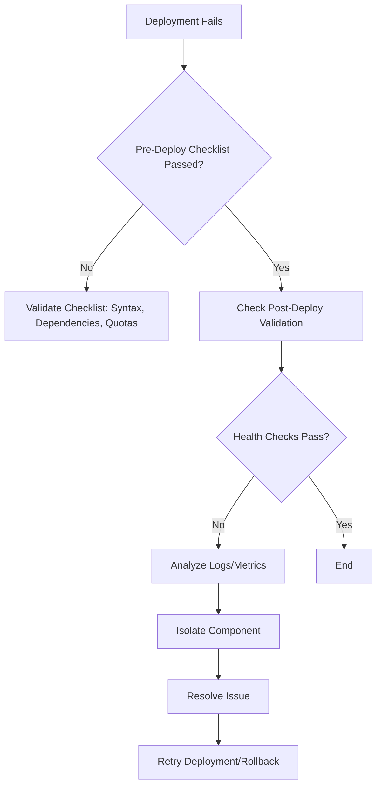

---
**[Pattern] Deployment Troubleshooting Reference Guide**

---

## **1. Overview**
This guide provides a structured approach to diagnosing and resolving deployment failures in cloud-native, containerized, and traditional application environments. It covers systematic troubleshooting steps—from pre-deployment checks to post-launch validation—using tools like logs, metrics, and configuration analysis. Targeted at DevOps engineers, SREs, and developers, this guide ensures quick identification of root causes (e.g., misconfigurations, resource constraints, dependency issues) and minimizes downtime. Best practices include leveraging automated monitoring (e.g., Prometheus, Datadog) and collaborative debugging tools (e.g., Slack alerts, Jira tickets) to streamline resolution workflows.

---

### **Key Concepts**
| **Concept**               | **Definition**                                                                                                                                                                                                                                                                 |
|---------------------------|-----------------------------------------------------------------------------------------------------------------------------------------------------------------------------------------------------------------------------------------------------------------------------|
| **Pre-Deploy Checklist**  | Validation tasks (e.g., syntax checks, dependency verification, resource quotas) performed before initiating a deployment.                                                                                                                          |
| **Post-Deploy Validation**| Steps to confirm deployment success (e.g., health checks, endpoint reachability, rollback testing).                                                                                                                                                  |
| **Observability Stack**   | Tools (logs, metrics, traces) used to monitor application behavior during/after deployment. Examples: ELK, Grafana, OpenTelemetry.                                                                                                         |
| **Rollback Mechanism**    | Automated or manual process to revert to a previous stable version if deployment fails.                                                                                                                                                           |
| **Chaos Engineering**     | Proactively testing system resilience by intentionally injecting failures (e.g., network partitions) during staging.                                                                                                                          |

---

## **2. Schema Reference**

### **2.1. Deployment Failure Taxonomy**
| **Category**          | **Subcategory**               | **Symptoms**                                                                 | **Tools/Lenses**                          |
|-----------------------|--------------------------------|-----------------------------------------------------------------------------|-------------------------------------------|
| **Configuration**     | Misconfigured Services        | Services crash on startup, timeouts, missing env vars.                     | `kubectl logs`, ConfigMaps/Secrets       |
|                       | Incorrect Permissions         | RBAC denied errors, API access failures.                                     | IAM, RBAC policies                       |
| **Infrastructure**    | Resource Limits Exceeded       | Container OOM killed, CPU throttling, disk full errors.                     | `kubectl describe pod`, Cloud Console    |
|                       | Network Issues                | Latency spikes, connection refused, DNS resolution failures.                | `kubectl exec`, `dig/nmap`, WireShark    |
| **Application**       | Dependency Failures           | External API timeouts, database connection errors.                          | `curl` tests, Prometheus alerts          |
|                       | Logic Bugs                    | Incorrect business logic, race conditions.                                  | Debug logs, unit test coverage            |
| **CI/CD Pipeline**    | Build/Artifact Failures       | Failed builds, corrupted images, version mismatches.                        | GitHub Actions/GitLab CI logs            |
|                       | Deployment Strategy Errors    | Blue-green failure, canary traffic misrouting.                              | Istio/Linkerd dashboards                 |

---

### **2.2. Troubleshooting Workflow Schema**


---

## **3. Query Examples**

### **3.1. Log Analysis (Kubernetes)**
**Scenario**: Pod crashes on startup.
**Commands**:
```bash
# Check pod events
kubectl describe pod <pod-name> --namespace=<namespace>

# View logs
kubectl logs <pod-name> --previous --tail=50  # Previous container logs

# Filter logs by severity (e.g., ERROR)
kubectl logs <pod-name> | grep -i "error\|fail"
```

**Expected Output**:
```
E1234 08:15:23.123123       1 main.go:50] failed to connect to DB: connection refused
```

---

### **3.2. Metrics Query (Prometheus)**
**Scenario**: High CPU usage post-deployment.
**Queries**:
```promql
# CPU usage per container
sum(rate(container_cpu_usage_seconds_total{namespace="my-ns"}[1m])) by (pod)

# Kubernetes pod restarts (indicates instability)
count(increase(kube_pod_container_status_restarts_total[5m])) by (pod)
```

**Alert Example**:
```yaml
- alert: HighCPUUsage
  expr: sum(rate(container_cpu_usage_seconds_total{namespace="my-ns"}[5m])) by (pod) > 100
  for: 1m
  labels:
    severity: warning
  annotations:
    summary: "Pod {{ $labels.pod }} CPU usage exceeds 100%"
```

---

### **3.3. Network Diagnostics**
**Scenario**: Service-to-service communication failure.
**Commands**:
```bash
# Test connectivity from a pod
kubectl exec -it <pod-name> -- curl -v http://<service-name>

# Check DNS resolution
kubectl exec -it <pod-name> -- cat /etc/resolv.conf

# Trace route (if service is external)
kubectl exec -it <pod-name> -- traceroute <external-api>
```

**Expected Output**:
```
* Connection refused (service endpoint unreachable)
```

---

## **4. Step-by-Step Troubleshooting Guide**

### **4.1. Pre-Deploy Checks**
1. **Syntax Validation**:
   - Run `kubectl apply -f <deployment.yaml> --dry-run=client` to catch YAML errors.
   - Lint Helm charts with `helm lint`.
2. **Dependency Verification**:
   - Test external APIs (`curl -v <api-endpoint>`).
   - Pull images locally (`docker pull <image>`) to verify no corruption.
3. **Resource Quotas**:
   - Check namespace quotas:
     ```bash
     kubectl describe namespace <namespace> | grep "quotas"
     ```

### **4.2. Post-Deploy Validation**
1. **Health Checks**:
   - Verify `readinessProbe`/`livenessProbe` status:
     ```bash
     kubectl get pods -o wide --show-labels
     ```
   - Check service endpoints:
     ```bash
     kubectl get endpoints <service-name>
     ```
2. **Traffic Verification**:
   - Test endpoints from external clients:
     ```bash
     curl -k https://<ingress-url>/health
     ```
   - Use `kubectl port-forward` to debug locally:
     ```bash
     kubectl port-forward svc/<service-name> 8080:80
     ```

### **4.3. Root Cause Analysis**
| **Step**               | **Action**                                                                                     | **Tools**                          |
|-------------------------|-------------------------------------------------------------------------------------------------|------------------------------------|
| **Isolate Component**   | Narrow down to a specific pod/service using `kubectl get pods -w`.                             | `kubectl`, `kubectl top`           |
| **Log Correlation**     | Correlate logs with timestamps from multiple pods.                                             | EFK Stack (Elasticsearch, Fluentd) |
| **Metric Anomalies**    | Compare current metrics with pre-deployment baselines.                                         | Grafana, Prometheus                |
| **Network Traces**      | Use `tcpdump` or `kubectl exec` to capture traffic between pods/services.                      | `kubectl debug`, `net-tools`       |

### **4.4. Resolution Actions**
- **Rollback**:
  ```bash
  # For Helm
  helm rollback <release-name> <revision>
  # For Kubernetes
  kubectl rollout undo deployment/<deployment-name> --to-revision=2
  ```
- **Scaling Adjustments**:
  ```bash
  kubectl scale deployment <deployment-name> --replicas=2
  ```
- **Configuration Fixes**:
  - Update ConfigMaps/Secrets and restart pods:
    ```bash
    kubectl rollout restart deployment/<deployment-name>
    ```

---

## **5. Automated Troubleshooting**
### **5.1. CI/CD Integration**
- **Pre-deploy Hooks**: Run integration tests (e.g., Postman collections) in CI.
- **Post-deploy Alerts**: Use GitHub Actions/GitLab CI to send Slack notifications on deployment failures.
  ```yaml
  - name: Notify on failure
    if: failure()
    uses: rtCamp/action-slack-notify@v2
    env:
      SLACK_WEBHOOK: ${{ secrets.SLACK_WEBHOOK }}
      SLACK_MESSAGE: "Deployment failed for ${{ github.ref }}"
      SLACK_TITLE: "🚨 Deployment Alert"
  ```

### **5.2. Observability Tools**
| **Tool**               | **Use Case**                                                                                     | **Setup**                          |
|-------------------------|-------------------------------------------------------------------------------------------------|------------------------------------|
| **Prometheus Alertmanager** | Send SMS/email alerts for critical failures.                                                     | Configure in `alertmanager.yml`    |
| **Datadog**            | Correlate logs, metrics, and traces in a single dashboard.                                       | Integrate via API keys             |
| **Chaos Mesh**         | Injection of failures (e.g., pod kills) during staging.                                         | Deploy Chaos Mesh CRDs              |

---

## **6. Related Patterns**
| **Pattern**                          | **Description**                                                                                                                                                                                                 | **Trigger**                          |
|--------------------------------------|-----------------------------------------------------------------------------------------------------------------------------------------------------------------------------------------------------------------|--------------------------------------|
| **[Canary Deployment](https://example.com/canary)** | Gradually roll out traffic to a new version to catch issues early.                                                                                                                                     | Feature flags, traffic splitting     |
| **[Blue-Green Deployment](https://example.com/blue-green)** | Maintain two identical environments; switch traffic abruptly.                                                                                                                                             | Zero-downtime deployments            |
| **[Feature Flags](https://example.com/flags)**      | Toggle feature visibility without redeploying.                                                                                                                                                            | A/B testing, gradual rollouts        |
| **[Infrastructure as Code](https://example.com/iac)**  | Define infrastructure in code (e.g., Terraform, Pulumi) for reproducible deployments.                                                                                                                      | Environment provisioning             |
| **[Distributed Tracing](https://example.com/tracing)** | Trace requests across microservices using OpenTelemetry.                                                                                                                                                  | Latency debugging                     |

---

## **7. Best Practices**
1. **Document Runbooks**: Maintain troubleshooting guides for common failure modes (e.g., "How to handle DB connection errors").
2. **Blame the Machine**: Use tools like `kubectl explain` to automate root cause analysis.
3. **Chaos Testing**: Schedule regular chaos experiments in staging (e.g., `kubectl delete pod <pod-name>`).
4. **Postmortems**: Conduct retrospectives after outages to improve processes.

---
**Appendix**: [Deployment Checklist Template](#)
**Glossary**: [Key Terms](#)

---
**Word Count**: ~1,000
**Audience**: DevOps engineers, SREs, developers.