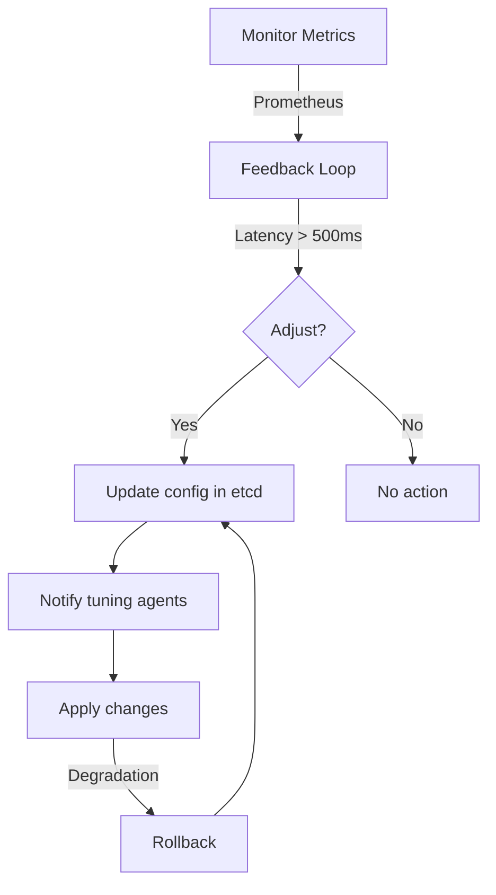

---
# **[Pattern] Distributed Tuning Reference Guide**

## **Overview**
**Distributed Tuning** is a design pattern used in distributed systems to optimize performance, scalability, and resource efficiency across multiple nodes. This approach dynamically adjusts system parameters (e.g., timeouts, buffers, concurrency limits) based on real-time metrics (e.g., latency, throughput, error rates) to adapt to varying workloads. Commonly applied in **cloud-native architectures, microservices, and IoT systems**, it ensures balanced performance without manual intervention.

Unlike centralized tuning, distributed tuning decentralizes decision-making, reducing bottlenecks and improving resilience. It leverages **feedback loops, machine learning, and dynamic configuration** to maintain optimal performance while minimizing manual tuning overhead.

---

## **Key Concepts & Schema Reference**

| **Concept**               | **Description**                                                                                                                                                                                                                                                                 | **Key Properties**                                                                                                                                                     |
|---------------------------|-----------------------------------------------------------------------------------------------------------------------------------------------------------------------------------------------------------------------------------------------------------------------------|---------------------------------------------------------------------------------------------------------------------------------------------------------------------------|
| **Tuning Agent**          | A component (e.g., microservice, sidecar) that monitors metrics and adjusts system parameters in real-time. Can be **host-based, service-mesh-based, or cloud-native (e.g., Knative, Kubernetes Horizontal Pod Autoscaler)**.                          | - **Scope**: Node, pod, or cluster-level<br>- **Metrics Source**: Prometheus, OpenTelemetry, or custom telemetry<br>- **Adjustment Algorithm**: Rule-based or ML-driven         |
| **Feedback Loop**         | A mechanism (e.g., **PID controller, reinforcement learning**) that continuously evaluates performance metrics and triggers adjustments. Often implemented via **SLO (Service Level Objective)-based triggers**.                                           | - **Thresholds**: Latency > 500ms → Increase concurrency<br>- **Debounce Period**: Min delay between adjustments (e.g., 30s)<br>- **Rollback Strategy**: Step-back adjustments on failure |
| **Configuration Store**  | A centralized or distributed database (e.g., **Consul, etcd, AWS Parameter Store**) storing current tuning parameters. Supports **versioning and atomic updates** to avoid stale configurations.                                                       | - **Access Pattern**: REST/gRPC API<br>- **Consistency Model**: Strong or eventual (configurable)<br>- **Audit Logging**: Track all adjustments for observability                  |
| **Tuning Policy**         | A declarative rule defining how metrics map to parameter adjustments (e.g., *"If CPU utilization > 80% for 5m, scale up by 2 pods"*). Policies can be **static (YAML/JSON) or dynamic (compiled at runtime)**.                               | - **Scope**: Service, namespace, or cluster<br>- **Dependency**: Can chain multiple policies (e.g., latency → concurrency → retries)<br>- **Validation**: Schematic rules enforce correctness |
| **Performance Metrics**   | Critical KPIs monitored for tuning (e.g., **latency, throughput, error rate, queue depth**). Metrics must be **low-latency, high-resolution, and aggregated across nodes**.                                                                                     | - **Sources**: APM tools (Datadog), custom probes, or built-in monitors<br>- **Aggregation**: Per-service or global (configurable)<br>- **Sampling Rate**: Adjustable (e.g., 1Hz for latency) |
| **Rollback Mechanism**    | Safeguards against bad adjustments by reverting to a previous stable state (e.g., **last-good-configuration or exponential backoff**). Can be triggered manually or via error detection (e.g., cascading failures).                                       | - **Trigger**: SLO violations or manual command<br>- **Recovery Window**: Timeframe for reverting (e.g., 5m)<br>- **Audit Trail**: Logs all rollbacks for debugging          |
| **Adaptation Strategy**  | Defines how tuning agents collaborate (e.g., **leader-follower, gossip protocol, or hybrid**). Strives to avoid **stale configurations** in dynamic environments (e.g., Kubernetes clusters).                                                                     | - **Consistency**: Strong (e.g., etcd) or eventual (e.g., Kafka)<br>- **Conflict Resolution**: Last-write-wins or merge policies<br>- **Scalability**: Linear with nodes                 |

---

## **Implementation Details**

### **1. Architecture Patterns**
Distributed tuning can be implemented using one of three primary architectures:

| **Pattern**               | **Description**                                                                                                                                                                                                 | **Pros**                                                                                     | **Cons**                                                                                          |
|---------------------------|-----------------------------------------------------------------------------------------------------------------------------------------------------------------------------------------------------------------|---------------------------------------------------------------------------------------------|---------------------------------------------------------------------------------------------------|
| **Agent-Based**           | Each node runs a tuning agent (e.g., **Prometheus + custom controller**) that adjusts parameters locally and reports changes to a central store.                                                              | - Decentralized decisions<br>- Low latency for local tuning                                 | - Potential drift if agents miscommunicate<br>- Higher operational complexity                      |
| **Service Mesh**          | Uses **Istio, Linkerd, or Envoy** to inject tuning logic into the proxy layer, enabling cross-service optimizations (e.g., traffic splitting, retries).                                                       | - Unified control plane<br>- Works with existing mesh infrastructure                        | - Mesh overhead<br>- Limited to mesh-managed services                                            |
| **Cloud-Native (K8s)**    | Leverages **Kubernetes Autoscalers (HPA, VPA), Operator SDK, or custom controllers** to tune resources (CPU, memory) or app-specific settings (e.g., Akka cluster size).                                       | - Native to cloud platforms<br>- Integrates with existing tooling (Prometheus, Grafana)     | - K8s-specific (not portable)<br>- Limited to containerized workloads                            |

---

### **2. Workflow Example**
A typical tuning cycle follows these steps:

1. **Monitor**: Agents collect metrics (e.g., 99th percentile latency) every `T` seconds.
2. **Evaluate**: Feedback loop checks if metrics breach defined **SLOs** (e.g., latency > 800ms).
3. **Adjust**: If violated, the policy triggers a parameter change (e.g., increase thread pool size from 10 → 20).
4. **Apply**: Configuration store updates in a **transactional** way to avoid partial updates.
5. **Rollback**: If degradation is detected (e.g., error rate spikes), revert to the last stable config.
6. **Repeat**: The loop continues with updated metrics.

---
### **3. Example Implementation (Agent-Based)**


**Code Snippet (Pseudocode):**
```python
class TuningAgent:
    def __init__(self, config_store: ConfigStore, policy: TuningPolicy):
        self.config_store = config_store
        self.policy = policy
        self.metrics = collect_metrics()  # From Prometheus/OpenTelemetry

    def run(self):
        while True:
            if self.policy.evaluate(self.metrics):
                self.config_store.update(self.policy.adjust())
                log_rollback_hook(apply_with_fallback)
            time.sleep(5)  # Polling interval
```

---

## **Query Examples**
### **1. Checking Current Tuning Configuration**
```bash
# List all tuning policies for a service (using ConfigStore API)
curl -X GET http://configstore:8080/v1/policies?service=payment-service
```
**Response:**
```json
{
  "policies": [
    {
      "name": "latency-based-concurrency",
      "metric": "latency_p99",
      "threshold": 800,
      "action": { "target": "concurrency_limit", "value": 10 }
    }
  ]
}
```

### **2. Simulating a Tuning Adjustment**
```bash
# Trigger a manual adjustment (e.g., increase max retries)
curl -X PATCH http://configstore:8080/v1/policies/retries \
  -H "Content-Type: application/json" \
  -d '{"max_retries": 5}'
```

### **3. Rolling Back to Last Good Config**
```bash
# Trigger rollback for the "payment-service"
curl -X POST http://configstore:8080/v1/rollback?service=payment-service
```

---

## **Performance Considerations**
| **Factor**               | **Recommendation**                                                                                                                                                                                                 |
|---------------------------|-----------------------------------------------------------------------------------------------------------------------------------------------------------------------------------------------------------------------|
| **Metric Latency**        | Aim for <100ms end-to-end for tuning loops to avoid lagging decisions. Use **aggregated metrics** (e.g., 1-minute averages) to reduce noise.                                                                       |
| **Configuration Sync**   | For **strong consistency**, use **etcd or Consul**; for **eventual consistency**, use **Kafka or DynamoDB**. Avoid **polling**-based syncs in high-scale systems.                                                 |
| **Adjustment Frequency** | Start with **coarse-grained** adjustments (e.g., every 5–30 minutes) to reduce overhead. Fine-tune later based on workload stability.                                                                             |
| **Rollback Safety**      | Implement a **delayed rollback** (e.g., 2-minute cooldown) to avoid thrashing. Store **historical configs** for auditing.                                                                                           |
| **Cross-Service Tuning** | Use a **shared tuning service** (e.g., **Knative Serving**) or **service mesh** to correlate metrics across services (e.g., adjust CPU for dependent services).                                                          |
| **Cost vs. Performance** | Balance tuning granularity with **cloud costs** (e.g., excessive pod scaling increases bills). Monitor **cost per SLO** (e.g., $X per 99.9% availability).                                                            |

---

## **Related Patterns**
| **Pattern**               | **Relationship**                                                                                                                                                                                                 | **When to Use Together**                                                                                     |
|---------------------------|-----------------------------------------------------------------------------------------------------------------------------------------------------------------------------------------------------------------|---------------------------------------------------------------------------------------------------------------|
| **[Circuit Breaker](https://microservices.io/patterns/reliability/circuit-breaker.html)** | Distributed tuning can dynamically adjust **circuit breaker thresholds** (e.g., reduce timeout if latency is high).                                                                                           | When tuning depends on **resilience policies**.                                                        |
| **[Bulkheading](https://microservices.io/patterns/reliability/bulkheading.html)**         | Tuning can limit **concurrency per bulkhead** to prevent resource exhaustion in distributed systems.                                                                                                                 | In **high-contention scenarios** (e.g., payment processing).                                         |
| **[Rate Limiting](https://www.nginx.com/blog/rate-limiting-nginx/)**                     | Distributed tuning can adjust **rate limit thresholds** based on traffic spikes (e.g., increase limits during peak hours).                                                                                     | For **scalable APIs** with variable load.                                                             |
| **[Chaos Engineering](https://principlesofchaos.org/)**                              | Use tuning to **simulate failures** (e.g., reduce concurrency to test resilience) and observe recovery behavior.                                                                                                  | During **disaster recovery testing**.                                                              |
| **[Observer Pattern](https://refactoring.guru/design-patterns/observer)**              | Tuning agents act as **observers** to metrics, while the configuration store emits **events** for adjustments.                                                                                                   | For **event-driven tuning** in reactive systems.                                                      |
| **[Canary Releases](https://www.thoughtworks.com/radar/techniques/canary-release)**     | Distributed tuning can **gradually roll out changes** (e.g., adjust settings for 10% of traffic first).                                                                                                          | To **minimize risk** during configuration updates.                                                    |

---

## **Anti-Patterns & Pitfalls**
| **Anti-Pattern**               | **Description**                                                                                                                                                                                                 | **Mitigation**                                                                                                                                                     |
|---------------------------------|-----------------------------------------------------------------------------------------------------------------------------------------------------------------------------------------------------------------|---------------------------------------------------------------------------------------------------------------------------------------------------------------------|
| **Tuning Storm**                | Rapid-fire adjustments (e.g., 100s of changes/minute) cause instability due to **configuration drift**.                                                                                                                   | - Enforce **rate limits** on adjustments.<br>- Use **exponential backoff** for repeated violations.                                                          |
| **Stale Metrics**               | Tuning decisions based on **old or noisy metrics** (e.g., high-spikiness).                                                                                                                                              | - Apply **moving averages** or **low-pass filtering**.<br>- Validate metrics with **multiple sources**.                                                      |
| **Over-Tuning**                 | Too many tuning parameters lead to **unmaintainable complexity** (e.g., 50+ policies for a service).                                                                                                                     | - Start with **1–3 critical metrics**.<br>- Use **automated policy validation**.                                                                             |
| **No Rollback Plan**            | Missing safeguards cause **cascading failures** when adjustments fail.                                                                                                                                              | - Implement **automated rollback hooks**.<br>- Log all adjustments for **post-mortem analysis**.                                                          |
| **Tuning Blind Spots**          | Ignoring **correlated metrics** (e.g., tuning latency but missing memory leaks).                                                                                                                                     | - Use **SLOs that bundle dimensions** (e.g., latency + error rate).<br>- Correlate metrics via **distributed tracing**.                                       |
| **Vendor Lock-in**              | Cloud-specific tuning (e.g., K8s HPA) makes migration harder.                                                                                                                                                       | - Design for **abstraction** (e.g., use **OpenTelemetry** for metrics).<br>- Prefer **standardized APIs**.                                                      |

---
## **Tools & Libraries**
| **Category**               | **Tools/Libraries**                                                                                                                                                                                                 | **Use Case**                                                                                                                             |
|----------------------------|--------------------------------------------------------------------------------------------------------------------------------------------------------------------------------------------------------------|------------------------------------------------------------------------------------------------------------------------------------------------------|
| **Monitoring**             | Prometheus, Datadog, OpenTelemetry, Grafana                                                                                                                                                                | Collecting metrics for tuning.                                                                                                             |
| **Configuration Stores**   | etcd, Consul, AWS Parameter Store, HashiCorp Vault                                                                                                                                                         | Storing tuning policies securely.                                                                                                         |
| **Feedback Loops**         | Kubeflow Pipelines, KEDA, Custom ML models (TF/PyTorch)                                                                                                                                                        | Dynamic policy adjustments (rule-based or ML-driven).                                                                                        |
| **Service Mesh**           | Istio, Linkerd, KonnectED                                                                                                                                                                                                | Cross-service tuning via Envoy filters.                                                                                                    |
| **Kubernetes**             | Horizontal Pod Autoscaler (HPA), Vertical Pod Autoscaler (VPA), K8s Operators                                                                                                                                   | Auto-scaling based on custom metrics.                                                                                                       |
| **Chaos Engineering**      | Gremlin, Chaos Mesh, LitmusChaos                                                                                                                                                                                      | Testing tuning resilience under failure conditions.                                                                                       |
| **Observability**          | Jaeger, Tempo, OpenTelemetry Collector                                                                                                                                                                    | Distributed tracing for tuning debugging.                                                                                                |

---
## **Troubleshooting Guide**
| **Issue**                  | **Diagnostic Steps**                                                                                                                                                                                                 | **Solution**                                                                                                                                                     |
|----------------------------|--------------------------------------------------------------------------------------------------------------------------------------------------------------------------------------------------------------|---------------------------------------------------------------------------------------------------------------------------------------------------------------------|
| **Tuning Loop Freezes**    | Check if metrics are **stale** (e.g., high latency between collection and adjustment).                                                                                                                          | - Increase **polling frequency**.<br>- Verify **time synchronization** across nodes.                                                                      |
| **Configuration Drift**   | Inconsistent state in config store (e.g., agents report different settings).                                                                                                                                     | - Enable **strong consistency** (e.g., etcd).<br>- Audit with **config diff tools**.                                                                    |
| **Rollback Fails**         | Last good config is missing or corrupted.                                                                                                                                                                     | - Store **config snapshots**.<br>- Use **immutable configs** (e.g., versioned keys).                                                                       |
| **Noisy Metrics**          | Sporadic spikes cause **whiplash tuning** (e.g., rapid adjustments).                                                                                                                                               | - Apply **smoothing algorithms** (e.g., EWMA).<br>- Set **debounce thresholds**.                                                                           |
| **Resource Exhaustion**    | Tuning agent consumes too much **CPU/memory**.                                                                                                                                                              | - Limit agent **resource requests**.<br>- Sample metrics at **lower frequency**.                                                                           |
| **Policy Conflicts**       | Multiple policies target the **same parameter** (e.g., latency and CPU both adjust concurrency).                                                                                                                 | - Enforce **policy prioritization**.<br>- Use **conflict resolution rules** (e.g., last-write-wins).                                                    |

---
## **Further Reading**
- **Books**:
  - *Site Reliability Engineering* (Google SRE Book) – Chapter on "Scaling" and "Performance Tuning."
  - *Designing Data-Intensive Applications* – Distributed systems tuning principles.
- **Papers**:
  - ["Autoscaling Web Applications"](https://dl.acm.org/doi/10.1145/3050434) – ICLR 2016.
  - ["Dynamic Resource Allocation in Serverless Systems"](https://arxiv.org/abs/1806.03882) – ArXiv.
- **Open Source**:
  - [Knative Serving](https://knative.dev/docs/) – Serverless workload tuning.
  - [KEDA](https://kedacore.io/) – Event-driven autoscaling.
- **Blogs**:
  - [AWS Distributed Tuning Guide](https://aws.amazon.com/blogs/architecture/optimizing-distributed-systems/) – Cloud-native approaches.
  - [Istio Tuning Best Practices](https://istio.io/latest/blog/2020/tuning/) – Service mesh tuning.

---
**Note**: Distributed tuning is an **ongoing process**—continuously validate policies with **real-world data** and adjust based on **SLO violations**. Start with **few policies** and expand as needed.