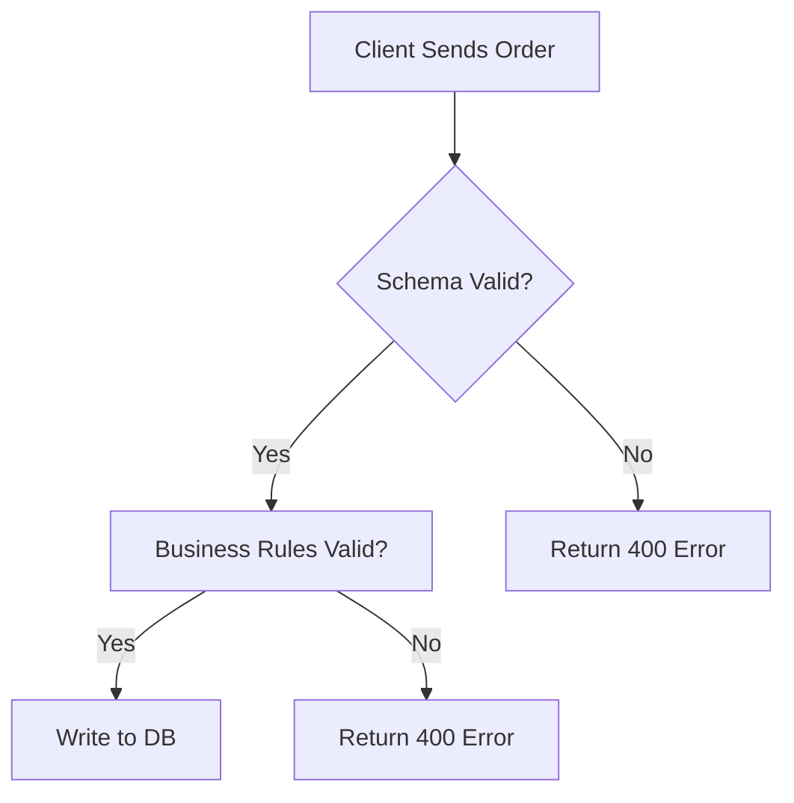

**[Pattern] Distributed Validation – Reference Guide**

---

### **Overview**
Distributed validation ensures data consistency across a microservices architecture by enforcing validation rules at multiple levels: **service boundaries**, **data ingestion**, and **query execution**. Unlike centralized validation, this pattern decentralizes validation logic, reducing bottlenecks and improving scalability.

Key benefits:
- **Decoupling**: Validation logic is embedded in services consuming or producing data.
- **Resilience**: Failures in one service don’t halt the entire system.
- **Performance**: Parallel validation reduces latency.
- **Flexibility**: Adapts to evolving data schemas without rigid schemas.

Distributed validation aligns with **API First** principles, where contract governance (OpenAPI/Swagger) defines validation rules shared across services. Common use cases include:
- Data pipelines (e.g., ETL systems)
- Event-driven architectures (e.g., Kafka streams)
- Real-time data processing (e.g., graph databases).

---

### **Key Concepts**
| **Term**               | **Definition**                                                                                                                                                                                                 |
|------------------------|-----------------------------------------------------------------------------------------------------------------------------------------------------------------------------------------------------------------|
| **Validation Layer**   | A logical separation where validation occurs (e.g., API gateway, service boundary, database layer).                                                                                                           |
| **Schema Registry**    | Centralized repository for data schemas (e.g., Avro, Protobuf) to define validation rules.                                                                                                                 |
| **Validation Policy**  | Predefined rules (e.g., regex, regex constraints, minimum/maximum values) applied to incoming/outgoing data.                                                                                           |
| **Retry Mechanism**    | Handles transient validation failures (e.g., exponential backoff) without cascading failures.                                                                                                        |
| **Idempotency Key**    | Ensures duplicate records aren’t reprocessed (e.g., UUID or transaction ID).                                                                                                                              |
| **Event Sourcing**     | Validation is applied to event payloads in a distributed event stream (e.g., Kafka, RabbitMQ).                                                                                                        |

---

### **Implementation Details**
#### **1. Validation Strategy by Layer**
| **Layer**          | **Scope**                          | **Validation Rules**                                                                                     | **Tools/Libraries**                                                                                     |
|--------------------|------------------------------------|---------------------------------------------------------------------------------------------------------|----------------------------------------------------------------------------------------------------------|
| **API Gateway**    | Incoming requests                  | Headers, query params, payload structure (e.g., JSON schema).                                          | OpenAPI, JSON Schema Validator, Kong/Apigee                                           |
| **Service Boundary**| Service inputs/outputs             | Business logic constraints (e.g., "price > 0").                                                      | Spring Validation, Express.js, gRPC                                         |
| **Database**       | Database writes/queries            | Domain-specific constraints (e.g., `NOT NULL`, foreign key references).                               | Database triggers, DDL constraints (PostgreSQL, MongoDB)                                       |
| **Event Stream**   | Event payloads                     | Schema compatibility (e.g., Avro schema evolution).                                                    | Kafka Schema Registry, Debezium                                                            |

#### **2. Validation Workflow**
1. **Request arrival**: Data enters the system (e.g., HTTP, message queue).
2. **Schema validation**: Compare payload against schema (e.g., using [JSON Schema](https://json-schema.org/)).
3. **Business rule validation**: Apply custom logic (e.g., "user age ≥ 18").
4. **Retry/fallback**: If validation fails, retry with backoff or send to dead-letter queue.
5. **Idempotent execution**: Ensure no duplicate processing.
6. **Audit logging**: Record validation outcomes for observability.

#### **3. Example: Validating an Order**


---

### **Schema Reference**
| **Field**          | **Type**       | **Description**                                                                                     | **Validation Rules**                                                                                     |
|--------------------|----------------|-------------------------------------------------------------------------------------------------|---------------------------------------------------------------------------------------------------------|
| `orderId`          | String (UUID)  | Unique identifier for the order.                                                                 | Required, `format: uuid`.                                                                        |
| `customerId`       | String         | Reference to user table.                                                                         | Required, exists in `users` table (foreign key check).                                           |
| `items`            | Array          | List of order line items.                                                                       | Min 1 item, max 100 items.                                                                         |
| `items[].productId`| String         | Reference to products table.                                                                   | Required, exists in `products` table.                                                             |
| `items[].quantity` | Integer        | Quantity of the product.                                                                       | Min 1, max 100.                                                                                      |
| `total`            | Decimal        | Calculated total price.                                                                         | `>= sum(item.price * item.quantity)`.                                                             |
| `timestamp`        | ISO 8601       | Order creation time.                                                                           | Required, `format: date-time`.                                                                     |

**Schema Example (JSON Schema):**
```json
{
  "$schema": "http://json-schema.org/draft-07/schema#",
  "type": "object",
  "properties": {
    "orderId": { "type": "string", "format": "uuid" },
    "customerId": {
      "type": "string",
      "pattern": "^[a-f0-9]{24}$"  // MongoDB ObjectId example
    },
    "items": {
      "type": "array",
      "minItems": 1,
      "maxItems": 100,
      "items": {
        "properties": {
          "productId": { "type": "string" },
          "quantity": { "type": "integer", "minimum": 1, "maximum": 100 }
        }
      }
    },
    "total": { "type": "number", "minimum": 0.01 }
  },
  "required": ["orderId", "customerId", "items", "total"]
}
```

---

### **Query Examples**
#### **1. Validating a Database Query (SQL)**
**Invalid Query (Missing Constraint):**
```sql
INSERT INTO orders (orderId, customerId, total)
VALUES ('550e8400-e29b-41d4-a716-446655440000', '5f0e8b8b8f0e8b8b8f0e8b8b', -100);
-- Fails: total must be > 0.
```

**Valid Query (With Check Constraint):**
```sql
-- Schema with constraint
CREATE TABLE orders (
  orderId UUID PRIMARY KEY,
  customerId VARCHAR(24) NOT NULL,
  total DECIMAL(10, 2) CHECK (total >= 0),
  FOREIGN KEY (customerId) REFERENCES users(id)
);

-- Valid insertion
INSERT INTO orders (orderId, customerId, total)
VALUES ('550e8400-e29b-41d4-a716-446655440000', '5f0e8b8b8f0e8b8b8f0e8b8b', 99.99);
```

#### **2. Validating an API Request (OpenAPI)**
**OpenAPI 3.0 Example:**
```yaml
paths:
  /orders:
    post:
      requestBody:
        required: true
        content:
          application/json:
            schema:
              $ref: '#/components/schemas/Order'
      responses:
        '400':
          description: Validation failed.
          content:
            application/json:
              schema:
                type: object
                properties:
                  errors:
                    type: array
                    items:
                      type: object
                      properties:
                        field: type: string
                        message: type: string
                example:
                  {
                    "errors": [
                      { "field": "total", "message": "must be ≥ 0" }
                    ]
                  }
```

**Request:**
```bash
curl -X POST http://api.example.com/orders \
  -H "Content-Type: application/json" \
  -d '{
    "orderId": "550e8400-e29b-41d4-a716-446655440000",
    "customerId": "5f0e8b8b8f0e8b8b8f0e8b8b",
    "items": [],
    "total": 99.99
  }'
```
**Response (Error):**
```json
{
  "errors": [
    { "field": "items", "message": "must have at least 1 item" }
  ]
}
```

#### **3. Validating an Event (Kafka)**
**Schema Registry (Avro):**
```json
{
  "type": "record",
  "name": "OrderEvent",
  "fields": [
    { "name": "orderId", "type": "string" },
    { "name": "customerId", "type": "string" },
    { "name": "status", "type": "string", "enum": ["CREATED", "COMPLETED"] },
    { "name": "timestamp", "type": "long" }
  ]
}
```

**Kafka Producer (Python):**
```python
from confluent_kafka import Producer
import json

config = {"bootstrap.servers": "kafka:9092"}
producer = Producer(config)

valid_event = {
    "orderId": "550e8400-e29b-41d4-a716-446655440000",
    "customerId": "5f0e8b8b8f0e8b8b8f0e8b8b",
    "status": "CREATED",
    "timestamp": 1625097600
}

producer.produce(
    topic="orders",
    value=json.dumps(valid_event),
    headers=[("content-type", "application/avro+json")]
)
producer.flush()
```

**Consumer Validation (Schema Registry Check):**
```python
from confluent_kafka.schema_registry import SchemaRegistryClient
from confluent_kafka.schema_registry.avro import AvroDeserializer

sr_client = SchemaRegistryClient({"url": "http://schema-registry:8081"})
deserializer = AvroDeserializer(sr_client)

for msg in consumer:
    try:
        event = deserializer(msg.value(), msg.headers)
        print(f"Valid event: {event}")
    except Exception as e:
        print(f"Validation failed: {e}")
```

---

### **Error Handling & Retries**
| **Scenario**               | **Action**                                                                                                                                                                                                 |
|----------------------------|-----------------------------------------------------------------------------------------------------------------------------------------------------------------------------------------------------------------|
| **Validation failure**     | Return HTTP `400 Bad Request` or reject the message (e.g., Kafka `REJECTED` status).                                                                                                                |
| **Transient failure**      | Implement exponential backoff (e.g., `retry: 3, backoff: 100ms`).                                                                                                                                    |
| **Schema mismatch**        | Use schema evolution strategies (e.g., backward-compatible changes) or reject incompatible payloads.                                                                                                   |
| **Duplicate processing**   | Use idempotency keys (e.g., `orderId`) to avoid reprocessing.                                                                                                                                       |
| **Audit logging**          | Log validation failures with metadata (e.g., timestamp, field, error code) for debugging.                                                                                                          |

**Example: Retry Policy (Spring Retry)**
```yaml
spring:
  retry:
    max-attempts: 3
    backoff:
      initial-interval: 1000
      multiplier: 2
      max-interval: 10000
```

---

### **Performance Considerations**
1. **Batch Validation**: Validate multiple records in a single call (e.g., bulk inserts).
2. **Async Validation**: Offload validation to a sidecar service (e.g., OpenTelemetry integration).
3. **Caching**: Cache schema definitions to avoid repeated lookups.
4. **Stream Processing**: Use tools like [Debezium](https://debezium.io/) for real-time validation in event streams.

---

### **Related Patterns**
| **Pattern**               | **Description**                                                                                                                                                                                                 | **Connection to Distributed Validation**                                                                                     |
|---------------------------|-------------------------------------------------------------------------------------------------------------------------------------------------------------------------------------------------------------|-------------------------------------------------------------------------------------------------------------------------------|
| **CQRS**                  | Separates read and write models.                                                                                                                                                                       | Validation rules can differ for reads vs. writes.                                                                             |
| **Event Sourcing**        | Stores state changes as immutable events.                                                                                                                                                         | Events must validate against schema before being persisted.                                                               |
| **API Gateway**           | Centralized entry point for services.                                                                                                                                                              | Can enforce global validation rules (e.g., rate limiting, payload size).                                               |
| **Schema Registry**       | Manages data schemas centrally.                                                                                                                                                              | Distributed validation relies on schema registry for consistency.                                                       |
| **Saga Pattern**          | Manages distributed transactions.                                                                                                                                                                | Validation can be part of compensating transactions (e.g., rollback on failure).                                         |
| **Idempotent Consumer**   | Ensures duplicate message processing.                                                                                                                                                         | Critical for retries in validation workflows.                                                                             |

---

### **Tools & Libraries**
| **Category**          | **Tools/Libraries**                                                                                                                                                     | **Use Case**                                                                                                          |
|-----------------------|----------------------------------------------------------------------------------------------------------------------------------------------------------------------|-----------------------------------------------------------------------------------------------------------------------|
| **Schema Validation** | [JSON Schema Validator](https://json-schema.org/implementations.html), [Avro](https://avro.apache.org/), [Protobuf](https://developers.google.com/protocol-buffers) | Define and enforce data contracts.                                                                             |
| **API Frameworks**    | [Spring Boot](https://spring.io/projects/spring-boot) (Validation), [Express.js](https://expressjs.com/) (Joi), [FastAPI](https://fastapi.tiangolo.com/) (Pydantic) | Validate API payloads.                                                                                               |
| **Event Streams**     | [Kafka](https://kafka.apache.org/), [RabbitMQ](https://www.rabbitmq.com/), [Apache Pulsar](https://pulsar.apache.org/) | Validate event payloads in real-time.                                                                              |
| **Database**          | [PostgreSQL](https://www.postgresql.org/) (Constraints), [MongoDB](https://www.mongodb.com/) (Schema Validation), [SQLAlchemy](https://www.sqlalchemy.org/) | Enforce validation at the database layer.                                                                         |
| **Observability**     | [OpenTelemetry](https://opentelemetry.io/), [Prometheus](https://prometheus.io/), [Grafana](https://grafana.com/) | Monitor validation failures.                                                                                      |
| **Testing**           | [Postman](https://www.postman.com/), [Karate](https://github.com/karatelabs/karate), [Testcontainers](https://www.testcontainers.org/) | Test validation scenarios.                                                                                          |

---
### **Anti-Patterns**
1. **Centralized Validation Bottleneck**: Validate all data through a single service (defeats the purpose of distributed systems).
2. **No Schema Evolution**: Freezing schemas prevents updates to validation rules.
3. **Silent Failures**: Ignoring validation errors (e.g., logging instead of rejecting payloads).
4. **Overly Complex Rules**: Embedding business logic in validation (separate validation from business logic).
5. **No Idempotency**: Retrying failed validations without deduplication leads to duplicate processing.

---
### **When to Use This Pattern**
- **Microservices Architecture**: Decoupled services need independent validation.
- **High Throughput**: Parallel validation improves scalability.
- **Event-Driven Systems**: Validating events before processing ensures data integrity.
- **Polyglot Persistence**: Different data stores require tailored validation rules.

---
### **When to Avoid This Pattern**
- **Monolithic Applications**: Centralized validation is simpler.
- **Low-Latency Requirements**: Distributed validation adds overhead.
- **Simple CRUD Systems**: Minimal validation needs (e.g., basic forms).

---
**Further Reading:**
- [JSON Schema Specification](https://json-schema.org/)
- [Kafka Schema Registry](https://kafka.apache.org/documentation/#schema_registry)
- [OpenAPI Specification](https://spec.openapis.org/)
- ["Distributed Systems" by Brendan Burns](https://www.oreilly.com/library/view/distributed-systems-with/9781492083040/) (Chapter on Consistency)