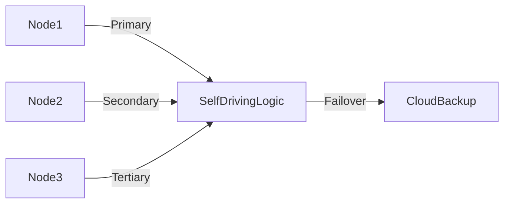

# **[Pattern] Edge Computing Patterns – Reference Guide**

---

## **1. Overview**
Edge Computing Patterns focus on distributing computational tasks closer to data sources (e.g., IoT devices, end-users, or local networks) to reduce latency, conserve bandwidth, and improve scalability. Unlike traditional cloud-centric architectures, edge computing processes data at the "edge" of the network (e.g., local servers, gateway devices, or fog layers) rather than sending it to centralized data centers.

This pattern breaks down **five key sub-patterns**:
1. **Device Processing** – Offloading simple computations directly to edge devices.
2. **Local Aggregation** – Collecting and preprocessing data at intermediate nodes (e.g., gateways) before sending to the cloud.
3. **Micro-Cloud** – Deploying lightweight cloud services at the edge (e.g., Kubernetes clusters in data centers or manufacturing plants).
4. **Bandwidth Optimization** – Filtering, compressing, or summarizing data at the edge to minimize cloud-bound traffic.
5. **Resilience Through Redundancy** – Distributing workloads across multiple edge nodes to ensure high availability.

**When to use this pattern:**
- Low-latency requirements (e.g., autonomous vehicles, AR/VR, real-time analytics).
- Bandwidth constraints (e.g., remote locations, IoT with limited connectivity).
- Regulatory compliance (e.g., processing sensitive data locally to meet GDPR or industry-specific rules).

---

## **2. Schema Reference**

| **Component**               | **Description**                                                                 | **Example Use Case**                          |
|-----------------------------|-------------------------------------------------------------------------------|-----------------------------------------------|
| **Edge Device**             | Low-powered hardware (e.g., Raspberry Pi, PLCs) performing local processing.   | Industrial sensors filtering noise before transmission. |
| **Gateway/Fog Node**        | Intermediate server aggregating or preprocessing data before cloud upload.   | Smart city cameras edge analytics for pedestrian counts. |
| **Micro-Cloud**             | Lightweight cloud environment (e.g., Kubernetes, Docker Swarm) running at the edge. | Factory floor ML inference for quality control. |
| **Local Database**          | Edge database (e.g., SQLite, Apache Cassandra Lightweight) for temporary storage. | IoT dashboards storing real-time sensor data locally. |
| **Data Filter/Reducer**     | Logic to exclude irrelevant data (e.g., thresholds, sampling).                  | Environmental sensors ignoring non-critical readings. |
| **Streaming Protocol**      | Real-time data transport (e.g., MQTT, WebSockets, Kafka).                    | Live video streaming with edge preprocessing. |
| **Fallback Mechanism**      | Rules for when to send data to the cloud (e.g., failure, threshold breaches).   | Edge device fails over to cloud if local processing fails. |
| **Security Layer**          | Local encryption, authentication (e.g., TLS, mutual TLS).                     | Edge devices in military or healthcare deployments. |

---

## **3. Query Examples**

### **3.1 Device Processing**
**Scenario:** A temperature sensor on a factory floor logs readings every second but only alerts if temperature exceeds 80°C.

```python
# Pseudocode for edge device filtering
while True:
    temp = read_sensor()
    if temp > 80:
        send_alert_to_cloud(temp)  # Only critical data sent
    time.sleep(1)
```

**Key Considerations:**
- Avoid sending raw data; apply logic locally.
- Use lightweight protocols (e.g., MQTT pub/sub) for notifications.

---

### **3.2 Local Aggregation**
**Scenario:** A smart grid gateway collects 1,000 data points per second from 100 homes but only forwards hourly averages to the cloud.

```sql
-- Example SQL query on edge gateway (Apache Cassandra Lightweight)
SELECT AVG(voltage), AVG(current), COUNT(*) AS samples
FROM home_meter_data
WHERE timestamp > now() - INTERVAL '1 hour'
GROUP BY home_id;
```

**Key Considerations:**
- Use time-series databases (e.g., InfluxDB) or aggregations to reduce volume.
- Batch uploads to minimize cloud costs.

---

### **3.3 Micro-Cloud Deployment**
**Scenario:** Deploy a lightweight Kubernetes cluster in a retail store for real-time inventory tracking.

```yaml
# Kubernetes Deployment (simplified)
apiVersion: apps/v1
kind: Deployment
metadata:
  name: inventory-tracker
spec:
  replicas: 3  # High availability at the edge
  template:
    spec:
      containers:
      - name: tracker
        image: edge-inventory-tracker:latest
        resources:
          limits:
            cpu: "1"
            memory: "512Mi"  # Edge-friendly constraints
```

**Key Considerations:**
- Use **edge-optimized** Kubernetes (e.g., K3s) for lower overhead.
- Deploy stateless services (e.g., API gateways) to scale horizontally.

---

### **3.4 Bandwidth Optimization**
**Scenario:** A drone records 4K video but transmits only key frames to the cloud.

```python
# Pseudocode for frame selection
def transmit_frames(video_stream):
    for frame in video_stream:
        if is_frame_key(frame):  # Detect motion or changes
            compress(frame)       # H.265 encoding
            upload_to_cloud(frame)
```

**Key Considerations:**
- Use **adaptive bitrate streaming** (e.g., DASH) for variable conditions.
- Leverage **edge acceleration** (e.g., Intel OpenVINO for ML inference).

---

### **3.5 Resilience Through Redundancy**
**Scenario:** A self-driving car’s edge cluster replicates critical tasks across 3 nodes.



**Key Considerations:**
- Implement **quorum-based consensus** (e.g., Raft) for state synchronization.
- Use **geographically distributed edge locations** for global redundancy.

---

## **4. Implementation Best Practices**

| **Practice**               | **Detail**                                                                                     | **Tools/Frameworks**                          |
|----------------------------|-----------------------------------------------------------------------------------------------|-----------------------------------------------|
| **Modular Design**         | Decouple edge logic (e.g., use microservices).                                                | Spring Cloud, gRPC                            |
| **Resource Constraints**   | Optimize for CPU/memory (e.g., avoid heavy frameworks).                                      | Go, Rust, Docker lightweight images          |
| **Security by Default**    | Encrypt data in transit/rest (TLS 1.3) and at rest (AES-256).                                | OpenSSL, HashiCorp Vault                     |
| **Observability**          | Local logging (e.g., ELK Stack Lite) and metrics (Prometheus).                                | Grafana, Telegraf                             |
| **Fallback Strategies**    | Define rules for cloud handoff (e.g., "If edge fails for >5s, retry").                         | Custom scripts, Kafka consumer retries         |
| **Standardized Protocols** | Use industry standards (e.g., OPC UA for IoT, LoRaWAN for LPWAN).                          | Eclipse IoT, AWS Greengrass                    |

---

## **5. Related Patterns**

| **Related Pattern**         | **Description**                                                                                     | **When to Pair With Edge Computing**               |
|-----------------------------|---------------------------------------------------------------------------------------------------|---------------------------------------------------|
| **Serverless Edge**         | Run stateless functions at the edge (e.g., AWS Lambda@Edge, Azure Edge Functions).               | Event-driven processing (e.g., IoT triggers).    |
| **Hybrid Cloud**            | Balance workloads between edge and cloud based on cost/performance.                              | Dynamic scaling for unpredictable traffic.      |
| **Data Mesh**               | Decentralize data ownership and governance across edge domains.                                   | Multi-tenant edge deployments (e.g., smart cities). |
| **Real-Time Analytics**     | Process streaming data at the edge (e.g., Apache Flink on Kubernetes).                          | Fraud detection, anomaly monitoring.             |
| **Circuit Breaker**         | Isolate edge failures from central systems to maintain availability.                              | Critical infrastructure (e.g., healthcare).     |

---

## **6. Common Pitfalls & Mitigations**

| **Pitfall**                  | **Risk**                                                                                         | **Mitigation**                                  |
|------------------------------|-------------------------------------------------------------------------------------------------|-------------------------------------------------|
| **Overloading Edge Nodes**   | High CPU/memory usage crashes local processing.                                                 | Profile workloads; use lightweight runtimes.    |
| **Data Consistency**         | Edge-cloud divergence due to async updates.                                                     | Implement eventual consistency or CRDTs.         |
| **Security Gaps**            | Weak encryption or unpatched edge devices.                                                      | Automated patching (e.g., AWS Systems Manager). |
| **Vendor Lock-in**           | Proprietary edge platforms limit portability.                                                  | Use open standards (e.g., ONNX for ML).         |
| **Cost Overruns**            | Unpredictable cloud/edge costs due to traffic spikes.                                            | Set up quotas and auto-scaling policies.         |

---
**Further Reading:**
- [Edge Computing for Dummies (TechRepublic)](https://www.techrepublic.com)
- [Gartner Hype Cycle for Edge Computing](https://www.gartner.com)
- [NVIDIA Edge Computing Framework](https://developer.nvidia.com/edge)