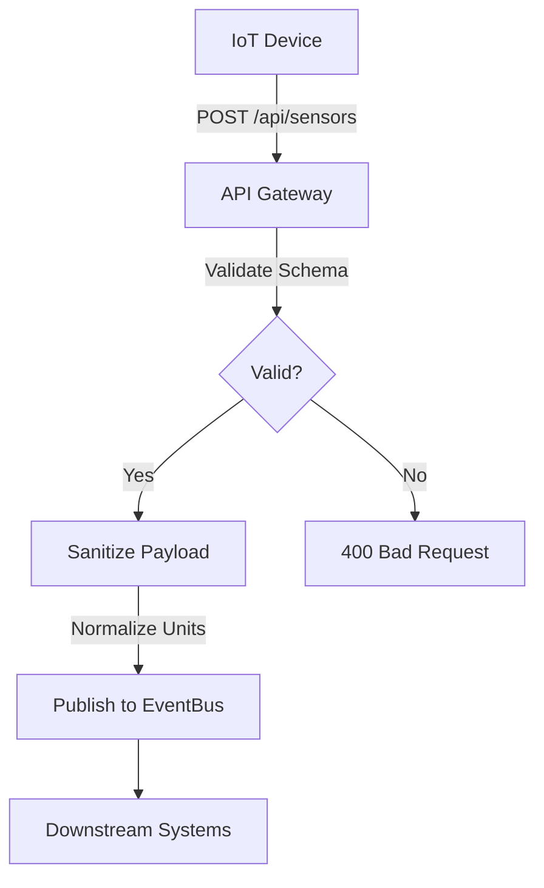

# **[Pattern] Edge Maintenance Reference Guide**

---

## **Overview**
The **Edge Maintenance** pattern ensures clean, consistent data at the network edge—where client requests meet infrastructure services—through automated mechanisms like **validation, sanitization, and normalization** before processing. By enforcing rules at ingestion (e.g., API gateways, service meshes, or CDNs), this pattern prevents downstream inconsistencies, reduces data corruption, and minimizes operational overhead. It’s critical for systems handling high-throughput, heterogeneous, or untrusted data sources (e.g., IoT devices, third-party APIs, or user-generated content).

Unlike traditional ETL pipelines (which process data in bulk), **Edge Maintenance** operates in real-time, acting as a first line of defense. It’s often paired with **Data Governance** and **Event Sourcing** patterns to ensure long-term integrity.

---

## **Key Concepts**
| Concept               | Definition                                                                                     | Example Use Case                                                                 |
|-----------------------|-------------------------------------------------------------------------------------------------|----------------------------------------------------------------------------------|
| **Validation**        | Rules to confirm data adheres to schemas/constraints (e.g., format, range, presence).          | Rejecting malformed JSON payloads from a sensor API.                             |
| **Sanitization**      | Removing or escaping harmful/invalid characters (e.g., SQL injection vectors, UTF-8 mismatches). | Stripping `<script>` tags from user comments.                                        |
| **Normalization**     | Standardizing formats (e.g., timestamps, units, case).                                      | Converting "2023-12-01T00:00:00Z" to ISO 8601 in all APIs.                         |
| **Dynamic Rules**     | Rules that adapt based on context (e.g., tenant-specific policies, traffic patterns).          | Blocking a country’s IPs during peak traffic if their API quota is exceeded.     |
| **Audit Logging**     | Recording edge-maintenance events for observability (e.g., rejections, transformations).       | Logging when a temperature sensor’s value exceeds ±3σ from its median.           |

---

## **Implementation Details**
### **1. Architecture Components**
| Component                | Purpose                                                                                     | Tools/Libraries                                                                 |
|--------------------------|---------------------------------------------------------------------------------------------|-------------------------------------------------------------------------------|
| **Ingress Layer**        | Intercepts data at the edge (API gateways, load balancers, or CDNs).                      | Kong, AWS API Gateway, Cloudflare Workers, Envoy.                               |
| **Validation Engine**    | Applies rules (schema, regex, business logic) before acceptance.                            | JSON Schema, OpenAPI, Apache Drools, custom Lambda functions.                  |
| **Sanitization Layer**   | Cleanses data for security/consistency (e.g., XSS, encoding).                              | OWASP ESAPI, DOMPurify, custom regex filters.                                  |
| **Normalization Module** | Transforms data into a consistent format (e.g., units, timestamps).                       | Apache NiFi, AWS Lambda, custom ETL pipelines.                                |
| **Observability**        | Logs, metrics, and alerts for edge-maintenance events.                                     | Prometheus, ELK Stack, Datadog, custom telemetry.                              |

---
### **2. Data Flow**
```
[Client] → [Ingress Layer: API Gateway]
    ↓ (Validation: Schema/Regex)
[Sanitization: Remove `<script>` tags]
    ↓ (Normalization: UTC timestamps)
[EventBus: Publish to Topic] → [Downstream Systems]
```

---
### **3. Schema Reference**
#### **Core Fields**
| Field               | Type          | Required | Description                                                                                     | Example Values                     |
|---------------------|---------------|----------|-------------------------------------------------------------------------------------------------|------------------------------------|
| `event_type`        | String        | Yes      | Categorizes the edge-maintenance action (e.g., `"validation_failure"`, `"sanitization"`).      | `"validation_failure"`             |
| `resource`          | String        | Yes      | Identifier of the processed resource (e.g., API path, IoT device ID).                          | `/api/sensors/12345`               |
| `operation`         | String        | Yes      | Type of maintenance (see below).                                                            | `"reject"`, `"transform"`           |
| `original_data`     | JSON          | Yes      | Raw input data before processing.                                                             | `{"temp": "25°C", "unit": "F"}`    |
| `processed_data`    | JSON          | No       | Output after edge-maintenance (omitted on rejection).                                        | `{"temp": 297.65, "unit": "K"}`    |
| `rule_id`           | String        | Yes      | Unique identifier for the applied rule (e.g., `"temperature_range_001"`).                     | `"temperature_range_001"`           |
| `rule_context`      | Object        | No       | Metadata about the rule (e.g., tenant ID, dynamic thresholds).                              | `{"tenant": "acme", "threshold": 30}`|
| `timestamp`         | ISO 8601      | Yes      | When the edge-maintenance occurred.                                                          | `"2023-12-01T14:30:00Z"`          |

---
#### **Operation Types**
| Operation       | Description                                                                                 | Example Rule                                       |
|-----------------|---------------------------------------------------------------------------------------------|----------------------------------------------------|
| `reject`        | Data is invalid and discarded.                                                             | `{"temp": "invalid"}` → Rejected with `400 Bad Request`. |
| `transform`     | Data is modified to comply with standards.                                                 | `"25°C"` → Normalized to `298.15 K`.                |
| `warn`          | Data is accepted but flagged as potentially problematic.                                   | `"temp": -50` → Warned (below `rule_context.threshold`). |
| `pass`          | No action taken (data complies).                                                           | `"temp": "20°C"` → Passed.                         |

---
### **4. Query Examples**
#### **Find All Rejected Events for a Sensor API**
```sql
SELECT *
FROM edge_maintenance_events
WHERE resource = '/api/sensors/*'
  AND operation = 'reject'
  AND timestamp > '2023-12-01T00:00:00Z';
```

#### **Count Transformations for Temperature Data**
```sql
SELECT rule_id, COUNT(*)
FROM edge_maintenance_events
WHERE processed_data->>'unit' = 'K'
  AND operation = 'transform'
GROUP BY rule_id;
```

#### **Gauge Sanitization Failures by Tenant**
```sql
SELECT rule_context->>'tenant', COUNT(*)
FROM edge_maintenance_events
WHERE operation = 'warn'
  AND resource LIKE '%user_comments%'
GROUP BY rule_context->>'tenant';
```

---

## **Implementation Steps**
### **1. Define Rules**
- **Validation**: Use JSON Schema for structural checks or regex for string formats.
  ```json
  // Example schema for a temperature sensor
  {
    "$schema": "http://json-schema.org/draft-07/schema#",
    "type": "object",
    "properties": {
      "temp": { "type": "number", "minimum": -273.15 },
      "unit": { "enum": ["C", "F", "K"] }
    },
    "required": ["temp", "unit"]
  }
  ```
- **Sanitization**: Whitelist allowed characters or use libraries like `DOMPurify` for HTML.
  ```javascript
  // Sanitize a user comment
  const cleanText = DOMPurify.sanitize(rawInput);
  ```
- **Normalization**: Apply transformations via ETL tools (e.g., Apache NiFi) or Lambda functions.
  ```python
  def normalize_temp(data):
      temp = data["temp"]
      if data["unit"] == "F":
          return {"temp": (temp - 32) * 5/9, "unit": "C"}
      return data
  ```

### **2. Deploy Ingress Layer**
- **API Gateway**: Configure request validation (e.g., AWS API Gateway with OpenAPI 3.0).
- **Service Mesh**: Use Envoy filters to validate/gate traffic.
- **CDN**: Deploy edge functions (e.g., Cloudflare Workers) to pre-process requests.

### **3. Integrate Observability**
- **Logging**: Stream edge-maintenance events to a central log hub (e.g., ELK, Datadog).
- **Metrics**: Track rejection rates, transformation latency, or rule violations.
  ```promql
  # Rate of rejected requests per minute
  rate(edge_maintenance_events[1m])
    [operation="reject"]
  ```

### **4. Handle Dynamic Rules**
- Use a config service (e.g., Consul, Kubernetes ConfigMaps) to update rules at runtime.
- Example: Adjust temperature thresholds by region during extreme weather.

---
## **Error Handling**
| Error Type               | Handling Strategy                                                                                     | Example Response                                                                 |
|--------------------------|-----------------------------------------------------------------------------------------------------|----------------------------------------------------------------------------------|
| **Schema Violation**     | Reject with `400 Bad Request` and include the failed field.                                         | `{"error": "Bad Request", "details": {"temp": "must be >= -273.15"}}`            |
| **Sanitization Failure** | Reject with `400 Bad Request` and sanitization status.                                               | `{"error": "Malformed content", "status": "sanitization_failed"}`                |
| **Rule Context Mismatch**| Reject or downgrade to `warn` if the data is acceptable but non-compliant.                         | `{"warning": "Temperature outside allowed range for your tenant"}`                |
| **System Overload**      | Queue or throttle requests with `429 Too Many Requests`.                                           | `{"error": "Service Unavailable", "retry-after": 30}`                            |

---

## **Query Examples (Expanded)**
### **Advanced: Correlation with Downstream Events**
Link edge-maintenance events to business outcomes (e.g., failed transactions):
```sql
WITH edge_events AS (
  SELECT *
  FROM edge_maintenance_events
  WHERE resource = '/api/transactions/123'
    AND operation = 'reject'
    AND timestamp BETWEEN '2023-12-01' AND '2023-12-02'
)
SELECT e.*, t.*
FROM edge_events e
JOIN transactions t ON e.resource = CONCAT('/api/transactions/', t.id);
```

### **Anomaly Detection**
Flag unexpected patterns (e.g., sudden spike in rejections):
```sql
SELECT
  rule_id,
  DATE_TRUNC('hour', timestamp) AS hour,
  COUNT(*) AS rejection_count
FROM edge_maintenance_events
WHERE operation = 'reject'
GROUP BY rule_id, hour
HAVING COUNT(*) > AVG(COUNT(*)) OVER (PARTITION BY rule_id) * 10;
```

---
## **Related Patterns**
| Pattern                     | Relationship to Edge Maintenance                                                                 | When to Combine                                                                 |
|-----------------------------|------------------------------------------------------------------------------------------------|----------------------------------------------------------------------------------|
| **Data Governance**         | Edge Maintenance enforces governance rules at ingestion; Governance defines the rules.           | Use together for comprehensive data policies.                                    |
| **Event Sourcing**          | Edge Maintenance validates/sanitizes events before they’re appended to an event log.             | Critical for immutable logs (e.g., financial transactions).                      |
| **Circuit Breaker**         | Edge Maintenance detects anomalous traffic; Circuit Breaker protects downstream systems.       | Deploy both to handle cascading failures from invalid data.                        |
| **Canary Releases**         | Edge Maintenance validates canary traffic before full rollout.                                    | Test new rules in a canary to avoid widespread disruptions.                       |
| **Schema Registry**         | Provides the schemas used in Edge Maintenance validation.                                         | Sync schemas dynamically for API versioning.                                     |

---
## **Anti-Patterns**
1. **Over-Sanitization**:
   - *Problem*: Stripping all HTML (e.g., `<em>` tags) breaks valid content.
   - *Fix*: Use whitelist-based sanitization (e.g., `DOMPurify` with allowed tags).

2. **Static Rules**:
   - *Problem*: Hard-coded thresholds fail in dynamic environments (e.g., seasonal temperature ranges).
   - *Fix*: Use dynamic rule sources (e.g., config maps, ML models).

3. **Silent Failures**:
   - *Problem*: Logging only failures omits the majority of valid data.
   - *Fix*: Log *all* edge-maintenance events (passes/warns/rejects).

4. **Performance Bottlenecks**:
   - *Problem*: Complex validation/sanitization slows ingress.
   - *Fix*: Offload to edge servers (e.g., Cloudflare Workers) or async processing.

---
## **Tools & Libraries**
| Category               | Tools                                                                 |
|------------------------|-----------------------------------------------------------------------|
| **Validation**         | JSON Schema, OpenAPI, Apache Drools, ZSchema.                         |
| **Sanitization**       | OWASP ESAPI, DOMPurify, HTML Purifier, custom regex.                  |
| **Normalization**      | Apache NiFi, AWS Lambda, Python `pandas`, custom ETL.               |
| **Observability**      | Prometheus, ELK Stack, Datadog, OpenTelemetry.                      |
| **Ingress**            | Kong, AWS API Gateway, Cloudflare Workers, Envoy.                   |
| **Config Management**  | Consul, Kubernetes ConfigMaps, HashiCorp Vault.                     |

---
## **Performance Considerations**
- **Latency**: Edge Maintenance should add <100ms overhead. Use lightweight validators (e.g., JSON Schema over SQL).
- **Throughput**: Scale validation engines horizontally (e.g., Kubernetes pods per rule).
- **Cold Starts**: For serverless (e.g., AWS Lambda), pre-warm functions or use provisioned concurrency.

---
## **Example: IoT Sensor Data Pipeline**


**Rules Applied**:
1. Schema: `temp` must be a number ≥ -273.15.
2. Sanitization: Strip non-numeric prefixes (e.g., `"temp: 25"` → `25`).
3. Normalization: Convert `C`/`F` to Kelvin.

---
## **Conclusion**
The **Edge Maintenance** pattern minimizes data corruption by acting as a real-time filter at network ingress. By combining **validation**, **sanitization**, and **normalization**, it ensures consistency before data reaches downstream systems. Integrate it with **Data Governance** for policy enforcement and **Observability** for monitoring.

**Key Takeaways**:
- Prioritize **performance** (low-latency rules) and **scalability** (horizontal scaling).
- Use **dynamic rules** for adaptability (e.g., tenant-specific policies).
- Log **all** edge-maintenance events for auditability.