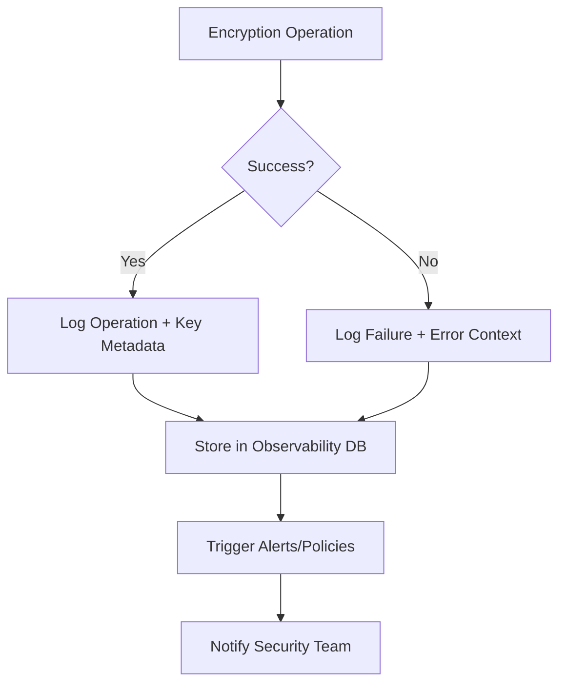

### **Overview**
Encryption Observability refers to the ability to monitor, trace, and audit encryption-related activities (e.g., key generation, decryption failures, policy compliance) across systems. It ensures transparency in encryption operations, detects anomalies, and validates compliance with security policies (e.g., FIPS 140-2, GDPR). This pattern complements encryption practices by documenting key metadata, logging events, and providing dashboards for security teams. Key challenges include balancing observability with performance overhead and ensuring encrypted logs aren’t compromised. Use cases include:
- **Compliance audits:** Tracking key lifecycle and access.
- **Incident response:** Identifying decryption failures or unauthorized key rotations.
- **Anomaly detection:** Flagging unusual decryption attempts or key revocations.

---

### **Schema Reference**
Below are core components for tracking encryption observability. Implement as structured logs, database tables, or time-series data.

| **Component**               | **Description**                                                                 | **Example Fields**                                                                                     | **Data Type**                     |
|-----------------------------|-------------------------------------------------------------------------------|--------------------------------------------------------------------------------------------------------|-----------------------------------|
| **Key Metadata**            | Metadata for encryption keys (e.g., creation, rotation, revocation).          | `key_id`, `algorithm`, `key_size`, `status`, `created_at`, `expires_at`, `owner`, `purpose` (e.g., "TLS"). | UUID, string, timestamp, enum      |
| **Operation Logs**          | Audit trail of encryption/decryption operations.                            | `operation_type` (e.g., "encrypt", "decrypt"), `status` (e.g., "success", "failed"), `duration_ms`, `user_agent`, `source_system`. | string, timestamp, numeric, string |
| **Policy Violations**       | Records of policy breaches (e.g., key reuse, weak algorithms).               | `violation_type`, `severity`, `affected_key_id`, `suggested_action`, `remediation_status`.          | enum, string, UUID, action        |
| **Performance Metrics**     | Latency, throughput, and resource usage for encryption operations.          | `operation`, `latency_p99`, `throughput_ops_sec`, `cpu_usage`.                                       | numeric, duration                 |
| **Compliance Events**       | Events tied to compliance checks (e.g., FIPS validation, key audits).        | `check_type`, `result` (e.g., "pass", "fail"), `check_timestamp`, `auditor`.                           | enum, timestamp, string           |
| **Key Access Logs**         | Track who accessed encrypted data (e.g., via KMS or HSM).                     | `accessor`, `key_id`, `access_type` (e.g., "decrypt", "list_keys"), `ip_address`, `timestamp`.        | string, UUID, enum, IP             |
| **Key Derivation Logs**     | Logs for key derivation/cryptographic operations.                             | `derivation_algorithm`, `input_data_hash`, `output_key_id`, `salt_used`, `iteration_count`.         | string, hash, UUID, numeric       |

---
**Note:** For production, extend with context-specific fields (e.g., `data_classification` for PII data).

---

### **Implementation Details**
#### **1. Key Concepts**
- **Encryption Context:** Include metadata like `data_sensitivity` (e.g., "PII") or `system_of_record` to correlate logs with business logic.
- **Event Correlation:** Use traces (e.g., distributed tracing IDs) to link encryption operations to application flows.
- **Confidentiality:** Ensure logs are encrypted at rest and in transit (e.g., using TLS). Avoid logging raw keys or plaintext secrets.
- **Retention Policies:** Comply with regulations (e.g., GDPR’s right to erasure) by purging sensitive logs after a defined period.

#### **2. Data Collection**
- **Sources:**
  - **KMS/HSM APIs:** Log key operations (e.g., AWS KMS `CreateKey` events).
  - **Application Code:** Instrument encryption libraries (e.g., OpenSSL, libsodium) to emit structured logs.
  - **Network Proxies:** Capture TLS handshake metadata (e.g., `ClientHello` cipher suites).
- **Tools:**
  - **Observability Stack:** Combine OpenTelemetry, Prometheus (metrics), and Loki/Grafana (logs).
  - **SIEM:** Forward logs to Splunk/Secura for alerting (e.g., on `decrypt_failure`).

#### **3. Schematic Workflow**


#### **4. Example Tools**
| **Tool**          | **Use Case**                                  |
|--------------------|---------------------------------------------|
| **OpenTelemetry**  | Standardize traces/logs from heterogeneous sources. |
| **Prometheus**     | Track encryption latencies/metrics.          |
| **AWS CloudTrail** | Audit KMS/HSM operations in AWS.            |
| **HashiCorp Vault** | Log dynamic secrets issuance.               |

---

### **Query Examples**
Use these queries to analyze encryption observability data in tools like **Grafana/Loki** or **SQL databases**.

#### **1. Key Rotation Activity (Last 30 Days)**
```sql
SELECT
    COUNT(*) as rotations,
    DATE_TRUNC('day', created_at) as day
FROM key_metadata
WHERE action = 'rotate' AND created_at > NOW() - INTERVAL '30 days'
GROUP BY day
ORDER BY day;
```
**Output:**
| day         | rotations |
|-------------|-----------|
| 2023-11-01  | 42        |

---

#### **2. Failed Decryption Attempts by Source System**
```sql
SELECT
    source_system,
    COUNT(*) as failures,
    SUM(duration_ms) as avg_latency_ms
FROM operation_logs
WHERE operation_type = 'decrypt' AND status = 'failed'
GROUP BY source_system
ORDER BY failures DESC;
```
**Output:**
| source_system | failures | avg_latency_ms |
|----------------|-----------|----------------|
| `payment-gateway` | 12       | 850            |

---

#### **3. Policy Violations for Weak Algorithms (Last 7 Days)**
```sql
SELECT
    violation_type,
    COUNT(*) as occurrences,
    MAX(check_timestamp) as last_occurrence
FROM policy_violations
WHERE check_timestamp > NOW() - INTERVAL '7 days'
  AND violation_type IN ('weak_algorithm', 'key_reuse')
GROUP BY violation_type;
```
**Output:**
| violation_type  | occurrences | last_occurrence |
|------------------|-------------|-----------------|
| weak_algorithm   | 5           | 2023-11-10      |

---

#### **4. TLS Handshake Cipher Suite Distribution (Metric Query)**
*(Prometheus example for OpenTelemetry data)*
```promql
histogram_quantile(0.95, rate(tls_handshake_latency_bucket[5m]))
by (cipher_suite)
```
**Output (Grafana):**
- **AEAD_CHACHA20_POLY1305**: 95th percentile = 22ms
- **TLS_ECDHE_RSA_WITH_AES_256_GCM_SHA384**: 95th percentile = 18ms

---

#### **5. Compliance Audit: Key Expiry Alerts**
```sql
SELECT
    key_id,
    expires_at,
    EXTRACT(EPOCH FROM (expires_at - NOW())) as days_until_expiry
FROM key_metadata
WHERE expires_at < NOW() + INTERVAL '30 days'
  AND expires_at > NOW()
ORDER BY days_until_expiry ASC
LIMIT 10;
```
**Output:**
| key_id         | expires_at       | days_until_expiry |
|----------------|------------------|--------------------|
| `kms-abc123`   | 2023-11-15       | 5                  |

---

### **Related Patterns**
1. **Centralized Logging**
   - *Why?* Aggregates encryption logs for unified querying.
   - *Tools:* ELK Stack, Datadog.

2. **Distributed Tracing**
   - *Why?* Correlates encryption operations with application flows (e.g., tracing a `decrypt` call in a microservice).
   - *Tools:* Jaeger, OpenTelemetry.

3. **Key Rotation Strategy**
   - *Why?* Observability depends on accurate key metadata (e.g., `expires_at`).
   - *Pattern:* [Key Rotation](https://docs.aws.amazon.com/kms/latest/developerguide/rotate-keys.html).

4. **Secure Logging**
   - *Why?* Logs about encryption must be protected.
   - *Pattern:* [Secure Logging Patterns](https://www.oreilly.com/library/view/data-driven-security/9781492042523/ch09.html).

5. **Policy as Code**
   - *Why?* Enforce encryption policies (e.g., "block keys older than 90 days") via observability alerts.
   - *Tools:* OPA/Gatekeeper, AWS IAM Policies.

---
### **Anti-Patterns to Avoid**
- **Logging Raw Keys:** Never store or log unhashed keys.
- **Ignoring Performance:** Frequent key operations can slow down systems; monitor throughput.
- **Silent Failures:** Ensure `decrypt_failure` events are logged and alerted, not silently discarded.
- **Over-Logging:** Balance granularity (e.g., log key metadata but not every cipher block).

---
### **Further Reading**
- [NIST SP 800-53 Rev 5: Security Observability](https://csrc.nist.gov/publications/detail/sp/800-53/rev-5/final).
- [OpenTelemetry Encryption Instrumentation](https://opentelemetry.io/docs/instrumentation/).
- [CIS Benchmarks for KMS/HSM](https://www.cisecurity.org/benchmark/).