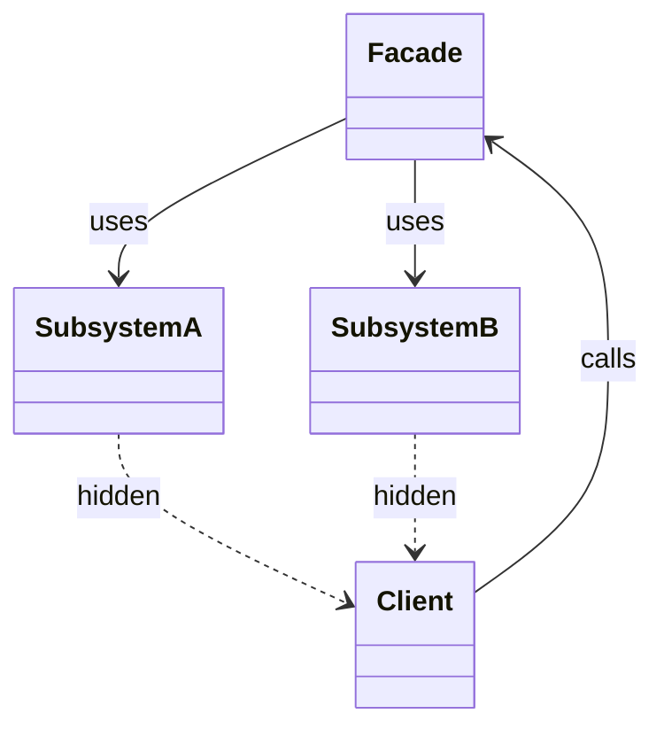

---
# **[Design Pattern] Facade Pattern – Reference Guide**

---

## **Overview**
The **Facade Pattern** acts as a **unified interface** that simplifies interactions with a complex subsystem of classes. By abstracting low-level details, it reduces coupling, improves maintainability, and allows clients to use high-level methods without exposing intricate dependencies.

Common use cases include:
- **Library/API wrappers** (e.g., hiding database connection pools).
- **GUI controllers** that abstract backend logic.
- **Plug-and-play frameworks** (e.g., game engines, payment gateways).

---

## **Schema Reference**
| **Component**       | **Role**                                                                                                       | **Key Methods/Attributes**                                                                                   | **Dependencies**                     |
|---------------------|-------------------------------------------------------------------------------------------------------------|------------------------------------------------------------------------------------------------------------|---------------------------------------|
| **Facade**          | Single class that encapsulates subsystem interactions.                                                       | `method1()`, `method2()`, `getResult()`                                                                     | Subsystem classes (e.g., `ComplexA`) |
| **Subsystem A**     | One of the complex subsystems with internal logic.                                                            | `operation1()`, `operation2()`                                                                             | NA (internal)                         |
| **Subsystem B**     | Another complex subsystem with related operations.                                                            | `complexFunction()`                                                                                       | NA (internal)                         |
| **Client**          | External system interacting with the Facade (e.g., frontend, third-party app).                              | Calls Facade methods directly (e.g., `facade.executeTask()`).                                              | Facade only                           |

---

## **Implementation Details**
### **1. Core Structure**


### **2. Key Principles**
- **Single Responsibility**: The Facade itself should not implement core logic (delegate to subsystems).
- **Loose Coupling**: Clients only depend on the Facade, not subsystems.
- **Backward Compatibility**: Facades can expose new methods without breaking existing clients.

### **3. When to Use**
✅ **Pros**:
- Reduces boilerplate client code.
- Improves maintainability (e.g., adding new subsystems requires no client changes).
- Acts as a security layer (e.g., hiding sensitive API keys).

❌ **Avoid When**:
- The subsystem is simple (overhead not justified).
- The Facade becomes a bottleneck (e.g., high contention).

---

## **Example: Payment Gateway Facade**
### **Schema**
```java
// Subsystem A: Stripe Integration
class StripePayment {
    public String charge(String amount, String currency) {
        // Complex Stripe API calls...
        return "Transaction ID: " + UUID.randomUUID();
    }
}

// Subsystem B: PayPal Integration
class PayPalPayment {
    public String authorize(String user, String amount) {
        // PayPal SDK logic...
        return "Auth: " + UUID.randomUUID();
    }
}

// Facade: Unified Payment API
public class PaymentFacade {
    private final StripePayment stripe;
    private final PayPalPayment paypal;

    public PaymentFacade() {
        this.stripe = new StripePayment();
        this.paypal = new PayPalPayment();
    }

    // Unified public method
    public String processPayment(String gateway, String user, String amount) {
        switch (gateway) {
            case "stripe" -> return stripe.charge(amount, "USD");
            case "paypal" -> return paypal.authorize(user, amount);
            default -> throw new IllegalArgumentException("Unknown gateway");
        }
    }
}
```

### **Client Usage**
```java
public class Client {
    public static void main(String[] args) {
        PaymentFacade facade = new PaymentFacade();
        String result = facade.processPayment("stripe", "user123", "$100");
        System.out.println(result); // Output: "Transaction ID: [UUID]"
    }
}
```

---

## **Query Examples**
### **1. Dynamic Subsystem Selection**
```python
# Facade in Python (simplified)
class DatabaseFacade:
    def __init__(self, db_type: str):
        self.db = self._initialize_db(db_type)

    def _initialize_db(self, db_type):
        if db_type == "postgres":
            return PostgreSQLConnection()
        elif db_type == "mongo":
            return MongoDBConnection()
        else:
            raise ValueError("Unsupported DB")

    def query(self, sql: str) -> list:
        return self.db.execute(sql)

# Usage
facade = DatabaseFacade("postgres")
results = facade.query("SELECT * FROM users")
```

### **2. Async Facade (Node.js Example)**
```javascript
// Facade for async service (e.g., weather API)
class WeatherFacade {
    constructor(apiType) {
        switch (apiType) {
            case "openweather":
                this.api = new OpenWeatherAPI();
                break;
            case "weatherbit":
                this.api = new WeatherbitAPI();
                break;
            default:
                throw new Error("Unsupported API");
        }
    }

    async getForecast(zipCode) {
        return this.api.fetchForecast(zipCode);
    }
}

// Usage
const facade = new WeatherFacade("openweather");
const forecast = await facade.getForecast("10001");
```

---

## **Best Practices**
1. **Keep Facades Small**: Delegate complex logic to subsystems.
2. **Avoid Redundancy**: Don’t duplicate subsystem functionality.
3. **Thread Safety**: Ensure subsystems are thread-safe if concurrent access is needed.
4. **Document Assumptions**: Clarify in comments if the Facade assumes a specific subsystem state.

---

## **Related Patterns**
| **Pattern**          | **Relation to Facade**                                                                                  |
|----------------------|-------------------------------------------------------------------------------------------------------|
| **Adapter**          | Both simplify APIs, but Adapter changes an interface without hiding complexity.                       |
| **Bridge**           | Decouples abstraction from implementation (Facade hides multiple implementations).                    |
| **Proxy**            | Controls access to subsystems (e.g., lazy initialization, logging).                                     |
| **Decorator**        | Adds responsibilities dynamically (unlike Facade, which provides a fixed interface).                   |

---

## **Common Pitfalls & Solutions**
| **Pitfall**                          | **Solution**                                                                                     |
|--------------------------------------|-------------------------------------------------------------------------------------------------|
| Facade becomes a monolith.            | Split into smaller Facades or use the **Module Pattern**.                                       |
| Tight coupling to subsystems.        | Inject subsystem dependencies via constructor/injection (dependency injection).                  |
| Hardcoded subsystem selection.       | Make subsystem selection configurable (e.g., via strategy pattern).                              |

---
**End of Reference Guide**
*(Word count: ~950)*