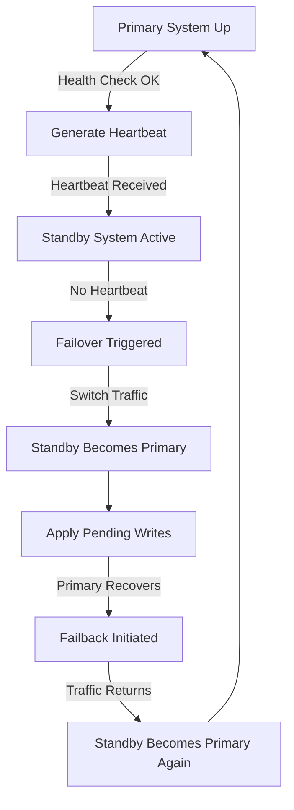

# **[Pattern] Failover & Failback Patterns – Reference Guide**

---

## **1. Overview**
The **Failover & Failback** pattern ensures high availability by automatically detecting and recovering from system failures, minimizing downtime, and preventing cascading outages. **Failover** switches traffic from a failing primary system to a standby (backup) system, while **Failback** returns traffic to the primary once it’s restored.

### **Key Objectives:**
✔ **Automatic Recovery** – Minimize manual intervention during failures.
✔ **Minimal Downtime** – Switch to backup systems seamlessly.
✔ **Data Consistency** – Ensure no data loss during failover/failback.
✔ **Load Balancing** – Distribute traffic evenly across active systems.

### **When to Use:**
✅ Critical applications (e.g., finance, healthcare).
✅ Distributed systems with redundant components.
✅ Environments requiring **High Availability (HA)** and **Disaster Recovery (DR)**.

❌ **Avoid** when:
- Manual recovery is feasible (e.g., low-impact systems).
- Redundancy is not available or cost-effective.

---

## **2. Key Concepts & Implementation Details**

### **2.1 Failover Mechanisms**
| **Mechanism**       | **Description**                                                                 | **Pros**                          | **Cons**                          |
|----------------------|-------------------------------------------------------------------------------|-----------------------------------|-----------------------------------|
| **Active-Passive**   | Standby system remains idle until failover occurs.                           | Low overhead, simple to manage.  | Single point of failure (standby). |
| **Active-Active**    | Multiple systems handle traffic simultaneously; failover switches load.     | High throughput, no single bottleneck. | Complex synchronization.          |
| **Manual Failover**  | Admin-triggered failover (not automated).                                   | Granular control.                | Slower recovery.                  |
| **Automated Failover** | Hardware/software detects failure and triggers failover.                     | Fast recovery.                   | Requires monitoring tools.        |

### **2.2 Failback Strategies**
| **Strategy**         | **Description**                                                                 | **Use Case**                     |
|----------------------|-------------------------------------------------------------------------------|----------------------------------|
| **Automatic Failback** | System detects primary recovery and switches traffic back.                   | Critical systems (e.g., databases). |
| **Manual Failback**   | Admin-initiated after verifying primary system health.                       | Complex validation required.     |
| **Scheduled Failback** | Failback occurs at a predefined time (e.g., maintenance window).             | Non-critical systems.           |
| **Condition-Based Failback** | Failback triggered by specific health metrics (e.g., CPU < 30%).           | Dynamic workloads.               |

### **2.3 Failure Detection Methods**
| **Method**           | **How It Works**                                                                 | **Pros**                          | **Cons**                          |
|----------------------|-------------------------------------------------------------------------------|-----------------------------------|-----------------------------------|
| **Heartbeat Monitoring** | Primary sends periodic signals to standby; failure detected if signal stops. | Simple, reliable.                | Requires network connectivity.     |
| **Health Checks**    | API/endpoint polls system health (e.g., HTTP 200/500 status).                | Flexible, works for web apps.    | Network latency impacts response. |
| **Distributed Locks** | Uses consensus algorithms (e.g., ZooKeeper, etcd) to detect leader failure.  | Scalable for distributed systems. | Complex setup.                    |
| **Replication Lag**   | Monitors lag in data replication between primary and standby.               | Detects partial failures.        | Requires strong replication.      |

### **2.4 Data Synchronization During Failover**
- **Synchronous Replication** (Strong consistency):
  - Standby waits for primary acknowledgment before applying changes.
  - **Pros:** Data consistency guaranteed.
  - **Cons:** Higher latency, potential bottleneck.

- **Asynchronous Replication** (Eventual consistency):
  - Standby applies changes after a delay.
  - **Pros:** Higher throughput.
  - **Cons:** Risk of data loss if failover occurs before replication.

- **Quorum-Based Replication** (Federated systems):
  - Requires a majority of nodes to agree on writes.
  - Example: Apache Cassandra, etcd.

### **2.5 Failback Challenges & Mitigations**
| **Challenge**               | **Mitigation**                                                                 |
|-----------------------------|-------------------------------------------------------------------------------|
| **Data Drift**              | Use **conflict-free replicated data types (CRDTs)** or **last-write-wins (LWW)** policies. |
| **Double-Spending**         | Implement **two-phase commit (2PC)** or **saga pattern** for transactions.    |
| **Performance Degradation** | Test failback under load; use **canary failback** (gradual rollback).           |
| **Zombie Instances**        | Auto-terminate failed primary after failback (e.g., Kubernetes liveness probes). |

---

## **3. Schema Reference**

### **3.1 Failover/Failback System Components**
| **Component**            | **Description**                                                                 | **Example Tools/Technologies**                     |
|--------------------------|-------------------------------------------------------------------------------|---------------------------------------------------|
| **Primary System**       | Active service handling requests.                                             | Databases (PostgreSQL, MySQL), APIs, Microservices |
| **Standby System**       | Backup system ready to take over.                                             | Read replicas, clustered databases.                |
| **Monitoring Agent**     | Detects failures (e.g., heartbeats, health checks).                         | Prometheus, Nagios, custom scripts.                |
| **Orchestrator**         | Manages failover/failback logic (e.g., Kubernetes, Consul).                 | Kubernetes `PodDisruptionBudget`, AWS Auto Scaling.|
| **Load Balancer**        | Routes traffic to active systems.                                             | NGINX, AWS ALB, HAProxy.                           |
| **Configuration Manager**| Synchronizes config across systems (e.g., for dynamic failover rules).         | etcd, ZooKeeper, HashiCorp Consul.                 |

---

### **3.2 Example Schema for Failover Workflow**


---

## **4. Query Examples**

### **4.1 Detecting Failover in a Database Cluster**
**Scenario:** PostgreSQL asynchronous replication failure detection.

**Check primary lag:**
```sql
SELECT pg_is_in_recovery(), pg_last_wal_receive_lsn(), pg_last_wal_replay_lsn();
-- If lag > threshold (e.g., 1MB), trigger failover.
```

**Use `pg_autofailover` (PostgreSQL extension):**
```sql
CREATE EXTENSION pg_autofailover;
SELECT pgaf_suggest_failover();
```

---

### **4.2 Automated Failover in Kubernetes**
**Deploy a StatefulSet with Pod Disruption Budget (PDB):**
```yaml
apiVersion: policy/v1
kind: PodDisruptionBudget
metadata:
  name: postgres-pdb
spec:
  minAvailable: 1  # Ensures at least 1 pod remains running
  selector:
    matchLabels:
      app: postgres
```

**Use a Liveness Probe to trigger failover:**
```yaml
livenessProbe:
  exec:
    command: ["pg_isready", "-U", "postgres"]
  initialDelaySeconds: 30
  periodSeconds: 10
```

---

### **4.3 Failback in a Microservice (Spring Boot + Resilience4j)**
**Configure Retry for Failback:**
```java
@Retry(
    name = "failbackRetry",
    maxAttempts = 3,
    delay = 5,
    delayUnit = ChronoUnit.SECONDS
)
public void failbackPrimary() {
    if (isPrimaryHealthy()) {
        loadBalancer.switchToPrimary();
    }
}
```

**Health Check Endpoint:**
```java
@GetMapping("/health")
public ResponseEntity<String> healthCheck() {
    if (healthService.isHealthy()) {
        return ResponseEntity.ok("UP");
    } else {
        return ResponseEntity.status(503).body("DOWN");
    }
}
```

---

## **5. Related Patterns**

| **Pattern**               | **Description**                                                                 | **When to Combine**                          |
|---------------------------|-------------------------------------------------------------------------------|-----------------------------------------------|
| **[Circuit Breaker](https://refactoring.guru/design-patterns/circuit-breaker)** | Prevents cascading failures by stopping requests to a failing service.       | Use failover for **fallback** while CB limits traffic. |
| **[Saga Pattern](https://microservices.io/patterns/data/saga.html)**           | Manages distributed transactions across services.                          | Failover should **retry** or **compensate** sagas. |
| **[Bulkhead Pattern](https://refactoring.guru/design-patterns/bulkhead)**       | Isolates failures by limiting concurrent requests to a service.              | Combine with failover to **isolate** impacted components. |
| **[Retry Pattern](https://refactoring.guru/design-patterns/retry)**            | Automatically retries failed operations (e.g., after failback).               | Useful for **temporary failures** during recovery. |
| **[Leader Election](https://martinfowler.com/eaaCatalog/leaderElection.html)**| Elects a primary node in distributed systems.                               | Critical for **active-active failover**.       |
| **[Database Sharding](https://refactoring.guru/design-patterns/sharding)**     | Distributes data across multiple database instances.                        | Failover can **promote** a shard to primary.   |

---

## **6. Best Practices**
1. **Test Failover/Failback Regularly**
   - Simulate failures in staging to validate recovery.
   - Use tools like **Chaos Engineering (Gremlin, LitmusChaos)**.

2. **Minimize Data Loss**
   - Use **synchronous replication** for critical data.
   - Implement **write-ahead logging (WAL)** for durability.

3. **Avoid Overhead**
   - **Active-Passive** for low-traffic systems.
   - **Active-Active** only if consistent hashing/sync is feasible.

4. **Monitor Failover Events**
   - Log failover/failback timestamps, duration, and affected traffic.
   - Tools: **ELK Stack, Datadog, New Relic**.

5. **Document Recovery Procedures**
   - Clearly define **failover triggers**, **failback criteria**, and **roll-back plans**.

6. **Leverage Automation**
   - Use **Infrastructure as Code (IaC)** (Terraform, Ansible) for consistent deployments.
   - Example:
     ```hcl
     # Terraform: Auto-scaling group with failover
     resource "aws_autoscaling_group" "app_asg" {
       launch_template {
         id      = aws_launch_template.app.id
         version = "$Latest"
       }
       min_size         = 2
       max_size         = 5
       health_check_type = "ELB"
       tag {
         key   = "failover-priority"
         value = "high"
       }
     }
     ```

7. **Handle Split-Brain Scenarios**
   - Use **quorum-based consensus** (e.g., Raft, Paxos) to avoid conflicting primary/standby.

---

## **7. Anti-Patterns to Avoid**
| **Anti-Pattern**               | **Risk**                                                                       | **Solution**                                    |
|---------------------------------|-------------------------------------------------------------------------------|-------------------------------------------------|
| **No Health Checks**            | Failures go unnoticed; prolonged downtime.                                   | Implement **liveness/readiness probes**.         |
| **No Automatic Failback**        | Manual intervention delays recovery.                                          | Use **auto-heal mechanisms** (e.g., Kubernetes HPA). |
| **Synchronous Replication Only**| High latency, potential bottlenecks.                                          | Use **asynchronous + snapshot replication**.    |
| **Ignoring Data Drift**         | Failback causes inconsistencies (e.g., double-spends).                        | Use **conflict resolution strategies**.         |
| **Over-Reliance on Manual Failover** | Human error leads to outages.                                                | Automate with **orchestration tools**.          |

---

## **8. Further Reading**
- **"Site Reliability Engineering" (Google SRE Book)** – Covers HA best practices.
- **"Designing Data-Intensive Applications" (Martin Kleppmann)** – Deep dive into replication.
- **AWS Well-Architected Failover Guide**: [AWS Failover Best Practices](https://aws.amazon.com/architecture/well-architected/failover/)
- **Kubernetes Failover Docs**: [Kubernetes High Availability](https://kubernetes.io/docs/concepts/architecture/high-availability/)

---
**Last Updated:** [Date]
**Contributors:** [List of authors/maintainers]