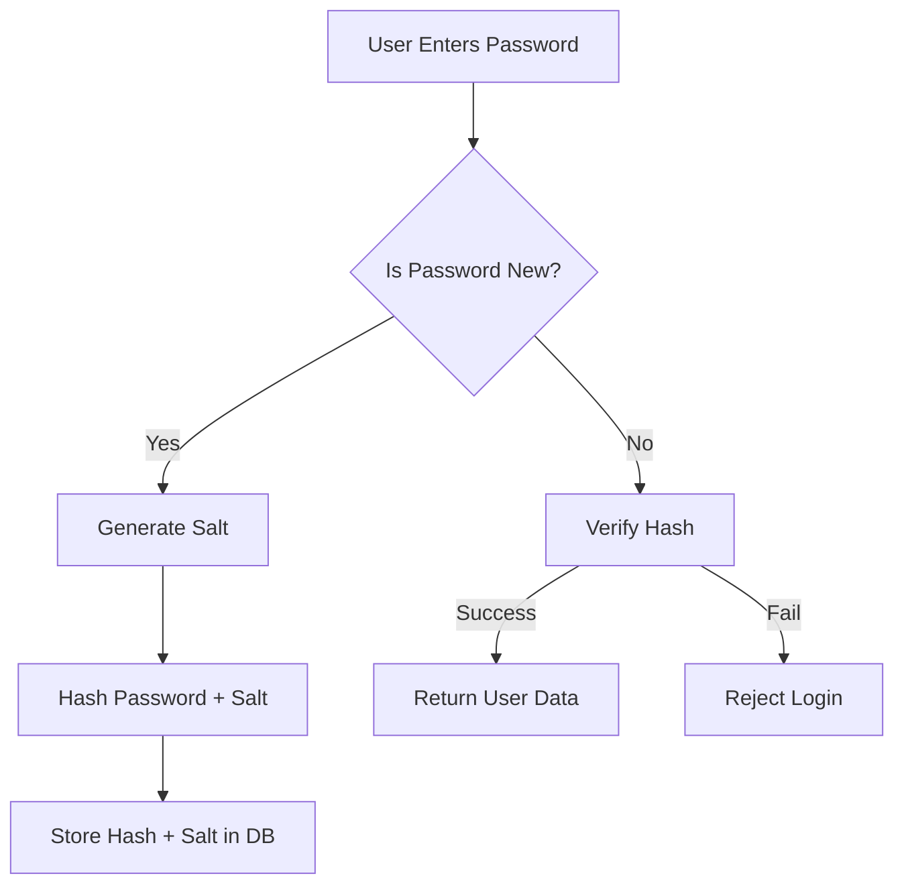

# **[Pattern] Hashing Conventions Reference Guide**

---

## **Overview**
Hashing conventions ensure consistent, predictable, and reversible (or irreversible, as needed) encoding of data to minimize collisions and optimize performance. This guide outlines standard practices for implementing hashing patterns in systems, defining key concepts, schema requirements, query methods, and integration with related design patterns.

---

## **Key Concepts**
### **Core Principles**
1. **Purpose**: Hashing transforms data into a fixed-size string (hash) for:
   - **Data deduplication** (e.g., caching, databases)
   - **Security** (password hashing, cryptographic checks)
   - **Efficient lookup** (indexing, partitioning)
   - **Data integrity** (checksums)

2. **Deterministic Output**: The same input always produces the same hash.
3. **One-Way vs. Two-Way Hashing**:
   - **One-Way**: Irreversible (e.g., password hashing with salt).
   - **Two-Way**: Reversible (e.g., HMAC for HMAC-SHA-256).

4. **Collision Resistance**: High-quality hashes minimize false positives.
5. **Salting**: Adds randomness to prevent rainbow table attacks (critical for passwords).

---

## **Implementation Details**
### **1. Hashing Algorithms**
| **Algorithm**       | **Use Case**                          | **Security Level** | **Output Bit Length** | **Notes**                          |
|---------------------|---------------------------------------|--------------------|-----------------------|------------------------------------|
| **SHA-256**         | General-purpose hashing               | High               | 256                   | Standard for security-sensitive data. |
| **SHA-512**         | High-security hashing                 | Very High          | 512                   | Slower but more collision-resistant. |
| **MD5**             | Legacy systems (not recommended)      | Low                | 128                   | Avoid for security.                |
| **BCrypt**          | Password hashing                      | Very High          | Configurable          | Adjusts computational cost (work factor). |
| **PBKDF2**          | Password hashing                      | High               | Configurable          | Combines hashing with key derivation. |
| **Argon2**          | Modern password storage (slow)         | Very High          | Configurable          | Memory-hard, resistant to GPU attacks. |
| **xxHash**          | Fast non-cryptographic hashing        | Low                | Configurable          | Optimized for speed (e.g., databases). |
| **FNV-1a**          | Simple, fast hashing                  | Low                | Configurable          | Used in programming languages.     |

---

### **2. Salting**
- **Why**: Prevents precomputed attacks (rainbow tables).
- **Implementation**:
  - Generate a **cryptographically secure** salt (e.g., 16+ bytes).
  - Store salt alongside the hash (never reuse salts for identical inputs).
  - Example (Python):
    ```python
    import os, hashlib
    salt = os.urandom(16)  # 16-byte salt
    hashed = hashlib.sha256(password + salt).hexdigest()
    ```

---

### **3. Hashing Strategies**
| **Strategy**               | **Example**                          | **When to Use**                          |
|----------------------------|---------------------------------------|------------------------------------------|
| **Simple Hashing**         | `SHA-256(data)`                       | Non-sensitive data (e.g., content IDs).  |
| **Salted Hashing**         | `SHA-256(password + salt)`            | Passwords, sensitive PII.                |
| **Key-Derived Hashing**    | `PBKDF2(password, salt, 100000)`      | High-security passwords.                 |
| **HMAC-Hashing**           | `HMAC-SHA256(key, data)`              | Authentication/authorization.           |
| **Checksum Hashing**       | `CRC32(file)`                         | Data integrity (not security).           |

---

## **Schema Reference**
### **Database Schema for Hashing**
| **Field**       | **Type**          | **Description**                                  | **Example**                          |
|-----------------|-------------------|--------------------------------------------------|--------------------------------------|
| `data`          | `TEXT`            | Original input to hash.                          | `"user123"`                          |
| `hash_algorithm`| `ENUM` (`sha256`, `bcrypt`, ...)| Algorithm used.                              | `"bcrypt"`                           |
| `hash_value`    | `VARCHAR(255)`    | Generated hash of `data`.                         | `"$2y$12$..."` (bcrypt)              |
| `salt`          | `VARCHAR(64)`     | Random salt used (if applicable).               | `"a1b2c3d4..."`                      |
| `hash_version`  | `INT`             | Version of the hashing method (for backward compatibility). | `1` |

**Example Table:**
```sql
CREATE TABLE hashed_data (
    id INT AUTO_INCREMENT PRIMARY KEY,
    data TEXT NOT NULL,
    hash_algorithm ENUM('sha256', 'bcrypt', 'argon2') NOT NULL,
    hash_value VARCHAR(255) NOT NULL,
    salt VARCHAR(64),
    hash_version INT DEFAULT 1,
    created_at TIMESTAMP DEFAULT CURRENT_TIMESTAMP
);
```

---

## **Query Examples**
### **1. Inserting a Hash (Salted)**
```sql
-- Insert a password hash with salt
INSERT INTO hashed_data
(data, hash_algorithm, hash_value, salt)
VALUES
('user123', 'bcrypt', '$2y$12$N9qo8uLObvXWx...', 'a1b2c3d4e5f6...');
```

### **2. Verifying a Hash**
#### **Using Application Logic (Pseudocode)**
```python
# Pseudocode for bcrypt verification
if bcrypt.checkpw(input_password, stored_hash_value):
    print("Authentication successful")
else:
    print("Authentication failed")
```

#### **SQL Query (For Indexed Lookup)**
```sql
-- Find a user by hashed password (do NOT store plaintext hashes)
SELECT user_id FROM users
WHERE hash_algorithm = 'bcrypt' AND hash_value = '$2y$12$...';
```
> **Note**: Avoid querying against raw hashes directly. Use application logic to verify hashes.

---

### **3. Updating Hash Algorithms**
```sql
-- Migrate old SHA-256 hashes to bcrypt
UPDATE hashed_data
SET hash_algorithm = 'bcrypt',
    hash_value = bcrypt_hash(data, random_salt()),
    hash_version = 2
WHERE hash_algorithm = 'sha256';
```

---

## **Performance Considerations**
| **Operation**       | **Algorithm**       | **Time Complexity** | **Notes**                          |
|---------------------|---------------------|---------------------|------------------------------------|
| **Hashing**         | SHA-256             | O(1)                | Fast but not resistant to brute force. |
|                     | BCrypt/PBKDF2       | O(n)                | Slower; increases security via work factor. |
| **Lookup**          | Any                | O(1)                | Use indexed hash fields.           |
| **Collision Check** | SHA-256             | O(1)                | Rare for 256-bit outputs.          |

**Optimizations:**
- **Indexing**: Add indexes on `hash_value` for faster lookups.
- **Batch Processing**: Hash data in parallel (e.g., using threads).
- **Caching**: Store frequently hashed data (e.g., static strings).

---

## **Security Best Practices**
1. **Never store plaintext passwords** or sensitive data as hashes without encryption.
2. **Use strong algorithms** (avoid MD5/SHA-1 for security).
3. **Salt every hash** (especially for passwords).
4. **Adjust work factors**:
   - BCrypt: `cost=12` (adjust based on hardware).
   - Argon2: Configure `memory=64MB`, `iterations=3`.
5. **Key rotation**: Periodically update hashes (e.g., for high-risk data).
6. **Rate limiting**: Prevent brute-force attacks on verification endpoints.

---

## **Related Patterns**
| **Pattern**               | **Description**                                                                 | **When to Use Together**                          |
|---------------------------|-------------------------------------------------------------------------------|---------------------------------------------------|
| **[Password Storage]**    | Secure storage of user credentials with hashing/salting.                    | Always pair with hashing conventions.             |
| **[Cryptographic Signatures]** | Digital signatures for data integrity/authentication.              | Use HMAC or ECDSA alongside hashes.             |
| **[Data Deduplication]**  | Eliminate duplicate data using hashes (e.g., in databases).               | For non-sensitive data (e.g., logs, content).    |
| **[Tokenization]**        | Replace sensitive data with non-sensitive tokens.                          | Use hashes for tokens (e.g., JWT hashing).       |
| **[Rate Limiting]**       | Throttle hash verification requests to prevent brute-force attacks.       | Critical for password/log-in systems.             |
| **[Key Derivation (KDF)]** | Securely derive cryptographic keys (e.g., PBKDF2, Argon2).                   | For key-based hashing (e.g., API keys).           |

---

## **Troubleshooting**
| **Issue**                     | **Root Cause**                          | **Solution**                                      |
|-------------------------------|----------------------------------------|---------------------------------------------------|
| **Slow hashing**              | High work factor (e.g., Argon2 with 10M iterations). | Reduce iterations or use xxHash for non-security hashing. |
| **False collisions**          | Weak algorithm (e.g., MD5).            | Upgrade to SHA-256 or SHA-512.                     |
| **Salting mismatches**        | Salt not stored or mismanaged.        | Ensure salt is persisted and used consistently.    |
| **Hash verification failures**| Incorrect salt or algorithm used.      | Verify the hash was generated/verified identically. |
| **Database bloat**            | Storing long hashes (e.g., bcrypt).    | Consider truncating hashes after verification.    |

---

## **Example: Full Password Flow**


**Code Snippet (Python - BCrypt):**
```python
import bcrypt

# Hashing
password = b"user123"
salt = bcrypt.gensalt()
hashed = bcrypt.hashpw(password, salt)

# Verification
if bcrypt.checkpw(b"user123", hashed):
    print("Login successful")
```

---
## **Further Reading**
- [OWASP Password Storage Cheat Sheet](https://cheatsheetseries.owasp.org/cheatsheets/Password_Storage_Cheat_Sheet.html)
- [NIST SP 800-63B](https://pages.nist.gov/800-63-3/sp800-63b.html) (Password Guidelines)
- [Argon2 Documentation](https://argondocs.com/)