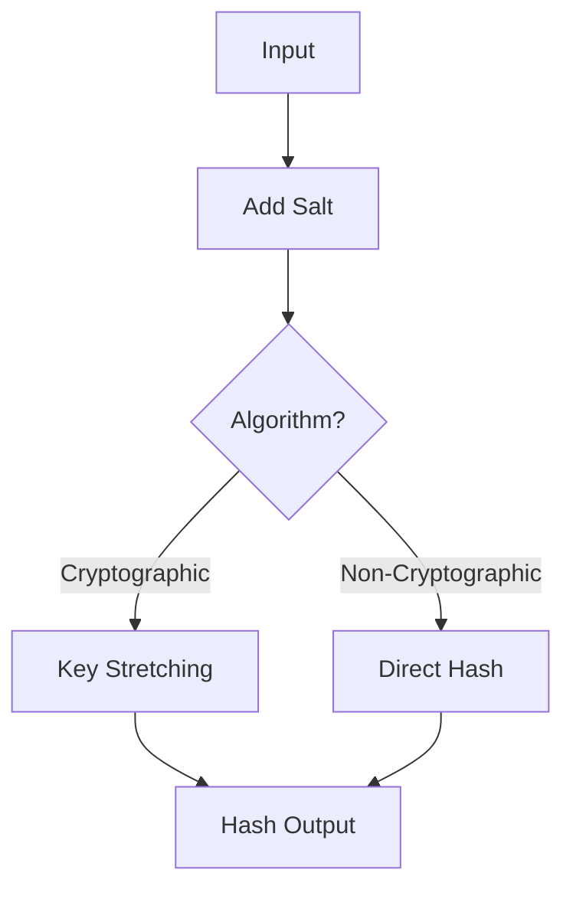

**[Pattern] Hashing Gotchas Reference Guide**

---

### **Overview**
Hashing is a foundational cryptographic and data integrity technique, but its implementation often leads to critical vulnerabilities if not handled carefully. This guide outlines common pitfalls (**"hashing gotchas"**)—such as collision attacks, insufficient salt application, chained hashes, or misconfigured algorithms—that can compromise security, performance, or data validation. Understanding these risks ensures robust hashing in authentication, checksums, password storage, and data deduplication.

---

## **Key Concepts & Implementation Details**

### **1. Common Hashing Gotchas**
| **Gotcha**               | **Risk**                                                                 | **Mitigation**                                                                                     |
|--------------------------|--------------------------------------------------------------------------|---------------------------------------------------------------------------------------------------|
| **Collision Attacks**     | Two distinct inputs produce the same hash (e.g., MD5, SHA-1).           | Use cryptographic hashes (SHA-256, SHA-3) or salted hashes.                                        |
| **No Salt (Rainbow Tables)** | Predetermined hashes (rainbow tables) crack unsalted passwords.       | Always apply unique salts (e.g., pepper + salt) to passwords.                                      |
| **Weak/Single-Hash Chaining** | Sequential hashing (e.g., `SHA-256(SHA-256(input))`) weakens security. | Use dedicated algorithms like bcrypt, Argon2, or PBKDF2 with configurable iterations.             |
| **Algorithm Misuse**     | Hashing sensitive data with non-cryptographic algorithms (e.g., XXHash). | Reserve cryptographic hashes (SHA-3, BLAKE3) for security-critical use.                           |
| **Fixed-Length Outputs**  | Hashes may truncate on storage, increasing collision risk.             | Store full-length hashes (e.g., 256-bit SHA-256).                                                 |
| **Key Stretching Skipped** | Fast hashes (e.g., MD5) are vulnerable to brute-force attacks.         | Use key-derivation functions (e.g., PBKDF2, scrypt) with high iteration counts.                   |
| **Hashing Large Files**   | Full-file hashing is inefficient for comparisons (e.g., checksums).    | Use incremental hashing or rolling hashes (e.g., xxHash) for large files.                       |
| **Hardcoded Secrets**     | Storing hashes of secrets (e.g., API keys) without protection.         | Encrypt secrets with a master key; never hash them directly.                                      |
| **Non-Deterministic Hashing** | Randomness (e.g., `Cryptogen`) breaks consistency.                      | Use deterministic algorithms (e.g., SHA-256) for consistent outputs.                               |

---

### **2. Schema Reference**
#### **Hashing Configuration Schema**
```json
{
  "algorithm": {
    "type": "string",
    "enum": ["SHA-256", "SHA-3", "BLAKE3", "bcrypt", "Argon2", "PBKDF2"],
    "description": "Target hashing algorithm (cryptographic only for security)."
  },
  "salt": {
    "type": "object",
    "properties": {
      "length": {
        "type": "integer",
        "minimum": 16,
        "description": "Salt length in bytes (minimum 16 bytes for bcrypt/Argon2)."
      },
      "source": {
        "type": "string",
        "enum": ["random", "pepper", "environment"],
        "description": "Salt source (e.g., random bytes, static pepper)."
      }
    }
  },
  "iterations": {
    "type": "integer",
    "minimum": 1,
    "description": "Key-stretching iterations (e.g., 100000+ for bcrypt)."
  },
  "output_length": {
    "type": "integer",
    "minimum": 32,
    "description": "Hash output length in bits (e.g., 256 for SHA-256)."
  }
}
```

#### **Password Hashing Workflow**


---

## **Query Examples**

### **1. Generating a Secure Password Hash**
**Input:**
- Password: `"SecurePass123!"`
- Algorithm: `bcrypt`
- Salt: Random 16-byte salt
- Iterations: `100000`

**Output (JSON):**
```json
{
  "algorithm": "bcrypt",
  "salt": "b3RwZXJzZXNzaW9uX2xhc3RuZXI=",
  "hash": "$2a$10$N9qo8uLOMy7Z2Z5ZY3bXFOQ5JT3aX...",
  "iterations": 100000
}
```

**Code Snippet (Python):**
```python
import bcrypt

password = b"SecurePass123!"
salt = bcrypt.gensalt(rounds=10)
hashed = bcrypt.hashpw(password, salt)
print(f"{hashed.decode()}")  # $2a$10$N9qo8uLOMy7Z2Z5ZY3bXFOQ5JT3aX...
```

---

### **2. Detecting Collisions**
**Scenario:**
Compare two hashes using SHA-256 to verify no collisions exist in a database.

**Query:**
```sql
SELECT COUNT(*)
FROM users
WHERE SHA256(password_hash, 256) = SHA256('target_hash', 256);
-- Result: 0 (no collision)
```

**Code Snippet (JavaScript):**
```javascript
const crypto = require('crypto');

const hash1 = crypto.createHash('sha256').update('input1').digest('hex');
const hash2 = crypto.createHash('sha256').update('input2').digest('hex');

console.log(hash1 === hash2); // false (collision check)
```

---

### **3. Hashing Large Files Incrementally**
**Use Case:**
Compute a checksum of a 1GB file without loading it entirely into memory.

**Command (Linux):**
```bash
sha256sum --binary largefile.dat | xxd -r -p | sha256sum
```

**Code Snippet (Python):**
```python
import hashlib

def incremental_hash(file_path):
    sha256 = hashlib.sha256()
    with open(file_path, "rb") as f:
        for chunk in iter(lambda: f.read(4096), b""):
            sha256.update(chunk)
    return sha256.hexdigest()
```

---

## **Validation Rules**
| **Rule**                          | **Description**                                                                 |
|-----------------------------------|---------------------------------------------------------------------------------|
| **Password Hashes**               | Must use bcrypt/Argon2 with ≥16-byte salts and ≥100,000 iterations.            |
| **Non-Password Data**             | Use SHA-3 or BLAKE3 for cryptographic integrity (e.g., blockchain hashes).     |
| **File Checksums**                | Prefer xxHash for speed; SHA-256 for security.                                  |
| **Algorithm Deprecation**         | Avoid SHA-1, MD5, and non-KDF hashes for new systems.                          |

---

## **Related Patterns**
1. **Password Storage Best Practices**
   - Patterns: [Password Hashing with Bcrypt](), [Key Derivation Functions]().
2. **Data Integrity**
   - Patterns: [Digital Signatures](), [HMAC Validation]().
3. **Performance-Optimized Hashing**
   - Patterns: [Rolling Hashes](), [Incremental Hashing]().
4. **Security Audits**
   - Patterns: [Hash Collision Testing](), [Side-Channel Attack Mitigation]().

---
**Note:** Always refer to [OWASP Hashing Cheat Sheet](https://cheatsheetseries.owasp.org/cheatsheets/Hashing_Cheatsheet.html) for updates.