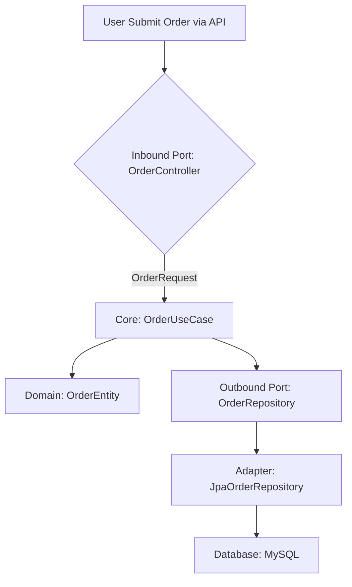

# **[Pattern] Hexagonal Architecture Reference Guide**

---

## **1. Overview**
Hexagonal Architecture (also called **Ports and Adapters** or **Clean Architecture**) is a software design pattern that **separates business logic from external frameworks, databases, or UI concerns**. By treating business logic as an isolated core, this pattern enhances **testability, flexibility, and maintainability** while reducing dependency on external systems.

The key idea is to structure code around **use cases** (business rules) rather than technical concerns (e.g., databases, APIs). Business logic is placed in the **inner core**, while **adapters** (ports) connect external systems to this core. This enables:
- **Loose coupling** between components
- **Easier testing** (mocking external dependencies)
- **Technology-agnostic** business logic
- **Simplified refactoring** due to clear separation

---

## **2. Core Concepts**

### **2.1. Key Components**
| **Component**       | **Description**                                                                 | **Example**                          |
|---------------------|---------------------------------------------------------------------------------|--------------------------------------|
| **Core Domain**     | Contains **business logic** and **entities** (pure, testable code).           | `OrderService`, `ProductCollection`   |
| **Use Cases**       | Define **how** business logic is applied (e.g., `PlaceOrder`, `CancelOrder`).  | `OrderUseCase`                      |
| **Ports (Interfaces)** | Abstract interfaces for external interactions (inbound/outbound).            | `OrderRepository`, `PaymentGateway`  |
| **Adapters**        | Implement ports to connect to external systems (e.g., databases, APIs).         | `JpaOrderRepository`, `StripePayment`|
| **Frameworks/Drivers** | External systems (e.g., Spring, Hibernate, REST clients).                     | `SpringBootApplication`, `MySQL`      |

---

### **2.2. Ports and Adapters Classification**
Hexagonal Architecture distinguishes between:
- **Inbound Ports** (APIs exposed by the core, e.g., REST endpoints, CLI commands)
- **Outbound Ports** (dependencies injected into the core, e.g., databases, messaging)

| **Port Type**  | **Purpose**                          | **Example**                     |
|----------------|--------------------------------------|---------------------------------|
| **Primary**    | Defines **how** the core is used (input). | `OrderController` (REST API)    |
| **Secondary**  | Defines **how** the core interacts (output). | `OrderRepository` (DB access)   |

---

### **2.3. Layers (Optional but Common Structure)**
While the pattern doesn’t enforce strict layers, a typical implementation includes:

1. **Domain Layer** (Core business logic, entities, value objects)
2. **Application Layer** (Use cases, orchestration)
3. **Infrastructure Layer** (Adapters for databases, APIs, etc.)
4. **Presentation Layer** (APIs, CLI, web interfaces)

---

## **3. Schema Reference**
Below is a visual and structural breakdown of Hexagonal Architecture:

### **3.1. Core Structure**
```
┌───────────────────────────────────────────────────┐
│                CORE (Domain + Use Cases)         │
│  ┌─────────────┐    ┌─────────────┐    ┌───────┐  │
│  │  Entity     │───▶│ Use Case    │───▶│ Port  │  │
│  └─────────────┘    └─────────────┘    └───────┘  │
└───────────────────────────────────────────────────┘
```

### **3.2. Adapter Connections**
```
┌───────────────────────────────┐       ┌───────────────────────────────┐
│    Presentation Layer         │       │    Infrastructure Layer        │
│  ┌───────────┐    ┌───────────┐   │  ┌───────────┐    ┌────────────┐  │
│  │  API      │───▶│ Inbound   │───▶│ Outbound  │───▶│ Adapter    │  │
│  │  (REST)   │    │  Port     │   │  Port     │    │ (e.g., DB) │  │
│  └───────────┘    └───────────┘   │  └───────────┘    └────────────┘  │
└───────────────────────────────┘       └───────────────────────────────┘
```

---

## **4. Implementation Best Practices**

### **4.1. Dependency Rule**
- **Core should not depend on details** (e.g., databases, frameworks).
- **Details should depend on abstractions** (e.g., adapters implement ports).

Example (Java-like pseudocode):
```java
// Core (does not know about MySQL)
public interface OrderRepository {
    Order findById(Long id);
}

// Adapter (depends on Core)
public class JpaOrderRepository implements OrderRepository {
    @Autowired
    private JpaOrderRepositoryImpl jpaRepo; // Framework-specific
}
```

### **4.2. Testing Strategy**
- **Mock external dependencies** (e.g., databases, APIs) to test use cases in isolation.
- **Write unit tests for business logic** (no DB/API calls).

### **4.3. When to Use Hexagonal Architecture**
✅ **Good for:**
- Large, long-lived applications with complex business logic.
- Teams needing to change databases/UI frameworks without refactoring core.
- Microservices where boundaries between services must be clear.

❌ **Avoid when:**
- Project is small and simple (overhead may not be justified).
- Team lacks discipline in maintaining separation (can lead to **fat adapters**).

---

## **5. Query Examples (Common Use Cases)**

### **5.1. Placing an Order (Example Flow)**

**Key Steps:**
1. **Presentation Layer**: REST API receives `OrderRequest`.
2. **Inbound Port**: `OrderController` validates and forwards to `OrderUseCase`.
3. **Core**: `OrderUseCase` creates `OrderEntity` and delegates to `OrderRepository`.
4. **Adapter**: `JpaOrderRepository` persists the order in MySQL.

---

### **5.2. Payment Processing (Example with Ports)**
```java
// Core (pure logic)
public class PaymentService {
    private final PaymentGateway paymentGateway;

    public PaymentService(PaymentGateway paymentGateway) {
        this.paymentGateway = paymentGateway;
    }

    public void processPayment(Order order) {
        if (order.getAmount() > 0) {
            paymentGateway.charge(order.getAmount());
        }
    }
}

// Adapter (implements PayPal API)
public class PayPalPaymentGateway implements PaymentGateway {
    @Override
    public boolean charge(BigDecimal amount) {
        // Call PayPal API here
        return true;
    }
}
```

---

## **6. Related Patterns**

| **Pattern**               | **Relationship to Hexagonal**                          | **When to Use Together**                          |
|---------------------------|-------------------------------------------------------|---------------------------------------------------|
| **Repository Pattern**    | Used for outbound ports (e.g., `OrderRepository`).   | When abstracting database access.                 |
| **Dependency Injection**   | Essential for injecting adapters into the core.      | Always (e.g., Spring, Dagger).                    |
| **CQRS**                  | Can complement Hexagonal by separating reads/writes.   | For high-scale systems with complex queries.     |
| **Event Sourcing**        | Outbound ports can emit events (e.g., `OrderCreated`).| For audit trails and eventual consistency.       |
| **Strategy Pattern**      | Used for flexible algorithms (e.g., different payment methods). | When multiple implementations of a port exist. |

---

## **7. Anti-Patterns & Pitfalls**

### **7.1. Fat Adapters**
- **Problem**: Adapters contain too much business logic (violating separation).
- **Solution**: Ensure **only the core contains use cases**; adapters are thin wrappers.

### **7.2. Overly Complex Core**
- **Problem**: Core becomes a monolith with too many dependencies.
- **Solution**: Refactor into **sub-domain modules** (e.g., `OrderModule`, `PaymentModule`).

### **7.3. Ignoring Ports**
- **Problem**: Directly coupling core to frameworks (e.g., Spring beans in domain).
- **Solution**: Always use **interfaces (ports)** between layers.

---

## **8. Tools & Frameworks**
| **Tool/FRAMEWORK**       | **Role in Hexagonal Architecture**                     |
|--------------------------|-------------------------------------------------------|
| **Spring (Java)**        | Dependency injection for adapters.                     |
| **Hibernate/JPA**        | Adapter for relational databases.                      |
| **REST Assured/Postman** | Testing inbound ports (APIs).                         |
| **Mockito**              | Mocking outbound ports for unit testing.              |
| **Gherkin/Cucumber**     | Behavior-driven testing for use cases.                |

---

## **9. Example Project Structure**
```
src/
├── main/
│   ├── java/
│   │   └── com/example/
│   │       ├── domain/          # Core logic (entities, value objects)
│   │       │   ├── model/       # Entities (Order.java)
│   │       │   └── usecase/     # Use cases (PlaceOrderUseCase.java)
│   │       ├── application/     # Inbound ports (controllers)
│   │       │   └── web/
│   │       ├── infrastructure/ # Adapters & outbound ports
│   │       │   ├── repository/  # JpaOrderRepository.java
│   │       │   └── payment/     # StripePaymentGateway.java
│   │       └── config/          # Dependency setup (Spring, etc.)
│   └── test/
│       └── java/                # Unit/integration tests
```

---

## **10. Key Takeaways**
1. **Core is king**: Business logic should be **independent of frameworks**.
2. **Ports > Direct Calls**: Always abstract external interactions.
3. **Test aggressively**: Mock dependencies to isolate core logic.
4. **Avoid tight coupling**: Adapters should be **replaceable** (e.g., switch DB from MySQL to PostgreSQL).
5. **Start small**: Apply Hexagonal incrementally (e.g., one module at a time).

---
**Further Reading:**
- [Alistair Cockburn’s Original Paper](https://alistair.cockburn.us/hexagonal-architecture/)
- *Clean Architecture* (Robert C. Martin) – Chapter 3 (Hexagonal Design)
- [Refactoring to Hexagonal Architecture](https://blog.ploeh.dk/2011/07/28/HeuristicsForDecomposingIntoHexagonalLayers/)