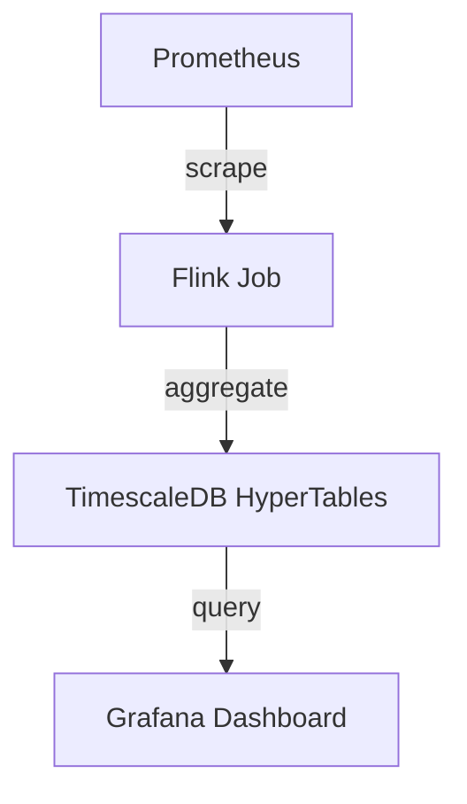

# **[Pattern] Metrics Aggregation Reference Guide**

## **Overview**
The **Metrics Aggregation** pattern standardizes the collection, processing, and storage of system metrics to enable real-time and historical performance monitoring, capacity planning, and anomaly detection. This pattern defines a structured pipeline for ingesting raw telemetry data (e.g., CPU, memory, network, custom application metrics) from distributed sources, transforming it into aggregated insights, and storing it in a query-optimized format. Key objectives include **scalability** (handling high ingestion volumes), **low-latency processing** (near-real-time aggregation), and **flexible querying** (supporting time-series analysis, aggregations, and alerts).

---

## **Key Concepts**

### **1. Metrics Sources**
Raw data can originate from:
- **Operating systems** (e.g., Prometheus, `/proc` stats)
- **Cloud services** (AWS CloudWatch, Azure Monitor, GCP Stackdriver)
- **Application instrumentation** (OpenTelemetry, custom SDKs)
- **Logs/Events** (ELK, Splunk, Fluentd/Fluent Bit)

### **2. Ingestion Layer**
- **Transport Protocols**: HTTP (REST/gRPC), gRPC Streaming, Kafka, or custom protocols.
- **Sampling**: Adjust sample rate (e.g., `1s`, `1m`) to balance fidelity vs. load.
- **Batching**: Aggregate metrics at rest (e.g., Prometheus `scrape_interval`) or in transit (e.g., Flink, Kafka).

### **3. Processing Pipeline**
| Stage               | Purpose                                                                 | Tools/Examples                          |
|---------------------|-------------------------------------------------------------------------|------------------------------------------|
| **Preprocessing**   | Data validation, filtering, and unit conversion (e.g., bytes → MB).     | AWS Lambda, Apache NiFi, custom scripts |
| **Aggregation**     | Downsampling (e.g., 1m → 5m averages) or rolling windows (e.g., `sum(10s)`). | Flink, Prometheus `aggregation_buffer`  |
| **Enrichment**      | Adding metadata (e.g., service labels, business context).               | ELK Pipeline, OpenSearch enrichments    |
| **Retention**       | Tiered storage (hot/warm/cold) to optimize cost and query speed.         | TimescaleDB, InfluxDB, S3 + Parquet     |

### **4. Storage Schema**
Metrics are stored in **time-series databases (TSDBs)** or **data lakes** with schema-on-read support.

---
## **Schema Reference**

| Field               | Type          | Description                                                                 | Example Values                     |
|---------------------|---------------|-----------------------------------------------------------------------------|-------------------------------------|
| **Timestamp**       | `datetime`    | Unix epoch (seconds/milliseconds).                                          | `1672531200` (Jan 1, 2023)         |
| **Metrics**         | `object`      | Key-value pairs for each metric (e.g., `cpu_usage`, `http_requests`).       | `{ "cpu_usage": 42.5, "errors": 0 }`|
| **Dimensions**      | `array`       | Labels/tags (e.g., `service=api`, `env=prod`).                             | `[{ "key": "env", "value": "prod" }]`|
| **Aggregation**     | `enum`        | Pre-computed function (`sum`, `avg`, `max`, `count`).                       | `avg`, `sum_squared`                |
| **Source**          | `string`      | Origin system (e.g., `prometheus`, `custom_app`).                           | `prometheus`                        |
| **RetentionPolicy** | `string`      | Storage tier (e.g., `high_resolution=30d`, `low_resolution=1y`).           | `30d_raw`, `1y_compressed`          |

---
## **Implementation Best Practices**

### **1. Design Considerations**
- **Granularity**: Trade-off between high-cardinality dimensions (e.g., `user_id`) and performance.
- **Sampling**: Use exponential backoff for high-frequency metrics (e.g., `1s` → `10s` after 5 min).
- **Schema Evolution**: Design schemas to support backward compatibility (e.g., optional fields).

### **2. Tools & Tech Stack**
| Component          | Options                                                                 |
|--------------------|-------------------------------------------------------------------------|
| **Ingestion**      | Prometheus, Telegraf, OpenTelemetry Collector, Fluentd                  |
| **Processing**     | Apache Flink, Spark Streaming, AWS Kinesis, Kafka Streams               |
| **Storage**        | TimescaleDB, InfluxDB, Prometheus, ClickHouse, S3/Parquet (lakehouse)  |
| **Querying**       | PromQL, InfluxQL, Grafana, Metabase, OpenSearch Dashboards               |

### **3. Example Pipeline (Prometheus → Flink → TimescaleDB)**


---
## **Query Examples**

### **1. Time-Series Aggregations (PromQL)**
```sql
# Average CPU usage per service over 5 minutes
avg by (service)(rate(cpu_usage[5m]))

# Rolling sum of HTTP errors (last 10 minutes)
sum(rate(http_errors_total[10m]))
```

### **2. SQL-like Queries (TimescaleDB)**
```sql
-- Mean response time per API endpoint
SELECT AVG(response_time_ms)
FROM http_requests
WHERE endpoint = '/users'
  AND time_bucket('1 hour', timestamp) = NOW() - INTERVAL '1 hour';
```

### **3. Alert Thresholds (Prometheus Rules)**
```yaml
groups:
- name: error-rates
  rules:
  - alert: HighErrorRate
    expr: rate(http_errors_total[1m]) / rate(http_requests_total[1m]) > 0.05
    for: 5m
    labels:
      severity: warning
    annotations:
      summary: "High error rate on {{ $labels.instance }}"
```

---
## **Performance Optimization**
| Technique               | Description                                                                 | Tools                          |
|-------------------------|-----------------------------------------------------------------------------|--------------------------------|
| **Downsampling**        | Pre-aggregate data (e.g., `1s` → `1m` averages) to reduce storage.        | Prometheus `aggregation_buffer`|
| **Compression**         | Use Parquet/ORC for cold storage with Snappy/Zstd.                          | S3, HDFS                       |
| **Indexing**            | Create GIN indexes on dimensions (e.g., `service`) for fast filtering.      | TimescaleDB, ClickHouse        |
| **Caching**             | Cache hot queries (e.g., last 5 minutes) in Redis.                          | Prometheus Remote Write        |
| **Sharding**            | Partition data by tenant/time (e.g., `shard-2023-01` for January).          | Cassandra, Druid               |

---
## **Error Handling & Reliability**
- **Dead Letter Queues (DLQ)**: Route malformed metrics to a retry queue (e.g., S3 bucket).
- **Idempotency**: Use deduplication keys (e.g., `metric_name + timestamp`) to avoid duplicates.
- **Backpressure**: Implement rate limiting (e.g., Kafka consumer lag alerts) to prevent pipeline overload.

---
## **Related Patterns**
1. **[Distributed Tracing](https://www.observability.docs/patterns/distributed-tracing)**
   - Correlate metrics with traces for root-cause analysis.
2. **[Log Aggregation](https://www.observability.docs/patterns/log-aggregation)**
   - Combines metrics + logs for context-rich monitoring (e.g., ELK Stack).
3. **[Canary Analysis](https://www.observability.docs/patterns/canary-analysis)**
   - Use aggregated metrics to compare feature rollouts (e.g., A/B testing).
4. **[Observability Pipeline](https://www.observability.docs/patterns/observability-pipeline)**
   - End-to-end flow from instrumentation to dashboards (includes metrics, logs, traces).
5. **[Cost Optimization for Observability](https://www.observability.docs/patterns/cost-optimization)**
   - Right-size metric retention and sampling to control costs.

---
## **Troubleshooting**
| Issue                          | Diagnosis                          | Solution                                  |
|--------------------------------|-------------------------------------|-------------------------------------------|
| High ingestion latency         | Check Kafka consumer lag or Flink backpressure. | Scale out consumers or adjust parallelism. |
| Slow queries                   | Full scans on large time ranges.   | Add indexes or use approximate queries.   |
| Data loss                      | Failed writers (e.g., DB crashes).  | Enable replication (e.g., TimescaleDB HA).|

---
## **References**
- [Prometheus Documentation](https://prometheus.io/docs/)
- [TimescaleDB Time-Series Guide](https://docs.timescale.com/)
- [OpenTelemetry Metrics Spec](https://opentelemetry.io/docs/specs/semconv/metrics/)

---
**Note**: Adjust schema/queries based on your TSDB (e.g., InfluxQL differs from TimescaleDB SQL). For cloud-native setups, leverage managed services like AWS Pinpoint or Azure Monitor.