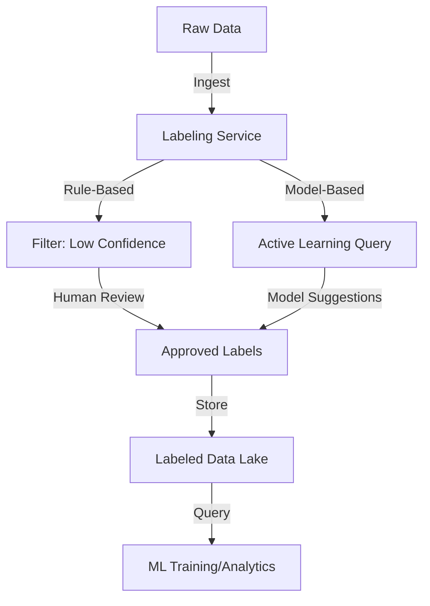

# **[Pattern] Data Labeling Patterns – Reference Guide**

---

## **Overview**
**Data Labeling Patterns** define standardized structures and conventions for labeling raw data to enhance consistency, usability, and automation in machine learning (ML), analytics, and enterprise applications. These patterns ensure that data is **semantically enriched** (with meaning and context), **interoperable** (compatible across systems), and **actionable** (ready for downstream workflows). Common use cases include:
- **Annotating unstructured data** (e.g., text, images, audio) for ML training.
- **Tagging structured data** (e.g., logs, IoT sensor readings) for querying/analysis.
- **Versioning and lineage tracking** for data governance.
- **Automated labeling workflows** via rules, ML models, or hybrid approaches.

Patterns cover **formats** (e.g., JSON, CSV, RDF), **semantic models** (e.g., ontologies, taxonomies), and **processes** (e.g., crowdsourcing, active learning). This guide focuses on **implementation best practices**, **schema design**, and **querying techniques** for labeled datasets.

---

## **Schema Reference**
Below is a **standardized schema** for data labeling patterns, categorized by use case. Customize fields per domain (e.g., healthcare vs. retail).

| **Field**               | **Type**       | **Description**                                                                                     | **Example Values**                          | **Notes**                                  |
|-------------------------|----------------|-----------------------------------------------------------------------------------------------------|--------------------------------------------|--------------------------------------------|
| **Core Labeling**       |                |                                                                                                     |                                            |                                            |
| `label_id`              | String         | Unique identifier for the label (e.g., UUID or auto-increment).                                      | `label_4567`                                | Useful for referential integrity.          |
| `label_value`           | String/Enum    | The actual label assigned (e.g., "spam," "urgent," "cat").                                           | `"malware"`, `"emergency"`                  | Enums reduce ambiguity.                    |
| `confidence_score`      | Float (0–1)    | Probability assigned by a model or human annotator (optional).                                      | `0.92`                                      | Critical for active learning.               |
| `labeler`               | String         | Identifier of the annotator/human or system (e.g., `model_XYZ` or `user_123`).                      | `"crowdworker_5"`, `"nlp_model_large"`     | Track accountability.                      |
| `timestamp`             | ISO 8601       | When the label was applied (e.g., for versioning).                                                   | `2023-10-15T08:30:00Z`                      | Use for drift detection.                  |
| **Context Metadata**    |                |                                                                                                     |                                            |                                            |
| `source_system`         | String         | Origin of the raw data (e.g., `customer_support_chat`, `factory_sensor`).                           | `"IoT_platform_v2"`                        | Enable cross-system joins.                 |
| `related_entity`        | String/Object  | Reference to parent objects (e.g., `{"user_id": "u789"}` for text spam labels).                     | `{"order_id": "ord_1001"}`                  | Supports hierarchical queries.             |
| `features_used`         | Array of Strings| Features considered for labeling (e.g., `["text_length", "sentiment_score"]`).                     | `["pixels_red_ratio", "audio_noise_db"]`    | Audit transparency.                       |
| **Process Metadata**    |                |                                                                                                     |                                            |                                            |
| `labeling_method`       | Enum           | How the label was applied (e.g., `human`, `model`, `rule_based`, `hybrid`).                       | `"active_learning"`, `"rule:virus_signature"`| Affects validation steps.                  |
| `validation_status`     | Enum           | Approval state (e.g., `pending`, `approved`, `disputed`).                                            | `"pending_review"`                         | Integrate with workflow tools.             |
| `effort_seconds`        | Integer        | Time spent labeling (for cost tracking).                                                           | `180`                                       | Useful for crowdsourcing.                  |
| **Technical Metadata**  |                |                                                                                                     |                                            |                                            |
| `schema_version`        | String         | Version of the labeling schema (e.g., `v2.1`).                                                     | `"v1.3"`                                   | Enable backward compatibility.            |
| `encoding`              | String         | Format of the label data (e.g., `utf-8`, `base64`).                                                  | `"utf-8"`                                  | Critical for text/image data.               |
| `compression`           | Boolean        | Whether the labeled data is compressed.                                                           | `true`/`false`                              | Optimize storage.                         |

---

### **Variants by Data Type**
Adjust the schema for specific data types:

| **Data Type**       | **Additional Fields**                                                                 |
|---------------------|---------------------------------------------------------------------------------------|
| **Text**            | `language_code` (e.g., `"en"`, `"fr"`), `text_segment` (for multi-sentence context). |
| **Images/Videos**   | `region_coordinates` (bounding boxes), `label_type` (e.g., `"object"`, `"blur"`).    |
| **Time-Series**     | `window_start`/`window_end` (for anomaly detection), `sensor_type`.                 |
| **Tabular**         | `column_name` (for structured row labels), `imputation_flag` (for missing data).     |

---

## **Query Examples**
Labeling patterns enable flexible querying for ML, analytics, or governance. Below are **SQL-like pseudocode** examples (adapt to your DB/NoSQL system).

---

### **1. Retrieve High-Confidence Labels for a Class**
```sql
SELECT *
FROM labeled_data
WHERE label_value = 'fraud'
  AND confidence_score > 0.95
  AND labeling_method = 'model';
```
**Use Case**: Filter data for ML training or compliance reviews.

---

### **2. Find Disputed Labels for Audit**
```sql
SELECT label_id, label_value, labeler, validation_status
FROM labeled_data
WHERE validation_status = 'disputed'
ORDER BY timestamp DESC;
```
**Use Case**: Flag labels needing resolution in a governance pipeline.

---

### **3. Join Labeled Data with Raw Data**
```sql
SELECT r.raw_text, l.label_value, l.confidence_score
FROM raw_data r
JOIN labeled_data l ON r.data_id = l.source_id
WHERE l.label_value = 'toxic'
  AND l.source_system = 'social_media';
```
**Use Case**: Analyze labeled content in a dashboard.

---

### **4. Time-Based Label Drift Detection**
```sql
SELECT label_value, COUNT(*)
FROM labeled_data
WHERE timestamp > DATE_SUB(CURRENT_DATE(), INTERVAL 30 DAY)
GROUP BY label_value
HAVING COUNT(*) < (SELECT AVG(count) FROM (
    SELECT label_value, COUNT(*) as count
    FROM labeled_data
    WHERE timestamp > DATE_SUB(CURRENT_DATE(), INTERVAL 90 DAY)
    GROUP BY label_value
) AS recent);
```
**Use Case**: Detect concept drift in labeled datasets (e.g., "spam" evolving over time).

---

### **5. Hybrid Labeling: Filter by Method**
```sql
SELECT *
FROM labeled_data
WHERE labeling_method IN ('human', 'hybrid')
  AND label_value = 'cat'
ORDER BY confidence_score DESC;
```
**Use Case**: Prioritize high-quality labels for model fine-tuning.

---

## **Implementation Details**
### **1. Schema Design Principles**
- **Hierarchy**: Use nested objects for complex relations (e.g., `related_entity` for images with multiple labels).
- **Extensibility**: Add `custom_metadata` as a JSON field for domain-specific tags.
- **Performance**: Index frequently queried fields like `label_value` and `source_system`.
- **Validation**: Enforce constraints (e.g., `confidence_score` between 0 and 1).

### **2. Tooling Support**
| **Tool/Framework**       | **Integration Notes**                                                                 |
|--------------------------|---------------------------------------------------------------------------------------|
| **Databases**            | PostgreSQL (JSONB), MongoDB (BSON), ClickHouse (for time-series labels).              |
| **ML Platforms**         | TensorFlow Label Studio, AWS Labeling Service, custom PyTorch/Catalyi pipelines.     |
| **ETL/Orchestration**    | Airflow (for labeling workflows), Databricks (scaling label generation).              |
| **Semantic Engines**     | GraphDB (e.g., Neo4j) for ontology-based labeling, SPARQL queries.                   |

### **3. Automation Patterns**
| **Pattern**              | **Description**                                                                       | **Example**                                  |
|--------------------------|---------------------------------------------------------------------------------------|-----------------------------------------------|
| **Rule-Based**           | Labels applied via predefined rules (e.g., regex, thresholds).                      | `IF text_length > 500 THEN label = "long"`   |
| **Model-Based**          | ML models predict labels (e.g., BERT for sentiment).                                | `label = NLP_model.predict(text)`             |
| **Hybrid**               | Combines rules + models (e.g., model suggests, human reviews).                       | `IF model_confidence < 0.7 THEN approve_human`|
| **Active Learning**      | Queries labels for uncertain samples to reduce cost.                                 | `SELECT * FROM data WHERE 0.7 < confidence < 0.9` |

### **4. Versioning**
- **Schema Versioning**: Use `schema_version` field to migrate labels across updates.
- **Data Versioning**: Track changes with `timestamp` + `labeler` for audit trails.
- **Example Migration**:
  ```sql
  -- Add a new optional field for schema v2
  ALTER TABLE labeled_data ADD COLUMN IF NOT EXISTS sentiment_score FLOAT;
  ```

---

## **Related Patterns**
1. **[Data Lineage]** – Track how labels propagate through pipelines.
2. **[Feature Store]** – Reuse labeled features for multiple models.
3. **[Data Governance Taxonomies]** – Align labels with enterprise glossaries.
4. **[Active Learning]** – Dynamically query labels for cost-efficient training.
5. **[Onto-Labeling]** – Use ontologies (e.g., OWL) to define hierarchical labels.
6. **[Confidentiality Labeling]** – Apply sensitivity tags (e.g., PII) to labeled data.

---
## **Best Practices**
- **Consistency**: Train annotators on label definitions (e.g., "urgent" = <1-hour response).
- **Bias Mitigation**: Audit labels for demographic skew (e.g., gender in facial recognition).
- **Performance**: Cache frequent queries (e.g., `label_value = 'spam'`).
- **Cost Control**: Limit crowdsourcing to high-variance or edge cases.

---
## **Example Pipeline**


---
**References**:
- [Google’s Labeling Guides](https://developers.google.com/machine-learning/crash-course)
- [AWS Data Labeling Service](https://aws.amazon.com/machine-learning/data-labeling/)
- [OWL Ontology for Labeling](https://www.w3.org/TR/owl2-overview/)