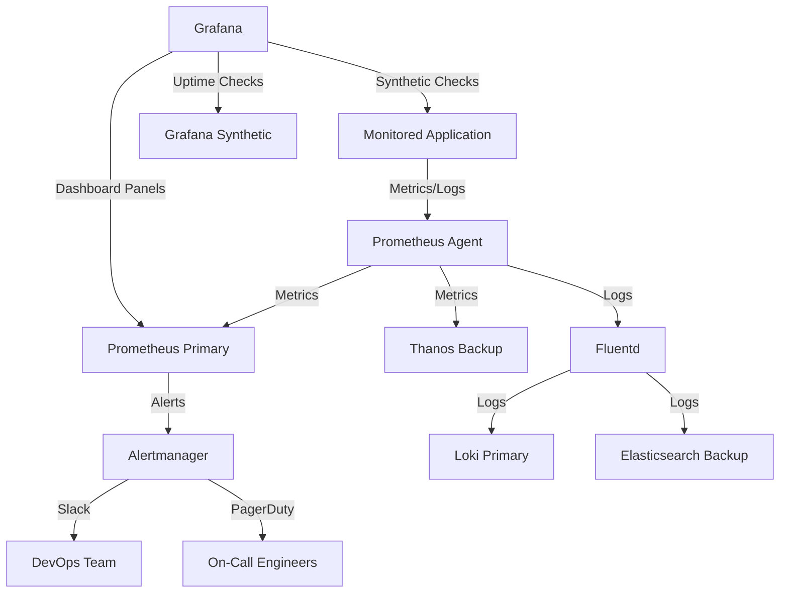

## **Overview**
The **Monitoring Monitoring** pattern (also called **"Metamonitoring"** or **"Observability of Observability"**) ensures that the systems responsible for monitoring your application are themselves monitored, maintained, and observable. This self-referential approach prevents blind spots when critical observability infrastructure fails, degrades, or is misconfigured. By embedding monitoring into monitoring agents, agents into collectors, and collectors into dashboards, organizations can detect **alert fatigue, data loss, or reliability failures** in distributed systems before they impact end users.

This pattern is critical for **large-scale, highly distributed systems** (e.g., cloud-native, microservices, IoT) where observability is a **dependency**, not just a tool. Without monitoring monitoring, you risk:
- **Undetected outages** in monitoring tools themselves.
- **Alert storms** from misconfigured or overwhelmed agents.
- **Data gaps** when metrics/logs from critical systems are silently dropped.

Key principles include:
1. **Instrumentation first** – Every monitoring component must emit telemetry.
2. **Automated validation** – Metrics/logs from monitoring systems are treated like production data.
3. **Circular checks** – Dashboards should alert on their own health, not just application health.
4. **Isolation** – Monitoring failures shouldn’t cascade into production incidents.

---

## **Implementation Details**
### **1. Key Concepts**
| Concept               | Description                                                                                                                                                     | Example Components                                                                                     |
|-----------------------|-----------------------------------------------------------------------------------------------------------------------------------------------------------------|---------------------------------------------------------------------------------------------------------|
| **Self-hosted Agents** | Monitoring agents (e.g., Prometheus Node Exporter, Datadog Agent) must log their own performance (CPU, memory, latency) to a **separate** backend.             | Prometheus `prometheus_node_exporter` emits metrics about itself to Alertmanager.                       |
| **Collector Redundancy** | Metrics/logs from collectors (e.g., Fluentd, Loki, Grafana Agent) should be duplicated to at least two storage backends (e.g., Prometheus + TimescaleDB).       | Loki ingests logs from agents, but also forwards sample logs to a secondary Grafana Cloud instance.     |
| **Dashboard Validation** | Dashboards (e.g., Grafana) should include panels that **query their own uptime, query latency, and alert thresholds**.                                   | Grafana dashboard panel: "Last 5 minutes of Grafana API response times (p99)."                          |
| **Synthetic Checks**   | Proactively ping monitoring endpoints (e.g., `/metrics`, `/health`) using tools like **Grafana Synthetic Monitoring** or **Pingdom**.                          | Health check: `http POST /api/v1/alerts` with a 30-second timeout.                                     |
| **Audit Logging**      | All monitoring actions (e.g., alert rule creation, dashboard edits) should be logged to a **central SIEM** or **audit trail** (e.g., Splunk, Datadog Audit Logs). | Log entry: `"User: admin edited Alert Rule ‘High CPU’ at 2024-05-20T14:30:00Z."`                 |
| **Fallback Paths**     | Define **offline monitoring** (e.g., periodic SMTP alerts, pager duty via cell towers) if primary observability channels fail.                           | If Prometheus is down, a cron job emails a pre-computed anomaly report from a local backup.            |
| **Threshold Tuning**   | Alerts for monitoring systems should use **slower, stricter thresholds** than production alerts (e.g., 99.99% uptime instead of 99.9%).               | Alert: "Grafana API latency > 500ms for 5 consecutive minutes."                                      |

---

### **2. Schema Reference**
Below is a **logical schema** for a Monitoring Monitoring system. Customize fields for your environment.

| **Component**         | **Incoming Telemetry**               | **Outgoing Telemetry**                          | **Storage Backend**          | **Alerting Targets**               |
|-----------------------|--------------------------------------|------------------------------------------------|------------------------------|-------------------------------------|
| **Agent (e.g., Prometheus Node Exporter)** | Host metrics (CPU, disk, network)      | Metrics to Prometheus server + backup system    | Prometheus + TimescaleDB      | PagerDuty (if `disk_free < 10%`)    |
| **Collector (e.g., Fluentd)**          | Logs/Metrics from agents              | Aggregated logs to Loki + raw data to Elasticsearch | Loki (primary) + Elastic (backup) | Slack if `log_collection_rate < 80%`|
| **Backend (e.g., Prometheus)**        | Time-series metrics from agents       | Alerts to Alertmanager + backup to VictorOps    | Prometheus (primary) + Thanos | Team Slack + PagerDuty              |
| **Dashboard (e.g., Grafana)**          | Metrics from Prometheus/Loki         | Uptime checks to Grafana Synthetic               | Metrics: Prometheus           | Email if `dashboard_render_time > 2s`|
| **Alertmanager**      | Alerts from Prometheus               | Alert silence confirmations to ChatOps          | Alertmanager + Backup DB     | SMS to on-call if `no_alerts_received`|
| **Synthetic Monitor** | Health checks (HTTP, ping, etc.)     | Status updates to a dedicated "Observability Status" dashboard | Grafana Statuspage          | Website banner if monitoring down   |

---

### **3. Query Examples**
#### **A. Check if Metrics are Being Collected**
**Goal:** Verify that Prometheus is scraping agents reliably.
**Query (PromQL):**
```promql
# Check Prometheus target scrape success rate (last 5m)
sum(rate(up{job="my_agent"}[5m])) by (job) / COUNT(up{job="my_agent"})
```
**Expect:** `1.0` (100% success).

**Query (Loki):**
```logql
# Check if agent logs appear in Loki
{job="my_agent"} |= "INFO"  # Filter for INFO-level logs
```

#### **B. Detect Alertmanager Failures**
**Goal:** Ensure Alertmanager is forwarding alerts to downstream systems.
**Query (PromQL):**
```promql
# Alerts sent to Slack vs. alerts missed
rate(alertmanager_notifications_sent_total[5m]) > 0
```
**Alert if:** `rate(alertmanager_notifications_failed_total[5m]) > 0`

#### **C. Validate Dashboard Uptime**
**Goal:** Monitor Grafana dashboard availability.
**Grafana Synthetic Check:**
```http
GET /api/dashboards/uid/my-dashboard
Headers: Authorization: Bearer <API_KEY>
Timeout: 3s
Expect: HTTP 200
```

#### **D. Audit Log Anomalies**
**Goal:** Detect unusual activity in monitoring configurations.
**SIEM Query (e.g., Splunk):**
```splunk
index=audit_log
| search user="admin" action="rule_creation"
| stats count by rule_name
| where count > 5  # Alert if too many rules created in a short time
```

---

### **4. Implementation Steps**
#### **Step 1: Instrument Agents**
- **Prometheus Node Exporter:**
  ```bash
  # Ensure exporter metrics are scraped at higher frequency (e.g., 15s)
  prometheus.yml:
    scrape_configs:
      - job_name: 'node'
        scrape_interval: 15s
        static_configs:
          - targets: ['localhost:9100']
  ```
- **Custom Metrics:**
  Add metrics for **agent performance** (e.g., `agent_query_latency_seconds`).

#### **Step 2: Redundant Storage**
- **Prometheus:** Use **Thanos** or **Cortex** for multi-region replication.
- **Logs:** Forward to **Loki + Elasticsearch** (or **Datadog**).

#### **Step 3: Validate Dashboards**
- **Grafana:**
  Create a dashboard with:
  1. Panel: "Last 5m of Grafana API latency (p99)."
  2. Alert: Notify if `> 1s`.
  3. Panel: "Number of active dashboards vs. expected." (e.g., 50 vs. 50).

#### **Step 4: Synthetic Monitoring**
- **Tools:** Grafana Synthetic Monitoring, Pingdom, or UptimeRobot.
- **Checks:**
  | Endpoint                | Frequency | Action on Failure               |
  |-------------------------|-----------|----------------------------------|
  | `/metrics` (Prometheus) | 1m        | Escalate to PagerDuty            |
  | `/api/alerts`           | 5m        | Email ops-team@company.com      |
  | Grafana login page      | 1h        | Trigger fallback SMS alert       |

#### **Step 5: Failover Testing**
- **Simulate Failures:**
  ```bash
  # Stop Prometheus (for testing)
  systemctl stop prometheus
  # Verify backup system (e.g., Thanos) picks up
  curl http://thanos-querier:9090/api/v1/query?query=up
  ```
- **Alert on Failures:**
  ```promql
  # Alert if primary Prometheus is down AND backup is down
  absent(up{job="prometheus-primary"}) and absent(up{job="prometheus-backup"})
  ```

---

### **5. Query Examples (Detailed)**
#### **Example 1: Check Agent Scrape Success**
**Scenario:** Ensure all agents report `up{job="..."} = 1`.
**PromQL:**
```promql
# Alert if any agent has failed to scrape 3x in 5m
sum(rate(prometheus_target_increase{job="my_agent"}[5m])) < 3
```
**Expected Result:**
- No alerts if all agents scrape successfully.
- Alert if `sum < 3` (e.g., due to network issues).

#### **Example 2: Detect Alertmanager Backlog**
**Scenario:** Alert if Alertmanager is processing alerts slower than expected.
**PromQL:**
```promql
# Alert if alerts take > 10s to resolve
histogram_quantile(0.95, sum by (le) (rate(alertmanager_alertmanager_resolved_total[5m])))
```
**Threshold:** `> 10s` → Escalate to PagerDuty.

#### **Example 3: Log Collection Rate**
**Scenario:** Ensure logs from critical services are ingested.
**Loki LogQL:**
```logql
# Check log rate from a critical service
{service="database"} |= "error"
| count over 5m
```
**Alert if:** `< 80%` of expected logs missing (compare to historical averages).

---

### **6. Related Patterns**
| **Pattern**               | **Description**                                                                                     | **When to Use**                                                                                     |
|---------------------------|-------------------------------------------------------------------------------------------------|---------------------------------------------------------------------------------------------------|
| **Chaos Engineering**     | Purposefully inject failures to test observability resilience.                                     | During DevOps "Chaos Month" or before major deployments.                                          |
| **SLO-Based Alerting**    | Define alerts tied to **Service Level Objectives (SLOs)** rather than absolute thresholds.        | When monitoring production-grade systems (e.g., "Error Budgets").                               |
| **Canary Releases**       | Gradually roll out monitoring changes to a subset of traffic.                                      | When updating observability tools (e.g., Prometheus to Thanos).                                  |
| **Distributed Tracing**   | Use **OpenTelemetry** to trace requests across monitoring components (e.g., agent → collector → DB). | Diagnosing latency in observability pipelines.                                                    |
| **Infrastructure as Code** | Manage monitoring configurations (e.g., Prometheus rules, Grafana dashboards) via Terraform/Ansible. | For repeatable, auditable observability setups.                                                  |
| **Observability Mesh**    | Decouple instrumentation (agents), collection (collectors), and visualization (dashboards).       | Large-scale systems where tight coupling increases risk.                                         |

---

### **7. Anti-Patterns to Avoid**
| **Anti-Pattern**               | **Risk**                                                                                     | **Mitigation**                                                                                     |
|---------------------------------|---------------------------------------------------------------------------------------------|---------------------------------------------------------------------------------------------------|
| **Circular Dependencies**       | Dashboard A depends on metrics from Dashboard B, which depends on Dashboard A.           | Use **synthetic checks** to validate external dependencies.                                         |
| **Single Point of Failure**     | All logs/metrics route through one collector (e.g., single Fluentd instance).              | Deploy **multiple collectors** with load balancing.                                               |
| **Ignoring Monitoring Logs**    | Alerts for monitoring tools are disabled ("It’s just monitoring, not production!").     | Treat monitoring telemetry **equally** to production data.                                         |
| **Static Thresholds**           | Alerts triggered by fixed values (e.g., "CPU > 80%") instead of SLOs.                      | Use **adaptive thresholds** (e.g., "CPU > 95th percentile + 10%").                               |
| **No Offline Alerts**           | All alerts rely on internet-connected tools (e.g., PagerDuty).                              | Configure **SMS/email fallbacks** for critical monitoring failures.                                |

---
### **8. Example Architecture**


---
### **9. Tools & Libraries**
| **Category**               | **Tools**                                                                                     | **Notes**                                                                                       |
|----------------------------|---------------------------------------------------------------------------------------------|-------------------------------------------------------------------------------------------------|
| **Metrics Collection**     | Prometheus, VictoriaMetrics, Datadog, New Relic                                           | Prometheus + Thanos for redundancy.                                                              |
| **Log Collection**         | Fluentd, Loki, ELK Stack (Elasticsearch, Logstash, Kibana), Datadog Logs                      | Forward to **two backends**.                                                                        |
| **Alerting**               | Alertmanager, PagerDuty, Opsgenie, Datadog Alerts                                           | Use **slower thresholds** for monitoring alerts (e.g., 99.99% uptime).                           |
| **Synthetic Monitoring**   | Grafana Synthetic, Pingdom, UptimeRobot, Synthetic.io                                      | Test **all monitoring endpoints**, not just applications.                                          |
| **Dashboarding**           | Grafana, Datadog, Chronograf (InfluxData), Kibana                                         | Include **self-monitoring panels** in every dashboard.                                           |
| **Audit & Compliance**     | Splunk, Datadog Audit Logs, Prometheus Remote Write Audit, OpenTelemetry                           | Log **who changed what** in monitoring configurations.                                             |

---
### **10. Troubleshooting**
| **Symptom**                     | **Root Cause**                                                                                     | **Diagnosis**                                                                                     | **Fix**                                                                                           |
|---------------------------------|-------------------------------------------------------------------------------------------------|--------------------------------------------------------------------------------------------------|-------------------------------------------------------------------------------------------------|
| No alerts for monitoring issues | Alertmanager not forwarding alerts.                                                              | Check `alertmanager_notifications_sent_total`.                                                    | Restart Alertmanager; verify `alertmanager.yml` includes all receivers.                          |
| Missing metrics from agents     | Scrape config misconfigured or agent unreachable.                                                 | Run `promtool check config`; check agent logs (`journalctl -u node-exporter`).                     | Update `prometheus.yml`; verify agent is running.                                               |
| Dashboard errors                | Grafana API latency or query timeouts.                                                           | Check `grafana_http_request_duration_seconds` in Prometheus.                                       | Scale Grafana; optimize queries with `.summary()` or `.mean()`.                                 |
| Logs not appearing in Loki      | Fluentd or Loki ingestion issues.                                                                | Check Fluentd output plugin logs; test Loki query with `logql`.                                  | Restart Fluentd; increase Loki retention or scale pods.                                           |
| Alert fatigue                    | Too many false positives in monitoring alerts.                                                    | Review `prometheus_rule_group_evaluation_time_seconds`.                                          | Tune thresholds; use **SLOs** instead of static values.                                          |

---
### **11. Further Reading**
- [Prometheus Operator Best Practices](https://prometheus.github.io/prometheus/docs/guides/operator/)
- [Loki + Promtail: Log Collection at Scale](https://grafana.com/docs/loki/latest/logs/log-collection/)
- [Google SRE Book: Observability](https://sre.google/sre-book/monitoring-distributed-systems/)
- [Datadog’s Metamonitoring Guide](https://www.datadoghq.com/blog/metamonitoring/)
- [Chaos Engineering for Observability](https://www.chaosshop.org/chaos-engineering-for-observability/)

---
### **12. Example Prometheus Rule for Monitoring Monitoring**
```yaml
groups:
- name: monitoring-monitoring-alerts
  rules:
  - alert: PrometheusDown
    expr: up{job="prometheus"} == 0
    for: 5m
    labels:
      severity: critical
    annotations:
      summary: "Prometheus instance {{ $labels.instance }} is down"
      description: "Thanos has not received any data from {{ $labels.instance }} for 5 minutes"

  - alert: AlertmanagerFailure
    expr: alertmanager_notifications_failed_total > 0
    for: 1m
    labels:
      severity: warning
    annotations:
      summary: "Alertmanager failed to send {{ $labels.alertname }}"

  - alert: GrafanaDashboardNotLoading
    expr: grafana_api_http_request_duration_seconds{status=~"5.."} > 0
    for: 5m
    labels:
      severity: critical
    annotations:
      summary: "Grafana dashboard {{ $labels.dashboard }} failed