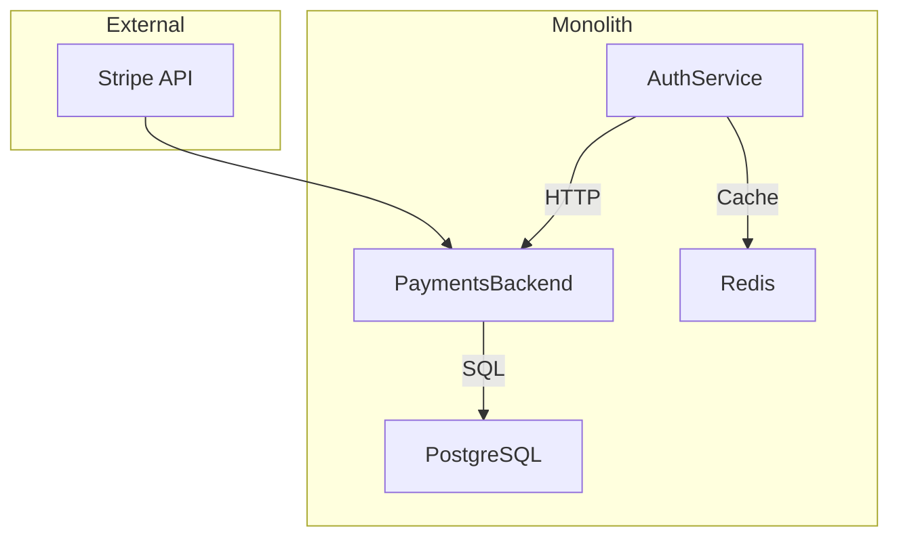

---
# **[Pattern] Monolith Monitoring Reference Guide**

---

## **Overview**
The **Monolith Monitoring** pattern centralizes observability for a legacy or polyglot application deployed as a single service container (e.g., Docker, VM, or bare-metal). Unlike microservices, monoliths require a unified approach to log aggregation, metric collection, and distributed tracing to diagnose issues across tightly coupled components. This pattern ensures observability at scale by abstracting infrastructure boundaries (e.g., JVM, Node.js, databases) into a cohesive monitoring pipeline. It’s critical for applications where splitting into microservices isn’t feasible or desirable due to technical debt, performance overhead, or business requirements.

---

## **Key Concepts**

| **Concept**               | **Description**                                                                                                                                                                                                                                                                 |
|---------------------------|-----------------------------------------------------------------------------------------------------------------------------------------------------------------------------------------------------------------------------------------------------------------------------|
| **Unified Logging**       | Aggregates logs from all monolith processes (e.g., Java, Python, Go) into a single log management system (e.g., ELK Stack, Loki, or Splunk). Includes structured logs (JSON) for easier parsing.                                     |
| **Containerized Metrics** | Exposes metrics (e.g., CPU, memory, latency, custom business KPIs) via standardized protocols (Prometheus PushGateway, OpenTelemetry Collector) or embedded agents (Datadog, New Relic).                                     |
| **Distributed Tracing**   | Correlates requests across monolith components (e.g., HTTP routes, database queries) using OpenTelemetry or Zipkin traces. Ensures end-to-end visibility despite monolithic coupling.                                                     |
| **Health Checks**         | Defines liveness (`/healthz`) and readiness (`/readyz`) endpoints to monitor container/process health in orchestrated environments (Kubernetes, Docker Swarm).                                                           |
| **Dependency Mapping**    | Documents internal/external dependencies (e.g., databases, APIs) to trace impact when a component fails. Often visualized via graph tools (e.g., Grafana, Dynatrace).                                                          |
| **Performance Baselines** | Establishes historical performance metrics (e.g., P99 latency, error rates) to detect anomalies. Tools: Prometheus Alertmanager, Datadog Anomaly Detection.                                                                       |
| **Configurable Alerts**   | Sets thresholds for critical metrics (e.g., OOM errors, deadlocks) with actions (e.g., Slack, PagerDuty) via monitoring platforms. Avoids alert fatigue by prioritizing business impact.                                      |
| **Sidecar Observability** | Employs lightweight sidecar containers (e.g., Jaeger, Prometheus) to inject tracing/metrics without modifying monolith code. Useful for unmaintained codebases.                                                                          |

---

## **Implementation Details**

### **1. Logging**
#### **Schema Reference**
| **Field**          | **Type**   | **Description**                                                                                     | **Example**                          |
|--------------------|------------|-----------------------------------------------------------------------------------------------------|--------------------------------------|
| `timestamp`        | ISO8601    | Log event time in UTC.                                                                               | `2024-05-20T12:34:56.789Z`          |
| `level`            | String     | Severity: `DEBUG`, `INFO`, `WARNING`, `ERROR`, `CRITICAL`.                                            | `"ERROR"`                            |
| `service`          | String     | Monolith component (e.g., `auth-service`, `payments-backend`).                                       | `"payments-backend"`                  |
| `context`          | Object     | Structured metadata (e.g., `userId`, `requestId`).                                                  | `{"userId": "123", "requestId": "abc"}` |
| `message`          | String     | Human-readable log content.                                                                          | `"Failed to validate credit card."`  |
| `traceId`          | String     | Distributed trace identifier for correlation.                                                       | `"1f3a7c8d-2b4e-5f6g-7h8i-9j0k1l2m3"` |

#### **Query Examples**
**Aggregating 500 errors by component (ELK/Kibana):**
```json
GET /_search
{
  "query": {
    "bool": {
      "must": [
        { "term": { "level": "ERROR" } },
        { "term": { "message": "500" } }
      ]
    }
  },
  "aggs": {
    "by_service": { "terms": { "field": "service.keyword" } }
  }
}
```

**Finding latency spikes (PromQL):**
```promql
# Latency > 500ms in last 1h
rate(http_request_duration_seconds_bucket{quantile="0.95"}[1h]) > 0.5
```

---

### **2. Metrics**
#### **Schema Reference**
| **Metric**                     | **Type**   | **Description**                                                                                      | **Example**                          |
|---------------------------------|------------|------------------------------------------------------------------------------------------------------|--------------------------------------|
| `jvm_memory_used_bytes`         | Gauge      | Heap memory usage (Java).                                                                               | `1250000000`                         |
| `http_requests_total`           | Counter    | Total HTTP requests (incremented on success/failure).                                                 | `42`                                 |
| `db_query_duration_seconds`     | Histogram  | Duration of database queries (buckets: 0.1s, 0.5s, 1s).                                              | `{"le": "0.5", "value": 3}`          |
| `error_rate`                    | Gauge      | Ratio of failed requests (`errors_total`/`requests_total`).                                          | `0.05` (5%)                          |
| `monolith_health`               | Gauge      | `0`: Unhealthy, `1`: Healthy (custom health check endpoint).                                         | `1`                                  |

#### **Query Examples**
**Alert for OOM risk (Prometheus):**
```yaml
- alert: HighMemoryUsage
  expr: (jvm_memory_used_bytes / jvm_memory_max_bytes) > 0.9
  for: 5m
  labels:
    severity: critical
  annotations:
    summary: "Monolith OOM risk ({{ $labels.instance }})"
```

**Top 5 slowest endpoints (Grafana PromQL):**
```promql
topk(5, rate(http_request_duration_seconds_sum[5m]) by (route))
```

---

### **3. Distributed Tracing**
#### **Schema Reference**
| **Field**          | **Type**   | **Description**                                                                                     | **Example**                          |
|--------------------|------------|-----------------------------------------------------------------------------------------------------|--------------------------------------|
| `traceId`          | String     | Unique identifier for the trace.                                                                        | `"a1b2c3d4e5f67890"`                 |
| `spanId`           | String     | Sub-span identifier (e.g., database call).                                                         | `"1b2c3d4e5f6"`                       |
| `operationName`    | String     | Monolith component/operation (e.g., `AuthService#validateUser`).                                       | `"AuthService#validateUser"`          |
| `parentSpanId`     | String     | ID of the parent span.                                                                               | `"0000000000000000"` (root)          |
| `startTime`        | Timestamp  | Span start time (nanoseconds since epoch).                                                           | `1716345678901000000`                |
| `duration`         | Numeric    | Span duration (microseconds).                                                                         | `456789`                             |
| `attributes`       | Object     | Key-value pairs (e.g., `http.method`, `db.query`).                                                  | `{"http.method": "POST", "db.query": "SELECT *"}` |

#### **Query Examples**
**Find traces with >1s latency (Jaeger Query):**
```
services:payments-backend duration:>1000ms
```

**Correlate errors with traces (OpenTelemetry):**
```sql
-- SQLite-like pseudocode for OTLP storage
SELECT *
FROM traces
WHERE spans.operationName = 'AuthService#validateUser'
AND spans.duration > 1000
LIMIT 10;
```

---

### **4. Health Checks**
#### **Endpoint Examples**
| **Endpoint**       | **HTTP Method** | **Purpose**                                                                                     | **Response**                          |
|--------------------|-----------------|-------------------------------------------------------------------------------------------------|---------------------------------------|
| `/healthz`         | GET             | Check if the monolith process is running (no business logic).                                  | `{"status": "healthy"}`               |
| `/readyz`          | GET             | Verify all dependencies (e.g., databases) are ready.                                          | `{"status": "ready"}` or `503`        |
| `/metrics`         | GET             | Expose Prometheus-compatible metrics (default port: `8080`).                                     | `http_requests_total 42`              |
| `/logs`            | GET             | Stream recent logs (paginated, rate-limited).                                                   | JSON array of logs                    |
| `/trace/{id}`      | GET             | Retrieve trace details by ID.                                                                  | JSON trace document                   |

**Example `/readyz` Implementation (Python Flask):**
```python
from flask import jsonify
from database import check_db_health

@app.route('/readyz')
def readiness():
    if not check_db_health():
        return jsonify({"status": "unready", "reason": "DB down"}), 503
    return jsonify({"status": "ready"})
```

---

### **5. Dependency Mapping**
#### **Visualization Tools**
| **Tool**       | **Use Case**                                                                                     | **Example Output**                     |
|----------------|-------------------------------------------------------------------------------------------------|----------------------------------------|
| **Grafana**    | Dashboards for metrics, logs, and traces across components.                                       | Monolith component graph with alerts.  |
| **Dynatrace**  | Automated dependency analysis from tracing data.                                                 | Service dependency map.                |
| **AWS CloudMap** | Integrates with ECS/Kubernetes to map internal services.                                          | AWS-owned monolith components.         |
| **Custom Graph**| Static markdown diagrams (e.g., Mermaid.js) for documentation.                                   | ```mermaid<br/>graph TD<br/>A[Auth] --> B[Payments]<br/>B --> C[DB]` |

**Example Mermaid Dependency Graph:**


---

## **Query Examples by Tool**
### **ELK Stack (Log Aggregation)**
**Find all `ERROR` logs mentioning "timeout" in the last hour:**
```json
GET /logs-_index*/_search
{
  "query": {
    "bool": {
      "must": [
        { "match": { "level": "ERROR" } },
        { "match": { "message": "timeout" } }
      ],
      "filter": {
        "range": { "@timestamp": { "gte": "now-1h/h" } }
      }
    }
  }
}
```

### **Prometheus (Metrics)**
**Alert if `rate(http_errors_total[1m])` exceeds 10% of requests:**
```yaml
- alert: HighErrorRate
  expr: rate(http_errors_total[1m]) / rate(http_requests_total[1m]) > 0.10
  for: 1m
  labels:
    severity: warning
```

### **OpenTelemetry (Traces)**
**Export traces to Jaeger via OTLP:**
```yaml
# otel-collector-config.yaml
receivers:
  otlp:
    protocols:
      grpc:
      http:

processors:
  batch:

exporters:
  jaeger:
    endpoint: "jaeger-collector:14250"
    tls:
      insecure: true

service:
  pipelines:
    traces:
      receivers: [otlp]
      processors: [batch]
      exporters: [jaeger]
```

---

## **Requirements Checklist**
| **Requirement**               | **Implementation**                                                                 |
|-------------------------------|-----------------------------------------------------------------------------------|
| Log aggregation               | Ship logs to ELK/Loki with structured payloads.                                   |
| Metrics collection            | Expose Prometheus metrics endpoint (e.g., `/metrics`).                            |
| Distributed tracing           | Instrument with OpenTelemetry SDK (auto-instrumentation if possible).               |
| Health checks                 | Implement `/healthz` and `/readyz` endpoints.                                      |
| Dependency mapping            | Document components and visualize with Grafana/Dynatrace.                          |
| Alerting                      | Configure Prometheus Alertmanager or similar for critical metrics.                  |
| Performance baselines         | Set up historical comparison (e.g., Grafana annotations).                          |
| Sidecar observability         | Deploy Jaeger/Prometheus sidecars for unmodifiable monoliths.                      |

---

## **Related Patterns**
1. **[Service Mesh Integration]**
   - Extends monolith monitoring by injecting Envoy sidecars for mTLS, retries, and observability.
   - *Tools*: Istio, Linkerd.
   - *Use Case*: If the monolith communicates with external APIs, a service mesh adds security and resilience.

2. **[Canary Deployments for Monoliths]**
   - Gradually roll out changes to a subset of users while monitoring metrics (e.g., error rates).
   - *Tools*: Argo Rollouts (Kubernetes), Flagger.
   - *Use Case*: Reducing risk during feature releases.

3. **[Legacy Code Observability]**
   - For monoliths with no observability instrumentation, use:
     - **Dynamic tracing agents**: Lightstep, Dynatrace.
     - **APM agents**: New Relic for Java (agent-based).
   - *Use Case*: Quick wins for unmaintained codebases.

4. **[Database Monitoring]**
   - Centralized monitoring for SQL/NoSQL dependencies (e.g., PostgreSQL slow queries).
   - *Tools*: Datadog DB, Percona PMM.
   - *Use Case*: Correlating app errors with DB performance.

5. **[Synthetic Monitoring]**
   - Simulate user flows (e.g., checkout process) to detect latent failures.
   - *Tools*: Pingdom, Synthetics by AWS.
   - *Use Case*: Proactively identify UX issues.

---

## **Antipatterns**
| **Antipattern**               | **Problem**                                                                                     | **Mitigation**                                                                                  |
|-------------------------------|-------------------------------------------------------------------------------------------------|--------------------------------------------------------------------------------------------------|
| **No Structured Logging**     | Debugging becomes chaotic with unstructured logs.                                                | Enforce JSON logs with `level`, `service`, and `traceId`.                                    |
| **Missing Trace Context**     | Correlating logs/metrics/traces is impossible.                                                   | Inject `traceId`/`spanId` into all logs/metrics via OpenTelemetry.                            |
| **No Readiness Checks**       | Deployment fails silently (e.g., DB down).                                                       | Implement `/readyz` with dependency validation.                                               |
| **Alert Fatigue**             | Too many alerts overwhelm the team.                                                              | Prioritize alerts by business impact (e.g., payment failures).                                |
| **Ignoring Dependency Health**| App errors masked by healthy dependencies (e.g., DB).                                           | Use dependency mapping + alerts for external services (e.g., API timeouts).                  |

---

## **Migration Path**
| **Step**               | **Action Items**                                                                                     |
|-------------------------|-----------------------------------------------------------------------------------------------------|
| **1. Instrumentation**  | Add OpenTelemetry SDK to monolith (or use sidecar).                                                |
| **2. Logs**             | Ship logs to ELK/Loki with structured schema.                                                      |
| **3. Metrics**          | Expose Prometheus metrics endpoint.                                                              |
| **4. Traces**           | Enable distributed tracing with Jaeger/Zipkin.                                                     |
| **5. Health Checks**    | Add `/healthz` and `/readyz` endpoints.                                                          |
| **6. Alerting**         | Configure Prometheus Alertmanager or similar for critical metrics.                                  |
| **7. Visualization**    | Build dashboards in Grafana for key metrics.                                                      |
| **8. Dependency Map**   | Document components and visualize with Mermaid/Grafana.                                           |

---
**Reference Guide Updated:** `2024-05-20`
**Version:** `1.2`