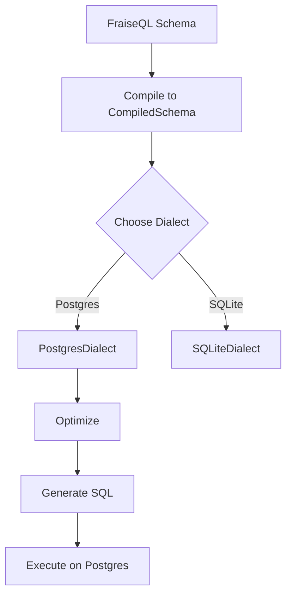

# **[Pattern] Multi-Database Compilation Reference Guide**

---

## **1. Overview**
The **Multi-Database Compilation** pattern enables **database-agnostic schema compilation** in FraiseQL, generating a **CompiledSchema** that abstracts platform-specific SQL quirks. This schema can then be deployed to **PostgreSQL, SQLite, Oracle, MySQL, or SQL Server** with **runtime optimizations** based on the target database.

The pattern simplifies cross-database deployments by:
- **Abstracting SQL dialect differences** (e.g., `LIMIT` vs. `FETCH FIRST`, `SERIAL` vs. `AUTO_INCREMENT`).
- **Supporting schema validation** before targeting a specific database.
- **Allowing optional optimizations** (e.g., indexing strategies, query rewrite rules).
- **Enabling incremental updates** via schema diffs when databases evolve.

This guide covers key concepts, implementation steps, schema structures, query examples, and related patterns.

---

## **2. Key Concepts & Implementation**

### **2.1 Core Components**
| Component               | Description                                                                 |
|-------------------------|-----------------------------------------------------------------------------|
| **CompiledSchema**      | A database-agnostic IR (Intermediate Representation) of a schema.          |
| **Dialect**             | A plugin defining SQL syntax rules for a target database (e.g., `PostgresDialect`). |
| **Optimizer**           | Optional rules to transform the schema (e.g., materialized views, CTEs). |
| **Target Generator**    | Converts `CompiledSchema` to platform-specific SQL (e.g., PostgreSQL `CREATE TABLE`). |
| **Schema Registry**     | Tracks schema versions and diffs for migration support.                     |

### **2.2 Workflow**
1. **Compile** a schema (in FraiseQL’s native DSL or SQL) → **`CompiledSchema`**.
2. **Attach a dialect** (e.g., `PostgresDialect`) to define platform-specific behavior.
3. **Apply optimizations** (if needed) via an optimizer plugin.
4. **Generate** and execute SQL for the target database.



---

## **3. Schema Reference**

### **3.1 CompiledSchema Structure**
The `CompiledSchema` is a hierarchical JSON-like structure with these top-level fields:

| Field          | Type               | Description                                                                 |
|----------------|--------------------|-----------------------------------------------------------------------------|
| `tables`       | `[TableDefinition]`| List of table definitions (see below).                                      |
| `views`        | `[ViewDefinition]` | Optional: Logical views (if supported by the dialect).                     |
| `functions`    | `[FunctionDefinition]`| User-defined functions (abstracted from SQL dialect).                |
| `metadata`     | `object`           | Schema versioning, dependencies, and optimization hints.                  |

#### **3.1.1 TableDefinition**
| Field          | Type               | Description                                                                 |
|----------------|--------------------|-----------------------------------------------------------------------------|
| `name`         | `string`           | Table name (sanitized for the target dialect).                             |
| `columns`      | `[ColumnDefinition]`| Column definitions (see below).                                            |
| `primary_key`  | `string[]`         | Column names forming the primary key (auto-normalized to dialect syntax).  |
| `constraints`  | `object`           | Database-specific constraints (e.g., `CHECK`, `UNIQUE`).                     |
| `indexes`      | `[IndexDefinition]`| Optional indexes (optimization hints).                                     |

#### **3.1.2 ColumnDefinition**
| Field          | Type               | Description                                                                 |
|----------------|--------------------|-----------------------------------------------------------------------------|
| `name`         | `string`           | Column name.                                                                |
| `type`         | `string`           | Abstract type (e.g., `INT`, `TEXT`, `JSON`).                                |
| `nullable`     | `boolean`          | Whether NULLs are allowed.                                                  |
| `default`      | `string`           | Default value (dialect-specific syntax abstracted).                         |
| `generated`    | `object`           | Generated column spec (e.g., `STORED | VIRTUAL`).                          |

#### **3.1.3 IndexDefinition**
| Field          | Type               | Description                                                                 |
|----------------|--------------------|-----------------------------------------------------------------------------|
| `name`         | `string`           | Index name.                                                                |
| `columns`      | `string[]`         | Columns indexed.                                                            |
| `unique`       | `boolean`          | Whether the index is unique.                                               |
| `optimizer_hint`| `string`           | Dialect-specific hints (e.g., `"BTree"` for PostgreSQL).                   |

---

### **3.2 Example: `users` Table in `CompiledSchema`**
```json
{
  "tables": [
    {
      "name": "users",
      "columns": [
        {
          "name": "id",
          "type": "SERIAL",
          "nullable": false,
          "primary_key": true
        },
        {
          "name": "username",
          "type": "TEXT",
          "nullable": false,
          "unique": true
        },
        {
          "name": "email",
          "type": "TEXT",
          "nullable": false
        }
      ],
      "indexes": [
        {
          "name": "idx_users_email",
          "columns": ["email"],
          "unique": false,
          "optimizer_hint": "BTree"
        }
      ]
    }
  ]
}
```

---

## **4. Query Examples**

### **4.1 Compiling a Query to `CompiledSchema`**
FraiseQL accepts both **native DSL** and **standard SQL**:
```python
# Native DSL (recommended for cross-database portability)
query = users.select(
    columns=[users.id, users.username],
    where=users.email.like("%@example.com%")
)
compiled_query = query.compile()
```

**Output (`CompiledSchema` for query):**
```json
{
  "select": {
    "columns": ["id", "username"],
    "from": "users",
    "where": {
      "operator": "LIKE",
      "column": "email",
      "value": "%@example.com%"
    }
  }
}
```

### **4.2 Generating Database-Specific SQL**
Attach a dialect and generate SQL for PostgreSQL:
```python
from fraise.dialects import PostgresDialect
postgres_dialect = PostgresDialect()
sql = compiled_query.to_sql(dialect=postgres_dialect)
print(sql)
```
**Output (PostgreSQL):**
```sql
SELECT id, "username"
FROM "users"
WHERE "email" LIKE '%@example.com%'
```

**For SQLite (same `CompiledSchema`):**
```python
from fraise.dialects import SqliteDialect
sqlite_dialect = SqliteDialect()
sql = compiled_query.to_sql(dialect=sqlite_dialect)
print(sql)
```
**Output (SQLite):**
```sql
SELECT id, username
FROM users
WHERE email LIKE '%@example.com%'
```

### **4.3 Optimized Queries with Dialect Plugins**
Some dialects support **query rewrites**. Example: PostgreSQL’s `EXPLAIN ANALYZE` hint:
```python
from fraise.optimizers import ExplainAnalyzer
optimizer = ExplainAnalyzer()
optimized_query = compiled_query.optimize(optimizer)
sql = optimized_query.to_sql(PostgresDialect())
print(sql)
```
**Output (PostgreSQL with optimization):**
```sql
/*+ ExplainAnalyzer */
SELECT id, username
FROM users
WHERE email LIKE '%@example.com%'
```

---

## **5. Related Patterns**

| Pattern                  | Description                                                                 | When to Use                          |
|--------------------------|-----------------------------------------------------------------------------|--------------------------------------|
| **Schema Versioning**    | Tracks changes to `CompiledSchema` across deployments.                     | Managing schema migrations.           |
| **Dialect-Parallel Query**| Runs the same query on multiple databases simultaneously.               | Reporting dashboards with multi-DB sources. |
| **Materialized Views**   | Pre-computes aggregations in the target database.                        | Performance-critical read-heavy workloads. |
| **Connection Pooling**   | Manages database connections efficiently for cross-database queries.       | High-concurrency applications.        |
| **A/B Testing Schema**   | Deploys experimental schemas to a subset of databases.                    | Canary releases for schema changes.   |

---

## **6. Common Pitfalls & Mitigations**

| Pitfall                          | Cause                                  | Mitigation                              |
|----------------------------------|----------------------------------------|-----------------------------------------|
| **Dialect conflicts**            | Schema relies on SQL features unsupported by a target DB. | Use `fallback_to_standard_sql`.          |
| **Schema drift**                 | Manual SQL edits break the `CompiledSchema`. | Enforce schema-as-code workflows.       |
| **Performance regressions**      | Optimizations break on certain dialects. | Test optimizers against all supported DBs. |
| **Idempotency issues**           | Duplicate `CREATE TABLE` statements.   | Use `IF NOT EXISTS` clauses in generators. |

---

## **7. Extending the Pattern**
To add support for a new database:
1. **Implement a dialect plugin** (`fraise.dialects.NewDialect`).
2. **Define schema translation rules** (e.g., `AUTO_INCREMENT` → `SERIAL`).
3. **Register the dialect** in FraiseQL’s plugin system.
4. **Test optimizations** against the new dialect.

Example dialect plugin skeleton:
```python
from fraise.dialects import Dialect

class OracleDialect(Dialect):
    def _translate_type(self, type: str) -> str:
        if type == "SERIAL":
            return "NUMBER GENERATED ALWAYS AS IDENTITY"
        return type  # Fallback to standard SQL

    def _add_table_constraint(self, constraint: str) -> str:
        return f"CONSTRAINT {constraint} CHECK ({constraint})"
```

---
**Next Steps:**
- [FraiseQL Schema DSL Reference](#)
- [Dialect Plugin API](#)
- [Optimizer Guidelines](#)