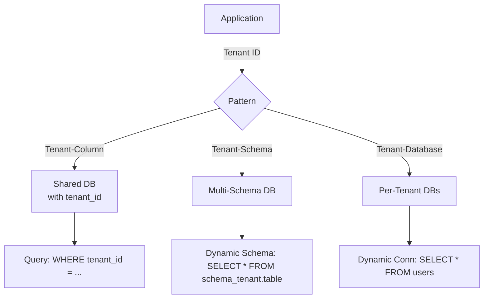

---
**[Pattern] Multi-Tenancy Database Patterns – Reference Guide**

---

### **1. Overview**
Multi-tenant architecture enables a single application instance to serve multiple customers (**tenants**), each with **data isolation** while sharing infrastructure. This pattern reduces operational costs and scalability challenges compared to dedicated environments. Three primary database strategies emerge, each balancing **tenant isolation**, **performance**, **complexity**, and **customization**:

- **Shared Database with Tenant Identifier (Tenant-Column Pattern)** – A single database table per entity with an added `tenant_id` column to segment data.
- **Schema-per-Tenant (Tenant-Schema Pattern)** – Each tenant’s data resides in isolated schemas within the same database.
- **Database-per-Tenant (Tenant-Database Pattern)** – A dedicated database instance per tenant, providing maximal isolation but higher overhead.

**When to Use:**
| Scenario                     | Recommended Approach                     |
|------------------------------|------------------------------------------|
| Low-cost, scalable hosting   | Tenant-Column or Tenant-Schema           |
| High-security/regulatory needs| Tenant-Database or Tenant-Schema         |
| Minimal customization        | Tenant-Column                             |
| Tenant-specific schema rules | Tenant-Schema or Tenant-Database         |

---

### **2. Key Concepts & Tradeoffs**

| **Aspect**           | **Tenant-Column**               | **Tenant-Schema**                | **Tenant-Database**              |
|----------------------|----------------------------------|----------------------------------|----------------------------------|
| **Isolation Level**  | Medium (logical via `tenant_id`) | High (schema-level)             | Highest (physical)               |
| **Scalability**      | High (single DB)                 | Medium (schema limits)           | High (independent DBs)           |
| **Performance**      | Good (minimal queries)           | Good (indexes per schema)        | Good (dedicated resources)       |
| **Complexity**       | Low (no schema changes)          | Medium (schema migrations)       | High (DB provisioning)            |
| **Customization**    | Low (shared schema)              | Medium (tenant-specific rules)   | High (full DB autonomy)           |
| **Cost**             | Low (single DB)                  | Medium (DB storage)               | High (DB licenses/hosting)       |

---

### **3. Schema Reference**

#### **3.1 Tenant-Column Pattern**
**Shared Table with `tenant_id` Column:**
Each table includes an `id` (primary key) and a `tenant_id` (foreign key to `tenants` table).

| Table Name   | Columns                          | Description                                                                 |
|--------------|----------------------------------|-----------------------------------------------------------------------------|
| **tenants**  | `id` (UUID/INT), `name`, `created_at` | Stores tenant metadata. Example: `tenants(id, name, created_at)`            |
| **users**    | `id`, `email`, `tenant_id` (FK) | Example: `users(id, email, tenant_id)`                                     |
| **products** | `id`, `name`, `tenant_id` (FK)   | Example: `products(id, name, tenant_id, price)`                            |

**Key Constraints:**
```sql
-- Example: Ensure tenant_id references tenants.id
ALTER TABLE users ADD CONSTRAINT fk_user_tenant
    FOREIGN KEY (tenant_id) REFERENCES tenants(id);
```

---

#### **3.2 Tenant-Schema Pattern**
**Isolated Schemas per Tenant:**
Each tenant’s data resides in a schema (e.g., `tenant_1`, `tenant_2`).

**Schema Creation (Example):**
```sql
-- Create a schema for each tenant
CREATE SCHEMA tenant_1;
CREATE SCHEMA tenant_2;
```

**Shared Tenant Registry:**
```sql
CREATE TABLE tenants (
    id UUID PRIMARY KEY,
    schema_name VARCHAR(50) UNIQUE NOT NULL  -- e.g., 'tenant_1'
);
```

**Tenant-Specific Tables:**
```sql
-- Within tenant_1 schema:
CREATE TABLE tenant_1.users (
    id SERIAL PRIMARY KEY,
    email VARCHAR(255) UNIQUE
);
```

**Querying Across Schemas:**
Use dynamic SQL or application-level routing to qualify table names (e.g., `tenant_1.users`).

---

#### **3.3 Tenant-Database Pattern**
**Dedicated Database per Tenant:**
Each tenant has its own database instance (e.g., `tenant_1_db`, `tenant_2_db`).

**Tenant Registry (Shared):**
```sql
CREATE TABLE tenants (
    id UUID PRIMARY KEY,
    database_name VARCHAR(50) UNIQUE NOT NULL  -- e.g., 'tenant_1_db'
);
```

**Database Creation (Example):**
```sql
-- Pseudocode (varies by DBMS)
CREATE DATABASE tenant_1_db;
```

**Connection Management:**
Applications dynamically connect to `tenant_X_db` based on the tenant ID.

---

### **4. Query Examples**

#### **4.1 Tenant-Column Pattern**
**Example: Fetch Users for a Tenant**
```sql
-- Get all users for tenant_id = 'XYZ123'
SELECT * FROM users
WHERE tenant_id = 'XYZ123';
```

**Example: Add Index for Performance**
```sql
CREATE INDEX idx_users_tenant_id ON users(tenant_id);
```

---

#### **4.2 Tenant-Schema Pattern**
**Example: Dynamic Schema Query (PostgreSQL)**
```sql
-- Parameters: %s = schema name, %s = tenant_id
DO $$
BEGIN
    EXECUTE format('SELECT * FROM %I.users WHERE tenant_id = %L', 'tenant_1', 'XYZ123');
END $$;
```

**Example: Schema-Specific Index**
```sql
-- Within tenant_1 schema:
CREATE INDEX idx_tenant_1_users_email ON tenant_1.users(email);
```

---

#### **4.3 Tenant-Database Pattern**
**Example: Query via Dynamic Connection**
```sql
-- Pseudocode (application logic):
1. Resolve db_name from tenant_id (e.g., 'tenant_1_db').
2. Connect to db_name and run:
   SELECT * FROM users WHERE email = 'user@example.com';
```

**Example: Database-Specific Index**
```sql
-- In tenant_1_db:
CREATE INDEX idx_users_email ON users(email);
```

---

### **5. Implementation Considerations**

#### **5.1 Data Migration**
- **Tenant-Column/Schema:**
  Use tools like **Flyway**, **Liquibase**, or **AWS Database Migration Service**.
  Example (Flyway SQL):
  ```sql
  -- Migrate users table for tenant_1
  INSERT INTO tenant_1.users (id, email) VALUES (1, 'user@example.com');
  ```
- **Tenant-Database:**
  Scripted dumps/restores or **ETL pipelines**.

#### **5.2 Security**
- **Tenant-Column:** Row-level security (RLS) or application filters.
- **Tenant-Schema:** Schema permissions (e.g., `GRANT USAGE ON SCHEMA tenant_1 TO app_user;`).
- **Tenant-Database:** Database-level roles and firewalls.

#### **5.3 Monitoring & Analytics**
- **Shared Metrics:** Use `tenant_id` in application logs (e.g., ELK stack).
- **Schema/DB Metrics:** Query `pg_stat_activity` (PostgreSQL) or equivalent.

---

### **6. Query Patterns for Isolation**

| Pattern               | Tenant-Column                          | Tenant-Schema                          | Tenant-Database                     |
|-----------------------|----------------------------------------|----------------------------------------|-------------------------------------|
| **Read Operations**   | `WHERE tenant_id = ?`                  | Dynamic schema lookup                  | Dynamic connection                  |
| **Write Operations**  | `INSERT INTO table(tenant_id, ...)`    | `INSERT INTO schema_tenant.table(...)` | Same as shared DB                   |
| **Partitioning**      | Range/Hash partitioning on `tenant_id` | N/A (use schema names)                | N/A                                 |
| **Backup**            | Single DB backup                       | Schema-level backup                    | Per-DB backup                       |

---

### **7. Performance Optimization**

#### **7.1 Tenant-Column**
- **Indexing:** Add composite indexes on `tenant_id` + hot columns (e.g., `users(tenant_id, email)`).
- **Sharding:** Partition tables by `tenant_id` (PostgreSQL `pg_partman`).

#### **7.2 Tenant-Schema**
- **Connection Pooling:** Reuse schema-specific poolers.
- **Avoid Schema Bloat:** Limit schemas to ~100 (PostgreSQL limit).

#### **7.3 Tenant-Database**
- **Resource Limits:** Set CPU/memory quotas per DB.
- **Replication:** Async replicas for read scaling.

---

### **8. Migration Strategies**

| From → To               | Steps                                                                 |
|-------------------------|------------------------------------------------------------------------|
| **Tenant-Column → Schema** | 1. Add `schema_name` column to tables. 2. Split data/indices. 3. Migrate. |
| **Schema → Database**   | 1. Create new DB per schema. 2. Replicate data. 3. Update app logic.    |
| **Database → Schema**   | 1. Consolidate DBs into a parent DB. 2. Convert schemas.              |

**Tools:**
- **AWS:** RDS Multi-AZ + Migration Service.
- **PostgreSQL:** `pg_dump`/`pg_restore` + `ALTER SCHEMA`.

---

### **9. Related Patterns**
1. **[Row-Level Security (RLS)](https://www.postgresql.org/docs/current/ddl-rowsecurity.html)**
   - Complements Tenant-Column by enforcing access at the row level.
   - Example:
     ```sql
     ALTER TABLE users ENABLE ROW LEVEL SECURITY;
     CREATE POLICY user_policy ON users USING (tenant_id = current_setting('app.current_tenant'));
     ```

2. **[Event Sourcing](https://martinfowler.com/eaaP.html)**
   - Useful for Tenant-Database to track tenant-specific audit logs.

3. **[Database Sharding](https://www.percona.com/blog/2018/10/25/database-sharding-the-good-the-bad-and-the-ugly/)**
   - Hybrid approach: Shard Tenant-Column tables by `tenant_id` ranges.

4. **[Microservices with Tenancy](https://microservices.io/)**
   - Combine with Tenant-Database for full tenant autonomy.

5. **[Canonical Model](https://martinfowler.com/eaaCatalog/canonicalModel.html)**
   - Normalize shared entities (e.g., `users`, `products`) while keeping tenant-specific data isolated.

---

### **10. Anti-Patterns to Avoid**
- **Ambiguous Queries:** Never assume `tenant_id` is in scope (always filter explicitly).
- **Schema Lockdown:** Avoid over-restricting schema names (e.g., reserving `tenant_` prefix).
- **Database Bloat:** Let Tenant-Database grow unbounded (monitor costs).
- **Hardcoded Tenant Logic:** Dynamically resolve tenant context (e.g., via middleware).

---

### **11. Example Architecture**


---
**Appendix A: Database-Specific Notes**
| DBMS       | Tenant-Column Tips                          | Tenant-Schema Tips                          | Tenant-Database Tips                     |
|------------|---------------------------------------------|---------------------------------------------|------------------------------------------|
| **PostgreSQL** | Use `pg_partman` for partitioning.         | Enable `search_path` for schema routing.    | Use `pg_backup_directory` for backups.   |
| **MySQL**    | Add `tenant_id` to all shared tables.       | Use `CREATE SCHEMA IF NOT EXISTS`.          | InnoDB for consistency.                 |
| **SQL Server** | Use `sp_rename` for schema/table updates.  | `IF SCHEMA_ID('tenant_X') IS NULL` checks.  | Always-on availability groups.           |