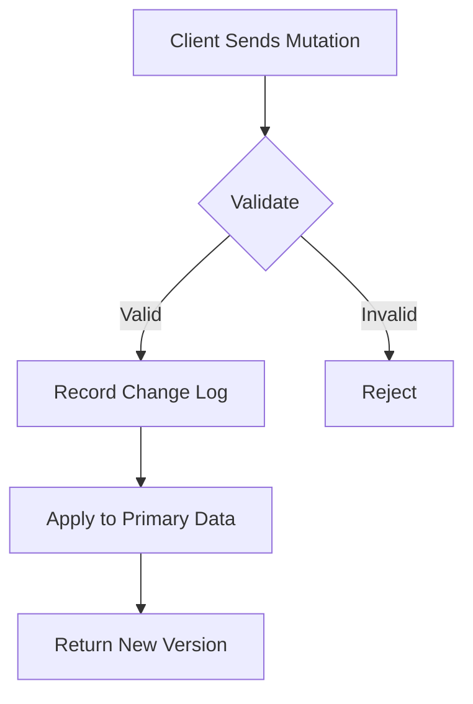

# **[Pattern] Mutation Observability via Change Log – Reference Guide**

---

## **Overview**
The **Mutation Observability via Change Log** pattern provides a structured way to track changes made to immutable or semi-immutable data (e.g., objects, documents, or records) by recording all mutations (additions, updates, or deletions) in a dedicated **change log**. This approach enhances auditability, enables precise rollback capabilities, and supports forensic analysis of system state evolution. By separating the change log from the primary data, this pattern ensures reconciliation between current state and historical context without degrading write performance.

This pattern is particularly useful in systems requiring:
- **Regulatory compliance** (e.g., financial transactions, healthcare records).
- **Data lineage** (tracking "who changed what and when").
- **Time-travel debugging** (recovering prior states after failures).
- **Event sourcing** (building applications where state is derived entirely from a sequence of events).

---

## **Core Concepts**
| **Term**               | **Definition**                                                                                     | **Example**                          |
|-------------------------|-----------------------------------------------------------------------------------------------------|--------------------------------------|
| **Immutable Data**      | Data that, once written, cannot be modified (e.g., blockchain entries, append-only logs).           | JSON document in a NoSQL DB.         |
| **Change Log**          | A persistent store of mutation records (e.g., CRUD operations) indexed by entity and version.      | `/changes/{entityId}/v1`, `/changes/{entityId}/v2`. |
| **Version Vector**      | A unique identifier for each state (e.g., `entityId#version#timestamp`).                          | `order_123#v5_2024-01-15T14:30:00Z`. |
| **Audit Trail**         | The complete sequence of change log entries for a given entity.                                   | All versions of a user profile.      |
| **Mutation Record**     | A structured payload describing an operation (e.g., `PATCH`, `DELETE`, `CREATE`).                | `{ op: "UPDATE", field: "status", oldValue: "active", newValue: "inactive" }`. |
| **Reconciliation**      | The process of applying change logs to reconstruct a prior state.                                  | Restoring a database to a snapshot.  |

---

## **Schema Reference**
### **1. Change Log Entry Schema**
| Field               | Type            | Required | Description                                                                                     | Example Value                     |
|---------------------|-----------------|----------|-------------------------------------------------------------------------------------------------|-----------------------------------|
| `entityId`          | `string`        | Yes      | Unique identifier for the mutated entity (e.g., database row ID or UUID).                      | `"user_789abc"`                   |
| `version`           | `integer`       | Yes      | Monotonically increasing version number for the entity.                                          | `3`                                |
| `timestamp`         | `datetime`      | Yes      | When the mutation was recorded (ISO 8601 format).                                              | `"2024-01-15T14:30:00.123Z"`      |
| `userId`            | `string`        | Yes      | Identifier of the user/actor performing the mutation (for accountability).                     | `"admin_456"`                     |
| `operation`         | `enum`          | Yes      | Type of mutation (`CREATE`, `UPDATE`, `DELETE`, `REPLACE`).                                   | `"UPDATE"`                        |
| `metadata`          | `object`        | No       | Contextual data (e.g., IP address, application name).                                          | `{ app: "api-gateway", ip: "192.168.1.1" }` |
| `payload`           | `object`        | Yes      | Details of the mutation (varies by operation).                                                 | See operation-specific schemas.   |

---

### **2. Operation-Specific Payloads**
| **Operation** | **Schema**                                                                                     | **Example**                                                                                     |
|----------------|------------------------------------------------------------------------------------------------|-----------------------------------------------------------------------------------------------|
| **CREATE**     | `{ fields: { [key: string]: value } }`                                                         | `{ fields: { name: "Alice", email: "alice@example.com" } }`    |
| **UPDATE**     | `{ fields: { [key: string]: { oldValue: any, newValue: any } }, changedFields: [string] }`   | `{ fields: { status: { oldValue: "active", newValue: "pending" } }, changedFields: ["status"] }` |
| **DELETE**     | `{ fields: { [key: string]: any } }`                                                           | `{ fields: { name: "Alice", email: "alice@example.com" } }`    |
| **REPLACE**    | `{ fullPayload: { [key: string]: value } }`                                                   | `{ fullPayload: { name: "Bob", email: "bob@example.com", status: "active" } }`               |

---

### **3. Example Change Log Entry**
```json
{
  "entityId": "user_789abc",
  "version": 4,
  "timestamp": "2024-01-15T14:30:00.123Z",
  "userId": "admin_456",
  "operation": "UPDATE",
  "metadata": {
    "app": "user-service",
    "ip": "192.168.1.1"
  },
  "payload": {
    "fields": {
      "status": {
        "oldValue": "active",
        "newValue": "inactive"
      },
      "lastLogin": {
        "oldValue": null,
        "newValue": "2024-01-14T09:00:00Z"
      }
    },
    "changedFields": ["status", "lastLogin"]
  }
}
```

---

## **Implementation Patterns**
### **1. Storage Layer**
- **Store the change log separately** from the primary data (e.g., dedicated database table or NoSQL collection).
- **Index by `entityId` and `version`** for efficient querying.
- **Use append-only storage** (e.g., Kafka, Cassandra) if high write throughput is required.

### **2. Write Path (Mutation Flow)**
1. **Validate** the mutation (e.g., permissions, business rules).
2. **Record the change log entry** (including `oldValue` if applicable).
3. **Apply the mutation** to the primary data.
4. **Return the new `version`** to clients.



### **3. Read Path (Reconciliation)**
- **Current state**: Query the primary data store.
- **Historical state**: Query the change log up to a specific `version` or `timestamp`.
- **Conflict resolution**: Use `version` vectors to handle concurrent writes.

### **4. Tools & Libraries**
| **Tool/Library**       | **Purpose**                                                                                     |
|------------------------|-------------------------------------------------------------------------------------------------|
| **Delta Lake**         | Open-source storage layer for change tracking in data lakes.                                   |
| **Apache Kafka**       | Event streaming for immutable logs with high availability.                                      |
| **PostgreSQL JSONB**   | Store change logs as structured JSON within rows.                                               |
| **Datomic**            | Database built on audit trails and immutable data.                                             |
| **Custom CRDTs**       | Conflict-free replicated data types for distributed systems.                                   |

---

## **Query Examples**
### **1. Fetch All Changes for an Entity**
```sql
-- SQL (PostgreSQL)
SELECT * FROM change_log
WHERE entityId = 'user_789abc'
ORDER BY version;
```

```javascript
// NoSQL (MongoDB)
db.changeLog.find({ entityId: "user_789abc" }).sort({ version: 1 });
```

### **2. Get a Specific Version of an Entity**
```javascript
// Reconstruct state by applying change logs up to version 3
const initialState = {}; // Entity created at version 1
const changeLogs = db.changeLog.find({ entityId: "user_789abc" })
                           .sort({ version: 1 })
                           .limit(3); // Versions 1-3

changeLogs.forEach(log => {
  if (log.operation === "CREATE") {
    initialState = log.payload.fields;
  } else if (log.operation === "UPDATE") {
    for (const field in log.payload.fields) {
      initialState[field] = log.payload.fields[field].newValue;
    }
  }
});
console.log(initialState);
```

### **3. Find When a Specific Field Was Changed**
```sql
-- SQL (PostgreSQL)
SELECT *
FROM change_log
WHERE entityId = 'user_789abc'
AND changedFields @> ARRAY['email'];
```

### **4. Audit Trail for Compliance**
```javascript
// Export all changes for auditing
db.changeLog.aggregate([
  { $match: { entityId: "user_789abc" } },
  { $sort: { timestamp: 1 } },
  { $project: {
      _id: 0,
      userId: 1,
      timestamp: 1,
      operation: 1,
      changedFields: 1
  }}
]);
```

---

## **Performance Considerations**
| **Aspect**               | **Recommendation**                                                                                     |
|---------------------------|-------------------------------------------------------------------------------------------------------|
| **Write Latency**         | Minimize change log writes by batching (e.g., write once per transaction).                           |
| **Read Performance**      | Cache frequently accessed entities or use materialized views for snapshots.                           |
| **Storage Growth**        | Compress old change logs or archive them after a retention period (e.g., 7 years).                |
| **Concurrency**           | Use optimistic locking (e.g., `version` checks) to prevent overwrites.                               |

---

## **Related Patterns**
| **Pattern**                          | **Relationship**                                                                                     | **When to Use Together**                                                                         |
|---------------------------------------|-----------------------------------------------------------------------------------------------------|---------------------------------------------------------------------------------------------------|
| **[Event Sourcing](https://eventstorming.com/event-sourcing)** | Change logs are a form of event store.                                                             | When building event-driven architectures with state derived from events.                         |
| **[Optimistic Locking](https://martinfowler.com/eaaCatalog/optimisticOff.pdf)** | Uses `version` to detect concurrent writes.                                                        | To prevent lost updates in multi-user systems.                                                 |
| **[CRDTs (Conflict-Free Replicated Data Types)](https://en.wikipedia.org/wiki/Conflict-free_replicated_data_type)** | Immutability + mergeable states.                                                                   | For distributed systems where consistency across nodes is critical.                               |
| **[Immutable Data Structures](https://en.wikipedia.org/wiki/Persistent_data_structure)** | Change logs enable immutable snapshots.                                                            | When working with functional programming paradigms.                                              |
| **[Audit Logging](https://www.owasp.org/index.php/Audit_Logging)** | Change logs serve as an extended audit trail.                                                      | For compliance (e.g., PCI-DSS, GDPR) or internal investigations.                                |

---

## **Anti-Patterns & Pitfalls**
| **Anti-Pattern**               | **Risk**                                                                                              | **Mitigation**                                                                                     |
|---------------------------------|------------------------------------------------------------------------------------------------------|---------------------------------------------------------------------------------------------------|
| **Storing Change Logs In-Place** | Primary data corruption can delete audit trails.                                                   | Keep change logs in a separate, immutable store.                                                  |
| **No Version Vectoring**        | Concurrent writes risk overwrites without detection.                                                | Use `version` or timestamps to detect and resolve conflicts.                                       |
| **Ignoring Retention Policies**  | Unbounded storage growth.                                                                        | Archive or delete old logs after compliance retention periods.                                     |
| **Overhead on Frequent Updates** | Excessive change log queries slow down reads.                                                       | Use caching or denormalized views for common queries.                                             |
| **No Field-Level Auditing**     | Hard to trace changes to specific attributes.                                                      | Include `changedFields` in each mutation record.                                                   |

---

## **Example Use Cases**
1. **Financial Systems**
   - Track every transaction change to `accountBalance` for fraud detection.
   - Enable precise rollbacks after successful testing of new algorithms.

2. **Healthcare Records**
   - Maintain an immutable audit trail of patient data modifications (HIPAA compliance).
   - Reconstruct prior diagnoses for clinical review.

3. **Configuration Management**
   - Log every change to `server.yaml` to debug production outages.
   - Support time-travel debugging of deployments.

4. **Blockchain**
   - Mimic Bitcoin’s UTXO model where all spends are logged in a change log.

---

## **Further Reading**
- [Event Sourcing](https://www.eventstore.com/blog/event-sourcing-basics-part-1-introduction)
- [CRDTs by Otto](https://github.com/othree/crdt-examples)
- [Datomic’s Audit Trail](https://www.datomic.com/immutable-audit-trail.html)
- [OWASP Audit Logging](https://cheatsheetseries.owasp.org/cheatsheets/Audit_Logging_Cheat_Sheet.html)