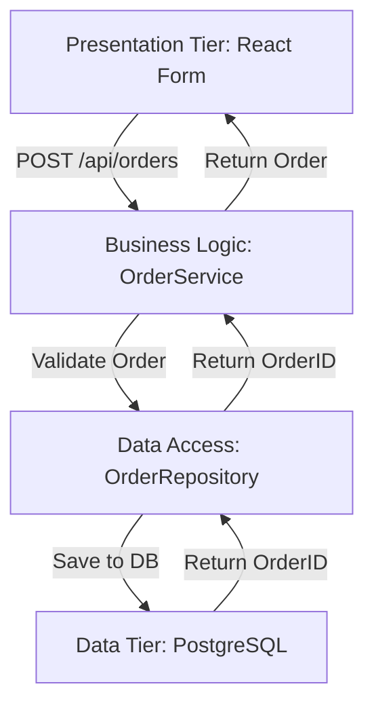

# **[Pattern] N-Tier Architecture Reference Guide**

---

## **Overview**
The **N-Tier Architecture** pattern organizes an application into discrete, loosely coupled layers, each responsible for a specific functional area (e.g., user interface, business logic, data access). By separating concerns, this pattern enhances modularity, reusability, testability, and scalability. The "N" in N-Tier represents the varying number of tiers used (e.g., 2-tier, 3-tier, or multi-tier). It is commonly applied to enterprise systems to decouple technology stacks (e.g., web frontends, APIs, and databases) and facilitate independent evolution of components.

Key benefits include:
- **Clear separation of responsibilities** (e.g., UI, logic, data).
- **Improved maintainability** via layer isolation.
- **Easier testing** through mocking dependencies.
- **Scalability** via horizontal scaling of individual tiers.

---

## **Schema Reference**

| **Component**       | **Description**                                                                                     | **Responsibilities**                                                                                     | **Communication Mechanism**                                                                 | **Example Technologies**                                                                 |
|----------------------|-----------------------------------------------------------------------------------------------------|----------------------------------------------------------------------------------------------------------|---------------------------------------------------------------------------------------------|-----------------------------------------------------------------------------------------|
| **Presentation Tier** | Handles user interaction (e.g., web, mobile, or API endpoints).                                     | - Renders UI/UX. <br>- Captures input. <br>- Communicates with business logic.                       | REST, GraphQL, gRPC, Message Queues (e.g., Kafka).                                      | React, ASP.NET Core MVC, Django, Flutter.                                               |
| **Business Logic Tier** | Encompasses core application rules, workflows, and domain logic.                                   | - Validates input/output. <br>- Manages transactions. <br>- Orchestrates workflows.                  | API calls, Service Contracts (e.g., DTOs), Event-Driven (e.g., CQRS).                    | CQRS, DDD Boundaries, MediatR (C#), Spring Data JPA (Java).                            |
| **Data Access Tier**   | Mediates interactions between the application and storage systems (e.g., databases, caches).       | - Executes queries/transactions. <br>- Maps data to objects. <br>- Handles persistence.              | ORMs, SQL, NoSQL drivers, Microservices Communication.                                  | Entity Framework (C#), Hibernate (Java), MongoDB Driver, Redis.                         |
| **Data Tier**        | Physical storage layer (e.g., relational databases, NoSQL, file systems).                         | - Stores raw data. <br>- Enforces schema constraints. <br>- Optimizes queries.                     | SQL, Document Stores, Graph Databases.                                                    | PostgreSQL, MongoDB, Cassandra, Elasticsearch.                                         |
| **External Systems** | Integrations with third-party services (e.g., payment gateways, analytics).                       | - Calls external APIs. <br>- Processes responses. <br>- Handles errors/retries.                     | HTTP/REST, SOAP, WebSockets, RPC.                                                      | Stripe API, Google Analytics, Twilio.                                                   |

---
**Note**: In modern architectures, tiers may overlap or be distributed (e.g., microservices), but logical separation remains critical.

---

## **Implementation Details**

### **1. Core Principles**
- **Loose Coupling**: Tiers should depend on abstractions (e.g., interfaces) rather than concrete implementations.
- **Single Responsibility**: Each tier focuses on one concern (e.g., UI ≠ logic ≠ data).
- ** contracts**: Define clear boundaries via contracts (e.g., DTOs, APIs, events).
- **Isolation**: Failures in one tier (e.g., database) should not crash others.

### **2. Common Variations**
| **Pattern**               | **Description**                                                                                     | **Use Case**                                                                                     |
|---------------------------|-----------------------------------------------------------------------------------------------------|--------------------------------------------------------------------------------------------------|
| **3-Tier Architecture**   | Presentation → Business Logic → Data Access.                                                       | Traditional enterprise apps (e.g., ERP systems).                                               |
| **4-Tier (N-Tier)**       | Adds a **Data Tier** (e.g., database) separate from the Data Access layer.                         | High-scalability apps requiring strict separation of storage.                                  |
| **Microservices N-Tier**  | Each microservice follows N-Tier internally but communicates via APIs/gRPC.                       | Distributed systems (e.g., e-commerce platforms).                                              |
| **CQRS**                  | Separates **Read** (Query) and **Write** (Command) paths into distinct tiers.                      | High-performance systems (e.g., financial trading).                                            |

---
### **3. Best Practices**
#### **Design**
- **Use Dependency Injection (DI)** to manage tier dependencies (e.g., Inversion of Control).
- **Avoid Circular Dependencies**: Tiers should not reference each other directly (e.g., UI tier should not call data tier).
- **Layer Abstraction**: Expose only interfaces/contracts between tiers (e.g., `IUserRepository` instead of `SqlUserRepository`).

#### **Development**
- **Layer-Specific Testing**:
  - **Unit Tests**: Business Logic Tier.
  - **Integration Tests**: Data Access Tier (mock databases).
  - **End-to-End Tests**: Full stack (e.g., Selenium, Postman).
- **Versioning**: Keep tier contracts stable (e.g., Semantic Versioning for APIs).

#### **Deployment**
- **Containerization**: Use Docker/Kubernetes to isolate tiers for scalability.
- **Database Sharding**: Split Data Tier horizontally for large-scale apps.
- **Caching**: Implement in the Business Logic or Presentation Tier (e.g., Redis).

---

## **Query Examples**

### **1. Example: 3-Tier Web Application**
**Scenario**: User submits a "Create Order" form in a React frontend.



**Code Snippets**:
- **Presentation Tier (React)**:
  ```javascript
  const handleSubmit = async (orderData) => {
    const response = await fetch('/api/orders', {
      method: 'POST',
      body: JSON.stringify(orderData)
    });
    const order = await response.json();
    console.log('Order created:', order);
  };
  ```

- **Business Logic Tier (C#)**:
  ```csharp
  public class OrderService {
    private readonly IOrderRepository _repo;

    public OrderService(IOrderRepository repo) => _repo = repo;

    public async Task<Order> CreateOrder(OrderDto orderDto) {
      if (!orderDto.IsValid()) throw new ValidationException();
      var order = new Order(orderDto);
      await _repo.SaveAsync(order);
      return order;
    }
  }
  ```

- **Data Access Tier (Entity Framework Core)**:
  ```csharp
  public class OrderRepository : IOrderRepository {
    private readonly AppDbContext _context;

    public async Task SaveAsync(Order order) {
      _context.Orders.Add(order);
      await _context.SaveChangesAsync();
    }
  }
  ```

---

### **2. Example: CQRS in N-Tier**
**Scenario**: Read/Write separation for a blog app.

```mermaid
graph TD
    A[Presentation Tier: Query] -->|GET /posts/{id}| B[Read Model Tier: PostQuery]
    B -->|Fetch Post| C[Data Tier: Redis Cache]
    C -->|Return Post| B
    B -->|Return Post| A

    D[Presentation Tier: Command] -->|POST /posts| E[Write Model Tier: PostCommand]
    E -->|Create Post| F[Data Access: PostRepository]
    F -->|Save to DB| G[Data Tier: PostgreSQL]
    G -->|Emit Event| H[Event Bus: Kafka]
    H -->|Update Cache| C
```

**Key Components**:
- **Query Tier**: Optimized for reads (e.g., Dapper, GraphQL).
- **Command Tier**: Handles writes (e.g., MediatR, Sagas).
- **Event Sourcing**: Updates Read Model via events (e.g., "PostCreated").

---

## **Related Patterns**

| **Pattern**               | **Relation to N-Tier**                                                                                     | **When to Use**                                                                                     |
|---------------------------|----------------------------------------------------------------------------------------------------------|--------------------------------------------------------------------------------------------------|
| **Dependency Injection**  | Enables loose coupling between tiers by managing dependencies externally.                              | Always (to decouple tiers).                                                                      |
| **Repository Pattern**    | Abstracts data access for the Business Logic Tier.                                                    | When the Data Access Tier needs to be swapped (e.g., SQL → NoSQL).                                |
| **CQRS**                  | Extends N-Tier by separating read/write operations.                                                    | High-performance apps with complex queries (e.g., dashboards).                                |
| **Domain-Driven Design (DDD)** | Defines bounded contexts that align with N-Tier layers.                                            | Complex domains (e.g., banking, healthcare).                                                   |
| **Microservices**         | Each microservice can internally use N-Tier, but services communicate via APIs.                       | Large-scale, distributed systems.                                                              |
| **Event-Driven Architecture** | Uses events to decouple tiers (e.g., Kafka, RabbitMQ).                                             | Asynchronous workflows (e.g., order processing).                                               |
| **API Gateway**           | Centralizes entry points for the Presentation Tier in distributed systems.                          | Microservices with multiple APIs.                                                              |
| **Caching (CDP)**         | Adds a cache tier (e.g., Redis) between Presentation and Business Logic.                           | High-traffic apps to reduce DB load.                                                          |

---

## **Anti-Patterns & Pitfalls**
| **Anti-Pattern**               | **Description**                                                                                     | **Mitigation**                                                                                     |
|--------------------------------|-----------------------------------------------------------------------------------------------------|--------------------------------------------------------------------------------------------------|
| **Tight Coupling**            | Tiers reference each other directly (e.g., UI calls DB).                                           | Use interfaces/contracts; favor DI.                                                                |
| **Fat Tiers**                 | One tier (e.g., Business Logic) does everything.                                                   | Split responsibilities (e.g., move validation to DTOs).                                           |
| **Database Direct Access**    | Business Logic Tier bypasses Data Access Tier to query DB.                                          | Enforce strict layer boundaries.                                                                |
| **Ignoring Eventual Consistency** | Caching/async writes cause data inconsistencies.                                                   | Use sagas or eventual consistency patterns.                                                       |
| **Over-Sharding**             | Splitting Data Tier too granularly increases complexity.                                           | Start with a single DB; shard only when necessary.                                                |

---

## **Tools & Frameworks**
| **Category**               | **Tools/Frameworks**                                                                                 | **Purpose**                                                                                     |
|----------------------------|-----------------------------------------------------------------------------------------------------|--------------------------------------------------------------------------------------------------|
| **Presentation Tier**      | React, Angular, ASP.NET Core MVC, Django, Flask.                                                  | Build UIs/APIs.                                                                                 |
| **Business Logic**         | MediatR (C#), Spring MVC (Java), FastAPI (Python).                                                 | Handle domain logic/workflows.                                                                  |
| **Data Access**            | Entity Framework Core, Hibernate, TypeORM, Dapper.                                                 | Map objects to databases.                                                                        |
| **ORM/ODM**                | SQLAlchemy, MongoDB Driver, JOOQ.                                                                   | Query databases.                                                                                 |
| **Testing**                | xUnit, JUnit, Jest, Mocha.                                                                        | Unit/integration tests.                                                                         |
| **Deployment**             | Docker, Kubernetes, Terraform.                                                                      | Containerize and scale tiers.                                                                  |
| **Caching**                | Redis, Memcached, NCache.                                                                          | Reduce latency for frequent queries.                                                           |
| **Event Bus**              | Kafka, RabbitMQ, Azure Service Bus.                                                               | Decouple tiers via events.                                                                     |
| **Monitoring**             | Prometheus, ELK Stack, Application Insights.                                                      | Track tier performance.                                                                       |

---
## **Further Reading**
1. **Books**:
   - *Clean Architecture* by Robert C. Martin (Uncle Bob).
   - *Domain-Driven Design* by Eric Evans.
   - *Patterns of Enterprise Application Architecture* by Martin Fowler.

2. **Articles**:
   - ["N-Tier Architecture: A Guide to Building Scalable Applications"](https://www.microsoft.com/en-us/security/documents/Whitepaper/n-tier-architecture).
   - ["CQRS and Event Sourcing" by Greg Young](https://cqrs.files.wordpress.com/2010/11/cqrs_docs.pdf).

3. **Code Samples**:
   - [Microsoft N-Tier Template](https://github.com/dotnet-architecture/eShopOnWeb).
   - [DDD N-Tier Example (C#)](https://github.com/ardalis/c clean-architecture).