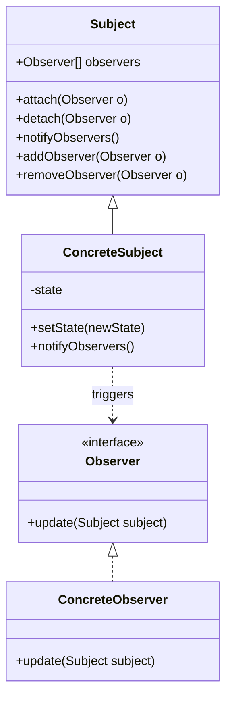

# **[Design Pattern] Observer Pattern Reference Guide**

---

## **Overview**
The **Observer Pattern** is a behavioral design pattern that establishes a **one-to-many dependency** between objects, enabling **event-driven communication**. At its core, it defines a **Subject (Observable)** that maintains a list of **Observer** objects, notifying them automatically of state changes or events. This decouples the subject from its observers, allowing flexible and scalable event handling without tight coupling.

Key use cases include:
- **UI event handling** (e.g., button clicks triggering updates).
- **Event-driven architectures** (e.g., stock market price updates).
- **Pub/Sub systems** (e.g., message brokers like Kafka or RabbitMQ).
- **State change notifications** (e.g., GUI widgets like sliders or progress bars).

The pattern is particularly useful in scenarios where **reactive programming** or **notification-based workflows** are required. By adhering to the *Loose Coupling* principle, the Observer Pattern minimizes dependencies between objects, making systems easier to extend and debug.

---

## **Schema Reference**
The Observer Pattern consists of three primary roles:

| **Component**       | **Description**                                                                                     | **Key Responsibilities**                                                                                     |
|---------------------|---------------------------------------------------------------------------------------------------|---------------------------------------------------------------------------------------------------------------|
| **Subject**         | Also called the **Observable**. Maintains a registry of observers and notifies them of changes.     | - Store observer list.                                                                                       |
|                     |                                                                                                   | - Define notification interface (`notifyObservers()`).                                                    |
|                     |                                                                                                   | - Expose methods to manage observers (`attach()`, `detach()`, `remove()`).                                  |
| **Observer**        | Defines an interface for notifying observers of subject state changes.                             | - Implement `update()` method to handle notifications.                                                      |
|                     |                                                                                                   | - Define context-specific behavior for state changes.                                                     |
| **Concrete Subject**| Implements the Subject role and triggers notifications when its state changes.                   | - Maintain internal state.                                                                                  |
|                     |                                                                                                   | - Notify observers only when relevant state changes occur (lazy updates).                                |
| **Concrete Observer**| Implements the Observer role and reacts to notifications from the Subject.                      | - Process updates (e.g., UI refresh, data processing).                                                   |
|                     |                                                                                                   | - Optionally cache state for performance or state validation.                                            |

---

### **Example Class Diagram**


---

## **Implementation Details**
### **1. Core Interfaces and Methods**
The core interfaces define the contract for the Observer Pattern:

| **Method/Property**   | **Description**                                                                                     | **Example Use Case**                                                                                     |
|-----------------------|---------------------------------------------------------------------------------------------------|-----------------------------------------------------------------------------------------------------------|
| `attach(Observer o)`  | Registers an observer with the subject.                                                           | GUI: Attach a button click listener to a button object.                                                 |
| `detach(Observer o)`  | Unregisters an observer from the subject.                                                          | Clean up event listeners to prevent memory leaks.                                                       |
| `notifyObservers()`   | Triggers all registered observers with an update.                                                  | Stock app: Notify all subscribed users of a new stock price.                                            |
| `update(Subject s)`   | Called on observers to handle notifications.                                                        | News feed: Refresh displayed content when new articles are published.                                    |

---

### **2. Implementation Considerations**
#### **A. Notification Granularity**
- **Fine-grained updates**: Notify observers only on relevant state changes (e.g., `setState()` triggers updates).
- **Bulk updates**: Group notifications to reduce overhead (e.g., batch triggers for rapid-fire events).
- **Lazy updates**: Use a queue or async task for performance-critical systems (e.g., mobile apps).

#### **B. Thread Safety**
- **Synchronization**: Use locks (`synchronized` in Java, `Mutex` in C++, or `lock()` in Python) to protect the observer list during modifications.
  ```java
  public synchronized void attach(Observer o) {
      observers.add(o);
  }
  ```
- **Concurrent Collections**: In Java, use `CopyOnWriteArrayList` for thread-safe observer lists.
  ```java
  private final List<Observer> observers = new CopyOnWriteArrayList<>();
  ```

#### **C. Memory Management**
- **Dangling References**: Avoid memory leaks by:
  - Weak references (Java’s `WeakHashMap`).
  - Explicit `detach()` calls to clean up observers.
  - Garbage collection-friendly designs (e.g., `finalize()` in Java, though discouraged today).

#### **D. Performance Optimization**
- **Observer Pooling**: Reuse observer objects to reduce garbage collection pressure.
- **Debouncing**: Throttle rapid notifications (e.g., UI updates on rapid input).
- **State Delta**: Send only changes, not full snapshots (e.g., `DeltaObserver` pattern).

---

### **3. Example Implementations**
#### **A. Java Implementation**
```java
import java.util.ArrayList;
import java.util.List;

// Observer Interface
public interface Observer {
    void update(Subject subject);
}

// Subject Interface
public interface Subject {
    void attach(Observer o);
    void detach(Observer o);
    void notifyObservers();
}

// Concrete Subject
public class WeatherStation implements Subject {
    private List<Observer> observers = new ArrayList<>();
    private float temperature;

    @Override
    public void attach(Observer o) {
        observers.add(o);
    }

    @Override
    public void detach(Observer o) {
        observers.remove(o);
    }

    @Override
    public void notifyObservers() {
        for (Observer observer : observers) {
            observer.update(this);
        }
    }

    public void setTemperature(float temperature) {
        this.temperature = temperature;
        notifyObservers(); // Trigger updates
    }
}

// Concrete Observer
public class PhoneDisplay implements Observer {
    @Override
    public void update(Subject subject) {
        if (subject instanceof WeatherStation) {
            System.out.println("Phone Display: Temperature is " +
                              ((WeatherStation) subject).temperature + "°C");
        }
    }
}

// Usage
public class Main {
    public static void main(String[] args) {
        WeatherStation station = new WeatherStation();
        station.attach(new PhoneDisplay());
        station.setTemperature(25.0f); // Notifies PhoneDisplay
    }
}
```

#### **B. Python Implementation**
```python
from abc import ABC, abstractmethod

class Observer(ABC):
    @abstractmethod
    def update(self, subject):
        pass

class Subject:
    def __init__(self):
        self._observers = []

    def attach(self, observer):
        self._observers.append(observer)

    def detach(self, observer):
        self._observers.remove(observer)

    def notify(self):
        for observer in self._observers:
            observer.update(self)

class NewsAgency(Subject):
    def __init__(self):
        super().__init__()
        self._news = ""

    @property
    def news(self):
        return self._news

    @news.setter
    def news(self, value):
        self._news = value
        self.notify()  # Auto-notify on change

class Subscriber(Observer):
    def update(self, subject):
        print(f"Subscriber received update: {subject.news}")

# Usage
agency = NewsAgency()
agency.attach(Subscriber())
agency.news = "Breaking: Observer Pattern is hot!"  # Triggers update
```

#### **C. JavaScript (EventEmitter)**
```javascript
const EventEmitter = require('events');

// Concrete Subject (EventEmitter)
const weatherStation = new EventEmitter();

// Concrete Observer
weatherStation.on('temperatureChange', (temp) => {
    console.log(`Display showing temperature: ${temp}°C`);
});

// Trigger event (notify observers)
weatherStation.emit('temperatureChange', 20);
```

---

## **Requirements and Best Practices**
### **1. Core Requirements**
| **Requirement**               | **Description**                                                                                     | **Example**                                                                                           |
|-------------------------------|---------------------------------------------------------------------------------------------------|-------------------------------------------------------------------------------------------------------|
| **Decoupled Components**      | Observers are unaware of the subject’s implementation.                                             | Subject updates UI without knowing if it’s a button or slider.                                      |
| **Dynamic Registration**      | Observers can attach/detach at runtime.                                                           | Users subscribe/unsubscribe to notifications in real-time.                                             |
| **State Change Notification** | Observers react to subject state changes.                                                          | Stock app updates UI when stock prices change.                                                        |
| **Thread Safety**             | Concurrent access to observer lists must be safe.                                                 | Use locks or thread-safe collections.                                                                 |

---

### **2. Best Practices**
1. **Minimize Observer Overhead**:
   - Avoid registering unnecessary observers.
   - Use lazy initialization for expensive observers.

2. **Avoid Circular Dependencies**:
   - Ensure observers don’t hold references to the subject that could cause cycles.
   - Example: A `View` observing a `Model` should not keep a hard reference to it.

3. **Handle Edge Cases**:
   - Null checks for observers before notifying.
   - Graceful handling of observer failures (e.g., logging errors without crashing).

4. **Optimize Performance**:
   - Use object pooling for observers.
   - Batch notifications for rapid updates (e.g., UI rendering).

5. **Document Contracts**:
   - Clearly specify which state changes trigger notifications.
   - Example: "The `WeatherStation` notifies observers only when `temperature` changes."

6. **Consider Alternatives for Complex Systems**:
   - **Publish-Subscribe (Pub/Sub)**: For large-scale distributed systems (e.g., Kafka, RabbitMQ).
   - **Event Bus**: Decouples components further (e.g., Android’s `EventBus` or RxJS).

---

## **Query Examples**
### **1. How do I implement the Observer Pattern in C#?**
```csharp
using System.Collections.Generic;

// Observer Interface
public interface IObserver
{
    void Update(ISubject subject);
}

// Subject Interface
public interface ISubject
{
    void Attach(IObserver observer);
    void Detach(IObserver observer);
    void Notify();
}

// Concrete Subject
public class TemperatureStation : ISubject
{
    private List<IObserver> _observers = new List<IObserver>();
    private float _temperature;

    public void Attach(IObserver observer) => _observers.Add(observer);
    public void Detach(IObserver observer) => _observers.Remove(observer);

    public void Notify()
    {
        foreach (var observer in _observers)
            observer.Update(this);
    }

    public float Temperature
    {
        get => _temperature;
        set
        {
            _temperature = value;
            Notify(); // Auto-notify
        }
    }
}

// Concrete Observer
public class DigitalDisplay : IObserver
{
    public void Update(ISubject subject)
    {
        if (subject is TemperatureStation station)
            Console.WriteLine($"Display: {station.Temperature}°C");
    }
}

// Usage
var station = new TemperatureStation();
station.Attach(new DigitalDisplay());
station.Temperature = 15.5f; // Triggers update
```

---

### **2. How can I optimize memory usage in the Observer Pattern?**
- **Use Weak References** (Java):
  ```java
  private final WeakHashMap<WeakReference<Observer>, Observer> observers = new WeakHashMap<>();
  ```
- **Implement `WeakObserver`**:
  ```java
  class WeakObserver implements Observer {
      private WeakReference<Observer> observerRef;

      @Override
      public void update(Subject subject) {
          Observer observer = observerRef.get();
          if (observer != null) observer.update(subject);
      }
  }
  ```
- **Manual Cleanup**: Call `detach()` when observers are no longer needed.

---

### **3. How do I handle thread-safe notifications in Python?**
Use threading locks or thread-safe collections:
```python
from threading import Lock

class Subject:
    def __init__(self):
        self._observers = []
        self._lock = Lock()

    def attach(self, observer):
        with self._lock:
            self._observers.append(observer)

    def notify(self):
        with self._lock:
            for observer in self._observers:
                observer.update(self)
```

---

## **Related Patterns**
| **Pattern**               | **Relationship**                                                                                     | **When to Use Together**                                                                                     |
|---------------------------|---------------------------------------------------------------------------------------------------|---------------------------------------------------------------------------------------------------------------|
| **Mediator**              | Decouples components further by replacing direct communication with a central mediator.            | Use when Observer leads to tangled dependencies (e.g., Chat apps with multiple message handlers).         |
| **State**                 | Works well with Observer to notify observers when the object’s state changes.                      | Example: A `Player` (Subject) notifies a `Display` (Observer) of game state transitions.                |
| **Strategy**              | Observers can implement different strategies for handling notifications.                           | Example: Different UI rendering strategies for the same event.                                          |
| **Command**               | Observers can encapsulate commands as objects, enabling undo/redo functionality.                  | Example: Notifying observers with `Command` objects to log actions.                                     |
| **Publish-Subscribe**     | A specialized Observer for distributed systems (e.g., message brokers).                           | Example: Microservices communicating via Kafka topics.                                                    |
| **Decorator**             | Observers can be wrapped to add behavior (e.g., logging, caching).                               | Example: Decorating an observer to cache state before updates.                                          |
| **Template Method**       | Defines the skeleton of notification logic, allowing observers to extend specific steps.          | Example: Standardized update workflow with customizable steps.                                        |

---

## **Anti-Patterns and Pitfalls**
| **Anti-Pattern**               | **Description**                                                                                     | **Solution**                                                                                              |
|---------------------------------|---------------------------------------------------------------------------------------------------|-----------------------------------------------------------------------------------------------------------|
| **Broadcast Storm**             | Excessive notifications overload the system (e.g., rapid UI updates).                              | Implement debouncing or batching.                                                                      |
| **Memory Leaks**                | Observers are not detached, causing memory retention.                                              | Use weak references or explicit cleanup.                                                                |
| **Tight Coupling via Notifications** | Observers rely too heavily on subject internals.                 | Keep notifications shallow; expose only relevant state changes.                                          |
| **No Error Handling**           | Observer failures crash the system.                                                                | Implement retry logic or silent failure modes.                                                         |
| **Over-Obsolescence**           | Observers are notified even when irrelevant.                                                        | Use event filtering (e.g., `update(subject, eventType)`).                                              |

---

## **Conclusion**
The **Observer Pattern** is a powerful tool for **event-driven architectures**, enabling flexible and decoupled communication between objects. By adhering to its core principles—**dynamic registration**, **state change notifications**, and **loose coupling**—you can build scalable systems with minimal dependencies.

### **Key Takeaways**:
1. Use the pattern for **UI events**, **state notifications**, or **asynchronous workflows**.
2. Ensure **thread safety** and **memory management** in concurrent or long-lived systems.
3. Optimize for **performance** with lazy updates, debouncing, or observer pooling.
4. Combine with **related patterns** (e.g., Mediator, Command) for complex scenarios.
5. Avoid **anti-patterns** like broadcast storms or memory leaks through careful design.

For further reading, explore:
- [GoF *Design Patterns* (Observer Chapter)](https://www.amazon.com/Design-Patterns-Elements-Reusable-Object-Oriented/dp/0201633612)
- [RxJS (Reactive Extensions)](https://rxjs.dev/) for advanced event handling.
- [EventBus vs. Observer Pattern](https://medium.com/@vamoose/event-bus-vs-observer-pattern-1a61e0acf09b).