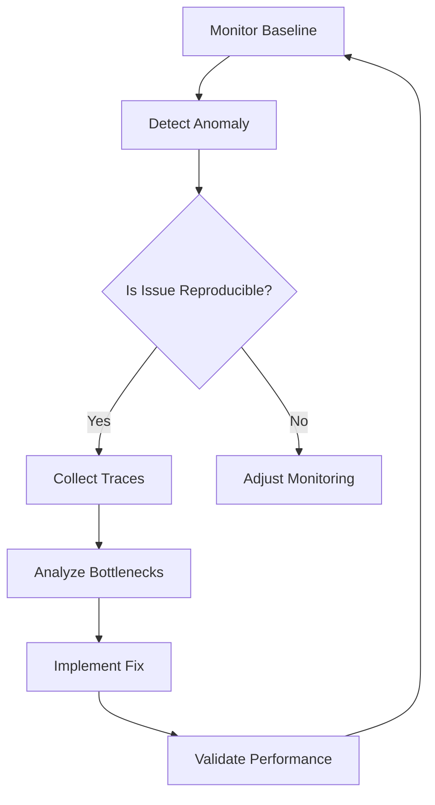

## **Overview**
Optimization Debugging is a structured approach to systematically analyze and resolve performance issues in distributed systems or applications. This pattern helps engineers identify inefficiencies in queries, network calls, computations, or resource utilization by isolating bottlenecks (e.g., slow queries, excessive latency, high CPU/memory usage). By using **tracing, profiling, and instrumentation**, debuggers can pinpoint root causes and implement targeted fixes without disrupting system stability. This guide covers key concepts, schema references, query patterns, and related patterns to apply this systematically.

---

## **Key Concepts**
| **Concept**               | **Definition**                                                                 | **Use Case**                                                                 |
|---------------------------|-------------------------------------------------------------------------------|------------------------------------------------------------------------------|
| **Bottleneck**            | A component (e.g., API, service, query) consuming excessive time/resources. | Identify slow-endpoint calls in microservices.                              |
| **Latency Spikes**        | Sudden increases in request processing time.                                   | Diagnose external API failures or database timeouts.                        |
| **Throughput Saturation** | Request rate exceeds system capacity (e.g., 5xx errors, timeouts).           | Scale out under heavy load or optimize query logic.                        |
| **Profiling**             | Instrumentation and data collection to measure code execution metrics.       | Analyze CPU/memory usage in a microservice.                               |
| **Tracing**               | Tracking requests across distributed services (e.g., using OpenTelemetry).   | Debug cross-service latency chains.                                          |
| **Instrumentation**       | Adding logging, metrics, or tracing to monitor performance.                  | Track slow database queries in an application.                            |

---

## **Schema Reference**
### **1. Optimization Debugging Workflow Schema**


### **2. Core Data Models**
| **Entity**          | **Properties**                                                                 | **Example Field**                     |
|---------------------|-------------------------------------------------------------------------------|----------------------------------------|
| **Bottleneck**      | `service`, `operation`, `latency_ms`, `error_rate`, `throughput`, `timestamp` | `{service: "user-service", latency_ms: 3000}` |
| **Trace**           | `trace_id`, `spans`, `start_time`, `end_time`, `status`                      | `{spans: [{name: "DB-Query", duration_ms: 1500}]}` |
| **Metric**          | `metric_name`, `value`, `unit`, `labels`                                    | `{metric_name: "query_latency", value: 1200}` |
| **Fix**             | `bottleneck_id`, `action`, `result`, `timestamp`                           | `{action: "add index to table", result: "reduced latency by 40%"}` |

---

## **Query Examples**
### **1. Detect High-Latency API Calls**
**Goal**: Find services with average response time > 95th percentile threshold.
**Query (Metrics Query Language - MQQL)**:
```sql
SELECT
    service,
    avg(operation_latency_ms) as avg_latency,
    percentile(operation_latency_ms, 0.95) as p95_latency
FROM api_latency_metrics
WHERE timestamp > now() - 1h
GROUP BY service
HAVING p95_latency > 500
ORDER BY avg_latency DESC;
```

### **2. Identify Slow Database Queries**
**Goal**: List top 5 slowest queries by execution time.
**Query (SQL)**:
```sql
SELECT
    query,
    avg(execution_time_ms) as avg_time,
    COUNT(*) as call_count
FROM query_performance
WHERE execution_time_ms > 100
GROUP BY query
ORDER BY avg_time DESC
LIMIT 5;
```

### **3. Trace Cross-Service Latency**
**Goal**: Visualize latency distribution across services in a trace.
**Query (OpenTelemetry)**:
```bash
# Using Jaeger CLI to filter traces with latency > 2s
jaeger query traces \
  --filter 'service:user-service AND duration>2000' \
  --limit 10
```

### **4. Compare Pre/Post-Optimization**
**Goal**: Validate if a fix improved performance.
**Query (Time-Series DB)**:
```sql
SELECT
    timestamp,
    metric_name,
    value
FROM performance_metrics
WHERE
    metric_name = 'query_latency' AND
    (timestamp BETWEEN '2023-10-01' AND '2023-10-07')
ORDER BY timestamp;
```
**Analysis**: Compare `value` before/after the fix date (e.g., `2023-10-03`).

---

## **Implementation Steps**
### **Step 1: Define Baseline Metrics**
- Set up **prometheus alerts** for:
  - P99 latency > 1s.
  - Error rates > 1%.
  - Throughput drops > 20%.
- Example Prometheus rule:
  ```yaml
  - alert: HighLatency
    expr: histogram_quantile(0.99, sum(rate(query_latency_bucket[5m])) by (le))
    for: 5m
    labels:
      severity: warning
    annotations:
      summary: "High latency in {{ $labels.service }}"
  ```

### **Step 2: Reproduce the Issue**
- Use **canary testing** to trigger bottlenecks:
  ```bash
  # Simulate load with Locust
  locust -f load_test.py --host=https://your-api.com --users 1000 --spawn-rate 100
  ```
- Inspect logs with:
  ```bash
  kubectl logs -n observability -l app=jaeger-query
  ```

### **Step 3: Collect Traces**
- Enable OpenTelemetry auto-instrumentation:
  ```yaml
  # Deploy OTel collector
  apiVersion: v1
  kind: ConfigMap
  metadata:
    name: otel-collector-conf
  data:
    config.yaml: |
      receivers:
        otlp:
          protocols:
            grpc:
            http:
      service:
        pipelines:
          traces:
            receivers: [otlp]
            processors: []
            exporters: [logging]
  ```

### **Step 4: Analyze Bottlenecks**
- Use **Grafana dashboards** to correlate metrics:
  ```grafana
  # Dashboard: "Optimization Debugging"
  - Panel: "Latency by Service" (Time Series)
  - Panel: "Error Rates" (Gauge)
  - Panel: "Trace Heatmap" (Jaeger)
  ```
- Example Grafana query for slow endpoints:
  ```sql
  sum(rate(http_request_duration_seconds_bucket[5m]))
    by (le, route)
    where le > 1000
  ```

### **Step 5: Implement Fixes**
| **Bottleneck Type**       | **Potential Fix**                                      | **Verification**                          |
|---------------------------|-------------------------------------------------------|-------------------------------------------|
| Slow Database Query       | Add index, optimize SQL, cache results.               | Check `EXPLAIN ANALYZE` results.          |
| High CPU Usage            | Update algorithms, reduce loops, optimize dependencies. | Monitor CPU metrics post-fix.             |
| Network Latency           | Use CDN, reduce payload, optimize serialization.      | Test with `ping` or `traceroute`.         |
| External API Timeouts     | Implement retries, circuit breakers, async calls.     | Validate error rate drops.                |

### **Step 6: Validate Performance**
- **A/B Testing**: Route 10% traffic to fixed vs. original version.
- **Chaos Engineering**: Inject failures to test resilience:
  ```yaml
  # Chaos Mesh experiment
  apiVersion: chaos-mesh.org/v1alpha1
  kind: PodChaos
  metadata:
    name: cpu-hog
  spec:
    action: cpu-hog
    mode: all
    duration: "30s"
    selector:
      namespaces:
        - default
  ```

---

## **Query Examples (Advanced)**
### **1. Find Orphaned Database Connections**
**Goal**: Detect idle connections holding locks.
**Query (PostgreSQL)**:
```sql
SELECT
    pid,
    now() - query_start AS duration,
    usename,
    query
FROM pg_stat_activity
WHERE state = 'idle in transaction'
ORDER BY duration DESC;
```

### **2. Identify Cascading Failures**
**Goal**: Trace downstream calls from a failed upstream service.
**Query (OpenTelemetry)**:
```bash
# Find traces where "payment-service" failed and affected "order-service"
jaeger query traces \
  --filter 'service:payment-service AND status:ERROR AND downstream_service:order-service' \
  --limit 5 \
  --format=json
```

### **3. Cost Analysis for Cloud Resources**
**Goal**: Identify expensive compute/memory usage.
**Example (AWS Cost Explorer Query)**:
```sql
-- Filter by service and date range
SELECT
    service,
    SUM(cost) as total_cost,
    COUNT(*) as requests
FROM cloud_cost_metrics
WHERE date BETWEEN '2023-10-01' AND '2023-10-31'
GROUP BY service
ORDER BY total_cost DESC;
```

---

## **Related Patterns**
| **Pattern**               | **Description**                                                                 | **When to Use**                                  |
|---------------------------|-------------------------------------------------------------------------------|--------------------------------------------------|
| **[Telemetry-Driven Development](Pattern)** | Build systems with observability from day one.                              | New projects or major refactors.                |
| **[Circuit Breaker](Pattern)**          | Prevent cascading failures by isolating unstable services.                 | High-availability microservices.                |
| **[Rate Limiting](Pattern)**             | Throttle requests to prevent overload.                                      | Public APIs or autoscaling environments.       |
| **[Distributed Tracing](Pattern)**       | Trace requests across services for latency analysis.                         | Complex microservices architectures.            |
| **[Chaos Engineering](Pattern)**          | Test resilience by injecting failures.                                       | Critical production systems.                    |

---

## **Anti-Patterns to Avoid**
| **Anti-Pattern**               | **Risk**                                                                       | **Mitigation**                                  |
|---------------------------------|-------------------------------------------------------------------------------|------------------------------------------------|
| **Ignoring Edge Cases**         | Fixes break under unusual conditions (e.g., high concurrency).               | Test with synthetic load.                     |
| **Over-Optimizing**             | Premature optimization wastes time on unrealistic scenarios.                 | Profile before optimizing.                    |
| **Silent Logging**              | Missing critical context for debugging.                                      | Use structured logging (JSON).               |
| **Static Thresholds**           | Fixed thresholds fail under dynamic workloads.                                | Use adaptive alerts (e.g., P99 based).         |
| **Untracked Dependencies**      | External API changes break workflows undetected.                              | Monitor downstream dependencies.              |

---
**Key Takeaways**:
- Use **metrics + traces** to isolate bottlenecks.
- **Validate fixes** with controlled experiments.
- **Automate monitoring** to catch regressions early.
- **Document bottlenecks** for future reference.