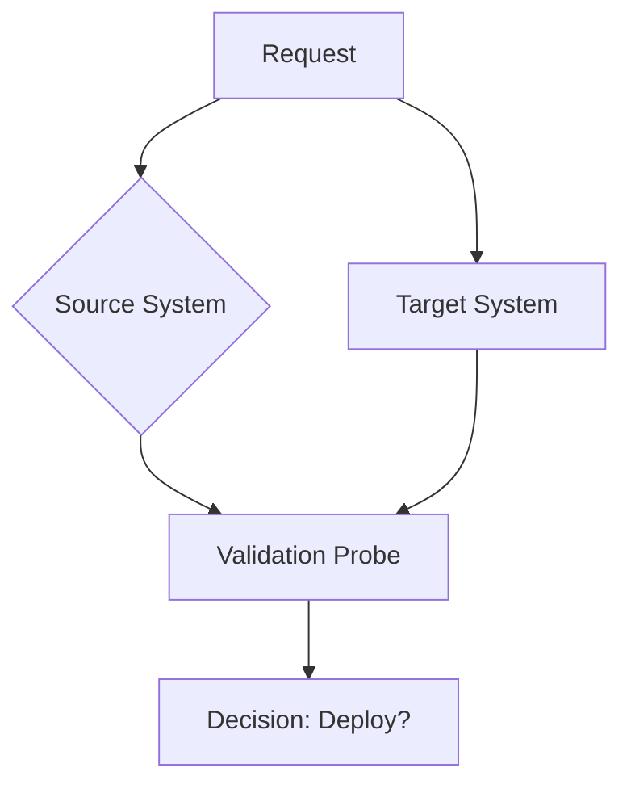
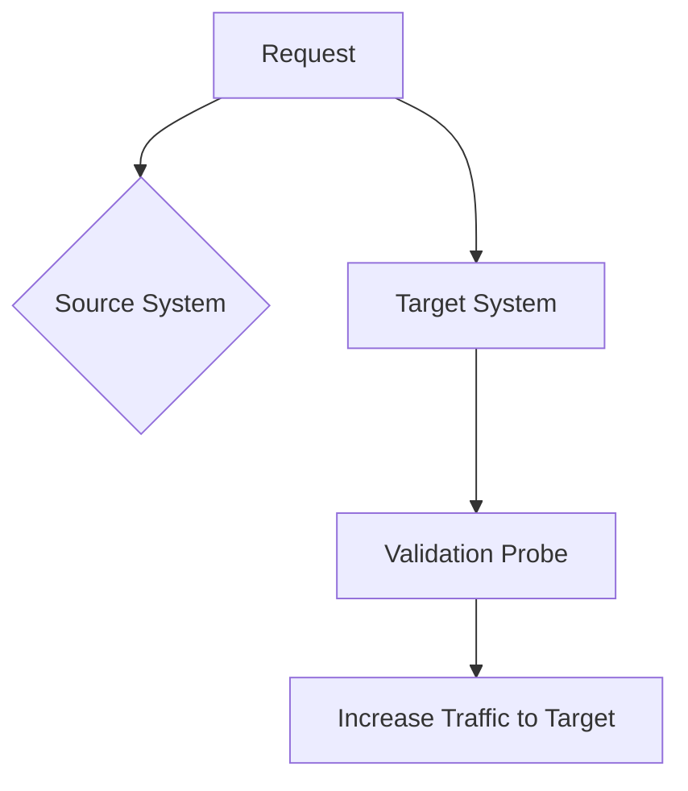

## **1. Overview**
The **Optimization Migration** pattern simplifies migrating from legacy systems or near-optimal architectures to more efficient, scalable, or performant alternatives without disrupting end-user experience. This pattern is particularly useful for:

- **Performance degradation** in high-traffic workloads.
- **Cost inefficiencies** (e.g., over-provisioned resources).
- **Tech debt accumulation** in monolithic or outdated systems.
- **Scalability constraints** in growing applications.

The key principle is **independent, phased migration**—minimizing risk by gradually adopting new components while retaining fallbacks. This avoids "big bang" refactors and allows for controlled validation.

---

## **2. Schema Reference**
The pattern involves the following core components:

| **Component**            | **Description**                                                                                     | **Example Input Fields**                     | **Output**                          |
|--------------------------|-----------------------------------------------------------------------------------------------------|----------------------------------------------|-------------------------------------|
| **Source System**        | The current system or workflow being migrated.                                                    | Legacy DB schema, API endpoints, runtime config | Current performance baseline       |
| **Target System**        | The new architecture with improved performance/cost.                                               | Updated DB schema, serverless functions, caching layer | Optimized workload metrics          |
| **Migration Gateway**    | A dual-write or shadowing mechanism to sync data between source and target.                     | Queue settings, sync frequency, retry logic  | Persistent data parity              |
| **Validation Probes**    | Tools to compare output between source and target (e.g., A/B testing, side-by-side queries).   | Traffic split %, error thresholds             | Pass/Fail results                   |
| **Fallback Mechanism**   | Graceful degradation if the target fails (e.g., circuit breakers, feature flags).                | Failover thresholds, retry delays            | Fallback activation logs            |
| **Monitoring Dashboard** | Real-time metrics to track performance, errors, and resource usage during migration.              | Latency, throughput, error rates             | Alerts, historical trends           |

---

## **3. Implementation Steps**

### **Step 1: Define Optimization Goals**
- **Scope**: Identify bottlenecks (e.g., slow queries, high latency, or cost overruns).
- **Metrics**: Use SLOs (Service Level Objectives) or KPIs to quantify "optimal" performance.
- **Trade-offs**: Balance speed vs. cost (e.g., caching vs. compute-heavy optimizations).

**Example**:
> *"Reduce API response time from 500ms to 100ms with <2% error increase."*

### **Step 2: Design the Migration Path**
#### **Option A: Dual-Write (Synchronized Migration)**
- Write data to **both** source and target during a transition period.
- Use a **de-duplication layer** (e.g., UUIDs, timestamps) to avoid conflicts.
- **Risk**: Higher write load; requires strict consistency checks.



#### **Option B: Shadowing (Read-Heavy Migration)**
- Redirect **new reads** to the target while keeping source for writes.
- Gradually increase read traffic to the target until source is deprioritized.
- **Risk**: Stale data if sync lags.



#### **Option C: Canary Rollout (Traffic-Based)**
- Route a small percentage of traffic (e.g., 1%) to the target first.
- Monitor errors/performance; scale up if stable.
- **Risk**: Limited initial testing scope.

---

### **Step 3: Implement the Migration Gateway**
#### **Key Techniques**:
- **Change Data Capture (CDC)**:
  Use tools like Debezium (Kafka) or AWS DMS to stream changes from source to target.
- **Event Sourcing**:
  Replay events to rebuild the target state incrementally.
- **Delta Migrations**:
  Sync only recently modified data (e.g., `WHERE updated_at > '2024-01-01'`).

**Example (CDC with Kafka)**:
```python
# Pseudo-code for CDC consumer
def consume_changes(topic: str):
    for change in kafka_consumer(topic):
        if change["type"] == "INSERT":
            target_db.insert(change["data"])
```

---

### **Step 4: Deploy Validation Probes**
- **Data Consistency Checks**:
  Compare row counts, checksums, or sample values between source and target.
  ```sql
  -- Example: Verify user IDs exist in both systems
  SELECT COUNT(*) FROM users WHERE id IN (
      SELECT id FROM legacy_users
  ) MINUS (
      SELECT id FROM new_users
  );
  ```
- **Performance Benchmarks**:
  Run identical workloads on both systems (e.g., JMeter, Locust).
- **Error Rate Monitoring**:
  Track `4xx/5xx` rates; set alerts for thresholds (e.g., >1% errors).

---

### **Step 5: Roll Out Gradually**
1. **Phase 1 (Pilot)**: Test with low-traffic features (e.g., 0.1% traffic).
2. **Phase 2 (Expansion)**: Increase traffic in 5–10% increments.
3. **Phase 3 (Full Cutover)**: Redirect all traffic to the target after validation.

**Fallback Trigger**:
```yaml
# Example: Feature flag for rollback
fallback_enabled: true  # Default state
features:
  - migration_enabled: false  # Disable if target fails
```

---

### **Step 6: Sunset the Source System**
- **Data Freeze**: Stop writes to the source after full cutover.
- **Read-Only Mode**: Redirect all reads to the target.
- **Decommission**: Delete the source after confirming no dependencies remain.

---

## **4. Query Examples**
### **Query 1: Compare Query Performance**
```sql
-- Current vs. optimized query execution time
EXPLAIN ANALYZE
SELECT * FROM orders WHERE customer_id = 123;
-- Before migration: Full table scan (slow)
-- After migration: Index seek (fast)
```

### **Query 2: Validate Data Sync**
```python
# Python example: Check for missing records in target
def check_sync_completeness():
    missing = set(legacy_db.query("SELECT id FROM users"))
    present = set(target_db.query("SELECT id FROM users"))
    return missing - present
```

### **Query 3: Monitor Cost Savings**
```sql
-- AWS Cost Explorer: Compare EC2 instances pre/post-migration
SELECT
    instance_type,
    SUM(USAGE_AGE) as cost_savings_hours,
    SUM(UNBLENDED_COST) as pre_migration_cost
FROM cost_and_usage_report
WHERE usage_start_date BETWEEN '2023-12-01' AND '2024-01-31'
GROUP BY instance_type;
```

---

## **5. Related Patterns**
| **Pattern**               | **Description**                                                                 | **When to Use**                          |
|---------------------------|---------------------------------------------------------------------------------|------------------------------------------|
| **Strangler Pattern**     | Gradually replace part of a legacy system by wrapping it in new components.    | When legacy system cannot be fully replaced at once. |
| **Blue-Green Deployment** | Instant cutover between identical production environments.                    | For low-risk, feature-complete migrations. |
| **Feature Flags**         | Toggle new functionality without redeploying.                                  | To test optimizations in production.    |
| **Event-Driven Architecture** | Decouple systems using events (e.g., Kafka, RabbitMQ).                  | For scalable, asynchronous migrations. |
| **Database Sharding**     | Split data across multiple servers to improve performance.                     | When a monolithic database is a bottleneck. |

---

## **6. Anti-Patterns to Avoid**
1. **Big Bang Migration**: Cutting over all at once risks downtime.
2. **Ignoring Validation**: Skipping probes can lead to data loss or errors.
3. **Over-Optimizing Prematurely**: Profile first; optimize later.
4. **Silent Failures**: Always monitor and alert on target system health.

---
**References**:
- [Google’s Site Reliability Engineering (SRE) Books](https://sre.google/sre-book/)
- [AWS Well-Architected Framework](https://aws.amazon.com/architecture/well-architected/)
- ["Release It!" by Michael Nygard](https://pragprog.com/titles/mnygd/release-it-2nd/)