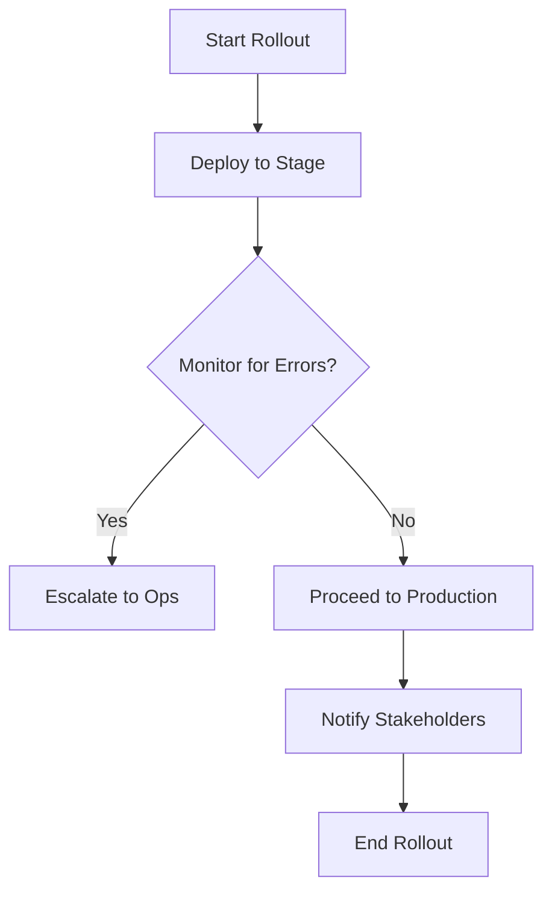

# **[Pattern] Change Management Practices – Reference Guide**

---

## **Overview**
The **Change Management Practices** pattern defines systematic processes, tools, and methodologies to guide organizations through intentional and measurable transitions—whether technical, operational, or cultural. It ensures that changes (e.g., system upgrades, policy shifts, process automation) are implemented with **minimal disruption**, **controlled risk**, and **maximized value**.

This guide outlines the **key components**, **implementation steps**, and **technical considerations** for applying change management in software development, IT operations, and business processes. It aligns with frameworks like **ITIL**, **Agile**, and **DevOps** while emphasizing **collaboration**, **communication**, and **validation**.

---

## **Schema Reference**
| **Component**               | **Description**                                                                                                                                                         | **Key Metrics/Outputs**                                                                                     |
|-----------------------------|---------------------------------------------------------------------------------------------------------------------------------------------------------------------|---------------------------------------------------------------------------------------------------------------|
| **1. Change Request**       | Formal documentation of proposed changes (scope, rationale, impact analysis).                                                                                           | Approval status, risk assessment score, backlog entry (if applicable).                                     |
| **2. Change Advisory Board (CAB)** | Group (or tool) that evaluates changes for alignment with business goals, feasibility, and risk.                                                                      | CAB meeting minutes, change prioritization results, dependency mapping.                                    |
| **3. Impact Analysis**      | Assessment of technical, operational, and human impacts (e.g., system dependencies, user workflows, compliance).                                                      | Risk heatmap, mitigation plan, affected stakeholders list.                                                  |
| **4. Rollout Plan**         | Step-by-step execution strategy (phases, rollback triggers, rollback plan, communication timelines).                                                              | Timeline chart, escalation contacts, post-rollout metrics (e.g., success rate).                              |
| **5. Pilot Testing**        | Controlled deployment to a subset of users/sys­tems to validate performance, usability, and stability.                                                            | Pilot feedback, defect rates, performance benchmarks.                                                       |
| **6. Training & Documentation** | Materials (e.g., videos, guides, FAQs) to onboard users/teams on new processes or tools.                                                                         | Training completion rates, documentation access logs, user support tickets (post-training).                 |
| **7. Post-Change Review**   | Retrospective to evaluate outcomes vs. goals, gather lessons learned, and adjust future processes.                                                                  | Success/failure metrics, root cause analysis (RCA), process improvement notes.                              |
| **8. Automation Tools**     | Platforms (e.g., Jira, ServiceNow, GitLab) to streamline request tracking, approvals, and rollout execution.                                                          | Tool uptime, automation success rate, integration health.                                                  |
| **9. Communication Plan**   | Stakeholder-specific messaging (e.g., emails, Slack alerts, town halls) to manage expectations and reduce resistance.                                            | Message delivery metrics, stakeholder feedback, adoption rates.                                             |
| **10. Rollback Strategy**   | Predefined actions to revert changes if objectives aren’t met (e.g., revert code, restore backups, revert user permissions).                                       | Rollback execution time, recovery success rate, impacted systems list.                                       |

---

## **Implementation Details**

### **1. Initiate a Change Request**
- **Input**: A formal request (documented in Jira, Confluence, or a change management tool) with:
  - **Description**: Clear problem/opportunity.
  - **Justification**: Business value, alignment with strategic goals.
  - **Scope**: Systems/user groups impacted.
  - **Proposed Solution**: High-level approach (e.g., "Replace legacy API with GraphQL").
- **Output**: Assigned change ID, initial risk assessment, and owner (e.g., "Dev Team" or "CAB").

**Example Tool Query**:
```sql
-- Filter pending change requests in Jira
SELECT
  `key`,
  `summary`,
  `priority`,
  `created` AS `submitted_date`
FROM
  `change_requests`
WHERE
  `status` = 'Pending Approval'
ORDER BY
  `priority` DESC;
```

---

### **2. Conduct Impact Analysis**
- **Technical**: Identify dependencies, compatibility issues, or system bottlenecks.
  - *Tools*: Architecture diagrams (Lucidchart), API documentation (Swagger), database schema.
- **Operational**: Map affected workflows, training needs, or compliance gaps.
  - *Tools*: Process maps (Miro), user role matrices.
- **Human**: Assess stakeholder sentiment (e.g., via surveys or town halls).
  - *Tools*: Google Forms, SurveyMonkey.

**Risk Assessment Framework**:
| **Risk Level** | **Criteria**                          | **Mitigation**                          |
|-----------------|---------------------------------------|------------------------------------------|
| High            | Critical system failure, major cost   | Freeze other changes, hire external experts |
| Medium          | Partial downtime, moderate training  | Pilot test, provide handouts             |
| Low             | Minimal disruption                    | No action required                       |

---

### **3. Approve via Change Advisory Board (CAB)**
- **CAB Roles**:
  - **Sponsor**: Business leader approving budget/strategy.
  - **Owning Team**: Developers/engineers executing the change.
  - **Stakeholders**: End-users, security/compliance teams, IT ops.
- **Decision Criteria**:
  - Alignment with business goals.
  - Risk-to-benefit ratio.
  - Resource availability.
- **Output**: Approved change plan with deadlines.

**Example Slack Notification Template**:
> **📢 CAB Decision: [Change-123] API Migration**
> Approved with **Medium Risk**. Rollout: **Oct 15–17**.
> - **Owner**: @dev-team
> - **Stakeholders**: @qa, @support
> - **Rollback Plan**: [Link]

---

### **4. Develop & Test Rollout Plan**
- **Phases**:
  1. **Preparation**: Backups, user training, tooling setup.
  2. **Pilot**: Deploy to 10% of users/systems (e.g., non-peak hours).
  3. **Full Rollout**: Gradual expansion (e.g., by department).
  4. **Monitoring**: Real-time dashboards (Prometheus, Datadog) for errors.
- **Rollback Triggers**:
  - Critical service outage (>5 min).
  - User adoption <70% after 48 hours.
  - Compliance violations detected.

**Query Example (Monitoring Rollout Success)**:
```sql
-- Check API latency spikes during rollout
SELECT
  `endpoint`,
  AVG(`response_time`), `error_rate`
FROM
  `api_metrics`
WHERE
  `timestamp` BETWEEN '2023-10-15 00:00' AND '2023-10-17 23:59'
GROUP BY
  `endpoint`
ORDER BY
  `error_rate` DESC;
```

---

### **5. Pilot Testing & Feedback**
- **Metrics to Track**:
  - **Success Rate**: % of pilots completing without rollback.
  - **Defect Density**: Bugs per 1,000 lines of code (after pilot).
  - **User Satisfaction**: NPS score post-training.
- **Tools**:
  - **Technical**: Load testing (JMeter), A/B testing (Google Optimize).
  - **User Feedback**: Feedback forms, usability testing sessions.

**Example Pilot Report**:
| **Metric**          | **Target** | **Actual** | **Status**   |
|---------------------|------------|------------|--------------|
| Error Rate          | <1%        | 0.5%       | ✅ Passed    |
| Feature Usability   | >80%       | 88%        | ✅ Passed    |
| Training Completion | 100%       | 95%        | ⚠️ Action    |

---

### **6. Execute Full Rollout**
- **Communication Plan**:
  - **Pre-Rollout**: "What’s changing" email + FAQ.
  - **During**: Real-time updates (Slack/Teams) for critical alerts.
  - **Post-Rollout**: Summary recap + troubleshooting resources.
- **Tools**:
  - **Automation**: GitLab CI/CD for code deployments.
  - **Alerting**: PagerDuty for escalations.

**Rollout Checklist**:


---

### **7. Post-Change Review**
- **Questions to Answer**:
  - Did the change meet its objectives?
  - Were risks accurately predicted?
  - What would we do differently?
- **Tools**:
  - **Retrospective**: Miro whiteboard, structured survey.
  - **Data**: Compare pre/post metrics (e.g., system uptime, user satisfaction).

**Example Post-Change Report Template**:
```
=== Change: [Name] ===
**Successes**:
- ✅ Reduced API latency by 30%.
- ✅ User training completion: 100%.

**Failures**:
- ❌ Compliance team flagged a data privacy gap (mitigated via patch).

**Action Items**:
- [ ] Update compliance documentation.
- [ ] Schedule follow-up with QA team.
```

---

### **8. Automate & Iterate**
- **Tools to Integrate**:
  - **Ticketing**: Jira, ServiceNow.
  - **CI/CD**: GitLab, Jenkins.
  - **Monitoring**: Datadog, New Relic.
  - **Communication**: Slack, Microsoft Teams.
- **Example Workflow**:
  ```
  1. Change request → Jira ticket.
  2. CAB approval → GitLab merge request.
  3. Automated testing → Deploy to staging.
  4. Pilot feedback → Adjust rollout plan.
  5. Full rollout → Monitor in Datadog.
  ```

---

## **Query Examples**
### **1. List All High-Risk Changes**
```sql
SELECT
  `change_id`,
  `summary`,
  `risk_level`,
  `created_date`
FROM
  `change_requests`
WHERE
  `risk_level` = 'High'
ORDER BY
  `created_date` DESC;
```

### **2. Track Rollout Progress**
```sql
-- Changes deployed in the last 30 days
SELECT
  `change_id`,
  `status`,
  `deployment_time`,
  `rollout_completion_percent`
FROM
  `change_deployments`
WHERE
  `deployment_time` > DATE_SUB(CURRENT_DATE(), INTERVAL 30 DAY)
ORDER BY
  `rollout_completion_percent` ASC;
```

### **3. Stakeholder Feedback Analysis**
```sql
-- Sentiment analysis of post-rollout surveys
SELECT
  `change_id`,
  AVG(`sentiment_score`),
  COUNT(*) AS `responses`
FROM
  `stakeholder_feedback`
WHERE
  `survey_date` BETWEEN '2023-10-01' AND '2023-10-31'
GROUP BY
  `change_id`;
```

---

## **Related Patterns**
1. **[Incident Management](https://example.com/incident-management)**
   - *Connection*: Change management prevents incidents; incident response handles unplanned changes.

2. **[Configuration Management](https://example.com/config-mgmt)**
   - *Connection*: Version-controlled configs ensure changes are reproducible and auditable.

3. **[Release Management](https://example.com/release-mgmt)**
   - *Connection*: Change management aligns with release cadence (e.g., agile sprints, CI/CD pipelines).

4. **[Knowledge Management](https://example.com/knowledge-mgmt)**
   - *Connection*: Post-change documentation updates expand organizational knowledge.

5. **[Security & Compliance](https://example.com/security-compliance)**
   - *Connection*: Changes must comply with policies (e.g., GDPR, HIPAA).

---
**Key Takeaway**: Change management is **not a one-time process** but a **culture of intentional improvement**. By standardizing workflows, automating safeguards, and fostering collaboration, organizations minimize risk and maximize the value of every change.