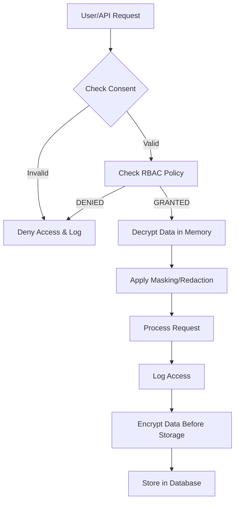

# **[Pattern] Privacy Verification Reference Guide**

---

## **Overview**
The **Privacy Verification** pattern ensures that sensitive data (e.g., personally identifiable information, PII) is handled, processed, and stored securely according to compliance regulations (e.g., GDPR, CCPA, HIPAA) and organizational policies. This pattern defines mechanisms to validate, audit, and enforce privacy rules at runtime.

### **Key Objectives**
- **Data Integrity**: Confirm that no unauthorized access, alteration, or leakage occurs.
- **Compliance Validation**: Verify adherence to privacy laws and internal policies.
- **Audit Trails**: Generate logs and reports for accountability and investigations.
- **Role-Based Access Control (RBAC)**: Ensure only authorized entities interact with sensitive data.

---

## **Key Concepts & Implementation Details**

### **1. Core Components**
| **Component**               | **Description**                                                                                     | **Example Use Cases**                                                                 |
|-----------------------------|-----------------------------------------------------------------------------------------------------|---------------------------------------------------------------------------------------|
| **Data Classification**     | Tags or labels sensitive data (e.g., `PII:Email`, `PII:SSN`) to classify privacy levels.             | GDPR, HIPAA: Differentiate between mandatory vs. voluntary data.                       |
| **Access Control Policies** | Rules defining who can read/write/delete data based on roles/permissions.                           | RBAC: Admin can edit PII, but contractors can only view.                              |
| **Audit Logs**              | Immutable records of all data access/events for compliance and forensics.                             | Investigating a data breach: Trace who accessed records and when.                      |
| **Encryption**              | Encrypts data at rest (storage) and in transit (network) to prevent unauthorized exposure.           | Encrypting emails before storage in a database.                                        |
| **Consent Management**      | Tracks and manages user consent for data processing (e.g., opt-in/opt-out).                       | GDPR: Users must consent to profile storage; revocable anytime.                     |
| **Data Masking**            | Redacts sensitive fields in queries/outputs (e.g., `user@example.com → user****@example.com`).      | Non-privacy staff viewing customer data: Show only masked emails.                     |
| **Data Minimization**       | Ensures only necessary data is collected/processed.                                                  | Payment systems: Only capture mandatory fields (no optional biometric data).          |
| **Third-Party Verification**| Validates external partners’ compliance with privacy standards (e.g., ISO 27001).                  | Vendors handling PII: Require quarterly audits.                                       |

---

### **2. Workflow**
1. **Classification**: Data is labeled during ingestion (e.g., via metadata tags).
2. **Access Request**: User/process requests access to sensitive data (e.g., querying a database).
3. **Policy Enforcement**: System checks permissions and triggers:
   - **Authorization**: RBAC or attribute-based access control (ABAC).
   - **Encryption**: Data is decrypted only in memory for the requester.
   - **Audit Log**: Records the access attempt (success/failure).
4. **Consent Check**: For user data, verifies active consent (e.g., GDPR "right to be forgotten").
5. **Masking/Redaction**: Sensitive fields are obscured in outputs where unnecessary.
6. **Logging**: All actions are logged for compliance and future reviews.

---

### **3. Schema Reference**
Use the following schema to define privacy verification rules in your system.

| **Field**               | **Type**       | **Description**                                                                                                                                 | **Example Values**                                                                 |
|-------------------------|----------------|-------------------------------------------------------------------------------------------------------------------------------------------------|------------------------------------------------------------------------------------|
| `data_type`             | String         | Classifies the data (e.g., PII, PHI, financial).                                                                                               | `PII:Email`, `PHI:MedicalRecord`, `Financial:CreditCard`                          |
| `sensitivity_level`     | Enum           | Defines privacy risk (Low/Medium/High/Critical).                                                                                             | `High`                                                                               |
| `access_policy`         | Object         | Rules governing who can access the data.                                                                                                   | `{ roles: ["admin"], departments: ["legal"], consent_required: true }`              |
| `encryption`            | Object         | Encryption configuration for the data.                                                                                                     | `{ algorithm: "AES-256", key_rotation: "quarterly" }`                             |
| `masking_pattern`       | String         | Regex pattern for redaction (e.g., hide last 4 digits of a credit card).                                                          | `****-****-****-{5}`                                                               |
| `audit_logging`         | Boolean        | Whether access attempts should be logged.                                                                                                | `true`                                                                               |
| `consent_required`      | Boolean        | If true, user consent must be active for access.                                                                                         | `true`                                                                               |
| `third_party_vendor`    | Object         | Details for third-party compliance checks.                                                                                               | `{ vendor_id: "123", audit_frequency: "quarterly" }`                              |
| `expiration_date`       | Date           | Data validity period (for time-sensitive PII).                                                                                            | `2025-12-31`                                                                         |

---

## **Query Examples**
### **1. Check Access Policy for a Data Record**
**Query** (e.g., in a database or API call):
```sql
SELECT
    *,
    CASE
        WHEN data_type = 'PII:Email' AND access_policy.roles = 'admin' THEN 'GRANTED'
        ELSE 'DENIED'
    END AS access_status
FROM sensitive_data
WHERE user_id = 'user123' AND email = 'john@example.com';
```
**Response**:
```json
{
  "access_status": "GRANTED",
  "masked_email": "john****@example.com",
  "audit_log": {
    "timestamp": "2023-10-01T12:00:00Z",
    "user_action": "READ",
    "success": true
  }
}
```

---

### **2. Validate Consent for a User**
**Query** (consent management system):
```sql
SELECT
    user_id,
    data_processing_consent,
    consent_expiration_date
FROM user_consents
WHERE user_id = 'user123'
  AND purpose = 'marketing'
```
**Response**:
```json
{
  "user_id": "user123",
  "data_processing_consent": true,
  "consent_expiration_date": "2024-12-31"
}
```

**Business Rule**:
- If `consent_expiration_date` < current date → `DENY` access.

---

### **3. Apply Data Masking**
**Query** (application logic or middleware):
```python
def mask_credit_card(card_number: str) -> str:
    # Input: "4111-1111-1111-1111"
    # Output: "****-****-****-1111"
    return f"****-****-****-{card_number.split('-')[-1]}"
```
**Example**:
```python
mask_credit_card("4111-1111-1111-1234") → "****-****-****-1234"
```

---

### **4. Enforce Encryption**
**Query** (database layer):
```sql
SELECT
    decrypt_column(
        cast(encrypted_field AS BINARY(256)),
        'AES_KEY_HERE'
    ) AS decrypted_email
FROM users
WHERE user_id = 'user123';
```
**Security Note**:
- Decryption keys should be stored in a separate key management system (e.g., AWS KMS).

---

## **Common Implementation Scenarios**
| **Scenario**                          | **Pattern Application**                                                                                     | **Tools/Libraries**                                                                 |
|----------------------------------------|------------------------------------------------------------------------------------------------------------|------------------------------------------------------------------------------------|
| **Database Access**                    | Apply row-level security (RLS) policies to restrict queries.                                                  | PostgreSQL RLS, Oracle VPD                                                           |
| **API Endpoints**                      | Validate JWT tokens and check data access rights before processing.                                            | Auth0, Firebase Auth, custom middleware                                             |
| **ETL Pipelines**                      | Mask sensitive fields during data transfers between systems.                                                  | Apache Airflow (with custom plugins), Talend                                          |
| **Third-Party Integrations**           | Verify vendor compliance before sharing data.                                                                | SOC 2 reports, HIPAA Business Associate Agreements (BAA)                            |
| **User Consent UI**                    | Display consent forms and track revocations.                                                                | Consent Management Platforms (e.g., OneTrust, Termly)                              |

---

## **Related Patterns**
Consume or combine these patterns for comprehensive privacy controls:

| **Pattern**               | **Description**                                                                                     | **When to Use**                                                                       |
|---------------------------|-----------------------------------------------------------------------------------------------------|---------------------------------------------------------------------------------------|
| **[Data Encryption]**     | Encrypts data at rest/in transit to prevent unauthorized access.                                     | When storing or transmitting PII (e.g., databases, APIs).                            |
| **[Role-Based Access Control (RBAC)]** | Grants permissions based on user roles.                                                           | For multi-team environments (e.g., admins vs. operators).                             |
| **[Audit Logging]**       | Records system events for compliance and forensics.                                                  | When required by regulations (e.g., GDPR, SOX).                                       |
| **[Tokenization]**        | Replaces sensitive data with non-sensitive tokens.                                                   | For payment systems or high-risk data (e.g., credit cards).                            |
| **[Consent Management]**  | Tracks and manages user consent for data processing.                                                  | GDPR/CCPA compliance for user data collection.                                       |
| **[Zero Trust Architecture]** | Verifies every access request, even from trusted networks.                                           | High-security environments (e.g., healthcare, finance).                               |

---

## **Best Practices**
1. **Minimize Data Exposure**:
   - Use **least-privilege access** and **data masking** where possible.
   - Avoid storing unnecessary PII (e.g., delete after processing).

2. **Automate Compliance Checks**:
   - Integrate privacy verification into CI/CD pipelines (e.g., scan for exposed PII in code).
   - Use tools like **Prisma Cloud** or **Snyk** for secret detection.

3. **Regular Audits**:
   - Schedule **quarterly reviews** of access logs and encryption keys.
   - Conduct **penetration tests** to simulate attacks on sensitive data.

4. **User Education**:
   - Train employees on **privacy policies** and **secure data handling**.
   - Provide clear **consent workflows** for user opt-ins/opt-outs.

5. **Vendor Due Diligence**:
   - Require **third-party compliance certifications** (e.g., ISO 27001) before sharing data.
   - Include **data processing agreements (DPA)** with vendors.

6. **Disaster Recovery**:
   - Ensure **encrypted backups** and **quick restoration** of sensitive data.
   - Test **privacy-aware recovery** procedures (e.g., mask restored data before access).

---

## **Failure Modes & Mitigations**
| **Failure Mode**               | **Cause**                                  | **Mitigation**                                                                         |
|---------------------------------|--------------------------------------------|---------------------------------------------------------------------------------------|
| **Unauthorized Data Access**    | Weak RBAC or leaked credentials.            | Enforce MFA, rotate keys, use short-lived tokens.                                    |
| **Consent Expiry Ignored**       | System doesn’t check consent timestamps.    | Implement automated consent validation triggers.                                      |
| **Encryption Key Compromised**   | Key stored in plaintext or shared.          | Use **hardware security modules (HSMs)** for key management.                         |
| **Masking Bypass**              | Direct DB queries bypass application logic. | Enforce **row-level security (RLS)** and **audit all queries**.                       |
| **Third-Party Non-Compliance**   | Vendor fails to meet privacy standards.      | Include **penalties/clauses** in contracts; monitor via audits.                        |
| **Data Leakage**                | Unsecured logs or exports.                  | Encrypt logs, use **data loss prevention (DLP)** tools, and restrict export permissions.|

---

## **Example Architecture**


---
**End of Guide**