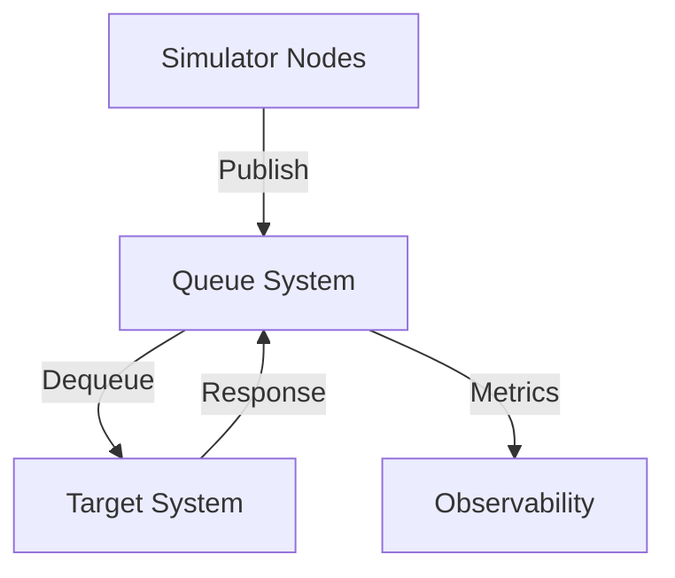

# **[Pattern] Queuing Testing — Reference Guide**

---

## **Overview**
The **Queuing Testing** pattern simulates high-concurrency workloads by distributing test requests across multiple clients (simulators) through a centralized queue. This approach isolates failures, improves scalability testing, and reduces resource contention compared to synchronous testing. It is ideal for validating:
- **Backend concurrency** (e.g., database locks, rate limiting, thread pools).
- **Resource contention** (e.g., connection pools, cache saturation).
- **Fault tolerance** (e.g., retry logic, circuit breakers).
- **Load spikes** (e.g., flash crowds, DoS resilience).

Queues (e.g., **RabbitMQ, Kafka, AWS SQS**) decouple simulators from the target system, enabling controlled traffic shaping. This pattern is widely used in **microservices**, **distributed systems**, and **API gateways**.

---

## **Implementation Details**

### **Key Concepts**
| Concept               | Description                                                                 | Example Tools/Libraries                     |
|-----------------------|-----------------------------------------------------------------------------|--------------------------------------------|
| **Queue System**      | Centralized message broker to manage request distribution.                | RabbitMQ, Kafka, AWS SQS, Redis Streams   |
| **Simulator Nodes**   | Client machines generating test traffic (e.g., JMeter, k6, custom scripts). | JMeter, Gatling, Locust, Postman Newman    |
| **Payload Generator** | Logic to create test requests (e.g., randomized data, workflows).           | Fixtures, Faker, custom scripts            |
| **Traffic Shaping**   | Configurable rate limits, bursts, or time-based throttling.                | RabbitMQ TTL, Kafka partitions, SQS FIFO   |
| **Observability**     | Metrics/exporters for queue depth, latency, and failure rates.             | Prometheus, Datadog, ELK Stack             |
| **Failure Injection** | Optional: Simulate network partitions or slow responses.                   | Chaos Mesh, Gremlin                       |

### **Architecture Flow**
1. **Simulators** publish test requests to the queue.
2. **Queue System** buffers and dispatches requests to the **Target System**.
3. **Target System** processes requests and returns results.
4. **Observability Tools** collect metrics (e.g., queue length, error rates).



---

## **Schema Reference**
Below is the **reference schema** for a typical queue-based testing setup.

| **Component**         | **Attributes**                          | **Description**                                                                 | **Example Value**                     |
|-----------------------|----------------------------------------|---------------------------------------------------------------------------------|---------------------------------------|
| **Queue System**      | - Broker Type                          | Broker protocol (e.g., AMQP, Kafka, SQS).                                    | `RabbitMQ`                            |
|                       | - Topic/Exchange                       | Naming convention for routing (e.g., `test-traffic/v1`).                     | `test-requests`                       |
|                       | - Queue Capacity                       | Max messages before backpressure triggers.                                   | `10,000`                              |
|                       | - Message TTL                          | Time-to-live for unprocessed messages (prevents stale tests).               | `30s`                                  |
| **Simulator Node**    | - Concurrency Level                    | Parallel requests per simulator instance.                                     | `100`                                  |
|                       | - Request Payload Template              | JSON/YAML snippet with dynamic placeholders (e.g., `@{userId}`).            | `{"operation": "GET", "path": "/api/users/@{id}"}` |
|                       | - Rate Limits                          | Requests per second (rps) or burst tolerance.                                | `100 rps`, `500 burst`                |
| **Target System**     | - Endpoint                             | API/Service URI or internal function.                                         | `/api/orders`                         |
|                       | - Expected Response Time               | Latency SLA for validation (e.g., <500ms).                                  | `500ms`                                |
|                       | - Error Threshold                      | Max allowed error rate (e.g., 1% failures).                                  | `0.01`                                 |
| **Observability**     | - Metrics Exporter                     | Prometheus, Datadog, or custom script.                                        | `Prometheus`                          |
|                       | - Alerting Rules                       | Conditions for notifications (e.g., queue depth > 90%).                    | `queue_len > 90%*capacity`           |

---

## **Query Examples**

### **1. Simulating API Load with RabbitMQ**
**Scenario**: Test an order service under 1,000 rps with 99.9% uptime.

#### **Steps**:
1. **Configure RabbitMQ Exchange**:
   ```bash
   # Create exchange (topic-based routing)
   rabbitmqadmin declare exchange name=test_exchange type=topic durable=true
   rabbitmqadmin declare queue name=test_queue durable=true
   rabbitmqadmin declare binding source=test_exchange destination=test_queue routing_key="test.*"
   ```

2. **Simulator Script (Python + Pika)**:
   ```python
   import pika, json, time, random
   from faker import Faker

   fake = Faker()
   connection = pika.BlockingConnection(pika.ConnectionParameters('localhost'))
   channel = connection.channel()
   channel.queue_declare(queue='test_queue', durable=True)

   def publish_order():
       payload = {
           "user_id": fake.uuid4(),
           "items": [{"product": fake.word(), "quantity": random.randint(1, 5)}],
           "total": round(random.uniform(10, 1000), 2)
       }
       channel.basic_publish(
           exchange='test_exchange',
           routing_key='test.orders',
           body=json.dumps(payload),
           properties=pika.BasicProperties(delivery_mode=2)  # Persistent
       )
       print(f"Published: {payload['user_id']}")

   # Simulate 1000 rps for 60 sec
   for _ in range(1000):
       publish_order()
       time.sleep(0.001)  # ~1ms delay = ~1000 rps
   ```

3. **Target System (Flask Example)**:
   ```python
   from flask import Flask, request, jsonify

   app = Flask(__name__)

   @app.route('/api/orders', methods=['POST'])
   def handle_order():
       data = request.json
       # Process order (simulate DB call)
       time.sleep(0.2)  # Simulate latency
       return jsonify({"status": "success", "order_id": data["user_id"]})
   ```

---

### **2. Kafka-based Event Stream Testing**
**Scenario**: Validate event-driven workflows (e.g., payment processing) under 50,000 messages/min.

#### **Steps**:
1. **Kafka Topic Setup**:
   ```bash
   kafka-topics --create --topic payment_events --bootstrap-server localhost:9092 --partitions 4 --replication-factor 1
   ```

2. **Simulator (Confluent/k6)**:
   ```javascript
   import http from 'k6/http';
   import { check } from 'k6';

   export const options = {
     stages: [
       { duration: '30s', target: 500 },  // Ramp-up
       { duration: '1m', target: 50000 }, // Steady state
       { duration: '30s', target: 0 }    // Ramp-down
     ],
     thresholds: {
       http_req_duration: ['p(95)<500'],  // 95% < 500ms
     }
   };

   export default function () {
     const payload = {
       id: Math.random().toString(36).substring(7),
       amount: Math.floor(Math.random() * 1000),
       status: ['pending', 'processing', 'failed'][Math.floor(Math.random() * 3)]
     };
     http.post('http://localhost:9092/payment-events', JSON.stringify(payload), {
       headers: { 'Content-Type': 'application/json' }
     });
   }
   ```

3. **Consumer (Spark Streaming)**:
   ```python
   from pyspark.sql import SparkSession
   from pyspark.sql.functions import col

   spark = SparkSession.builder.appName("PaymentProcessor").getOrCreate()
   df = spark.readStream.format("kafka") \
       .option("kafka.bootstrap.servers", "localhost:9092") \
       .option("subscribe", "payment_events") \
       .load()

   processed = df.selectExpr("CAST(value AS STRING)") \
       .writeStream \
       .outputMode("append") \
       .foreachBatch(process_batch) \
       .start()
   ```

---

### **3. SQS FIFO for Ordered Workloads**
**Scenario**: Test a message queue with strict ordering (e.g., transactional logs).

#### **Steps**:
1. **AWS CLI Setup**:
   ```bash
   # Create FIFO queue (suffix '.fifo')
   aws sqs create-queue --queue-name transaction-logs.fifo --attributes VisibilityTimeout=30
   ```

2. **Simulator (AWS CDK)**:
   ```typescript
   import * as sqs from 'aws-cdk-lib/aws-sqs';

   const queue = new sqs.Queue(this, 'TransactionLogsQueue', {
     queueName: 'transaction-logs.fifo',
     fifo: true,
     visibilityTimeout: cdk.Duration.seconds(30),
   });

   // Simulator lambda (Node.js)
   import { SQSClient, SendMessageCommand } from '@aws-sdk/client-sqs';

   const sendTransaction = async () => {
     const client = new SQSClient({ region: 'us-east-1' });
     const command = new SendMessageCommand({
       QueueUrl: 'https://sqs.us-east-1.amazonaws.com/1234567890/transaction-logs.fifo',
       MessageBody: JSON.stringify({ id: Date.now(), amount: Math.random() * 100 }),
       MessageGroupId: 'group1',  // Ensures ordering
     });
     await client.send(command);
   };

   // Trigger 1000 transactions with 100ms delay per batch
   for (let i = 0; i < 10; i++) {
     await Promise.all(Array(100).fill().map(() => sendTransaction()));
     await new Promise(resolve => setTimeout(resolve, 100));
   }
   ```

---

## **Query Examples: Validating Results**
| **Metric**               | **Tool/Query**                          | **Interpretation**                                      |
|--------------------------|----------------------------------------|--------------------------------------------------------|
| Queue Depth              | `rabbitmqadmin list queues name=test_queue` | High depth → Bottleneck in processing.               |
| Error Rate               | `k6 output prometheus-remote`          | >1% errors → Target system instability.               |
| Latency Percentiles      | `PromQL: rate(http_request_duration_seconds_count[1m])` | 99th percentile >500ms → Slow endpoints.          |
| Throughput               | `aws cloudwatch get-metric-statistics --namespace SQS --metric-name ApproximateNumberOfMessagesVisible` | Sudden drops → Queue backpressure.                   |
| Retry Count              | `elk-search: logs.filter("event:retry")` | High retries → Flaky endpoints or network issues.   |

---

## **Common Pitfalls & Mitigations**
| **Pitfall**                          | **Cause**                              | **Mitigation**                                      |
|---------------------------------------|----------------------------------------|----------------------------------------------------|
| **Stale Data in Queue**               | Simulators fail to drain the queue.    | Set TTL on messages (e.g., RabbitMQ `x-expires`). |
| **Queue Flooding**                    | Simulators burst traffic without rate limiting. | Use Kafka partitions or SQS FIFO for controlled flow. |
| **Target System Overload**            | No backpressure handling.               | Implement circuit breakers (e.g., Hystrix) in target. |
| **False Positives in Metrics**        | Observability tools misaligned.        | Validate with `kubectl top pods` or `aws cloudwatch`.|
| **Ordering Violations (Non-FIFO)**    | Multiple consumers dequeue messages out of order. | Use Kafka `min.partition.count` or SQS `MessageGroupId`. |

---

## **Related Patterns**
| **Pattern**                     | **When to Use**                              | **Synergy with Queuing Testing**                     |
|---------------------------------|---------------------------------------------|------------------------------------------------------|
| **[Chaos Engineering](https://chaosengineering.io/)** | Test failure resilience.                  | Inject delays/failures into the queue system.       |
| **[Canary Releases](https://martinfowler.com/bliki/CanaryRelease.html)** | Gradually roll out updates.               | Use queues to throttle traffic to new versions.      |
| **[Load Testing](https://www.blazemeter.com/blog/load-testing)** | Validate performance under load.          | Queues enable distributed, concurrent testing.       |
| **[Circuit Breaker](https://microservices.io/patterns/reliability/circuit-breaker.html)** | Prevent cascading failures.           | Monitor queue depth to trigger breakers.             |
| **[Rate Limiting](https://medium.com/faun/rate-limiting-patterns-in-distributed-systems-50e07126b7e5)** | Prevent abuse.                          | Simulate spikes with queues + rate-limiting middleware. |

---

## **Tools & Libraries**
| **Category**               | **Tools/Libraries**                                                                 | **Use Case**                                      |
|----------------------------|------------------------------------------------------------------------------------|---------------------------------------------------|
| **Queue Systems**          | RabbitMQ, Apache Kafka, AWS SQS, NATS, Redis Streams                              | Centralized message brokers.                      |
| **Simulators**             | JMeter, Gatling, Locust, k6, Postman Newman, custom scripts (Python, Go)          | Generate test traffic.                            |
| **Observability**          | Prometheus + Grafana, Datadog, ELK Stack, OpenTelemetry, AWS CloudWatch            | Monitor queue metrics.                            |
| **Failure Injection**      | Gremlin, Chaos Mesh, Chaos Monkey                                              | Test fault tolerance.                             |
| **Traffic Shaping**        | Envoy, NGINX, AWS WAF                                                         | Throttle/rate-limit traffic.                     |

---

## **Best Practices**
1. **Start Small**: Begin with a single queue and gradually scale simulators.
2. **Isolate Tests**: Use dedicated queues/topics to avoid interference.
3. **Monitor Everything**: Track queue depth, latency, and error rates in real-time.
4. **Simulate Realistic Workloads**: Use payload generators (e.g., Faker) to mimic production data.
5. **Automate Cleanup**: Delete queues/topics post-test to avoid resource leaks.
6. **Document Assumptions**: Note constraints (e.g., "Tests assume DB connection pool size = 50").
7. **Reproduce Failures**: Save queue logs (e.g., RabbitMQ `rabbitmq-plugins enable rabbitmq_management`) for debugging.