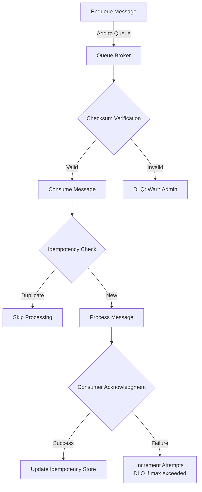

# **[Pattern] Queuing Verification – Reference Guide**

---

## **Overview**
The **Queuing Verification** pattern ensures data integrity and correctness in asynchronous processing systems by validating the state of queued messages at various stages. This pattern is critical for high-throughput systems where messages are processed in batches, such as event-driven architectures, microservices, or real-time data pipelines.

Key use cases include:
- Detecting processing delays or failures in queues (e.g., Kafka, RabbitMQ, AWS SQS).
- Ensuring message persistence and replayability.
- Validating consumer acknowledgment and retry logic.
- Monitoring for message corruption or duplicates.

By instrumenting checks (e.g., checksums, checksums, or external validation), the pattern prevents silent failures and provides observability into the queue lifecycle.

---

## **Key Concepts**
### **1. Queue Phases**
Queues typically operate through distinct phases where verification occurs:

| **Phase**          | **Description**                                                                 | **Verification Checks**                                                                                     |
|----------------------|---------------------------------------------------------------------------------|-------------------------------------------------------------------------------------------------------------|
| **Enqueue**         | Messages are added to the queue.                                                 | - **Consistency:** Check for duplicates or malformed messages.                                             |
| **Persistence**     | Messages are written to durable storage (e.g., disk, database).                  | - **Integrity:** Verify checksums or cryptographic hashes.                                                 |
| **Consumption**     | Consumers pull/pop messages from the queue.                                     | - **Acknowledgment:** Ensure consumers mark messages as processed (or implement dead-letter queues).      |
| **Replay/Retries**  | Failed messages are reprocessed.                                                | - **Idempotency:** Validate deduplication logic (e.g., using message IDs).                                |
| **Cleanup**         | Expired or processed messages are removed.                                       | - **Final State:** Confirm messages are fully acknowledged or archived.                                     |

---

### **2. Verification Techniques**
| **Technique**               | **Use Case**                                                                 | **Implementation Notes**                                                                                     |
|------------------------------|------------------------------------------------------------------------------|--------------------------------------------------------------------------------------------------------------|
| **Checksum Validation**     | Ensure message integrity during transmission.                                | Compute SHA-256/CRC32 hashes on enqueue; verify upon consumption.                                         |
| **Message Signing**         | Authenticate message source (e.g., using digital signatures).               | Pair with HMAC-SHA256 for tamper-proofing.                                                              |
| **Idempotency Keys**        | Prevent duplicate processing.                                                | Assign unique keys (e.g., `message_id + payload_hash`) and track processed keys in a database.               |
| **Dead-Letter Queues (DLQ)**| Route failed messages for analysis.                                          | Configure DLQ triggers (e.g., max retries exceeded) in the broker (e.g., Kafka `max.in.flight`).            |
| **External Validation**     | Cross-check against a authoritative source (e.g., database).               | For critical data, store metadata in a DB and query post-processing.                                      |

---

### **3. Pattern Components**
| **Component**          | **Purpose**                                                                 | **Example Tools/Libraries**                                                                               |
|-------------------------|-----------------------------------------------------------------------------|-----------------------------------------------------------------------------------------------------------|
| **Queue Broker**        | Manages message storage and routing.                                      | Apache Kafka, RabbitMQ, AWS SQS/SNS, Azure Service Bus.                                                |
| **Verification Agent**  | Performs checks (e.g., checksums, idempotency).                            | Custom scripts, Apache NiFi, AWS Lambda (for serverless validation).                                    |
| **Monitoring System**   | Tracks queue health and verification failures.                             | Prometheus + Grafana, Datadog, ELK Stack.                                                              |
| **Dead-Letter Queue**   | Isolates failed messages for debugging.                                   | Native DLQ support in Kafka/RabbitMQ or custom S3/SQS-backed DLQs.                                      |
| **Idempotency Store**   | Stores processed message keys to avoid duplicates.                         | Redis, PostgreSQL, DynamoDB.                                                                             |

---

## **Schema Reference**
### **1. Message Schema (Example)**
A queued message typically includes verification metadata:

| **Field**               | **Type**       | **Description**                                                                                                                                                     | **Example**                          |
|--------------------------|----------------|---------------------------------------------------------------------------------------------------------------------------------------------------------------------|---------------------------------------|
| `message_id`             | `string`       | Unique identifier for deduplication.                                                                                                                          | `uuid4`                              |
| `payload`               | `JSON`         | The actual data being queued.                                                                                                                                      | `{"event": "order_placed", "data": {...}}` |
| `checksum`               | `string`       | Hash of the payload (e.g., SHA-256).                                                                                                                              | `a591a6d40bf420404a011733cfb7b190d62c65bf0bcda32b57b277d9ad9f146e` |
| `timestamp`              | `timestamp`    | When the message was enqueued.                                                                                                                                | `2023-10-01T12:00:00Z`              |
| `source_system`          | `string`       | Originating system (for auditing).                                                                                                                              | `ecommerce-api`                      |
| `processing_attempts`    | `integer`      | Count of retry attempts (for DLQ).                                                                                                                         | `3`                                   |
| `idempotency_key`        | `string`       | Composite key for idempotency (e.g., `message_id:payload_hash`).                                                                                           | `order_123:SHA256(payload)`           |

---

### **2. Verification Workflow Schema**


---

## **Query Examples**
### **1. Check Queue Message Integrity (Kafka)**
Use Kafka’s consumer API to verify checksums:
```python
from kafka import KafkaConsumer
import hashlib

consumer = KafkaConsumer('topic_name', bootstrap_servers='kafka:9092')
for msg in consumer:
    payload = msg.value.decode()
    computed_checksum = hashlib.sha256(payload.encode()).hexdigest()
    if computed_checksum != msg.headers.get('checksum')[0].decode():
        print(f"Checksum mismatch for message {msg.message_id}")
```

---
### **2. Query Idempotency Store (PostgreSQL)**
Track processed messages to avoid duplicates:
```sql
-- Insert processed message key
INSERT INTO idempotency_keys (key, processed_at)
VALUES ('order_123:SHA256(payload)', NOW());

-- Check if message is already processed
SELECT * FROM idempotency_keys
WHERE key = 'order_123:SHA256(payload)'
LIMIT 1;
```

---
### **3. Monitor Dead-Letter Queue (Prometheus)**
Expose DLQ metrics (e.g., using Kafka’s JMX exporter):
```promql
# Messages in DLQ over last 5 minutes
rate(kafka_server_replicamanager_deadletterqueue_messages_total[5m]) > 0
```

---
### **4. Validate Message Signing (AWS Lambda)**
Verify signed messages using AWS KMS:
```python
import boto3
import json

def lambda_handler(event, context):
    kms = boto3.client('kms')
    signature = event['headers']['x-signature']
    signed_message = event['body']
    try:
        kms.verify(
            SigningAlgorithm='RSASSA-PSS-SHA256',
            Message=bytes(signed_message, 'utf-8'),
            Signature=bytes.fromhex(signature),
            KeyId='alias/verification-key'
        )
        return {"status": "valid"}
    except Exception as e:
        return {"status": "invalid", "error": str(e)}
```

---

## **Implementation Best Practices**
1. **Minimize Verification Overhead**:
   - Perform checksums/signatures only on critical fields (e.g., payload, not metadata).
   - Cache verification results where possible (e.g., Redis for idempotency keys).

2. **Handle Partial Failures**:
   - Use **atomic transactions** for enqueue + verification (e.g., Kafka transactions).
   - Implement **circuit breakers** for verification agents (e.g., retry with backoff).

3. **Observability**:
   - Log verification failures with trace IDs (e.g., W3C Trace Context).
   - Alert on anomalies (e.g., sudden spike in checksum failures).

4. **Scalability**:
   - Partition verification work (e.g., dedicated consumers for checksum validation).
   - Use **asynchronous validation** (e.g., Lambda triggers post-queue processing).

5. **Security**:
   - Rotate verification keys (e.g., HMAC secrets) periodically.
   - Encrypt sensitive payloads (e.g., using TLS or KMS).

---

## **Related Patterns**
| **Pattern**                     | **Description**                                                                                                                                                     | **When to Use**                                                                                      |
|----------------------------------|---------------------------------------------------------------------------------------------------------------------------------------------------------------------|-------------------------------------------------------------------------------------------------------|
| **[Idempotent Producer](https://microservices.io/patterns/data/idempotent-producer.html)** | Ensures duplicate messages are safely handled.                                                                                                                 | When retry mechanisms may resend the same message.                                                   |
| **[Saga Pattern](https://microservices.io/patterns/data/saga.html)**                     | Manages distributed transactions across services.                                                                                                                 | For long-running workflows with multiple queue-dependent steps.                                      |
| **[Event Sourcing](https://microservices.io/patterns/data/event-sourcing.html)**           | Stores state as a sequence of events.                                                                                                                          | When auditability and replayability are critical.                                                    |
| **[Circuit Breaker](https://microservices.io/patterns/reliability/circuit-breaker.html)** | Prevents cascading failures in verification systems.                                                                                                             | If verification agents depend on external services (e.g., KMS).                                     |
| **[Compensating Transactions](https://microservices.io/patterns/reliability/compensating-transaction.html)** | Rolls back changes if verification fails.                                                                                                                     | For critical state changes (e.g., financial transactions).                                          |

---

## **Troubleshooting**
### **Common Issues & Solutions**
| **Issue**                          | **Root Cause**                                                                 | **Solution**                                                                                          |
|-------------------------------------|---------------------------------------------------------------------------------|-------------------------------------------------------------------------------------------------------|
| **Checksum mismatches**             | Network corruption or broker-side modification.                                 | Enable broker-level checksums (e.g., Kafka `producer.checksum.enabled`).                            |
| **Duplicate processing**            | Idempotency key collisions or consumer crashes.                                     | Use UUIDs for `message_id` + payload hashing for `idempotency_key`.                                  |
| **DLQ flooding**                    | High retry attempts without exponential backoff.                                  | Implement retry policies (e.g., Kafka `retries` + `delivery.timeout.ms`).                          |
| **Verification agent latency**      | Slow external validation (e.g., DB queries).                                      | Cache results or use async processing (e.g., SQS + Lambda).                                           |
| **Consumer lag**                     | Slow processing or backpressure.                                                  | Scale consumers or add QoS policies (e.g., Kafka `fetch.min.bytes`).                                  |

---
### **Debugging Commands**
- **Kafka**:
  ```bash
  # Check message offsets
  kafka-consumer-groups --bootstrap-server kafka:9092 --describe --group my-group

  # List DLQ messages
  kafka-console-consumer --bootstrap-server kafka:9092 --topic dead-letter-topic --from-beginning
  ```
- **RabbitMQ**:
  ```bash
  # Inspect queue errors
  rabbitmqctl list_queues name messages_ready messages_unacknowledged
  ```
- **AWS SQS**:
  ```bash
  # List messages in DLQ
  aws sqs get_queue_attributes --queue-url https://sqs.region.amazonaws.com/... --attribute-names All
  ```

---

## **References**
1. **Kafka Documentation**: [Producing Messages](https://kafka.apache.org/documentation/#producerapi)
2. **Idempotent Producer Pattern**: [Microservices.io](https://microservices.io/patterns/data/idempotent-producer.html)
3. **AWS SQS Dead-Letter Queues**: [AWS Docs](https://docs.aws.amazon.com/AWSSimpleQueueService/latest/SQSDeveloperGuide/sqs-dead-letter-queues.html)
4. **Checksum Algorithms**: [NIST SP 800-185](https://nvlpubs.nist.gov/nistpubs/SpecialPublications/NIST.SP.800-185.pdf)