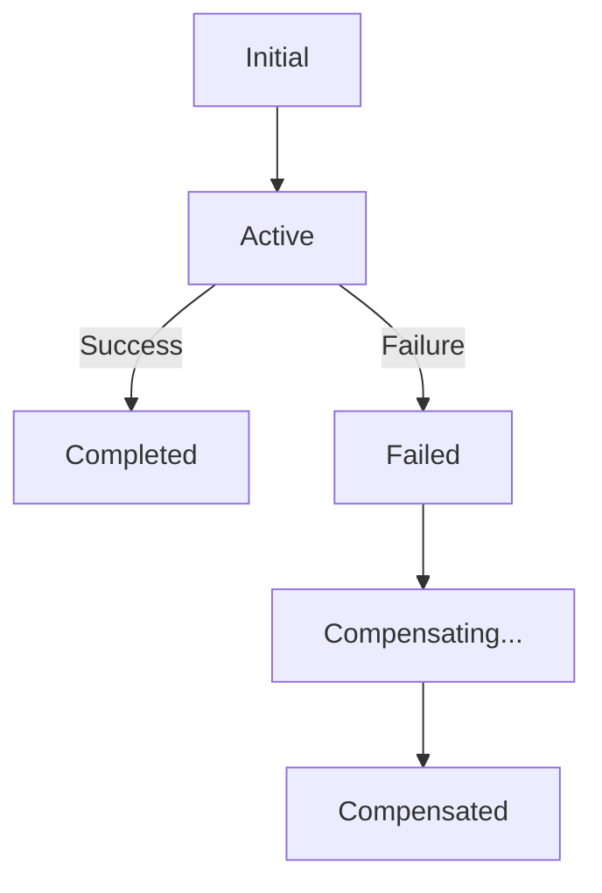

# **[Pattern] Saga Pattern & Distributed Transactions – Reference Guide**

---
## **1. Overview**
The **Saga Pattern** enables **eventual consistency** in distributed microservices architectures where traditional ACID (Atomicity, Consistency, Isolation, Durability) transactions are impractical. Unlike a single atomic transaction spanning services, a saga orchestrates a **sequence of local transactions**, each executed in its own microservice. If a transaction fails, the saga triggers **compensating transactions** (rollbacks) to restore business invariants, ensuring overall data consistency over time.

This pattern is ideal for long-running workflows with high latency or when strict ACID isn’t feasible. Common use cases include:
- **Order processing** (e.g., inventory deduction, payment, shipping).
- **Financial transactions** (e.g., loan approvals with multi-step approvals).
- **Travel bookings** (e.g., hotel reservations with payment and flight coordination).

---

## **2. Key Concepts & Schema Reference**

### **Core Components**
| **Component**               | **Description**                                                                                     | **Example**                                  |
|-----------------------------|-----------------------------------------------------------------------------------------------------|----------------------------------------------|
| **Business Process**        | A sequence of steps (transactions) executed in a workflow.                                          | Order → Inventory deduction → Payment        |
| **Transaction**             | A local, atomic operation within a single microservice.                                              | Deduct inventory from database                |
| ** compensating transaction** | A reverse operation to undo a prior transaction if the saga fails.                                 | Restock inventory if payment fails            |
| **Saga Coordinator**        | Manages the saga lifecycle: commits or rolls back steps based on success/failure.                  | Sends events to trigger next/rollback step.  |
| **Event Store**             | Persists saga state and events for recovery, fault tolerance, and replay.                          | Kafka, RabbitMQ, or a dedicated event log.   |
| **Saga Steps**              | Individual transactions in the saga workflow, ordered sequentially.                                 | Step 1: Reserve seats; Step 2: Process payment. |

---

### **Saga Types**
| **Type**               | **Description**                                                                                     | **Advantages**                                  | **Disadvantages**                          |
|------------------------|-----------------------------------------------------------------------------------------------------|-------------------------------------------------|-------------------------------------------|
| **Choreography-based** | Services publish events to trigger next steps **asynchronously**; no central orchestrator.            | Decentralized, scalable.                      | Harder to debug; eventual consistency.   |
| **Orchestration-based**| A central coordinator **explicitly calls** each step in sequence; manages retries and compensation. | Easier to debug; deterministic control flow.   | Single point of failure; tighter coupling. |

---

## **3. Implementation Details**

### **3.1 Saga Lifecycle**
A saga progresses through these states:



- **Active**: Saga is executing steps.
- **Completed**: All steps succeeded.
- **Failed**: A step failed; compensation begins.
- **Compensated**: All compensating transactions completed.

---

### **3.2 Compensating Transactions**
| **Scenario**               | **Compensating Action**                                      |
|----------------------------|---------------------------------------------------------------|
| Payment failure            | Release reserved inventory                                    |
| Shipping address update     | Revert delivery confirmation                                  |
| Partial refund              | Adjust customer account balance                               |

**Design Rule**: Each compensating transaction must be **idempotent** (safe to retry).

---

### **3.3 Fault Tolerance & Recovery**
- **Idempotent Steps**: Ensure steps can be retried without side effects (e.g., use transaction IDs).
- **Event Sourcing**: Store all saga events for replay in case of coordinator failure.
- **Saga Timeout**: Define timeouts for steps to avoid hanging (e.g., 5-minute timeout for payment step).
- **Dead Letter Queue**: Route failed events to a queue for manual review.

---

## **4. Schema Reference (Table Format)**

### **4.1 Saga Header (Event)**
```json
{
  "sagaId": "order_12345",
  "version": "1.0",
  "type": "ORDER_CREATED",
  "correlationId": "order_12345_payment",
  "timestamp": "2023-10-15T12:00:00Z",
  "metadata": {
    "userId": "user_789",
    "totalAmount": 99.99
  }
}
```

| **Field**          | **Type**   | **Required** | **Description**                                                                 |
|--------------------|------------|--------------|---------------------------------------------------------------------------------|
| `sagaId`           | String     | Yes          | Unique identifier for the saga instance.                                        |
| `type`             | String     | Yes          | Event type (e.g., `ORDER_CREATED`, `PAYMENT_FAILED`).                           |
| `correlationId`    | String     | No           | Links related saga steps (e.g., payment retry).                               |
| `timestamp`        | ISO 8601   | Yes          | Event timestamp for ordering.                                                   |
| `status`           | Enum       | Yes          | `ACTIVE`, `COMPENSATING`, `COMPENSATED`, `FAILED`.                              |

---

### **4.2 Saga Step (Database Table)**
```sql
CREATE TABLE saga_steps (
  step_id UUID PRIMARY KEY,
  saga_id VARCHAR(64) NOT NULL,
  step_name VARCHAR(50) NOT NULL,  -- e.g., "deduct_inventory"
  status VARCHAR(20) NOT NULL,     -- "PENDING", "COMPLETED", "FAILED"
  retries INT DEFAULT 0,
  last_attempt TIMESTAMP,
  payload JSONB,                  -- Step-specific data (e.g., inventory item ID)
  created_at TIMESTAMP DEFAULT NOW()
);
```

| **Field**    | **Type**   | **Description**                                                                 |
|--------------|------------|---------------------------------------------------------------------------------|
| `saga_id`    | VARCHAR    | Links to saga header.                                                            |
| `step_name`  | VARCHAR    | Describes the transaction (e.g., `process_payment`).                            |
| `status`     | VARCHAR    | Tracks progress (`PENDING`, `COMPLETED`, `FAILED`).                             |
| `payload`    | JSONB      | Step-specific data (e.g., `{ "product": "laptop", "quantity": 1 }`).             |

---

## **5. Query Examples**

### **5.1 List All Active Sagas**
```sql
SELECT saga_id, type, status, metadata
FROM saga_events
WHERE status = 'ACTIVE'
ORDER BY timestamp DESC;
```

### **5.2 Find Compensating Steps for Failed Saga**
```sql
SELECT s.step_id, s.step_name, s.status
FROM saga_steps s
JOIN saga_events e ON s.saga_id = e.saga_id
WHERE e.saga_id = 'order_12345'
AND e.status = 'FAILED';
```

### **5.3 Trigger Compensation for a Step**
```python
# Pseudocode for compensating "inventory_deduction"
def compensate_inventory_deduction(saga_id, payload):
    product = payload["product"]
    quantity = payload["quantity"]
    # Rollback: Increase inventory
    inventory_service.increase_stock(product, quantity)
    # Log compensation
    log_compensation_event(saga_id, "INVENTORY_RESTOCKED", payload)
```

---

## **6. Error Handling & Retries**

### **6.1 Retry Logic**
- **Exponential Backoff**: Delay retries (e.g., 1s, 2s, 4s, 8s).
- **Max Retries**: Limit attempts (e.g., 3 retries for `payment_step`).

| **Step**        | **Retry Policy**                          | **Action on Failure**               |
|-----------------|-------------------------------------------|-------------------------------------|
| `deduct_inventory` | 3 retries, 1s delay                       | Compensate by restocking.           |
| `process_payment`   | 5 retries, exponential backoff            | Notify customer of failure.         |

---

### **6.2 Common Failure Scenarios & Responses**
| **Scenario**               | **Response**                                                                 |
|----------------------------|------------------------------------------------------------------------------|
| **Service Unavailable**    | Queue step; retry later or notify admin.                                     |
| **Duplicate Event**        | Idempotent handler (skip if saga already completed).                          |
| **Compensation Failure**   | Alert admin; mark saga as `PARTIALLY_COMPENSATED`.                           |

---

## **7. Performance Considerations**
- **Event Throughput**: Use a high-performance event bus (e.g., Kafka) for scalability.
- **State Management**: Avoid heavy payloads; store only critical data in saga steps.
- **Saga Granularity**: Keep steps small to minimize rollback complexity.

---

## **8. Related Patterns**
| **Pattern**                  | **Purpose**                                                                 | **Relationship to Saga**                          |
|------------------------------|-----------------------------------------------------------------------------|----------------------------------------------------|
| **Event Sourcing**           | Store state changes as immutable events.                                     | Sagas rely on event sourcing for replayability.    |
| **CQRS**                     | Separate read/write models for performance.                                 | Sagas update write models via events.              |
| **Circuit Breaker**          | Fail fast if dependent services are unreliable.                             | Use with saga retries to avoid cascading failures. |
| **Idempotent Operations**    | Ensure safe retries without duplicate side effects.                          | Critical for compensating transactions.           |
| **Outbox Pattern**           | Decouple saga events from database commits.                                 | Ensures event durability during crashes.           |

---

## **9. Example Workflow: Order Processing**

### **9.1 Orchestration-Based Saga**
1. **Order Created** → Saga orchestrator triggers:
   - `reserve_inventory` (Step 1).
   - On success → `process_payment` (Step 2).
   - On payment failure → `release_inventory` (compensation).

2. **Event Flow**:
   ```mermaid
   sequenceDiagram
       participant Client
       participant OrderService
       participant InventoryService
       participant PaymentService
       participant SagaCoordinator

       Client->>OrderService: Create Order
       OrderService->>SagaCoordinator: Start saga (ORDER_CREATED)
       SagaCoordinator->>InventoryService: reserve_inventory
       InventoryService-->>SagaCoordinator: Success
       SagaCoordinator->>PaymentService: process_payment
       alt Payment Success
           PaymentService-->>SagaCoordinator: Success
           SagaCoordinator->>SagaCoordinator: Mark COMPLETED
       else Payment Failure
           SagaCoordinator->>InventoryService: release_inventory
           InventoryService-->>SagaCoordinator: Success
           SagaCoordinator->>SagaCoordinator: Mark COMPENSATED
       end
   ```

### **9.2 Choreography-Based Saga**
1. **Order Created** → `ORDER_CREATED` event published.
2. **Inventory Service** subscribes to `ORDER_CREATED` → reserves inventory → publishes `INVENTORY_RESERVED`.
3. **Payment Service** subscribes to `INVENTORY_RESERVED` → processes payment → publishes `PAYMENT_SUCCESS` or `PAYMENT_FAILED`.
4. On failure, services listen for `PAYMENT_FAILED` → trigger `release_inventory`.

---
## **10. Anti-Patterns & Pitfalls**
| **Anti-Pattern**               | **Risk**                                                                 | **Solution**                                  |
|---------------------------------|--------------------------------------------------------------------------|-----------------------------------------------|
| **Long-Running Sagas**          | Risk of timeouts or resource exhaustion.                                 | Split into smaller sagas or use async steps.  |
| **No Saga Timeout**             | Orphaned sagas lock resources.                                           | Define strict timeouts (e.g., 24h for order). |
| **Tight Coupling to Steps**     | Changes in one service break the saga.                                    | Decouple via events.                          |
| **No Idempotency**              | Duplicate compensations cause data corruption.                           | Use transaction IDs for deduplication.       |
| **Ignoring Event Ordering**     | Out-of-order events lead to inconsistencies.                             | Use correlation IDs and sequence numbers.     |

---
## **11. Tools & Libraries**
| **Tool/Library**              | **Purpose**                                                                 | **Example Use Case**                          |
|--------------------------------|-----------------------------------------------------------------------------|-----------------------------------------------|
| **Spring Cloud Stream**        | Build event-driven sagas with Spring Boot.                                  | Choreography-based order processing.          |
| **Camunda**                    | Orchestration engine with BPMN support for sagas.                          | Complex workflows with human approvals.      |
| **Apache Kafka**               | Event bus for high-throughput sagas.                                       | Real-time inventory updates.                  |
| **Saga.js**                    | Lightweight saga framework for Node.js.                                     | Microservices with async compensations.       |
| **AWS Step Functions**         | Visual workflow editor for orchestration-based sagas.                      | Serverless order fulfillment.                 |

---
## **12. Further Reading**
- **Books**:
  - *Patterns of Enterprise Application Architecture* (Martin Fowler) – Saga pattern overview.
  - *Domain-Driven Design* (Eric Evans) – Business invariants and event sourcing.
- **Papers**:
  - [Saga: Long-Running Transactions and the Commitment Problem](https://www.pdos.lcs.mit.edu/~barber/long-running-trans.pdf).
- **Talks**:
  - [EventStorming with Alberto Brandolini](https://www.youtube.com/watch?v=o78xzZ3V85Q) – Modeling sagas via events.