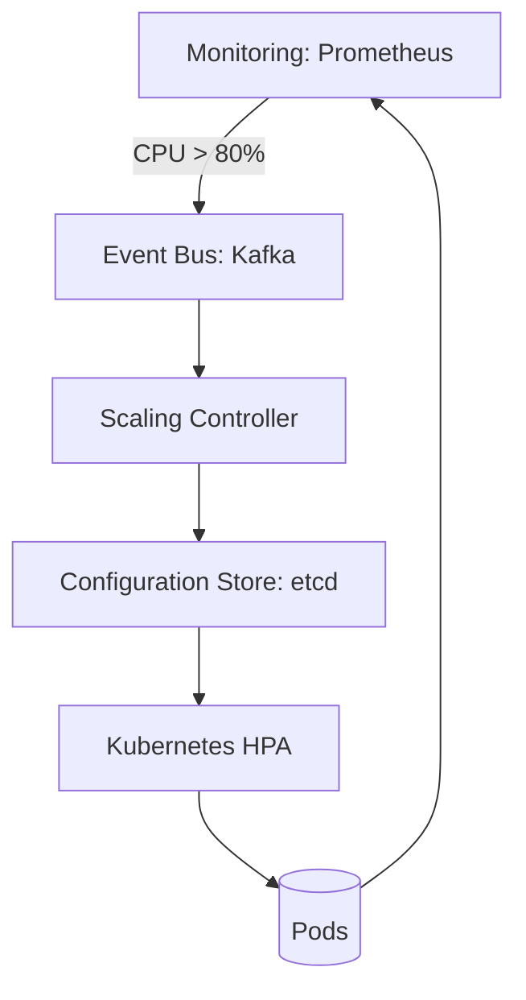

# **[Pattern] Scaling Configuration Reference Guide**

---

## **Overview**
The **Scaling Configuration Pattern** ensures efficient resource allocation for distributed systems by dynamically adjusting configurations based on workload, system metrics, or external triggers. This pattern decouples static configuration management from runtime scaling decisions, enabling systems to scale **horizontally** (adding nodes) or **vertically** (upgrading resources) without manual intervention.

Key use cases include:
- **Auto-scaling microservices** based on CPU/memory thresholds.
- **Load balancing** by distributing configuration changes across nodes.
- **Multi-tenancy** support where per-tenant configurations scale independently.
- **Disaster recovery** by dynamically updating failover configurations.

By centralizing scaling logic, this pattern reduces downtime, optimizes cloud spend, and improves system resilience.

---

## **Schema Reference**

| **Component**          | **Field**               | **Data Type**       | **Description**                                                                                     | **Example Value**                     |
|-------------------------|-------------------------|---------------------|-----------------------------------------------------------------------------------------------------|---------------------------------------|
| **Scaling Policy**      | `policy_id`             | `string`            | Unique identifier for the scaling policy.                                                          | `"auto-scale-webservers"`             |
|                         | `name`                  | `string`            | Human-readable name of the policy.                                                                   | `"Scale Web Servers Based on Traffic"`|
|                         | `type`                  | `enum` (`cron`, `metric`, `manual`) | Trigger mechanism (scheduled, event-based, or manual).      | `"metric"`                           |
|                         | `resource_group`        | `string`            | Target resource group (e.g., Kubernetes deployment, EC2 auto-scaling group).                     | `"web-server-group"`                 |
|                         | `scale_direction`       | `enum` (`horizontal`, `vertical`) | Direction of scaling (adding nodes vs. upgrading instance types). | `"horizontal"`                       |
|                         | `up_scale_threshold`    | `object`            | Conditions to trigger scaling **up**.                                                               | `{ "metric": "cpu_utilization", "value": 70 }` |
|                         | `down_scale_threshold`  | `object`            | Conditions to trigger scaling **down**.                                                             | `{ "metric": "request_latency", "value": 500 }` |
| **Configuration**       | `config_key`            | `string`            | Unique identifier for a specific configuration setting.                                             | `"max_connections"`                   |
|                         | `value`                 | `string`/`number`   | Dynamic value for the configuration (e.g., max connections, timeouts).                             | `1000`                                |
|                         | `scale_factor`          | `number`            | Multiplier/divisor applied when scaling (e.g., `1.5` for 50% increase).                            | `1.2` (20% increase)                  |
|                         | `scope`                 | `enum` (`global`, `tenant`, `node`) | Applicability range of the configuration.                                                           | `"tenant"`                            |
| **Trigger**             | `metric_source`         | `string`            | System/monitoring source (e.g., Prometheus, CloudWatch, custom API).                               | `"prometheus:webserver_cpu"`          |
|                         | `poll_interval`         | `number` (seconds)  | Frequency of trigger checks.                                                                         | `300` (5 minutes)                     |
|                         | `cool_down_period`      | `number` (seconds)  | Time to wait after scaling to avoid rapid oscillations.                                             | `600` (10 minutes)                    |
| **Execution**           | `action`                | `enum` (`deploy`, `update`, `rollback`) | Operation to perform during scaling.                                                               | `"update"`                           |
|                         | `retry_policy`          | `object`            | Retry configuration for failed executions (attempts, backoff).                                      | `{ "max_attempts": 3, "backoff_sec": 10 }` |

---

## **Implementation Details**

### **1. Key Concepts**
#### **a. Scaling Policies**
- Defines **when** and **how** to scale (e.g., "scale up if CPU > 80% for 5 minutes").
- Policies can be **static** (predefined thresholds) or **dynamic** (AI/ML-driven adjustments).

#### **b. Configuration Scaling**
- Configurations are versioned and **immutable** to enable rollback.
- Example: If scaling up a database cluster, `max_connections` might increase from `1000` to `1500`.

#### **c. Decoupled Triggers**
- Triggers (metrics, events, or schedules) **do not** directly modify configurations.
- Use an **event bus** (e.g., Kafka, AWS EventBridge) to separate triggers from execution.

#### **d. Idempotency**
- Ensure scaling actions are **idempotent** (repeating the same action produces the same result).
- Example: Updating max_connections to `1000` twice should not cause errors.

---

### **2. Data Flow**
```
[Monitoring System] → [Trigger Evaluation] → [Event Bus] → [Scaling Controller] → [Configuration Store] → [Runtime System]
```
- **Monitoring System**: Collects metrics (e.g., Prometheus, Datadog).
- **Trigger Evaluation**: Checks if thresholds are met (e.g., `cpu_utilization > 70%`).
- **Event Bus**: Publishes scaling events (e.g., `{"action": "scale_up", "policy_id": "webservers"}`).
- **Scaling Controller**: Validates policies and updates configurations atomically.
- **Configuration Store**: Stores current and historical configurations (e.g., etcd, ZooKeeper).
- **Runtime System**: Applies configurations to containers, VMs, or serverless functions.

---

### **3. Best Practices**
| **Best Practice**               | **Implication**                                                                 |
|----------------------------------|---------------------------------------------------------------------------------|
| **Use immutable configurations** | Avoids corruption during scaling events.                                       |
| **Implement circuit breakers**   | Prevents cascading failures during rapid scaling.                               |
| **Monitor scaling events**       | Track success/failure of scaling operations (e.g., using OpenTelemetry).       |
| **Avoid over-fragmentation**     | Group related configurations (e.g., all DB settings under `scope: "database"`). |
| **Test in staging**              | Validate scaling policies with simulated load before production.                 |

---

## **Query Examples**

### **1. List All Active Scaling Policies**
```bash
# API Example (REST)
GET /api/v1/scaling/policies?status=active
```
**Response:**
```json
{
  "policies": [
    {
      "policy_id": "webserver-scale",
      "name": "Scale Web Servers",
      "type": "metric",
      "resource_group": "webservers",
      "scale_direction": "horizontal",
      "up_scale_threshold": {"metric": "cpu_utilization", "value": 70},
      "down_scale_threshold": {"metric": "request_latency", "value": 500}
    }
  ]
}
```

---

### **2. Update a Configuration for a Specific Policy**
```bash
# API Example
PUT /api/v1/scaling/configurations/webserver-scale/max_connections
{
  "value": 2000,
  "scale_factor": 1.5,
  "scope": "global"
}
```
**Response:**
```json
{
  "status": "success",
  "previous_value": 1000,
  "new_value": 2000,
  "applied_at": "2023-10-15T14:30:00Z"
}
```

---

### **3. Trigger a Manual Scaling Event**
```bash
# API Example
POST /api/v1/scaling/events
{
  "policy_id": "webserver-scale",
  "action": "scale_up",
  "priority": "high"
}
```
**Response:**
```json
{
  "event_id": "event-12345",
  "status": "queued",
  "triggered_at": "2023-10-15T14:35:00Z"
}
```

---

### **4. Query Configuration History**
```bash
# API Example
GET /api/v1/scaling/configurations/webserver-scale/history?key=max_connections
```
**Response:**
```json
{
  "history": [
    {
      "version": 1,
      "value": 1000,
      "changed_at": "2023-10-01T09:00:00Z",
      "changed_by": "auto-scaler"
    },
    {
      "version": 2,
      "value": 2000,
      "changed_at": "2023-10-15T14:30:00Z",
      "changed_by": "manual"
    }
  ]
}
```

---

## **Error Handling & Edge Cases**

| **Scenario**                          | **Action**                                                                                     |
|----------------------------------------|------------------------------------------------------------------------------------------------|
| **Threshold crossed but no resources** | Scale down instead of failing (graceful degradation).                                          |
| **Configuration conflict**            | Roll back to the last known good state.                                                       |
| **Monitoring system unavailable**     | Fall back to a static configuration or pause triggering.                                     |
| **Rapid scaling oscillations**        | Enforce `cool_down_period` to prevent thrashing.                                              |
| **Permission denied**                 | Log the event and notify administrators.                                                        |

---

## **Related Patterns**

| **Pattern**                          | **Relationship**                                                                                     | **Use Case Example**                                                                               |
|--------------------------------------|-----------------------------------------------------------------------------------------------------|---------------------------------------------------------------------------------------------------|
| **[Circuit Breaker](https://microservices.io/patterns/reliability.html#circuit-breaker)** | Complements scaling by preventing cascading failures during rapid scaling events.                  | If scaling fails 3 times, pause further attempts for 5 minutes.                                    |
| **[Config Maps](https://kubernetes.io/docs/concepts/configuration/secret/)**      | Stores dynamic configurations for Kubernetes pods.                                               | Use with Scaling Configuration to adjust `max_connections` per pod based on traffic.              |
| **[Feature Flags](https://martinfowler.com/articles/feature-toggles.html)**       | Enables gradual rollouts of scaling policies.                                                      | Roll out a new scaling policy to 10% of traffic before full deployment.                            |
| **[Rate Limiting](https://docs.aws.amazon.com/apigateway/latest/developerguide/set-up-rate-based-throttling.html)** | Prevents over-scaling due to traffic spikes.                                                     | Limit scaling events to 1 per minute to avoid sudden resource exhaustion.                          |
| **[Service Mesh (e.g., Istio)](https://istio.io/latest/docs/concepts/traffic-management/)** | Manages dynamic traffic routing during scaling events.                                            | Redirect traffic away from nodes being scaled back down.                                          |

---

## **Example Architecture**


---
**Notes:**
- Replace placeholders (e.g., `Prometheus`, `Kubernetes`) with your system’s tools.
- For serverless (e.g., AWS Lambda), replace `Kubernetes HPA` with **Provisioned Concurrency** or **Step Functions**.
- Add **metrics endpoints** (e.g., `/metrics/scale_events_total`) for observability.