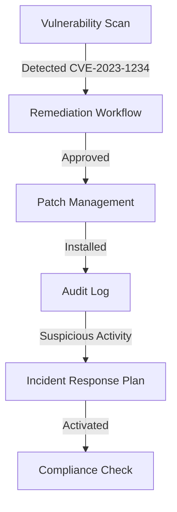

# **[Pattern: Security Maintenance] Reference Guide**

---

## **Overview**
The **Security Maintenance** pattern ensures continuous monitoring, assessment, and remediation of security vulnerabilities in systems, applications, or infrastructure. This pattern is critical for maintaining compliance with security policies, detecting unauthorized access, and mitigating risks before they escalate. It integrates **automated scanning, manual reviews, patch management, and incident response** to proactively identify and resolve security weaknesses.

Key objectives include:
- **Vulnerability Detection** – Identify known and unknown threats using tools like vulnerability scanners, SIEM systems, and threat intelligence feeds.
- **Risk Assessment** – Prioritize vulnerabilities based on severity, exploitability, and impact.
- **Remediation & Patch Management** – Apply security updates, configure firewalls, and enforce least-privilege access.
- **Compliance Validation** – Ensure adherence to regulatory standards (e.g., PCI-DSS, GDPR, ISO 27001).
- **Incident Response** – Contain, investigate, and recover from security breaches with predefined playbooks.

---

## **Schema Reference**

| **Component**               | **Description**                                                                 | **Required Fields**                                                                 | **Optional Fields**                                                                 |
|-----------------------------|-------------------------------------------------------------------------------|------------------------------------------------------------------------------------|-------------------------------------------------------------------------------------|
| **Vulnerability Scan**      | Automated or manual security assessment of assets (apps, OS, networks).      | - `scan_id` (UUID)<br>- `asset_type` (e.g., "web_app", "server", "API")<br>- `scan_date` (timestamp)<br>- `severity` (critical/high/medium/low)<br>- `CVE_id` (if applicable) | - `scan_tool` (e.g., "Nessus", "Burp Suite")<br>- `confidence_score` (0-100)<br>- `remediation_steps` (text) |
| **Remediation Workflow**    | Steps to address identified vulnerabilities.                                 | - `workflow_id` (UUID)<br>- `status` (pending/approved/failed/completed)<br>- `priority` (P1-P4)<br>- `assigned_to` (team/role) | - `due_date` (timestamp)<br>- `automation_flag` (boolean)<br>- `justification` (text) |
| **Patch Management**        | System for applying security updates.                                        | - `patch_id` (UUID)<br>- `affected_asset` (asset_id)<br>- `patch_version` (e.g., "Linux Kernel 5.4.191")<br>- `status` (pending/installed/tested) | - `tested_by` (account)<br>- `revert_plan` (text)<br>- `automated_deployment` (boolean) |
| **Incident Response Plan**  | Predefined procedures for security breaches.                                | - `plan_id` (UUID)<br>- `incident_type` (e.g., "DDoS", "data_leak")<br>- `activation_threshold` (e.g., "critical severity") | - `escalation_path` (team hierarchy)<br>- `forensic_tools` (list)<br>- `SLA_target` (minutes/hours) |
| **Audit Log**               | Record of security-related events (logins, access changes, scans).           | - `log_entry_id` (UUID)<br>- `event_type` (e.g., "failed_login", "policy_violation")<br>- `timestamp` (ISO 8601)<br>- `source_ip` (if applicable)<br>- `status` (normal/suspicious/compromised) | - `user_agent` (for web logs)<br>- `affected_data` (PII sensitivity)<br>- `mitigation_action` (text) |
| **Compliance Check**        | Validation against regulatory standards.                                     | - `check_id` (UUID)<br>- `compliance_framework` (e.g., "GDPR Article 32")<br>- `asset_scope` (e.g., "all databases")<br>- `result` (pass/fail/partial) | - `auditor_notes` (text)<br>- `remediation_deadline` (timestamp)<br>- `automated_check` (boolean) |

---
**Data Flow Example:**


---

## **Implementation Details**

### **1. Vulnerability Detection**
- **Tools:**
  - **Static Application Security Testing (SAST):** SonarQube, Checkmarx (for code).
  - **Dynamic Application Security Testing (DAST):** OWASP ZAP, Burp Suite (for runtime).
  - **Network Scanners:** Nessus, OpenVAS (for infrastructure).
  - **Cloud Scanners:** AWS Inspector, Azure Security Center.
- **Frequency:**
  - **Critical systems:** Weekly scans.
  - **High-risk assets:** Monthly scans.
  - **Low-risk assets:** Quarterly scans.

### **2. Risk Prioritization**
Use a **severity scoring system** (e.g., CVSS v3.1) to rank vulnerabilities:
| **Severity** | **CVSS Score Range** | **Actions**                                                                 |
|--------------|----------------------|------------------------------------------------------------------------------|
| Critical     | 9.0–10.0             | Immediate patching + containment.                                            |
| High         | 7.0–8.9              | Patch within **48 hours**; monitor for exploits.                             |
| Medium       | 4.0–6.9              | Patch within **30 days**; document justification for exceptions.              |
| Low          | 0.1–3.9              | Schedule in next maintenance window; monitor for changes.                    |

### **3. Remediation Workflow**
- **Automated Remediation:**
  - Use configuration management tools (Ansible, Chef) for repetitive fixes.
  - Example: Auto-apply patches to vulnerable Linux servers via scripting.
- **Manual Review:**
  - For high-risk assets, require approval from a security team before applying changes.
- **Change Tracking:**
  - Log all remediation steps in the **Audit Log** component with `mitigation_action`.

### **4. Patch Management Best Practices**
- **Test in Staging:**
  - Deploy patches to a non-production environment first (e.g., "patch testing" phase).
- **Rollback Plan:**
  - Maintain a **revert_script** in the `Patch Management` schema for failed deployments.
- **Validation:**
  - Verify fixes using **rescans** (e.g., re-run Nessus after patching).

### **5. Incident Response**
- **Detection Triggers:**
  - Failed logins (`event_type: "failed_login"`), unusual data access (`affected_data: "PII"`).
- **Response Phases:**
  1. **Containment:** Isolate affected systems (e.g., quarantine a compromised VM).
  2. **Eradication:** Remove root causes (e.g., revoke compromised credentials).
  3. **Recovery:** Restore services from clean backups.
  4. **Lessons Learned:** Update the `Incident Response Plan` based on post-mortem findings.

### **6. Compliance Validation**
- **Automated Checks:**
  - Use tools like **OpenSCAP** (for CIS benchmarks) or **Policy Compliance** APIs.
- **Manual Audits:**
  - Quarterly reviews by compliance teams (e.g., GDPR sovereignty checks).
- **Documentation:**
  - Store results in the `Compliance Check` schema with `auditor_notes`.

---

## **Query Examples**

### **1. Find Unpatched Critical Vulnerabilities**
```sql
SELECT v.*
FROM Vulnerability_Scan v
JOIN Remediation_Workflow w ON v.scan_id = w.workflow_id
WHERE v.severity = 'critical'
  AND w.status = 'pending'
  AND w.priority = 'P1';
```
**Output:**
| `scan_id` | `asset_type` | `CVE_id` | `severity` | `remediation_steps` |
|-----------|--------------|----------|------------|---------------------|
| abc123    | web_app      | CVE-2023-5678 | critical   | "Update Django to v4.2" |

---

### **2. List Assets with Failed Patches**
```sql
SELECT p.*
FROM Patch_Management p
WHERE p.status = 'failed'
  AND p.due_date < CURRENT_DATE;
```
**Output:**
| `patch_id` | `affected_asset` | `patch_version` | `status` | `revert_plan`                     |
|------------|------------------|-----------------|----------|-----------------------------------|
| xyz987     | db-server-01     | "PostgreSQL 14.5" | failed    | "Revert to 14.4 via docker rollback" |

---

### **3. Generate Compliance Report for GDPR**
```sql
SELECT c.*
FROM Compliance_Check c
WHERE c.compliance_framework = 'GDPR Article 32'
  AND c.result = 'fail';
```
**Output:**
| `check_id` | `asset_scope`   | `result` | `remediation_deadline` | `auditor_notes`                  |
|------------|-----------------|----------|-----------------------|----------------------------------|
| def456     | "customer_db"   | fail     | 2023-11-15 00:00:00   | "Encryption keys not rotated Q4" |

---

### **4. Track Incidents by Response Time**
```sql
SELECT i.*
FROM Incident_Response_Plan i
WHERE i.activation_threshold = 'critical'
  AND i.response_time_ms > 300000;  -- >5 minutes
ORDER BY i.response_time_ms DESC;
```
**Output:**
| `plan_id` | `incident_type` | `activation_threshold` | `response_time_ms` | `escalation_path` |
|-----------|-----------------|------------------------|--------------------|--------------------|
| ghi789     | "data_leak"     | "critical"             | 600000             | "Security Team -> CISO" |

---

## **Related Patterns**

| **Pattern**                  | **Description**                                                                 | **Use Case**                                                                 |
|------------------------------|---------------------------------------------------------------------------------|------------------------------------------------------------------------------|
| **[Defense in Depth](https://example.com/defense-depth)** | Layered security controls (e.g., firewalls + encryption + access controls). | Protects against multi-vector attacks by reducing single points of failure. |
| **[Zero Trust Architecture](https://example.com/zero-trust)** | Verify every access request, even internal users.                            | Mitigates insider threats and lateral movement in breaches.                  |
| **[Runtime Application Self-Protection (RASP)](https://example.com/rasp)** | Monitors app behavior in real-time for anomalies.                           | Detects zero-day exploits during runtime (e.g., API abuse, injection attacks). |
| **[Security by Design](https://example.com/security-by-design)** | Integrates security into development lifecycle (DevSecOps).                   | Prevents vulnerabilities from being introduced in the first place.          |
| **[Threat Modeling](https://example.com/threat-modeling)** | Systematically identifies threats and countermeasures.                       | Proactive risk assessment before implementation.                           |

---
**Synergy with Security Maintenance:**
- Use **Defense in Depth** to layer remediation steps (e.g., patch + WAF + monitoring).
- **Zero Trust** complements maintenance by enforcing least-privilege access after patches.
- **RASP** can trigger automated responses in the `Incident Response Plan` for real-time threats.

---
## **Best Practices**
1. **Automate Where Possible:**
   - Use tools like **Chef/Puppet** for patch deployment and **SIEM systems** (e.g., Splunk) for log correlation.
2. **Define Clear Ownership:**
   - Assign a **Security Champion** per team to track remediation workflows.
3. **Document Everything:**
   - Maintain a **security runbook** with step-by-step guides for common issues (e.g., "How to patch Log4j").
4. **Test Incident Responses:**
   - Conduct **tabletop exercises** annually to validate the `Incident Response Plan`.
5. **Stay Updated:**
   - Subscribe to **CVE feeds** (e.g., NVD) and **threat intelligence** (e.g., AlienVault OTX) for proactive scanning.

---
**Common Pitfalls to Avoid:**
- **Overlooking Third-Party Risks:** Ensure vendors’ software is patched (e.g., `affected_asset: "third_party_lib"`).
- **Ignoring False Positives:** Reduce noise in vulnerability scans by tuning thresholds (e.g., exclude `severity: "low"` for certain assets).
- **Manual Processes:** Avoid paper-based tracking; integrate tools like **Jira** or **ServiceNow** for workflows.

---
## **Tools & Integrations**
| **Category**          | **Tools**                                                                 |
|-----------------------|---------------------------------------------------------------------------|
| **Vulnerability Scanning** | Nessus, OpenVAS, Qualys, Tenable.io, SonarQube, Snyk                  |
| **Patch Management**   | Microsoft WSUS, Red Hat Satellite, Ansible Tower, Nagios                  |
| **SIEM/Logging**      | Splunk, ELK Stack, IBM QRadar, Microsoft Sentinel                          |
| **Compliance**        | Drata, OneTrust, MetricStream, ServiceNow Risk Management               |
| **Incident Response** | MISP (Malicious Infrastructure Analysis), PhishMe, Cortex (Palantir)      |
| **Orchestration**     | AWS Systems Manager, Azure Automation, Terraform (for IaC security)      |

---
**Sample Integration Workflow:**
1. **Nessus** detects a vulnerability → triggers a **Jira ticket** in `Remediation Workflow`.
2. **Ansible** automates patch deployment → updates **AWS Systems Manager** status.
3. **Splunk** correlates logs → activates the `Incident Response Plan` if anomalies are detected.
4. **OneTrust** validates compliance → generates a report in `Compliance Check`.