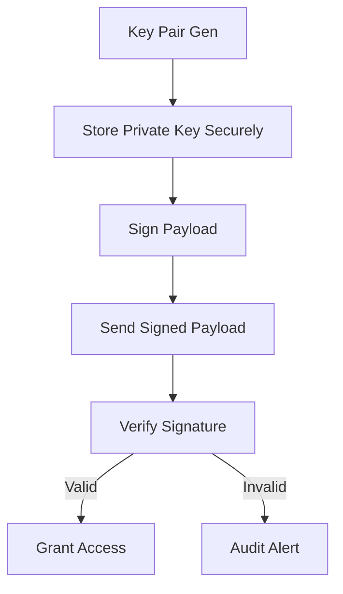

# **[Pattern] Signing Setup Reference Guide**

## **Overview**
The **Signing Setup** pattern ensures secure and authenticated access to systems, APIs, or services by establishing, managing, and validating cryptographic signing keys. This pattern is foundational for authentication, data integrity, and authorization workflows, particularly in zero-trust architectures, API gateways, and cloud-native environments.

It standardizes the lifecycle of signing keys (e.g., RSA, ECDSA) to prevent key leakage, enforce rotation policies, and integrate seamlessly with identity providers (IdPs), OAuth 2.0, and JWT-based systems. The pattern includes provisions for key generation, storage, validation, and revocation, while supporting workflows like **Sign-and-Send** (e.g., JWT tokens) and **Verify-and-Act** (e.g., certificate validation).

This guide covers the core components, interactions, and implementation best practices for integrating Signing Setup into applications, microservices, or infrastructure-as-code (IaC) environments.

---

## **Implementation Details**

### **Core Components**
Each Signing Setup instance interacts with the following key elements:

| **Component**         | **Purpose**                                                                                     | **Technologies/Libraries**                                                                 |
|-----------------------|-------------------------------------------------------------------------------------------------|-------------------------------------------------------------------------------------------|
| **Key Pair Manager**  | Generates, stores, and rotates cryptographic key pairs (public/private) or certificates.         | HashiCorp Vault, AWS KMS, OpenSSL, Go ECDSA/RSA, Python `cryptography`                     |
| **Signing Service**   | Signs payloads (e.g., JWTs, API requests) using private keys.                                   | `jose` (JWT library), `signer` middleware (Express.js), AWS SigV4 signing tools             |
| **Validation Service**| Verifies signatures using public keys (or certificates) to confirm authenticity.              | JWT libraries (`jsonwebtoken`, `PyJWT`), X.509 certificate validators (OpenSSL, `mosquitto`)|
| **Revocaton List**    | Tracks revoked keys/certificates via CRL (Certificate Revocation List) or OCSP (Online CSP).   | CRL-DB, Microsoft AD CS, `revoke` middleware (custom implementations)                   |
| **Audit Log**         | Records signing/validation events for compliance and debugging (e.g., key rotation triggers). | ELK Stack, Splunk, AWS CloudTrail, custom logging middleware                             |
| **Key Rotation Policy** | Defines TTL (Time-To-Live), renewal thresholds, and fallback keys for zero-downtime upgrades. | Terraform (IaC), `keyring` (Python), custom cron jobs                                      |

---

### **Key Concepts**

#### **1. Signing Workflow**


**Steps:**
- **Key Generation:** Create RSA/ECDSA key pairs or X.509 certificates (e.g., using OpenSSL or AWS KMS).
- **Key Storage:** Encrypt private keys (e.g., in HashiCorp Vault) and distribute public keys via trusted channels (e.g., JWKS endpoint).
- **Signing:** Use the private key to sign data (e.g., JWT tokens, OAuth2 requests) via HMAC, RSA, or ECDSA.
- **Validation:** Recipient verifies the signature using the public key. Rejects invalid signatures or revoked keys.

#### **2. Key Rotation Strategies**
| **Strategy**               | **Use Case**                                  | **Implementation Notes**                                                                 |
|----------------------------|-----------------------------------------------|------------------------------------------------------------------------------------------|
| **Static Rotation (TTL)**  | Short-lived credentials (e.g., API tokens).   | Rotate keys after 24h (JWT `exp` claim); use Vault’s `transit` engine.                   |
| **Event-Triggered**        | Key compromise detected.                      | Revoke keys via CRL/OCSP; trigger rotation via webhook (e.g., AWS Lambda + CloudWatch).   |
| **Rolling Rotation**       | Zero-downtime upgrades.                      | Deploy new key + old key simultaneously; validate both during transition.                 |
| **Certificate Authority (CA)** | PKI-based systems.                          | Leverage enterprise CAs (e.g., Microsoft AD CS) or public CAs (Let’s Encrypt) for scalability. |

#### **3. Cryptographic Algorithms**
| **Algorithm**       | **Key Size** | **Use Case**               | **Security Notes**                                                                 |
|---------------------|--------------|---------------------------|-----------------------------------------------------------------------------------|
| **RSA**             | 2048+ bits   | Legacy systems, JWTs.      | Avoid <2048 bits; prefer ECDSA for mobile/embedded constraints.                     |
| **ECDSA (P-256)**   | 256 bits     | Modern APIs, mobile apps.  | Smaller key size; faster signing/validation than RSA.                              |
| **HMAC-SHA256**     | 256 bits     | Short-lived tokens.        | Symmetric key; avoid for long-term security (key distribution complexity).         |
| **EdDSA (Ed25519)**  | 256 bits     | High-performance needs.   | Used in SSH; not yet standardized for JWT but gaining traction.                    |

**Deprecated Algorithms:** Avoid SHA-1, MD5, or RSA-1024 for security.

---

## **Schema Reference**
### **1. Key Pair Schema (OpenAPI 3.0)**
```yaml
components:
  schemas:
    KeyPair:
      type: object
      required:
        - public_key
        - private_key  # Encrypted in production
      properties:
        algorithm:
          type: string
          enum: [RSA, ECDSA, EdDSA]
          example: "ECDSA"
        key_size:
          type: integer
          example: 256
        expiry:
          type: string
          format: date-time
          example: "2025-12-31T23:59:59Z"
        issuer:
          type: string
          format: uri
          example: "https://idp.example.com"
        metadata:
          type: object
          example:
            rotation_policy: "rolling"
            revoked: false
```

### **2. JWKS Endpoint Response**
```json
{
  "keys": [
    {
      "kty": "EC",
      "crv": "P-256",
      "x": "AQAB",
      "y": "BCDE",
      "kid": "abc123",
      "use": "sig",
      "alg": "ES256",
      "exp": 1735689600
    }
  ]
}
```
- **`kid`:** Key ID for linking signed tokens to keys.
- **`exp`:** Expiry timestamp (JWT); triggers rotation if exceeded.

### **3. Audit Log Entry**
```json
{
  "event_id": "a1b2c3d4",
  "timestamp": "2024-01-15T14:30:00Z",
  "action": "key_rotation_triggered",
  "key_id": "abc123",
  "old_key_id": "xyz789",
  "initiator": "admin@example.com",
  "status": "success"
}
```

---

## **Query Examples**
### **1. Generate a New Key Pair (OpenSSL)**
```bash
# Generate ECDSA key pair (P-256)
openssl ecparam -genkey -name prime256v1 -out private_key.pem
openssl ec -in private_key.pem -pubout -out public_key.pem
```

### **2. Sign a JWT Token (Node.js)**
```javascript
const jwt = require('jsonwebtoken');
const privateKey = fs.readFileSync('private_key.pem', 'utf8');

const token = jwt.sign(
  { userId: 123 },
  privateKey,
  { algorithm: 'ES256', expiresIn: '1h' }
);
```

### **3. Validate a JWT (Python)**
```python
import jwt
from cryptography.hazmat.primitives import serialization

public_key = serialization.load_pem_public_key(
    open('public_key.pem').read()
).public_bytes(encoding=serialization.Encoding.PEM, format=serialization.PublicFormat.SubjectPublicKeyInfo)

try:
    decoded = jwt.decode(
        token,
        public_key,
        algorithms=['ES256']
    )
except jwt.ExpiredSignatureError:
    print("Token expired")
```

### **4. Check Key Revocation (CRL)**
```bash
# Verify certificate against CRL (OpenSSL)
openssl crl -in crl.pem -noout -text
openssl verify -CAfile ca.crt -untrusted intermediate.crt certificate.pem crl.pem
```

### **5. Rotate Keys via Terraform**
```hcl
resource "aws_kms_key" "signing_key" {
  description             = "Signing key for API tokens"
  deletion_window_in_days = 30
  policy                  = data.aws_iam_policy_document.kms_policy.json
}

resource "aws_kms_alias" "signing_key_alias" {
  name          = "alias/signing-key"
  target_key_id = aws_kms_key.signing_key.key_id
}
```

---

## **Related Patterns**
| **Pattern**               | **Description**                                                                                     | **When to Use**                                                                             |
|---------------------------|-----------------------------------------------------------------------------------------------------|---------------------------------------------------------------------------------------------|
| **[OAuth 2.0 Token Validation](href)** | Validates OAuth tokens using JWKS and Introspection Endpoints.                                    | API gateways, microservices relying on OAuth2.                                           |
| **[Zero-Trust Networking](href)** | Combines authentication with mutual TLS (mTLS) and continuous verification.                    | Hybrid cloud, edge computing, or high-security environments.                                |
| **[Certificate Authority (CA) Setup](href)** | Deploys a PKI infrastructure for certificate management.                                        | Enterprise environments with internal PKI needs (e.g., Windows AD).                        |
| **[Cryptographic Envelope Pattern](href)** | Encrypts data before signing to protect payload confidentiality.                                   | Sensitive data transmission (e.g., HIPAA/GDPR compliance).                                  |
| **[Webhook Signing](href)** | Signs webhook payloads to prevent replay attacks.                                                 | Event-driven architectures (e.g., GitHub webhooks, Stripe listeners).                      |

### **Integration Considerations**
- **With OAuth 2.0:** Use JWKS endpoints (`/.well-known/jwks.json`) for public key discovery.
- **With JWT:** Align key rotation with `exp` claim to avoid token breakage.
- **With PKI:** Export public keys to trusted CAs for certificate issuance.
- **With Audit Logs:** Correlate signing events with access logs (e.g., ELK stack).

---

## **Best Practices**
1. **Key Management:**
   - Use hardware security modules (HSMs) or cloud KMS for private keys.
   - Encrypt private keys at rest (e.g., AWS KMS, HashiCorp Vault).
   - Limit key access to least-privilege roles.

2. **Rotation:**
   - Set TTLs shorter than security teams’ incident response times (e.g., 24h).
   - Test rotation in staging before production.

3. **Validation:**
   - Cache public keys locally but validate `kid` and `exp` claims.
   - Reject tokens with `alg` values not in your allowed list (e.g., `ES256`).

4. **Security:**
   - Monitor for signature forgeries or revocation list bypasses.
   - Use `jwk` endpoints with rate limiting to prevent brute-force key discovery.

5. **Compliance:**
   - Retain audit logs for 1–3 years (GDPR/HIPAA).
   - Document key rotation procedures for audits.

---
**References:**
- [RFC 7517 (JWK)](https://datatracker.ietf.org/doc/html/rfc7517)
- [OAuth 2.0 JWT Bearer Flow](https://datatracker.ietf.org/doc/html/rfc9068)
- [AWS KMS Signing Example](https://docs.aws.amazon.com/kms/latest/developerguide/services-signing.html)