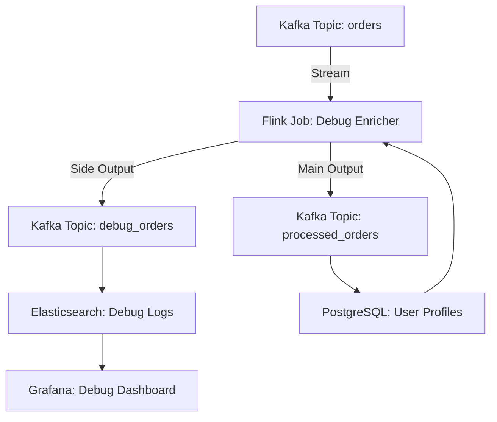

# **[Pattern] Streaming Debugging Reference Guide**

---

## **Overview**
Streaming Debugging is a pattern for efficiently diagnosing issues in **real-time or near-real-time data pipelines**, microservices, or event-driven architectures. Unlike traditional batch-based debugging (where logs or traces are analyzed offline), Streaming Debugging processes and inspects data *as it flows*, enabling **low-latency root-cause analysis** with minimal overhead. This pattern leverages **streams, sampling, enrichment, and correlation** to identify anomalies, bottlenecks, or misconfigurations while maintaining performance.

Common use cases include:
- Debugging **kafka streams, lambda functions, or serverless event handlers**
- Monitoring **real-time analytics pipelines (e.g., Flink, Spark Streaming)**
- Tracking issues in **distributed microservices with asynchronous communication**
- Investigating **network latency or API throttling** in streaming workloads

---

## **Key Concepts**
| **Concept**               | **Definition**                                                                                     | **When to Use**                                                                                     |
|---------------------------|---------------------------------------------------------------------------------------------------|------------------------------------------------------------------------------------------------------|
| **Stream Sampling**       | Selecting a subset of records from a stream for debugging (e.g., every 10th event).              | High-volume streams where full inspection is impractical.                                          |
| **Enrichment**            | Adding contextual metadata (e.g., user session IDs, geolocation) to stream events.               | Debugging requires deeper context than raw payloads (e.g., fraud detection).                       |
| **Correlation IDs**       | Unique identifiers attached to events to trace their flow across services/components.           | Debugging multi-service transactions (e.g., order processing).                                       |
| **Side Outputs**          | Splitting stream data into parallel sinks for separate processing (e.g., debug logs vs. analytics).| Isolating debug data without clogging primary processing paths.                                      |
| **Dynamic Filtering**     | Filtering streams based on runtime conditions (e.g., errors, timeouts).                          | Reacting to real-time anomalies (e.g., spiking latency).                                           |
| **Backpressure Handling** | Mechanisms to slow down ingestion when the system is overwhelmed.                                 | Preventing debug overhead from crashing production pipelines.                                        |

---

## **Schema Reference**
Below is a **Linda (Logical Data Model)** schema for a **Streaming Debugging System**. Adjust fields based on your use case.

| **Field**                | **Type**       | **Description**                                                                                     | **Example Values**                                                                                   |
|--------------------------|---------------|---------------------------------------------------------------------------------------------------|------------------------------------------------------------------------------------------------------|
| `stream_id`              | String (UUID) | Unique identifier for the streaming pipeline or process.                                           | `550e8400-e29b-41d4-a716-446655440000`                                                            |
| `event_timestamp`        | Timestamp     | When the event was created (for ordering).                                                         | `2023-10-15T14:30:00Z`                                                                              |
| `correlation_id`         | String        | Trace ID to link related events across services.                                                    | `x-correlation-12345`                                                                                 |
| `sample_rate`            | Float (0-1)   | Fraction of events to sample (e.g., `0.1` = 10% of events).                                        | `0.05` (5%)                                                                                         |
| `payload`                | JSON          | Original event data (serialized).                                                                  | `{"user_id": "u123", "action": "checkout"}`                                                        |
| `metadata`               | JSON          | Enriched context (e.g., session data, geographic location).                                        | `{"session": "s789", "lat": 40.7128, "lng": -74.0060}`                                            |
| `debug_flags`            | Flags         | Runtime conditions triggering debug output (e.g., `ERROR`, `LATENCY_THRESHOLD`).                  | `[{"flag": "LATENCY", "threshold_ms": 500}]`                                                       |
| `processing_status`      | Enum          | Current state of the event (e.g., `PENDING`, `PROCESSED`, `FAILED`).                                | `PROCESSED`                                                                                         |
| `processing_time_ms`     | Integer       | Time taken to process the event.                                                                   | `120`                                                                                               |
| `parent_stream_id`       | String        | Reference to the upstream stream (for hierarchical debugging).                                    | `40e8400-e29b-41d4-a716-446655440001`                                                            |
| `backpressure_level`     | Integer       | Current backpressure score (0–100).                                                                | `75` (high pressure)                                                                                 |

---
**Example Payload:**
```json
{
  "stream_id": "550e8400-e29b-41d4-a716-446655440000",
  "event_timestamp": "2023-10-15T14:30:00Z",
  "correlation_id": "x-correlation-12345",
  "sample_rate": 0.1,
  "payload": {"user_id": "u123", "action": "checkout"},
  "metadata": {"session": "s789", "lat": 40.7128},
  "debug_flags": [{"flag": "LATENCY", "threshold_ms": 500}],
  "processing_status": "FAILED",
  "processing_time_ms": 120,
  "parent_stream_id": null
}
```

---

## **Implementation Details**
### **1. Stream Sampling**
**Purpose:** Reduce debug overhead by inspecting only a subset of events.
**Tools/Frameworks:**
- **Apache Flink:** Use `KeyedProcessFunction` with a custom sampler.
- **Kafka Streams:** Apply `Sampler` or `Filter` transformers.
- **Custom Code:** Implement probabilistic sampling (e.g., every *n*th event).

**Example (Pseudocode):**
```python
def sample_stream(stream, rate=0.1):
    sampled = stream.sample(lambda x: random.random() < rate)
    return sampled
```

### **2. Enrichment**
**Purpose:** Add contextual data to events for deeper debugging.
**Techniques:**
- **Join Streams:** Correlate debug events with side data (e.g., user profiles).
- **External APIs:** Fetch metadata (e.g., IP geolocation) during processing.
- **Side Outputs:** Write enriched debug data to a separate topic/stream.

**Example (Kafka Streams):**
```java
StreamsBuilder builder;
KStream<String, String> mainStream = builder.stream("input-topic");
KStream<String, String> debugStream = mainStream
    .filter((k, v) -> v.contains("ERROR"))
    .enrichWith(
        new UserProfileEnricher(),  // Custom enricher
        Materialized.with(String.class, String.class)
    );
```

### **3. Correlation IDs**
**Purpose:** Trace events across services.
**Implementation:**
- Inject `correlation_id` in **HTTP headers**, **Kafka headers**, or **message payloads**.
- Use **UUIDv4** or **snowflakes** for uniqueness.

**Example (HTTP Request):**
```
POST /api/checkout
Headers: {
  "X-Correlation-ID": "x-correlation-12345",
  "Content-Type": "application/json"
}
```

### **4. Dynamic Filtering**
**Purpose:** Flag events based on runtime conditions.
**Approach:**
- Use **stream operators** to filter by:
  - **Error codes** (e.g., `status: 500`)
  - **Latency** (e.g., `processing_time > 1000ms`)
  - **Custom predicates** (e.g., `payload.amount > 1000`)

**Example (Flink):**
```java
DataStream<Event> debugEvents = eventStream
    .filter(event -> event.getStatus() == "ERROR")
    .or(event -> event.getProcessingTime() > 1000);
```

### **5. Backpressure Handling**
**Purpose:** Prevent debug pipelines from overwhelming upstream systems.
**Strategies:**
- **Rate Limiting:** Throttle debug stream output (e.g., 1000 events/sec).
- **Buffering:** Queue events temporarily if downstream is slow.
- **Prioritization:** Debug high-priority events (e.g., critical errors) first.

**Example (Kafka Producer Config):**
```properties
# Limit debug messages to 1000/sec
max.in.flight.requests.per.connection=1
delivery.timeout.ms=30000
```

---
## **Query Examples**
Use these queries to analyze debug streams in tools like **Grafana**, **Elasticsearch**, or **custom dashboards**.

### **1. Find High-Latency Events**
**Query (KQL/Elasticsearch):**
```sql
stream_debug_events
| where processing_time_ms > 1000
| summarize count() by bin(timestamp, 1h), processing_status
| render timechart
```

**Output:**
| Time Range       | Failed | Processed |
|------------------|--------|-----------|
| 2023-10-15 00:00 | 42     | 120       |

---

### **2. Trace a Correlated Transaction**
**Query (SQL-like):**
```sql
SELECT *
FROM stream_debug_events
WHERE correlation_id = 'x-correlation-12345'
ORDER BY event_timestamp;
```

**Output:**
| Timestamp          | Stream ID               | Processing Status | Payload                          |
|--------------------|-------------------------|-------------------|----------------------------------|
| 2023-10-15 14:30:00 | 550e8400-e29b-41d4...   | FAILED            | `{"user_id": "u123", "action": "checkout"}` |

---

### **3. Sample Rate Analysis**
**Query (Python/Pandas):**
```python
import pandas as pd

df = pd.read_json("stream_debug_events.jsonl")
sample_rates = df["sample_rate"].value_counts().sort_index()
print(sample_rates)
```

**Output:**
```
0.05    12000
0.10    15000
0.20     5000
```

---

### **4. Backpressure Detection**
**Query (Grafana PromQL):**
```sql
sum(rate(stream_debug_events_buffer_size[1m])) by (stream_id) > 1000
```

**Output:**
| Stream ID               | Buffer Size |
|-------------------------|-------------|
| 550e8400-e29b-41d4...   | 1500        |

---

## **Related Patterns**
| **Pattern**               | **Description**                                                                                     | **When to Combine**                                                                                     |
|---------------------------|---------------------------------------------------------------------------------------------------|---------------------------------------------------------------------------------------------------------|
| **[Observability Pipeline](https://observability-patterns.com/pipelines)** | Centralized logging, metrics, and tracing.                                                          | Use **Streaming Debugging** to feed real-time insights into an observability pipeline.            |
| **[Circuit Breaker](https://microservices.io/patterns/reliability-circuit-breaker.html)** | Isolate failures in streaming components.                                                           | Apply **Streaming Debugging** to monitor circuit breaker thresholds in real time.                     |
| **[Event Sourcing](https://martinfowler.com/eaaTut/eventSourcing.html)**        | Store state changes as a sequence of events.                                                       | Debug **event sourcing** pipelines by streaming emitted events with context.                       |
| **[Rate Limiting](https://www.postman.com/learn/performance/rate-limiting/)** | Control request volume to prevent overload.                                                         | Use **Streaming Debugging** to track rate-limited events and adjust thresholds dynamically.         |
| **[Retries with Backoff](https://www.awsarchitectureblog.com/2015/03/backoff.html)** | Exponential backoff for failed requests.                                                            | Debug **retry patterns** by sampling failed events and analyzing backoff behavior.                   |

---

## **Anti-Patterns**
| **Anti-Pattern**          | **Risk**                                                                                           | **Mitigation**                                                                                       |
|---------------------------|---------------------------------------------------------------------------------------------------|-------------------------------------------------------------------------------------------------------|
| **Full Stream Inspection** | High overhead; crashes pipelines under load.                                                       | Always use **sampling** (e.g., `sample_rate=0.01`).                                                 |
| **Debugging Without Correlation IDs** | Impossible to trace events across services.                                                         | Mandate `correlation_id` in all streaming contracts.                                                |
| **Static Filtering**      | Misses runtime anomalies (e.g., sudden spikes).                                                    | Use **dynamic filtering** based on metrics (e.g., latency thresholds).                              |
| **Ignoring Backpressure** | Debug streams starve primary pipelines.                                                           | Implement **rate limiting** and **buffering** in debug streams.                                     |
| **Over-Enrichment**       | Slows processing; increases storage costs.                                                          | Enrich only when needed (e.g., for specific debug queries).                                         |

---
## **Tools & Libraries**
| **Category**               | **Tools/Libraries**                                                                               | **Best For**                                                                                          |
|----------------------------|--------------------------------------------------------------------------------------------------|-------------------------------------------------------------------------------------------------------|
| **Stream Processing**      | Apache Flink, Apache Kafka Streams, Spark Streaming                                            | Real-time debugging in large-scale pipelines.                                                       |
| **Sampling**               | [Flux Sampler](https://github.com/apache/flink/tree/master/flink-streaming/java/src/main/java/org/apache/flink/streaming/api/functions/) | Probabilistic sampling in Flink.                                                                 |
| **Enrichment**             | [Kafka Connect Enricher](https://www.confluent.io/blog/kafka-connect-enricher/)              | Joining stream data with external sources.                                                          |
| **Observability**          | OpenTelemetry, Jaeger, Prometheus                                                          | Correlating debug streams with traces/metrics.                                                      |
| **Querying**               | Elasticsearch, Grafana, ClickHouse                                                             | Analyzing debug logs with SQL-like queries.                                                         |
| **Backpressure Handling**  | [Kafka Consumer Groups](https://kafka.apache.org/documentation/#consumergroups)               | Managing debug stream consumption rates.                                                             |

---
## **Best Practices**
1. **Start with Low Sample Rates** (e.g., `0.01`) and increase only when needed.
2. **Prioritize Correlation IDs** to avoid "lost in translation" debugging.
3. **Use Side Outputs** to isolate debug data from primary streams.
4. **Monitor Backpressure** to ensure debug streams don’t strangle pipelines.
5. **Automate Alerts** for critical debug conditions (e.g., `processing_time > 2s`).
6. **Document Debug Schemas** to ensure consistency across teams.
7. **Clean Up Debug Data** after resolution (e.g., TTL policies in Kafka).

---
## **Example Architecture**


---
This guide provides a **practical, scannable** reference for implementing **Streaming Debugging**. Adjust schemas, tools, and queries to fit your specific streaming ecosystem (e.g., Kafka, Flink, or serverless).