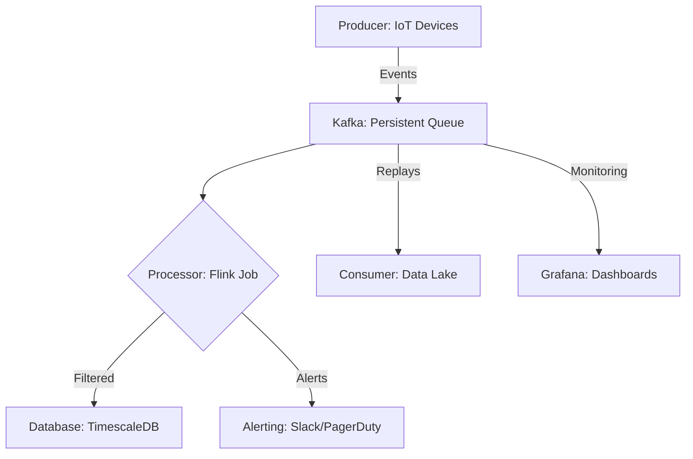

## **Overview**
The **Streaming Guidelines** pattern defines best practices for real-time data ingestion, processing, and delivery, ensuring scalability, low latency, and fault tolerance. It is designed for systems where data streams (e.g., IoT telemetry, logs, financial transactions) are continuously generated and consumed. This pattern helps optimize throughput, manage backpressure, and maintain data integrity across distributed environments. Key components include **producers** (data sources), **consumers** (data sinks), **stream processors** (e.g., filters, aggregations), and **buffers** (queues or caches). By adhering to these guidelines, developers can avoid common pitfalls like data loss, inconsistent state, or resource exhaustion while supporting high-velocity streaming workloads.

---

## **Key Concepts & Implementation Details**

### **Core Components**
| **Component**         | **Description**                                                                                     | **Example Use Cases**                          |
|-----------------------|-----------------------------------------------------------------------------------------------------|-------------------------------------------------|
| **Producer**          | Generates and emits events (e.g., sensors, APIs, databases). Must adhere to format, rate, and schema. | IoT devices sending telemetry, clickstreams.   |
| **Stream Buffer**     | Temporarily stores events (e.g., Kafka partitions, RabbitMQ queues) with **backpressure handling**.   | Queueing during high load, decoupling producers/consumers. |
| **Processor**         | Applies transformations (filters, enrichments, aggregations) in real time.                           | Fraud detection, anomaly detection.             |
| **Consumer**          | Receives and acts on processed events (e.g., databases, dashboards, ML models).                     | Storing in time-series DBs, triggering alerts.  |
| **Monitoring**        | Tracks metrics (latency, throughput, errors) to detect anomalies or degradation.                     | CloudWatch, Prometheus, Grafana.               |
| **Fault Tolerance**   | Ensures no data loss via **idempotency**, **checkpointing**, and **replayability**.                    | Exactly-once delivery, dead-letter queues.      |

---

## **Schema Reference**
Use this table to validate event formats. Adjust fields based on your system.

| **Field**            | **Type**       | **Description**                                                                                     | **Example Value**               |
|----------------------|----------------|-----------------------------------------------------------------------------------------------------|----------------------------------|
| `event_id`           | `string` (UUID) | Unique identifier for deduplication.                                                               | `a1b2c3d4-e5f6-7890-g1h2-i3j4k5` |
| `timestamp`          | `datetime`     | Event generation time (ISO 8601 format).                                                            | `2024-05-20T14:30:00.123Z`      |
| `source`             | `string`       | Identifier for the producer system or device.                                                      | `sensor/device-123`             |
| `data`               | `object`       | Payload specific to the event type (see **Data Models** below).                                    | `{ "temp": 23.5, "humidity": 45 }` |
| `metadata`           | `object`       | Optional context (e.g., user session ID, geographic location).                                     | `{ "user_id": "abc123", "loc": "NYC" }` |
| `version`            | `string`       | Schema version for backward compatibility (e.g., `v1`).                                              | `v1`                             |
| `checksum`           | `string` (SHA-256) | Ensures data integrity (computed from `data`).                                                    | `d41d8cd9...`                   |

---

### **Data Models**
Define event structures using **JSON Schema** or **Avro**. Example for a sensor event:

```json
{
  "$schema": "http://json-schema.org/draft-07/schema#",
  "title": "SensorTelemetry",
  "type": "object",
  "properties": {
    "temperature": { "type": "number", "minimum": -50, "maximum": 100 },
    "humidity": { "type": "number", "minimum": 0, "maximum": 100 }
  },
  "required": ["temperature", "humidity"]
}
```

**Versioning Strategy**:
- Increment `version` for breaking changes.
- Use **backward-compatible** schemas (e.g., adding optional fields).
- Store old schema definitions for deserialization.

---

## **Query Examples**
### **1. Filtering Events**
**Use Case**: Extract high-temperature alerts.
**Language**: [Kafka Streams](https://docs.confluent.io/platform/current/kafka-streams/) / [Flink SQL](https://nightlies.apache.org/flink/flink-docs-stable/docs/connectors/table/sql/)
```sql
-- Flink SQL
SELECT data.temperature
FROM SensorTelemetry
WHERE data.temperature > 30;
```

**Language**: Python (PySpark Structured Streaming)
```python
from pyspark.sql.functions import col

df.filter(col("data.temperature") > 30).show()
```

---

### **2. Windowed Aggregations**
**Use Case**: Average humidity per sensor over 5-minute windows.
```sql
-- Flink SQL
SELECT
  source,
  AVG(data.humidity) as avg_humidity
FROM SensorTelemetry
WINDOW TUMBLING (size 300 seconds)
GROUP BY source;
```

**Language**: Java (Flink CEP)
```java
StreamExecutionEnvironment env = StreamExecutionEnvironment.getExecutionEnvironment();
DataStream<SensorTelemetry> stream = env.addSource(new KafkaSource<>(...))
  .keyBy(SensorTelemetry::getSource)
  .window(TumblingEventTimeWindows.of(Time.minutes(5)))
  .aggregate(new AvgHumidityAggregator());
```

---

### **3. Joining Streams**
**Use Case**: Enrich sensor data with location metadata.
```sql
-- Flink SQL
SELECT
  s.*,
  l.city
FROM SensorTelemetry s
JOIN LocationMetadata l
  ON s.metadata.user_id = l.user_id;
```

**Note**: Ensure alignment of event timestamps using `WATERMARKS` or event-time processing.

---

### **4. Backpressure Handling**
**Metrics to Monitor**:
| **Metric**               | **Threshold**       | **Action**                                  |
|--------------------------|---------------------|---------------------------------------------|
| `kafka-consumer-lag`     | >1000 messages      | Scale consumers or increase partitions.     |
| `stream-processor-latency` | >1s                | Optimize filters/aggregations or add caching. |
| `buffer-full-count`      | >5% fill rate       | Adjust buffer size or throttle producers.   |

**Example (Kafka Producer Config)**:
```yaml
# producer.conf
acks=all
max.in.flight.requests.per.connection=5
compression.type=snappy
buffer.memory=33554432  # 32MB
```

---

## **Requirements Checklist**
| **Category**          | **Requirements**                                                                                     | **Tools/Frameworks**                          |
|-----------------------|-----------------------------------------------------------------------------------------------------|-----------------------------------------------|
| **Producers**         | - Validate schema before emitting.                                                                  | Avro, Protobuf, JSON Schema.                  |
|                       | - Implement **retries with backoff** for transient failures.                                       | Resilience4j, ExponentialBackoff.             |
| **Buffers**           | - Use **persistent storage** (e.g., Kafka, Pulsar) for fault tolerance.                              | Kafka, RabbitMQ, NATS.                       |
|                       | - Set **partition count** ≥ consumers × desired parallelism.                                         | --partitions=N (Kafka CLI).                  |
| **Processors**        | - Support **exactly-once** processing (e.g., transactional sinks).                                  | Flink Checkpointing, Kafka Transactions.     |
|                       | - Implement **circuit breakers** for dependent services.                                            | Hystrix, Resilience4j.                        |
| **Consumers**         | - Acknowledge messages **asynchronously** to avoid blocking.                                        | Kafka Consumer `ack()` in background thread. |
|                       | - Handle **schema drift** (e.g., fall back to default values).                                      | Schema Registry (Confluent).                 |
| **Monitoring**        | - Log **latency percentiles** (P50, P99).                                                          | Prometheus + Grafana.                         |
|                       | - Alert on **data skew** (e.g., uneven partition loads).                                            | Spark SQL `EXPLAIN ANALYZE`.                   |

---

## **Query Language Support**
| **Language**       | **Library/Framework**               | **Notes**                                      |
|--------------------|-------------------------------------|------------------------------------------------|
| SQL                | Apache Flink SQL, Spark SQL        | Optimized for windowed operations.             |
| Java/Python        | Flink, Spark Streaming              | Stateful processing with `State`/`Checkpoint`.   |
| C++                | Apache Kafka C++ Client             | Low-latency for edge use cases.                |
| Go                 | NATS Streaming, Kafka Go Client     | Lightweight, good for microservices.           |

---

## **Related Patterns**
| **Pattern**                     | **Description**                                                                                     | **When to Use**                                  |
|----------------------------------|-----------------------------------------------------------------------------------------------------|--------------------------------------------------|
| **[Event Sourcing](https://martinfowler.com/eaaToc.html)** | Append-only log of state changes for auditability.                                                    | Financial transactions, audit trails.            |
| **[CQRS](https://martinfowler.com/bliki/CQRS.html)**       | Separate read/write models to optimize performance.                                                   | High-read workloads (e.g., dashboards).          |
| **[Saga Pattern](https://martinfowler.com/articles/patterns-of-distributed-systems/patterns-of-distributed-systems.html)** | Coordinate distributed transactions via compensating actions.                                         | Microservices with complex workflows.             |
| **[Rate Limiting](https://developer.okta.com/blog/2020/04/14/rate-limiting)** | Throttle producers/consumers to prevent overload.                                                     | API gateways, bursty workloads.                  |
| **[Idempotent Producer](https://kafka.apache.org/documentation/#producerconfigs)** | Ensure duplicate events don’t cause side effects.                                                    | Exactly-once processing.                         |

---

## **Anti-Patterns & Pitfalls**
| **Anti-Pattern**               | **Risk**                                      | **Mitigation**                                  |
|---------------------------------|-----------------------------------------------|-------------------------------------------------|
| **Ignoring Ordering**           | Skewed results in windowed aggregations.       | Use `keyBy()` + watermarks.                     |
| **No Backpressure Handling**    | Producer/consumer overloads.                  | Implement dynamic scaling or flow control.      |
| **Tight Coupling to Schema**    | Breaking changes require redeploys.           | Use backward-compatible schemas (e.g., Avro).   |
| **Unbounded State**             | Memory leaks in processors.                   | Set TTL for state (e.g., Flink `StateTtlConfig`). |
| **No Monitoring**               | Undetected failures.                          | Export metrics to Prometheus/CloudWatch.         |

---

## **Performance Tuning**
| **Optimization**               | **Action**                                                                                       | **Tools**                                      |
|---------------------------------|---------------------------------------------------------------------------------------------------|-------------------------------------------------|
| **Reduce Serialization Overhead** | Use binary formats (Avro, Protobuf).                                                             | Avro Schema Registry.                           |
| **Parallel Processing**         | Increase partition counts or consumer instances.                                                  | Kafka `kafka-consumer-groups` CLI.              |
| **Local Processing**            | Use **batch processing** (e.g., Flink batch mode) for offline tasks.                               | Flink SQL `EXECUTE IMMEDIATE`.                  |
| **Compression**                 | Enable producer/consumer compression (e.g., `snappy`).                                              | Kafka `compression.type`.                       |
| **Network Optimization**        | Co-locate producers/consumers to reduce latency.                                                  | Cloud provider networking (VPC peering).        |

---

## **Example Architecture**


---
**Key**:
- **Bold**: Required; *Italics*: Optional.
- Adjust buffer sizes (`B`) and partitions based on throughput testing.
- Replace tools (e.g., Kafka, Flink) with alternatives like Pulsar or Spark if needed.