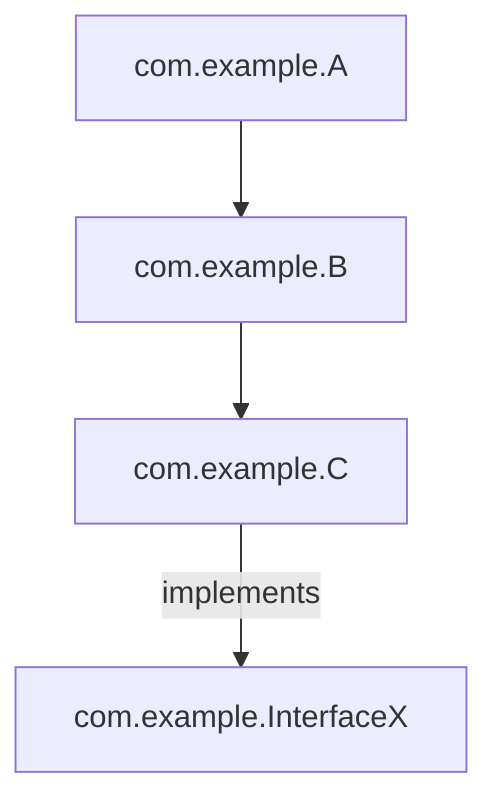

# **[Pattern] Type Closure Testing Reference Guide**

---

## **Overview**
Type Closure Testing is a pattern used to verify **type hierarchies and inheritance structures** in object-oriented or class-based systems. It ensures that types maintain valid relationships (e.g., inheritance, composition, or interfaces) and behave consistently across the hierarchy. This pattern is critical for **static type-checkers** (e.g., TypeScript, Java), **code generators**, and **refactoring tools** that rely on accurate type resolution.

The pattern focuses on:
- **Inheritance cycles** (e.g., circular dependencies where `A` extends `B`, and `B` extends `A`).
- **Interface conformance** (e.g., ensuring all implementing types adhere to expected methods/attributes).
- **Subtype polymorphism** (e.g., verifying that derived classes correctly override or extend parent behaviors).
- **Composability** (e.g., checking if types maintain valid relationships when combined via composition).

By applying Type Closure Testing, you can catch **logical inconsistencies** early, such as:
- Hidden inheritance conflicts.
- Missing or misimplemented abstract methods.
- Incompatible type joins (e.g., mixing sealed and open types).

This guide covers **how to define, query, and enforce** type closure rules programmatically.

---

## **Schema Reference**
The following table outlines key components of the Type Closure Testing pattern:

| **Component**               | **Description**                                                                                                                                                                                                 | **Example Values**                                                                                     |
|------------------------------|-----------------------------------------------------------------------------------------------------------------------------------------------------------------------------------------------------------------|---------------------------------------------------------------------------------------------------------|
| **Type Node**                | A discrete type (class, interface, enum, or abstract type) with a unique identifier.                                                                                                                       | `{"id": "com.example.User", "kind": "class", "name": "User"}`                                        |
| **Parent/Ancestor**          | A type that is directly or indirectly inherited by another type (via `extends`, `implements`, or mixins).                                                                                           | `{"id": "com.example.Person", "relationship": "inherits"}`                                           |
| **Child/Descendant**         | A type that inherits from or implements a parent type.                                                                                                                                                 | `{"id": "com.example.Admin", "relationship": "extends"}`                                             |
| **Constraint**               | Rules governing valid type relationships (e.g., "no circular dependencies," "all classes must implement `Serializable`").                                                              | `{"name": "no-circular-inheritance", "severity": "error"}`                                          |
| **Closure Path**             | The sequence of inheritance steps between two types (e.g., `A → B → C`). Used to detect violations.                                                                                                  | `["com.example.A", "com.example.B", "com.example.C"]`                                                 |
| **Transitive Closure**       | The complete set of reachable types from a starting node (e.g., all ancestors/descendants of a type).                                                                                                | `[{"id": "com.example.User", "depth": 0}, {"id": "com.example.Person", "depth": 1}]`               |
| **Violation**                | A mismatch between a type’s actual and expected relationships (e.g., missing method, incorrect inheritance).                                                                            | `{"type": "missing-method", "method": "validate", "parent": "com.example.User", "severity": "warning"}` |
| **Resolution Strategy**      | Actions to take when a violation is found (e.g., "auto-fix," "warn," "fail build").                                                                                                                     | `{"strategy": "auto-implement-missing-methods", "scope": "local"}`                                   |

---

## **Implementation Details**
### **1. Core Concepts**
#### **Inheritance Graph**
Represents types as nodes in a directed graph, where edges denote relationships (`extends`, `implements`, or `mixes-in`). Example:


#### **Closure Algorithms**
- **Depth-First Search (DFS)**: Traverse the graph recursively to find all ancestors/descendants.
- **Breadth-First Search (BFS)**: Explore level by level (useful for short-circuiting on violations).
- **Memoization**: Cache results to avoid redundant computations for repeated queries.

#### **Constraint Enforcement**
Rules are applied during:
- **Compile-time** (static analysis tools like TypeScript’s compiler).
- **Runtime** (dynamic languages with type introspection, e.g., Python’s `inspect`).
- **CI/CD pipelines** (pre-deployment checks for breaking changes).

---

### **2. Key Operations**
| **Operation**               | **Description**                                                                                                                                                     | **Example Use Case**                                                                                     |
|------------------------------|-----------------------------------------------------------------------------------------------------------------------------------------------------------------|---------------------------------------------------------------------------------------------------------|
| **Compute Closure**          | Given a type, return all reachable ancestors/descendants.                                                                                                      | `getClosure("com.example.User") → ["com.example.Person", "com.example.InterfaceX"]`                     |
| **Check Constraint**         | Verify if a type satisfies a given rule (e.g., "no circular dependencies").                                                                                   | `isValidClosure("com.example.A", ["no-circular-inheritance"])`                                         |
| **Detect Violations**        | Scan the type graph for mismatches (e.g., missing methods in a derived class).                                                                              | `findViolations("com.example.Admin") → [missing-method: validate]`                                      |
| **Resolve Conflicts**        | Suggest fixes for violations (e.g., auto-implement an interface method).                                                                                   | `autoFix({ type: "missing-method", method: "serialize" })`                                           |
| **Visualize Graph**          | Generate diagrams (e.g., Mermaid, Graphviz) for manual inspection.                                                                                              | `exportGraph("com.example.User") → SVG output`                                                        |

---

## **Query Examples**
### **1. Compute Type Closure**
**Input:**
```json
{
  "typeId": "com.example.Admin",
  "relationships": [
    {"parent": "com.example.User", "type": "extends"},
    {"parent": "com.example.InterfaceX", "type": "implements"}
  ]
}
```
**Output (Transitive Closure):**
```json
[
  {
    "type": "com.example.Admin",
    "depth": 0,
    "isSelf": true
  },
  {
    "type": "com.example.User",
    "depth": 1,
    "isAncestor": true
  },
  {
    "type": "com.example.InterfaceX",
    "depth": 1,
    "isAncestor": true
  }
]
```

---

### **2. Check for Circular Dependencies**
**Input:**
```json
{
  "typeGraph": {
    "com.example.A": ["com.example.B"],
    "com.example.B": ["com.example.C"],
    "com.example.C": ["com.example.A"]
  }
}
```
**Output:**
```json
{
  "violations": [
    {
      "type": "circular-dependency",
      "path": ["com.example.A", "com.example.B", "com.example.C", "com.example.A"],
      "severity": "error"
    }
  ]
}
```

---

### **3. Verify Interface Conformance**
**Input:**
```json
{
  "interface": "com.example.InterfaceX",
  "implementingType": "com.example.Admin",
  "requiredMethods": ["validate", "serialize"]
}
```
**Output:**
```json
{
  "violations": [
    {
      "type": "missing-method",
      "method": "serialize",
      "implementingType": "com.example.Admin",
      "severity": "warning"
    }
  ]
}
```

---

### **4. Auto-Fix Missing Methods**
**Input:**
```json
{
  "violation": {
    "type": "missing-method",
    "method": "serialize",
    "interface": "com.example.InterfaceX"
  },
  "strategy": "auto-implement"
}
```
**Output (Generated Code):**
```typescript
// Auto-generated in com.example.Admin.ts
serialize(): void {
  // Default implementation
  console.log("Serialization not implemented.");
}
```

---

## **Performance Considerations**
| **Factor**               | **Optimization Strategy**                                                                                                                                 | **Example**                                                                                          |
|--------------------------|-------------------------------------------------------------------------------------------------------------------------------------------------------|------------------------------------------------------------------------------------------------------|
| **Graph Size**           | Use **indexing** (e.g., adjacency lists) and **union-find** for large hierarchies.                                                                   | Precompute ancestor tables for O(1) lookups.                                                          |
| **Constraint Checks**    | **Memoize** results of expensive checks (e.g., recursive closure validation).                                                                         | Cache `getClosure()` results for 5 minutes.                                                           |
| **Violation Scanning**   | **Incremental analysis**: Only re-check types modified since the last run.                                                                           | Track file timestamps and skip unchanged types.                                                     |
| **Parallelization**      | Distribute type checks across CPU cores (e.g., using `concurrent.futures` in Python or `Promise.all` in JavaScript).                              | Process 100 types in parallel (thread pool size = 4).                                               |

---

## **Related Patterns**
| **Pattern**                     | **Description**                                                                                                                                       | **When to Use Together**                                                                             |
|----------------------------------|-------------------------------------------------------------------------------------------------------------------------------------------------------|------------------------------------------------------------------------------------------------------|
| **[Dependency Inversion Principle](https://en.wikipedia.org/wiki/Dependency_inversion_principle)** | Decouple high-level modules from low-level implementations via abstractions.                                                                  | Use Type Closure Testing to verify that abstractions are properly implemented.                         |
| **[Bridge Pattern](https://refactoring.guru/design-patterns/bridge)** | Separates abstraction from its implementation (e.g., interfaces vs. concrete classes).                                                          | Test that bridge implementations correctly adhere to abstract contracts.                              |
| **[Template Method](https://refactoring.guru/design-patterns/template-method)** | Defines a skeleton algorithm in a base class, letting subclasses override steps.                                                                   | Ensure subclasses implement required steps without breaking the template.                            |
| **[Static Analysis](https://en.wikipedia.org/wiki/Static_program_analysis)** | Analyzes code without execution (e.g., linting, type checking).                                                                                 | Combine with Type Closure Testing for comprehensive type safety checks (e.g., ESLint + TypeScript).  |
| **[Code Generation](https://en.wikipedia.org/wiki/Code_generation)** | Generates boilerplate (e.g., interfaces, method stubs) from type definitions.                                                                      | Use Type Closure Testing to validate generated code against type rules.                               |
| **[Refactoring (Extract Interface)](https://refactoring.com/catalog/extractInterface.html)** | Introduces an interface to reduce coupling.                                                                                                      | Apply Type Closure Testing to ensure all implementing types conform to the new interface.             |

---

## **Tools & Libraries**
| **Language/Framework** | **Tool/Library**               | **Key Features**                                                                                     |
|-------------------------|----------------------------------|-----------------------------------------------------------------------------------------------------|
| TypeScript              | `ts-morph`                       | Manipulate TypeScript AST and validate type hierarchies.                                             |
| Java                    | `JavaPoet` + Custom Analyzer     | Generate and validate type relationships at compile time.                                            |
| Python                  | `inspect` + `dataclasses`        | Introspect dynamically typed code for type consistency.                                              |
| JavaScript              | `babel-plugin-check-types`      | Run type closure checks during JS transpilation.                                                     |
| General Purpose         | `DOT` (Graphviz)                 | Visualize type inheritance graphs for manual review.                                                  |

---

## **Troubleshooting**
| **Issue**                          | **Root Cause**                                                                 | **Solution**                                                                                     |
|-------------------------------------|---------------------------------------------------------------------------------|-------------------------------------------------------------------------------------------------|
| False positives in missing methods  | Overriding methods with different signatures.                                  | Use `extends`/`implements` checks with signature validation.                                    |
| Slow closure computation           | Deep inheritance chains or large graphs.                                      | Implement **lazy computation** or **approximate algorithms** (e.g., limit depth).             |
| Circular dependencies hidden       | Indirect cycles (e.g., `A → B → C → A`).                                       | Run **all-pairs shortest path** algorithms to detect hidden cycles.                              |
| Violations not caught at runtime    | Dynamic type changes (e.g., monkey patching).                                  | Combine with **runtime type checks** (e.g., `instanceof` in JS or `isinstance` in Python).     |

---
**Example Workflow:**
1. Define a constraint: *"All classes extending `com.example.User` must implement `validate()`."*
2. Run `getClosure("com.example.Admin")` to find all descendants.
3. Check each descendant for missing methods using `verifyConformance()`.
4. Auto-fix violations with `resolveViolations()`.
5. Export the graph as a `DOT` file for review.

---
**Key Takeaway:**
Type Closure Testing bridges **static analysis** and **design patterns** to ensure robust type systems. By formalizing inheritance rules and automating compliance checks, you reduce technical debt and improve maintainability. Integrate this pattern early in the development lifecycle to catch issues before they propagate.