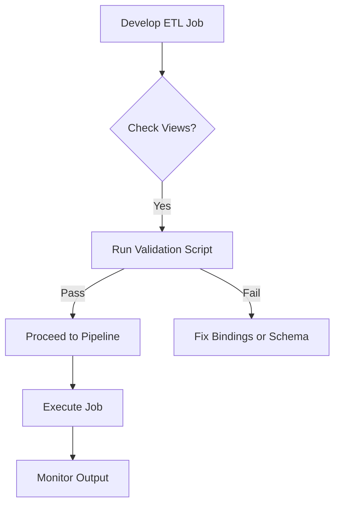

# **[Pattern] View Existence Validation Reference Guide**

## **Overview**
The **View Existence Validation** pattern ensures that all views referenced in **type bindings** (e.g., table aliases, column mappings, or schema definitions) are checked against the **target database schema** before execution. This prevents runtime errors caused by missing, deprecated, or misconfigured views, improving robustness and maintainability in data pipelines, ETL processes, and generated SQL.

This pattern is particularly useful in:
- **Dynamic SQL generation** (e.g., ORMs, query builders)
- **Schema-aware transformations** (e.g., Spark, dbt, Airflow)
- **Auto-generated artifacts** (e.g., stored procedures, views)

By validating view existence at compile-time or build-time, teams avoid costly **No Such Object** or **Reference Not Found** exceptions during runtime.

---

## **Key Concepts**
| Concept               | Description                                                                 |
|-----------------------|-----------------------------------------------------------------------------|
| **Type Binding**      | A reference to a database object (e.g., `SELECT * FROM "analytics.db.user_views"`) in a SQL template, schema file, or generated query. |
| **View Existence Check** | A validation step that queries the metadata catalog (`INFORMATION_SCHEMA`, `pg_catalog`, etc.) to confirm a referenced view exists in the target schema. |
| **Target Database**   | The database schema where views are deployed (e.g., production, staging). |
| **Compile-Time Check** | Validation occurs during development (e.g., during build pipelines).       |
| **Runtime Check**     | Validation happens when the query executes (less preferred due to performance overhead). |

---

## **Schema Reference**
The following tables describe the metadata structures used for validation across major database systems.

### **1. Standard SQL (INFORMATION_SCHEMA)**
| Table                | Column                     | Description                                                                 |
|----------------------|----------------------------|-----------------------------------------------------------------------------|
| `INFORMATION_SCHEMA.VIEWS` | `TABLE_SCHEMA`             | Database/schema where the view is defined.                                  |
|                      | `TABLE_NAME`               | Name of the view.                                                          |
|                      | `VIEW_DEFINITION`          | SQL text of the view (optional for existence checks).                      |
|                      | `IS_UPDATABLE`             | Whether the view can be modified (often irrelevant for existence checks).  |

**Example Query (PostgreSQL/MySQL/SQL Server):**
```sql
SELECT TABLE_SCHEMA, TABLE_NAME
FROM INFORMATION_SCHEMA.VIEWS
WHERE TABLE_SCHEMA = 'analytics'
  AND TABLE_NAME IN ('user_views', 'product_metrics');
```

---

### **2. PostgreSQL-Specific**
| Table                | Column                     | Description                                                                 |
|----------------------|----------------------------|-----------------------------------------------------------------------------|
| `pg_catalog.pg_class` | `relname`                  | View name.                                                                |
|                      | `relkind`                  | Must equal `'v'` (view) or `'m'` (materialized view).                     |
|                      | `relnamespace`             | OID of the schema (join with `pg_namespace`).                             |

**Example Query:**
```sql
SELECT n.nspname AS schema_name, c.relname AS view_name
FROM pg_catalog.pg_class c
JOIN pg_catalog.pg_namespace n ON n.oid = c.relnamespace
WHERE c.relkind IN ('v', 'm')
  AND n.nspname = 'analytics'
  AND c.relname IN ('user_views', 'product_metrics');
```

---

### **3. Snowflake**
| Table                | Column                     | Description                                                                 |
|----------------------|----------------------------|-----------------------------------------------------------------------------|
| `SNOWFLAKE.INFORMATION_SCHEMA.VIEWS` | `SCHEMA_NAME`      | Schema containing the view.                                                |
|                      | `NAME`                     | View name.                                                                  |
|                      | `IS_CURRENT`               | Whether the view is in the current catalog.                                 |

**Example Query:**
```sql
SELECT SCHEMA_NAME, NAME
FROM SNOWFLAKE.INFORMATION_SCHEMA.VIEWS
WHERE SCHEMA_NAME = 'ANALYTICS'
  AND NAME IN ('USER_VIEWS', 'PRODUCT_METRICS');
```

---

### **4. BigQuery**
| Table                | Column                     | Description                                                                 |
|----------------------|----------------------------|-----------------------------------------------------------------------------|
| `INFORMATION_SCHEMA.VIEWS` | `TABLE_SCHEMA`       | Dataset.                                                                   |
|                      | `TABLE_NAME`               | View name.                                                                  |
|                      | `VIEW_DEFINITION`          | SQL definition (ignored for existence checks).                            |

**Example Query:**
```sql
SELECT TABLE_SCHEMA, TABLE_NAME
FROM `project.dataset.INFORMATION_SCHEMA.VIEWS`
WHERE TABLE_SCHEMA = 'analytics'
  AND TABLE_NAME IN ('user_views', 'product_metrics');
```

---
## **Implementation Approaches**

### **1. Compile-Time Validation (Recommended)**
Validate views **before runtime** using a build pipeline (e.g., GitHub Actions, dbt, Teradata SQL Assistant).

#### **Pseudocode (Python Example)**
```python
import sqlite3  # Replace with target DB driver

def validate_view_existence(target_db_url, views_to_check):
    """Check if all views exist in the target database."""
    conn = sqlite3.connect(target_db_url)  # Or psycopg2, pyodbc, etc.
    cursor = conn.cursor()

    # Example for PostgreSQL
    query = """
    SELECT TABLE_SCHEMA, TABLE_NAME
    FROM INFORMATION_SCHEMA.VIEWS
    WHERE TABLE_SCHEMA = 'analytics'
    """

    for view_name in views_to_check:
        cursor.execute(query + f"AND TABLE_NAME = '{view_name}'")
        if not cursor.fetchone():
            raise ValueError(f"View 'analytics.{view_name}' does not exist!")

    conn.close()
    return True
```

#### **Integration with dbt**
Add a pre-run hook in `dbt_project.yml`:
```yaml
models:
  my_project:
    +on_run_start:
      - "dbt run-operation validate_views --args '{\"views\": [\"user_views\", \"product_metrics\"]}'"
```

---

### **2. Runtime Validation (Fallback)**
If compile-time checks are impractical, validate at execution (e.g., in stored procedures or dynamic SQL generators).

#### **SQL Example (PostgreSQL)**
```sql
DO $$
DECLARE
    missing_views text[];
    valid bool;
BEGIN
    -- Check views in a transaction
    FOR view_name IN ARRAY['user_views', 'product_metrics'] LOOP
        SELECT EXISTS (
            SELECT 1 FROM pg_catalog.pg_class c
            JOIN pg_catalog.pg_namespace n ON n.oid = c.relnamespace
            WHERE n.nspname = 'analytics'
              AND c.relname = view_name
              AND c.relkind IN ('v', 'm')
        ) INTO valid;

        IF NOT valid THEN
            RAISE EXCEPTION 'View "analytics.%" does not exist', view_name;
        END IF;
    END LOOP;
END $$;
```

#### **Spark SQL Example**
```python
from pyspark.sql import functions as F

# Assume `spark` is initialized
views_to_check = ["user_views", "product_metrics"]
schema_name = "analytics"

missing_views = spark.sql(f"""
    SELECT TABLE_NAME
    FROM INFORMATION_SCHEMA.VIEWS
    WHERE TABLE_SCHEMA = '{schema_name}'
    AND TABLE_NAME IN {tuple(views_to_check)}
    EXCEPT
    SELECT '{v}' AS TABLE_NAME
    FROM UNNEST({tuple(views_to_check)}) AS v
""")

if missing_views.count() > 0:
    raise Exception(f"Missing views: {missing_views.collect()}")
```

---

### **3. Tooling Integration**
| Tool               | Integration Method                                                                 |
|--------------------|------------------------------------------------------------------------------------|
| **dbt**            | Custom macros in `macros/` or `dbt_project.yml` hooks.                            |
| **Airflow**        | Pre-execute task with `PythonOperator` or SQL task to validate views.             |
| **Spark (Databricks)** | Use `spark.sql()` to validate via `INFORMATION_SCHEMA` before running jobs.       |
| **ORMs (SQLAlchemy)** | Patch query generation to validate references before execution.                  |

---

## **Query Examples**
### **Example 1: Check Views Before Running a Query**
**Scenario:** A Spark job references `analytics.user_views` and `analytics.product_metrics`.

```python
# Pre-check
verify_views_exist(
    spark=spark,
    views=["user_views", "product_metrics"],
    schema="analytics"
)

# Then run the job
df = spark.table("analytics.user_views").join(...)
```

---

### **Example 2: Dynamic SQL Validation (Teradata)**
```sql
-- Generate dynamic SQL with validation
DECLARE @views TABLE (name VARCHAR(100));
INSERT INTO @views VALUES ('USER_VIEWS'), ('PRODUCT_METRICS');

DECLARE @missing_views VARCHAR(1000) DEFAULT '';

SELECT @missing_views = @missing_views + QUOTENAME(name) + ', '
FROM @views
WHERE NOT EXISTS (
    SELECT 1 FROM DBC.VIEWS
    WHERE TABLENAME = QUOTENAME(name)
      AND SCHEMANAME = 'ANALYTICS'
);

IF LEN(@missing_views) > 0
    RAISE ERROR 'Missing views: %s', STRINGLEFT(@missing_views, LEN(@missing_views) - 1);
```

---

### **Example 3: CI/CD Pipeline Check (GitHub Actions)**
```yaml
name: Validate Views
on: [push]
jobs:
  check-views:
    runs-on: ubuntu-latest
    steps:
      - uses: actions/checkout@v4
      - name: Install PostgreSQL client
        run: sudo apt-get install postgresql-client
      - name: Validate views
        run: |
          psql -h ${{ secrets.DB_HOST }} -U ${{ secrets.DB_USER }} -d ${{ secrets.DB_NAME }} -c "
          DO $$
          DECLARE
              views_to_check TEXT[] := ARRAY['user_views', 'product_metrics'];
              valid BOOLEAN;
          BEGIN
              FOR view_name IN ARRAY(views_to_check) LOOP
                  SELECT EXISTS (
                      SELECT 1 FROM pg_catalog.pg_class c
                      JOIN pg_catalog.pg_namespace n ON n.oid = c.relnamespace
                      WHERE n.nspname = 'analytics'
                        AND c.relname = view_name
                  ) INTO valid;
                  IF NOT valid THEN
                      RAISE EXCEPTION 'View ''analytics.%' does not exist', view_name;
                  END IF;
              END LOOP;
          END $$;
          "
```

---

## **Performance Considerations**
| Approach               | Pros                                    | Cons                                      | Best For                          |
|------------------------|-----------------------------------------|-------------------------------------------|-----------------------------------|
| **Compile-Time**       | Early failure, avoids runtime crashes.  | Requires pipeline setup.                  | CI/CD, dbt, schema-driven apps.   |
| **Runtime**            | Flexible for dynamic schemas.          | Slower, may fail late in execution.      | Ad-hoc queries, stored procedures.|
| **Cached Metadata**    | Fast for repeated checks.              | Risk of stale data if schema changes.     | Frequently used views.           |

---
## **Error Handling**
| Error Type               | Cause                                  | Solution                                  |
|--------------------------|----------------------------------------|-------------------------------------------|
| `ViewNotFound`           | Referenced view does not exist.         | Validate schema; update bindings.         |
| `SchemaMismatch`         | Schema name differs (e.g., `dev` vs. `prod`). | Use consistent schema references.      |
| `PermissionDenied`       | No read access to metadata tables.     | Grant `SELECT` on `INFORMATION_SCHEMA`.   |

**Example Error (Python):**
```python
try:
    validate_view_existence(db_url, ["user_views"])
except ValueError as e:
    print(f"Validation failed: {e}")
    raise SystemExit(1)  # Fail build pipeline
```

---

## **Related Patterns**
| Pattern                          | Description                                                                 | When to Use                          |
|----------------------------------|-----------------------------------------------------------------------------|--------------------------------------|
| **[Schema Registry]**            | Centralized storage for schema definitions (Avro, Protobuf).              | Cross-team consistency.               |
| **[Dynamic SQL with Variables]**  | Generate SQL at runtime with parameters.                                   | Avoid hardcoding schema references.  |
| **[Data Lineage Tracking]**      | Log dependencies between tables/views.                                    | Debug schema changes.                |
| **[Versioned Schemas]**          | Tag views by version (e.g., `user_views_v2`).                             | Manage breaking changes.             |

---
## **Troubleshooting**
| Issue                          | Diagnosis                          | Fix                                  |
|--------------------------------|-------------------------------------|--------------------------------------|
| False positives (e.g., tables mislabeled as views) | Check `relkind` in PostgreSQL.      | Filter by `relkind = 'v'`.           |
| Slow validation across large schemas | Use indexes on metadata tables.     | Add `CREATE INDEX` on `TABLE_SCHEMA`. |
| Views in different databases    | Validate each target database.      | Loop through connection strings.     |

---
## **Best Practices**
1. **Fail Fast:** Validate views **before** running expensive transformations.
2. **Use Tooling:** Leverage dbt, Spark, or ORMs to automate checks.
3. **Document Schema:** Maintain a `SCHEMA.md` file listing critical views.
4. **Test in Staging:** Run validation in pre-production environments.
5. **Monitor Changes:** Set up alerts for schema drifts (e.g., Terraform, Sqoop).

---
## **Example Workflow**


---
## **See Also**
- [INFORMATION_SCHEMA Standard](https://www.iso.org/iso-9075.html)
- [dbt Documentation on Schema Validation](https://docs.getdbt.com/docs/building-a-dbt-project/schema-validation)
- [Spark SQL Metadata Functions](https://spark.apache.org/docs/latest/api/sql/index.html#metadata-functions)