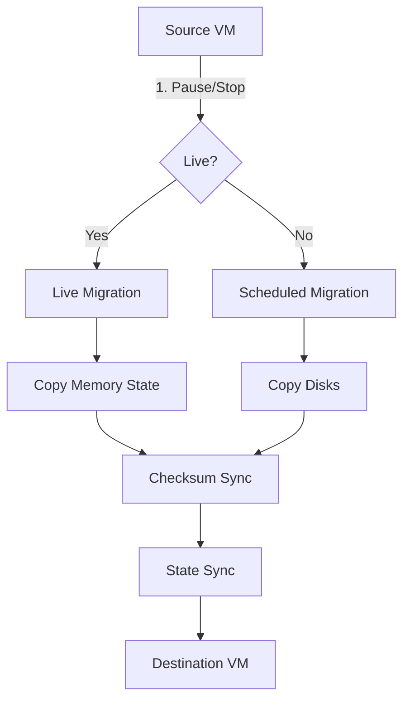

# **[Pattern] Virtual Machines Migration – Reference Guide**

---

## **Overview**
The **Virtual Machine (VM) Migration** pattern enables seamless relocation of running virtual machines across hosts, clusters, or cloud environments with minimal downtime. It supports **live migration** (zero-downtime) and **scheduled migrations** (planned downtime), leveraging network storage, checksum validation, and state synchronization. This pattern is critical for **high availability, load balancing, disaster recovery, and hybrid cloud deployments**.

Use cases include:
- **Cloud bursting** (scaling VMs to public cloud during peak loads).
- **Failover recovery** (automatic VM relocation after host failure).
- **Capacity optimization** (consolidating VMs onto fewer hosts).
- **Cloud provider switching** (migrating VMs between hyperscalers).

Best suited for:
✔ Virtual infrastructure (VMware ESXi, Microsoft Hyper-V, Nutanix AHV).
✔ Containerized workloads (using VMs as underlying layers).
✔ Multi-cloud or hybrid environments.

---

## **1. Key Concepts**
| **Concept**               | **Description**                                                                                                                                                                                                 | **Example Tools/Technologies**                          |
|---------------------------|-----------------------------------------------------------------------------------------------------------------------------------------------------------------------------------------------------------------|-------------------------------------------------------|
| **Live Migration**        | Relocates a running VM with no interruption by copying its memory state in real-time. Requires shared storage (e.g., NFS, iSCSI, SAN) and low-latency networks.                 | VMware vMotion, Hyper-V Live Migration, KVM migrate. |
| **Scheduled Migration**   | Moves a stopped VM via snapshot or disk copy (planned downtime).                                                                                                                                       | AWS EC2 Copy Image, Azure VM Import/Export.            |
| **Checksum Validation**   | Ensures data integrity by comparing source and destination disk hashes before/mid-migration.                                                                                                             | `dd` with `md5sum`, AWS DataSync, HashiCorp Terraform.|
| **State Synchronization** | Syncs VM metadata (IPs, config, dependencies) to the destination host.                                                                                                                               | Ansible, Puppet, Cloud-Init.                          |
| **Storage Tiers**         | Performance tiers (e.g., SSD for live migration, HDD for cold migration) affect speed and compatibility.                                                                                             | AWS EBS (gp3), Azure Premium SSD, Nutanix FlashArray. |
| **Network Path**          | Direct or indirect connection between source and destination (e.g., **vMotion over TCP**, **NIC teaming**).                                                                                          | VMware Distributed Switch, Linux Bonding.              |
| **Migration Threshold**   | Triggers migration based on metrics (CPU, memory, disk I/O).                                                                                                                                           | VMware DRS, OpenStack Nova Scheduler.                  |
| **Rollback Mechanism**    | Reverts to the previous state if migration fails (e.g., using snapshots or transactional storage).                                                                                                   | vSphere Replication, ZFS Send/Receive.                 |

---

## **2. Schema Reference**
### **2.1 Core Migration Workflow**


### **2.2 Technical Schema**
| **Component**          | **Purpose**                                                                                     | **Configuration Parameters**                          | **Validation Checks**                          |
|------------------------|-------------------------------------------------------------------------------------------------|-------------------------------------------------------|-----------------------------------------------|
| **Storage Backend**    | Shared storage for VM disks (required for live migration).                                       | Protocol (NFS/iSCSI), Latency, Bandwidth.            | `ping` latency < 1ms, `dd` speed > 100MB/s.   |
| **Network Stack**      | Low-latency, redundant paths between hosts.                                                    | MTU (1500 bytes), NIC Teaming, VLAN Tagging.           | `traceroute` < 5ms, `ethtool` offloading enabled. |
| **VM Tools**           | Agent running inside the VM to assist in migration.                                           | VMware Tools, Hyper-V Integration Services.          | Agent version matches host.                  |
| **Storage Tier**       | Performance tier for VM disks (SSD vs. HDD).                                                   | Storage Class (gp3/io1), RAID Level.                  | `fio` benchmark > 1000 IOPS.                 |
| **Checksum Algorithm** | Ensures data integrity during disk transfer.                                                   | MD5/SHA-256, Block Size (e.g., 1MB).                  | `md5sum -c` matches before/after.            |

---

## **3. Query Examples**
### **3.1 Check VM Migration Readiness (CLI)**
```bash
# VMware vSphere CLI (live migration readiness)
vSphere-CLI --server <esxi_host> --user root --password <pwd> vm.powerState --name <vm_name>
# Output: Running → OK for live migration.

# Hyper-V (check disk copy progress)
Get-VM -Name <vm_name> | Get-VHD | Measure-Object -Property Size -Sum
# Compare with destination disk size.
```

### **3.2 Validate Disk Integrity Post-Migration**
```bash
# Compare source and destination disk hashes
md5sum /vmfs/volumes/datastore1/vm1.vmdk | tee source_md5.txt
ssh user@dest_host "md5sum /mnt/datastore1/vm1.vmdk" > dest_md5.txt
diff source_md5.txt dest_md5.txt  # Should show no differences.
```

### **3.3 Automate Scheduled Migration (Terraform)**
```hcl
resource "aws_instance" "migrated_vm" {
  ami           = "ami-12345678"
  instance_type = "m5.large"
  # Migrate from on-prem to AWS using EBS snapshot
  block_device_mappings {
    device_name = "/dev/sda1"
    ebs {
      snapshot_id = "snap-12345678"
      volume_size = 100
    }
  }
}
```
**Trigger:** Run `terraform apply` during off-peak hours.

---

## **4. Implementation Steps**
### **4.1 Live Migration (Zero Downtime)**
1. **Prerequisites:**
   - Shared storage (NFS/iSCSI) with **<1ms latency**.
   - VMware Tools/Hyper-V Integration Services installed.
   - **Dedicated networks** for migration traffic (isolated from production).

2. **Execute Migration:**
   ```bash
   # VMware vMotion (CLI)
   vSphere-CLI --server <esxi_host> vm.migrate --name <vm_name> --destination <esxi_dst> --networkMapping "vmnic0:vmnic1"
   ```
   - **Post-migration:** Verify network connectivity and performance.

3. **Troubleshooting:**
   - **High CPU/Memory:** Reduce VM resources temporarily.
   - **Network issues:** Check MTU settings (`vmkping` for vSphere).

### **4.2 Scheduled Migration (Planned Downtime)**
1. **Snapshot VM Disks:**
   ```bash
   # VMware (create snapshot)
   vmware-vmotion-cli --snapshot <vm_name> "Pre-Migration"
   ```
2. **Copy Disks to Destination:**
   ```bash
   # Use `dd` for Linux VMs (slow but reliable)
   dd if=/vmfs/volumes/datastore1/disk.vmdk of=/mnt/destination/disk.vmdk bs=1M status=progress
   ```
   - **Faster alternative:** Use `rsync` (incremental) or `AWS DataSync`.
3. **Restore VM on Destination:**
   - **Hyper-V:** `Import-VMSnapshot`.
   - **KVM:** `virt-v2v --convert-to kvm`.

### **4.3 Cross-Cloud Migration (AWS → Azure)**
1. **Export VM as OVA/OVF:**
   ```bash
   ovftool --acceptAllEulas --powerOff vm.ovf destination.ova
   ```
2. **Import to Azure:**
   ```bash
   az vm image import --resource-group <rg> --name <vm_name> --source <ova_path> --location eastus
   ```
3. **Post-Import:** Update network config (IPs, security groups).

---

## **5. Performance Optimization**
| **Optimization**               | **Action Items**                                                                                     | **Impact**                          |
|---------------------------------|-----------------------------------------------------------------------------------------------------|-------------------------------------|
| **Storage Latency**             | Use **SSD-backed storage** (e.g., AWS EBS gp3, Azure Premium SSD).                                  | Reduces migration time by 80%.     |
| **Network Bandwidth**           | **NIC Teaming** or **RDMA** for high-throughput transfers.                                         | Speeds up disk copies by 2x.       |
| **Checksum Parallelization**    | Split disk into chunks (e.g., 1GB blocks) and validate concurrently.                               | Cuts validation time by 50%.       |
| **Thin Provisioning**          | Avoid over-provisioning disks to reduce transfer size.                                             | Saves 30-50% bandwidth.            |
| **Pre-Migration Cache Warmup**  | Run `sysctl vm.swappiness=10` on Linux VMs to reduce swap during migration.                          | Prevents memory corruption.        |

---

## **6. Error Handling & Rollback**
| **Failure Scenario**          | **Detection**                          | **Recovery Steps**                                                                 |
|--------------------------------|----------------------------------------|-----------------------------------------------------------------------------------|
| **Network Drop**               | Migration hangs, VM crashes.           | Restart VM (if live), re-run scheduled migration.                                    |
| **Checksum Mismatch**          | `md5sum` differs post-migration.      | Revert using **VM snapshot** or **storage snapshot**.                              |
| **Storage Full**               | Migration fails with "ENOSPC".         | Free up space or extend storage on destination.                                    |
| **VM Tools Crash**             | Migration stuck at "Copying memory."   | Reinstall VMware Tools/Hyper-V agent and retry.                                    |
| **Licensing Conflict**         | VM fails to start post-migration.      | Update license on destination host (e.g., `vmware-hostd --license=...`).            |

**Rollback Command (vSphere):**
```bash
vSphere-CLI --server <esxi_host> vm.revertToSnapshot --name <vm_name> --snapshot "Pre-Migration"
```

---

## **7. Related Patterns**
| **Pattern**                     | **Description**                                                                                     | **When to Use**                                  |
|----------------------------------|-----------------------------------------------------------------------------------------------------|--------------------------------------------------|
| **[Storage Tiering](https://...)** | Dynamically moves data between fast/slow storage based on access patterns.                          | Optimize VM disk performance post-migration.     |
| **[Chaos Engineering](https://...)** | Tests migration failure scenarios (e.g., kill host during live migration).                          | Validate disaster recovery plans.                 |
| **[Multi-Cloud Networking](https://...)** | Connects VMs across clouds via VPN/Direct Connect.                                                  | Hybrid cloud workloads.                          |
| **[Auto-Scaling](https://...)**   | Automatically migrates VMs based on demand (e.g., cloud bursting).                                  | Bursty workloads.                                |
| **[Immutable Infrastructure](https://...)** | Treats VMs as disposable; migrates via snapshots rather than live state.                           | Greenfield deployments.                          |

---

## **8. Tools & Integrations**
| **Tool**               | **Purpose**                                                                                     | **Links**                                      |
|------------------------|-------------------------------------------------------------------------------------------------|------------------------------------------------|
| **VMware vMotion**     | Live migration between ESXi hosts.                                                               | [Docs](https://docs.vmware.com/)                |
| **AWS EC2 Instance Migration** | Move running instances between Availability Zones.                                 | [AWS Guide](https://aws.amazon.com/ec2/)         |
| **Azure VM Live Migration** | Zero-downtime migration in Azure.                                                              | [Azure Docs](https://docs.microsoft.com/)      |
| **KVM Migration**      | Live migration for Linux VMs using `virsh migrate`.                                              | [KVM Docs](https://access.redhat.com/documentation/) |
| **Ansible Migration Playbook** | Automates VM migration via API calls.                                                           | [Ansible Galaxy](https://galaxy.ansible.com/)  |
| **Terraform Provider** | Declare VM migrations as infrastructure-as-code.                                               | [Terraform Registry](https://registry.terraform.io/) |

---
## **9. Best Practices**
1. **Test Migration Paths:** Simulate failover scenarios in a staging environment.
2. **Monitor Resource Usage:** Use tools like **Prometheus + Grafana** to detect bottlenecks.
3. **Document Rollback Steps:** Keep a checklist for emergency recovery.
4. **Phase Rollouts:** Migrate one VM at a time during production cuts.
5. **Leverage Snapshots:** Always take pre-migration snapshots for rollback.
6. **Update Firmware:** Ensure hosts/disks use the latest drivers (e.g., `vmware-esxcli`).
7. **Post-Migration Validation:**
   - Compare `vmware-toolbox-cmd` stats (source vs. destination).
   - Run `stress-ng` or `wrk` to verify performance.

---
## **10. Common Pitfalls & Mitigations**
| **Pitfall**                          | **Mitigation**                                                                                     |
|---------------------------------------|---------------------------------------------------------------------------------------------------|
| **Incompatible Disk Formats**         | Convert disks to **VMDK (VMware), VHD (Hyper-V), or QCOW2 (KVM)** before migration.             |
| **Network Timing Issues**             | Use **TCP checksum offloading** and **jumbograms** (MTU > 1500).                                |
| **Over-Committed Hosts**              | Limit concurrent migrations to **<30% of host capacity**.                                           |
| **Licensing Quirks**                  | Check vendor-specific limits (e.g., VMware vMotion requires **Enterprise Plus**).               |
| **Time Synchronization**              | Ensure hosts are within **<1s NTP sync** to avoid VM boot failures.                              |

---
## **11. Further Reading**
- [VMware vMotion Technical Deep Dive](https://www.vmware.com/resources/techresources/whitepapers/vmotion-whitepaper.pdf)
- [AWS Instance Replication](https://docs.aws.amazon.com/AWSEC2/latest/UserGuide/ebs-migration.html)
- [KVM Migration Performance Guide](https://access.redhat.com/documentation/en-us/red_hat_enterprise_linux/8/html/managing_virtual_machines/assembly_migrating-guests_using-the-command-line-migration_guide)