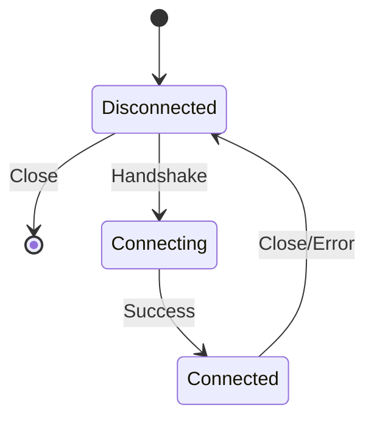

# **[Pattern Name] Websockets Integration – Reference Guide**

---

## **Overview**
The **Websockets Integration** pattern enables **real-time, bidirectional communication** between clients and servers using the WebSocket protocol (RFC 6455). Unlike HTTP, which relies on request-response cycles, Websockets establish a persistent connection for low-latency, event-driven interactions—ideal for applications requiring live updates (e.g., chat apps, stock tickers, gaming, or IoT dashboards).

This pattern supports:
- **Connection management** (handshaking, reconnection logic)
- **Message serialization/deserialization** (JSON, Protocol Buffers, etc.)
- **Scalability** (via load balancers, message brokers)
- **Security** (TLS/WSS, authentication middleware)

---

## **Key Concepts & Implementation Details**
### **1. WebSocket Lifecycle**
| Phase          | Description                                                                 | Key API/Action                     |
|----------------|-----------------------------------------------------------------------------|------------------------------------|
| **Handshake**  | Upgrade from HTTP to WebSocket (HTTP/1.1 101 Switching Protocols).       | `Sec-WebSocket-Key` header exchange. |
| **Connected**  | Persistent connection; bidirectional message flow.                        | `send()`, `onmessage` callbacks.   |
| **Disconnect** | Graceful or abrupt termination (close codes: `1000`–`1011`).               | `close()` method.                  |

### **2. Connection States**


**Key State Codes:**
- `CONNECTING` (handshake in progress)
- `OPEN` (active connection)
- `CLOSED` (terminated)

---

## **Schema Reference**
### **1. WebSocket Handshake Headers**
| Header                     | Purpose                                                                     | Example Value                          |
|----------------------------|-----------------------------------------------------------------------------|-----------------------------------------|
| `Sec-WebSocket-Key`        | Client-generated random string; server validates with SHA-1.               | `dGhlIHNhbXBsZSBub25jZQ==`              |
| `Sec-WebSocket-Version`    | Specifies protocol version (default: `13`).                                | `13`                                    |
| `Sec-WebSocket-Extensions` | Optional features (e.g., `permessage-deflate`).                            | `permessage-deflate`                   |
| `Connection`               | Upgrade header (required).                                                 | `Upgrade, websocket`                    |

**Server Response Headers:**
| Header                     | Purpose                                                                     | Example Value                          |
|----------------------------|-----------------------------------------------------------------------------|-----------------------------------------|
| `Upgrade`                  | Indicates WebSocket protocol.                                               | `websocket`                            |
| `Sec-WebSocket-Accept`     | SHA-1 hash of `Sec-WebSocket-Key + "258EAFA5-E914-47DA-95CA-C5AB0DC85B11"`.| `s3pPLMBiTxaQ9kYGzzhZRbK+xOo=`           |
| `Sec-WebSocket-Protocol`   | Subprotocol negotiation (e.g., `chat`, `metrics`).                         | `chat`                                  |

---

### **2. Message Formats**
| Field          | Type     | Description                                                                 |
|----------------|----------|-----------------------------------------------------------------------------|
| `opcode`       | Uint8    | Defines message type (`0x1` = text, `0x2` = binary, `0x8` = close).       |
| `mask`         | Uint8    | Client-side masking flag (clients must mask).                              |
| `payload`      | Bytes    | Serialized data (JSON example below).                                       |

**Example JSON Payload:**
```json
{
  "event": "user_message",
  "data": {
    "user_id": "12345",
    "message": "Hello, server!",
    "timestamp": "2024-05-20T12:00:00Z"
  }
}
```

---

## **Query Examples**
### **1. Client-Side Handshake (JavaScript)**
```javascript
const socket = new WebSocket('wss://api.example.com/chat');

// Handshake (automatic via constructor)
socket.onopen = () => {
  console.log('Connected');
  socket.send(JSON.stringify({ action: 'login', token: 'abc123' }));
};

socket.onmessage = (event) => {
  const data = JSON.parse(event.data);
  console.log('Server:', data);
};
```

### **2. Server-Side (Node.js with `ws` Library)**
```javascript
const WebSocket = require('ws');
const wss = new WebSocket.Server({ port: 8080 });

wss.on('connection', (ws) => {
  ws.on('message', (data) => {
    const msg = JSON.parse(data);
    if (msg.action === 'login') {
      ws.send(JSON.stringify({ status: 'authenticated' }));
    }
  });

  ws.on('close', () => console.log('Client disconnected'));
});
```

### **3. Server-Side (Python with `websockets` Library)**
```python
import asyncio
import json
from websockets.sync.client import connect

async def client():
    async with connect('ws://localhost:8765') as ws:
        await ws.send(json.dumps({"action": "subscribe", "topic": "news"}))
        response = await ws.recv()
        print(f"Received: {response}")

asyncio.get_event_loop().run_until_complete(client())
```

---

## **Implementation Patterns**
### **1. Session Management**
- **Token-based auth:** Include JWT in the first message (e.g., `ws.send(auth_token)`).
- **Stateless validation:** Verify tokens via middleware (e.g., `ws.on('message', authenticate)`).

### **2. Scalability**
| Strategy               | Description                                                                 |
|------------------------|-----------------------------------------------------------------------------|
| **Horizontal scaling** | Use a load balancer (Nginx, HAProxy) with sticky sessions (`ws://backend:port`). |
| **Message brokers**    | Offload pub/sub logic to Redis or Kafka.                                   |
| **Connection pooling** | Reuse WebSocket instances (e.g., `wslib` in Go).                           |

### **3. Error Handling**
```javascript
// Retry with exponential backoff
async function reconnect(ws, retries = 3) {
  try {
    await ws.close();
  } catch (e) {}
  await new Promise(resolve => setTimeout(resolve, 1000 * 2 ** retries));
  if (retries > 0) reconnect(ws, retries - 1);
}
```

---

## **Security Considerations**
| Risk                  | Mitigation Strategy                                  |
|-----------------------|------------------------------------------------------|
| **Man-in-the-middle** | Enforce **WSS (WebSocket Secure)** with TLS.         |
| **Brute-force attacks** | Rate-limit handshakes (e.g., `ws-auth` middleware). |
| **Message tampering** | Sign messages with HMAC (e.g., `msg_signature`).    |

---

## **Related Patterns**
1. **HTTP/2 Server Push** – For hybrid request-response + streaming.
2. **Pub/Sub (Kafka/RabbitMQ)** – Decouple WebSocket servers from clients.
3. **Server-Sent Events (SSE)** – Simpler unidirectional alternative.
4. **GraphQL Subscriptions** – Real-time queries (e.g., Apollo Federated Subscriptions).

---
**See Also:**
- [RFC 6455 (WebSocket Protocol)](https://datatracker.ietf.org/doc/html/rfc6455)
- [WebSocket API (MDN)](https://developer.mozilla.org/en-US/docs/Web/API/WebSocket)